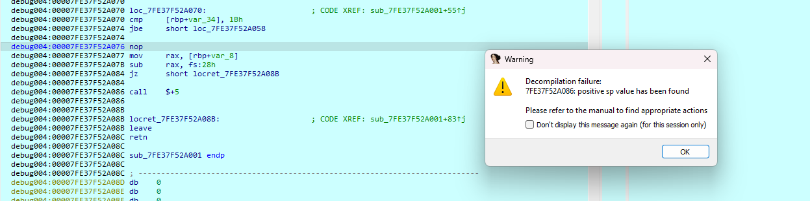
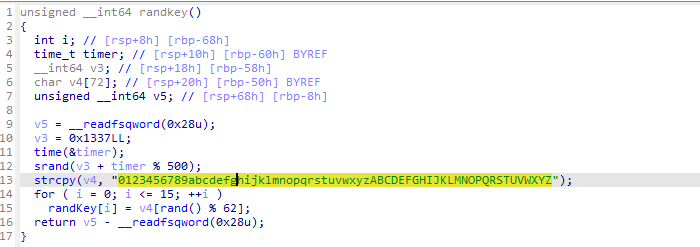

## CTFs/akasecctf

### Grip

- Quăng vào `IDA`, nhìn sơ bộ ta thấy chương trình thực hiện biến đổi 1 dải giá trị. Ban đầu mình nghĩ đây là bài ez thì chắc nó biến đổi in ra flag luôn, tuy nhiên dải giá trị này khá lớn, đồng thời biên dưới còn có lệnh `call` sau khi truyền data vào nên chắc nó là `shellcode`.


- Cắm breakpoint và tiến hành debug động, chương trình bị văng ra liên tục và không nhảy tới bp mình đặt. Thấy có dấu hiệu của antidebug, tìm một chút thì mình nhìn ra hàm dưới đây.


- Đặt bp trong này rồi nhảy theo nhánh chuẩn, nhảy tới shellcode thì ta thấy nó có nội dung như dưới.

```asm
; unsigned __int64 sub_7FE37F52A001()
debug004:00007FE37F52A001 sub_7FE37F52A001 proc near
debug004:00007FE37F52A001
debug004:00007FE37F52A001 var_34= dword ptr -34h
debug004:00007FE37F52A001 var_30= qword ptr -30h
debug004:00007FE37F52A001 var_28= qword ptr -28h
debug004:00007FE37F52A001 var_1C= qword ptr -1Ch
debug004:00007FE37F52A001 var_8= qword ptr -8
debug004:00007FE37F52A001
debug004:00007FE37F52A001 mov     rbp, rsp
debug004:00007FE37F52A004 sub     rsp, 40h
debug004:00007FE37F52A008 mov     rax, fs:28h
debug004:00007FE37F52A011 mov     [rbp+var_8], rax
debug004:00007FE37F52A015 xor     eax, eax
debug004:00007FE37F52A017 mov     rax, 3139212731232923h
debug004:00007FE37F52A021 mov     rdx, 76321D3B3636732Ah
debug004:00007FE37F52A02B mov     [rbp+var_30], rax
debug004:00007FE37F52A02F mov     [rbp+var_28], rdx
debug004:00007FE37F52A033 mov     rax, 2671292176321D3Bh
debug004:00007FE37F52A03D mov     rdx, 3F3B30762C73201Dh
debug004:00007FE37F52A047 mov     [rbp+var_28+4], rax
debug004:00007FE37F52A04B mov     [rbp+var_1C], rdx
debug004:00007FE37F52A04F mov     [rbp+var_34], 0
debug004:00007FE37F52A056 jmp     short loc_7FE37F52A070
debug004:00007FE37F52A056
debug004:00007FE37F52A058 ; ---------------------------------------------------------------------------
debug004:00007FE37F52A058
debug004:00007FE37F52A058 loc_7FE37F52A058:                       ; CODE XREF: sub_7FE37F52A001+73↓j
debug004:00007FE37F52A058 mov     eax, [rbp+var_34]
debug004:00007FE37F52A05B movzx   eax, byte ptr [rbp+rax+var_30]
debug004:00007FE37F52A060 xor     eax, 42h
debug004:00007FE37F52A063 mov     edx, eax
debug004:00007FE37F52A065 mov     eax, [rbp+var_34]
debug004:00007FE37F52A068 mov     byte ptr [rbp+rax+var_30], dl
debug004:00007FE37F52A06C add     [rbp+var_34], 1
debug004:00007FE37F52A06C
debug004:00007FE37F52A070
debug004:00007FE37F52A070 loc_7FE37F52A070:                       ; CODE XREF: sub_7FE37F52A001+55↑j
debug004:00007FE37F52A070 cmp     [rbp+var_34], 1Bh
debug004:00007FE37F52A074 jbe     short loc_7FE37F52A058
debug004:00007FE37F52A074
debug004:00007FE37F52A076 nop
debug004:00007FE37F52A077 mov     rax, [rbp+var_8]
debug004:00007FE37F52A07B sub     rax, fs:28h
debug004:00007FE37F52A084 jz      short locret_7FE37F52A08B
debug004:00007FE37F52A084
debug004:00007FE37F52A086 call    $+5
debug004:00007FE37F52A086
debug004:00007FE37F52A08B
debug004:00007FE37F52A08B locret_7FE37F52A08B:                    ; CODE XREF: sub_7FE37F52A001+83↑j
debug004:00007FE37F52A08B leave
debug004:00007FE37F52A08C retn
debug004:00007FE37F52A08C
debug004:00007FE37F52A08C sub_7FE37F52A001 endp
debug004:00007FE37F52A08C
debug004:00007FE37F52A08C ; ---------------------------------------------------------------------------
```

- Đoạn mã này không thể decompile thành mã giả vì chứa nội dung không hợp lệ, dễ thấy là đoạn lệnh `call    $+5`. Nop nó đi là được^^.



- Mã giả của shellcode sẽ trông như dưới đây.


- Giờ thì thu giá trị sau khi `xor` là có flag rồi.


```
flag: akasec{sh1tty_p4ck3d_b1n4ry}
```

### Sperm_rev

- Có lẽ từ sau mình không cho mấy bài kiểu này vào wu nữa -.-. trông hơi vô nghĩa.


```
flag: akasec{strings_b35t_t00l_1n_r3v3r5e_eng1n33r1ng}
```

### Paranoia

- Tiếp tục là câu chuyện về random, bài này thì lv cao hơn các bài random khác một chút khi phải connect sever nên mình sẽ viết pwntools để bắt output sever trả về và truyền vào script để gen ra flag. Tất nhiên ta cũng có thể duyệt trong 1 khoảng giá trị khi biết seed sẽ không khác trong sever là bao nếu không quá máy móc.


- về script thì mình thấy trong chương trình có đúng 1 phép xor nên cứ lấy cả chương trình ra là được.

```C
#include <stdio.h>
#include <stdlib.h>
#include <time.h>
int main()
{
    int flag[36];
    // int flag[] = {157, 97, 139, 62, 224, 28, 232, 120, 137, 76, 238, 96, 108, 78, 189, 66, 136, 193, 119, 198, 69, 130, 234, 107, 39, 68, 206, 81, 114, 250, 180, 118, 160, 179, 19, 101};
    for (int i = 0; i < 36; ++i)
        scanf("%d", &flag[i]);
    unsigned int v3 = time(0LL);
    srand(v3);
    for (int i = 0LL; i <= 35; ++i)
    {
        int v4 = flag[i];
        int v5 = rand();
        printf("%c", v4 ^ (v5 & 0xff));
    }
    putchar(10);
    return 0;
}
```

- pwntools bắt output và truyền vào script.

```python
from pwn import *

while (True):
    # context.log_level = 'debug'
    p = remote('20.80.240.190', 1234)
    # p.recvuntil(b'Test')
    a = p.recvline()
    arr = a[:-1].decode()
    # nums = list(map(int, arr.split()))
    s = process('./sc')
    # print(str(arr).encode())
    s.sendline(arr.encode())
    result = s.recvline()
    print(result)
s.close()
# p.interactive()
```

- Compile file C trước rồi chạy script tới khi ra flag là được. Và hiển nhiên là đừng chạy trên win, Chall này là 1 file `ELF` nên ta cần chạy trên linux mới cho seed giống nhau được.


```
flag: akasec{n0t_t00_m4ny_br41nc3lls_l3ft}
```

### Risks

- Quăng vào ghira. quan sát trong section `.text`, dễ thấy `main()` như sau.

```C
undefined8 main(void)
{
  char cVar1;
  long lVar2;
  undefined8 local_30;
  long local_28;
  long local_20;
  long local_18;

  local_28 = 0;
  local_30 = 0;
  FUN_001006b0("whats the flag: ");
  local_18 = FUN_001006c0(&local_28,&local_30,stdin);
  *(undefined *)(local_18 + -1 + local_28) = 0;
  local_20 = local_28;
  FUN_00101ad4(local_28);
  FUN_00101346(local_20);
  FUN_00100c8c(local_20);
  FUN_00100786(local_20);
  lVar2 = FUN_00100690(local_28);
  if ((lVar2 == 0x20) && (cVar1 = FUN_001020be(local_20), cVar1 == '\x01')) {
    FUN_001006a0("good job!");
    return 0;
  }
  FUN_001006a0("nuh uh");
  return 0;
}
```

- Chương trình khá dễ đọc, đơn giản chia inpput thành 4 phần dạng `QWORD` là mã hóa input 4 lần rồi kiểm tra với các các giá trị tương ứng như hàm check dưới đây.


- Nhét các biểu thức vào z3 để giải, hoặc ai try hard có thể rev lại hết vì cũng toàn phép cộng với xor thôi :v.

```python
from z3 import *

def outPut(comp):
    arr = []
    while comp != 0:
        arr.append(comp & 0xff)
        comp = comp >> 8
    return arr

param_1 = [BitVec("x{}".format(i), 64) for i in range(4)]
s = Solver()

# param_1 = [0]*4

param_1[0] = flag_pos[0] + 0x75978f47ac76cf
param_1[1] = flag_pos[1] + 0xff889b2d229768ef
param_1[0] = param_1[0] ^ 0x76bf86ade5d5cc
param_1[2] = flag_pos[2] + 0x760f38b4bc69dc
param_1[0] = param_1[0] ^ 0x559f46365cee21
param_1[0] = param_1[0] + 0x5c6476bf0d4a19
param_1[0] = param_1[0] ^ 0xed41cda9780
param_1[2] = param_1[2] ^ 0x1e555c027a4e43
param_1[3] = flag_pos[3] + 0xfff29f96915a6e96
param_1[0] = param_1[0] ^ 0x4c46c321e8dc3d
param_1[2] = param_1[2] + 0x440d7b5dafb63c
param_1[3] = param_1[3] ^ 0x39549dd6e1299b
param_1[0] = param_1[0] + 0xff80a83276856f6b
param_1[0] = param_1[0] + 0x3869018f758dd0
param_1[0] = param_1[0] + 0xfff507f694ac1618
param_1[0] = param_1[0] + 0xffaef9a6a60ac41c
param_1[2] = param_1[2] ^ 0x4bb739ae97e2b2
param_1[0] = param_1[0] ^ 0xb9c189c728744
param_1[3] = param_1[3] ^ 0x63b60e480e2904
param_1[1] = param_1[1] + 0x70ea19e458d1dd
param_1[0] = param_1[0] ^ 0x1c380c9255dc4a
param_1[0] = param_1[0] ^ 0x72195b264896c6
param_1[0] = param_1[0] + 0xb58f5721006db
param_1[1] = param_1[1] + 0xfff1a19d465554d0
param_1[1] = param_1[1] + 0x45c8dee1a136cd
param_1[1] = param_1[1] + 0xff95aa1bc2ad9c07
param_1[3] = param_1[3] + 0xffed79b44c733cd6
param_1[0] = param_1[0] + 0x27d894eb9caa9b
param_1[3] = param_1[3] + 0xff9cb13f334ec53a
param_1[3] = param_1[3] + 0x3c2a0d8d36145a
param_1[1] = param_1[1] + 0x30a473f940b5dd
param_1[2] = param_1[2] + 0x7239ea8aa2bc49
param_1[1] = param_1[1] + 0x71e89e42b8b132
param_1[1] = param_1[1] + 0xff887455a5eb36fd
param_1[2] = param_1[2] + 0xffc07313a3962d72
param_1[2] = param_1[2] + 0xffcf924d075d2a72
param_1[1] = param_1[1] ^ 0x3707089012b521
param_1[2] = param_1[2] + 0x12b99b0e57e3bb
param_1[1] = param_1[1] + 0x3e897bb78bc162
param_1[2] = param_1[2] + 0xffc244c1f804fc9b
param_1[3] = param_1[3] ^ 0x21e211817f468b
param_1[3] = param_1[3] + 0x44c0052fcca332
param_1[1] = param_1[1] + 0x4f53af9faf8acf
param_1[1] = param_1[1] + 0x2fda660863a649
param_1[1] = param_1[1] + 0xffa9f06d0990b3ac
param_1[2] = param_1[2] + 0x2e93addef2df4f
param_1[3] = param_1[3] + 0x4531b2344b641b
param_1[3] = param_1[3] + 0xfff8e89a72f8e26c
param_1[1] = param_1[1] + 0x15c6da9bc36ed0
param_1[2] = param_1[2] ^ 0x738278f8599e2d
param_1[1] = param_1[1] ^ 0x44dd76d42e4513
param_1[1] = param_1[1] + 0xffb57183e089ceb4
param_1[2] = param_1[2] ^ 0x27972fbdfd287c
param_1[0] = param_1[0] ^ 0x7eb9039a2b6bf0
param_1[2] = param_1[2] + 0xffc75c67f5de1b31

param_1[0] = param_1[0] ^ 0x131e29f760409
param_1[1] = param_1[1] + 0x23fe2dd7650a73
param_1[1] = param_1[1] + 0xfff70308e97acf79
param_1[2] = param_1[2] + 0xffb870f6f2950920
param_1[0] = param_1[0] ^ 0x58bd244826ef43
param_1[2] = param_1[2] + 0xffdc5874e8d03bbc
param_1[1] = param_1[1] + 0xffb3ce0944bbfc19
param_1[0] = param_1[0] ^ 0x38b3e1c4b3be14
param_1[3] = param_1[3] ^ 0x6de4b0dccee1f8
param_1[2] = param_1[2] + 0x48e99a2ccfbefa
param_1[2] = param_1[2] + 0x2803831f197314
param_1[2] = param_1[2] ^ 0x7fd3195c5e8bfb
param_1[1] = param_1[1] + 0x2311f9e5515a6d
param_1[3] = param_1[3] + 0x29e99994341bad
param_1[2] = param_1[2] + 0xffa46f41e698229f
param_1[0] = param_1[0] ^ 0x16097f9beb9df8
param_1[2] = param_1[2] ^ 0x58f5f5f9e64f77
param_1[2] = param_1[2] + 0xffce81bd3383de95
param_1[0] = param_1[0] + 0x1437a45ffed077
param_1[2] = param_1[2] + 0x4ec7609899b599
param_1[3] = param_1[3] + 0x77832406a422ee
param_1[0] = param_1[0] ^ 0xa299bfabd147f
param_1[0] = param_1[0] + 0xff9731d63e0a4ce9
param_1[0] = param_1[0] ^ 0x3ea0b669b87301
param_1[0] = param_1[0] ^ 0x7bc3ff2762eeb0
param_1[0] = param_1[0] + 0x2ff3559df23d95
param_1[2] = param_1[2] + 0xffb0934ca254c450
param_1[0] = param_1[0] + 0xff8b3b8d33d104e1
param_1[3] = param_1[3] ^ 0x2f268e55029508
param_1[2] = param_1[2] + 0xffe1c76d94c5b270
param_1[3] = param_1[3] ^ 0x5575918734e1cd
param_1[0] = param_1[0] + 0xffe368f50fe7ff81
param_1[0] = param_1[0] ^ 0x22b615021c1680
param_1[0] = param_1[0] + 0xff95c819c49f5170
param_1[2] = param_1[2] + 0x485e655976a7ee
param_1[0] = param_1[0] + 0x6f4847b022b253
param_1[1] = param_1[1] ^ 0x392622311d6f3d
param_1[1] = param_1[1] + 0xffb3096849dd7eb3
param_1[3] = param_1[3] ^ 0x6e8b5de620fa
param_1[3] = param_1[3] + 0x21d4322fefd286
param_1[3] = param_1[3] + 0xffe14e96454625c5
param_1[3] = param_1[3] ^ 0x4757d3b35495bb
param_1[1] = param_1[1] + 0xffc4845886e53673
param_1[0] = param_1[0] ^ 0x57617d2db4d1c4
param_1[0] = param_1[0] ^ 0x69bd97ec881da
param_1[2] = param_1[2] ^ 0x57ac6bbc11593
param_1[2] = param_1[2] ^ 0x5c2cbf22512aa3
param_1[2] = param_1[2] + 0x1860e298e3c0d5
param_1[2] = param_1[2] + 0xffe6f1b24728fb11
param_1[0] = param_1[0] + 0x4561b3931db109
param_1[0] = param_1[0] ^ 0x1a70a95138d536
param_1[2] = param_1[2] + 0x32ff8082367e19
param_1[3] = param_1[3] + 0xff99a53e605869f2
param_1[0] = param_1[0] + 0x1e359449108efb
param_1[0] = param_1[0] + 0xff9338172cb899f9
param_1[0] = param_1[0] + 0x33dbc3093cba9e
param_1[1] = param_1[1] + 0x7d005d760e8a00
param_1[0] = param_1[0] ^ 0x630abe094f2fcb
param_1[2] = param_1[2] ^ 0x5c693ca6ad4098
param_1[2] = param_1[2] ^ 0x1218c2c1fc6aab
param_1[2] = param_1[2] ^ 0x78d35fbb138c9c
param_1[3] = param_1[3] + 0x42dfb926a777d2
param_1[3] = param_1[3] ^ 0x3f60fd507495c5
param_1[1] = param_1[1] + 0x2cca6aa235fa04
param_1[0] = param_1[0] + 0x5a8e68db17f162
param_1[0] = param_1[0] + 0x1287bd45883bda
param_1[0] = param_1[0] + 0xffe7b46bbeb822c6
param_1[3] = param_1[3] + 0x5234b2a7901fd8
param_1[3] = param_1[3] + 0xa856e4c03b946
param_1[1] = param_1[1] ^ 0x6312ec05f527a4
param_1[1] = param_1[1] + 0x46ce8a9c234e2f
param_1[3] = param_1[3] + 0x171cfaebba97ed

param_1[2] = param_1[2] ^ 0x21552380a54ebd
param_1[2] = param_1[2] ^ 0x217fe5a723014c
param_1[2] = param_1[2] + 0xff929930c56e6594
param_1[2] = param_1[2] ^ 0x7eb96f8929799a
param_1[3] = param_1[3] + 0x67d0ff39897513
param_1[3] = param_1[3] + 0x26a2f35c92df10
param_1[2] = param_1[2] + 0xffd5d8a901dbebd6
param_1[2] = param_1[2] + 0xad9fcf45aef6
param_1[2] = param_1[2] + 0xffc53d1702ef8aa8
param_1[0] = param_1[0] + 0x591ac5d1939c8b
param_1[2] = param_1[2] ^ 0x33d94a84565532
param_1[2] = param_1[2] ^ 0x308afb7e01e13e
param_1[3] = param_1[3] + 0xffb48db7039082e1
param_1[2] = param_1[2] ^ 0x55662e74858cf1
param_1[3] = param_1[3] + 0xffa5b828a6179210
param_1[1] = param_1[1] ^ 0x1638c6225c560d
param_1[2] = param_1[2] ^ 0x40641fcdaf2a6d
param_1[0] = param_1[0] + 0x1907586d8aaec6
param_1[1] = param_1[1] ^ 0x2ac0e1d87fbfd3
param_1[0] = param_1[0] + 0x4903ecf455fa05
param_1[1] = param_1[1] + 0xff84efef75a89283
param_1[2] = param_1[2] ^ 0x575e02c2ec2e98
param_1[2] = param_1[2] ^ 0x5686c924044043
param_1[0] = param_1[0] + 0xffa75728515de781
param_1[0] = param_1[0] + 0x6c40d33a5de8b4
param_1[0] = param_1[0] + 0xffae776809930118
param_1[1] = param_1[1] + 0x77250c081305ce
param_1[2] = param_1[2] + 0xffeff0d64a3fb770
param_1[3] = param_1[3] + 0x1106386668917b
param_1[2] = param_1[2] ^ 0x2a958285eaabc6
param_1[1] = param_1[1] + 0x17e82fdc4bb7e6
param_1[2] = param_1[2] + 0x6e5b6deacda2b3
param_1[1] = param_1[1] + 0xffe4362cd469721d
param_1[1] = param_1[1] ^ 0x46a8ddb8e7831e
param_1[0] = param_1[0] + 0x5ef639bb0d96fc
param_1[3] = param_1[3] ^ 0x540dd0d8537808
param_1[3] = param_1[3] + 0xffd7468d44d84bfc
param_1[2] = param_1[2] + 0xffb5048de8c6e26a
param_1[0] = param_1[0] ^ 0x457b282105f5ff
param_1[1] = param_1[1] ^ 0x2eff779ebf04ee
param_1[1] = param_1[1] ^ 0x282c4c9602a8d1
param_1[0] = param_1[0] ^ 0x5892a99ecd56db
param_1[1] = param_1[1] + 0x7306fd8fb4ac48
param_1[3] = param_1[3] + 0x4b3f6ca9126599
param_1[3] = param_1[3] + 0xffed5514bbd0b395
param_1[0] = param_1[0] + 0x19b2a80c1ebde0
param_1[2] = param_1[2] ^ 0x34ab995333d7bc
param_1[0] = param_1[0] ^ 0x4b803835540e77
param_1[2] = param_1[2] ^ 0x4aaf3dd459117d
param_1[3] = param_1[3] ^ 0x45b9bf142dd7b9
param_1[0] = param_1[0] + 0xffdae06e2a1c7254
param_1[1] = param_1[1] + 0xff805d1980ad21aa
param_1[0] = param_1[0] + 0xff8aba0c42d40896
param_1[0] = param_1[0] + 0x425422cc59e30
param_1[0] = param_1[0] + 0x235f71339ac927
param_1[2] = param_1[2] + 0xffb282c744cb6616
param_1[2] = param_1[2] + 0xffa61489eb15d360
param_1[0] = param_1[0] ^ 0x8db3daacc3ff9
param_1[2] = param_1[2] ^ 0x97368bc6e7d41
param_1[3] = param_1[3] ^ 0x86c96f6b4510f
param_1[2] = param_1[2] ^ 0x1951f11deeb2fa
param_1[1] = param_1[1] + 0x5dc2de99056b51
param_1[2] = param_1[2] + 0xffb654da8cc4cb5f


param_1[3] = param_1[3] + 0xffdb0267f30481de
param_1[0] = param_1[0] + 0xd349975ed71ce
param_1[3] = param_1[3] + 0x396b3ec36373cc
param_1[3] = param_1[3] ^ 0x2d2d96a9d4da30
param_1[2] = param_1[2] ^ 0x656498272858da
param_1[2] = param_1[2] + 0xffb3ad5ab10bc1f3
param_1[0] = param_1[0] + 0x23b2f30be0e9ab
param_1[0] = param_1[0] + 0xff99bef8c799559b
param_1[0] = param_1[0] + 0xffe049bda2d90572
param_1[2] = param_1[2] + 0xff9d4568f99d45eb
param_1[2] = param_1[2] ^ 0x26ed48b4153eb0
param_1[2] = param_1[2] ^ 0x1af75e7b5b8c5f
param_1[2] = param_1[2] + 0xffe9fc2941b7bd92
param_1[1] = param_1[1] ^ 0x4b4b690f995f73
param_1[0] = param_1[0] + 0xffa3bcbff21dd191
param_1[2] = param_1[2] ^ 0x6feb10d533c4b1
param_1[1] = param_1[1] + 0xffb8a8e39fec3250
param_1[2] = param_1[2] + 0xffdb2496d81b4293
param_1[0] = param_1[0] + 0xffb778b645f31de9
param_1[0] = param_1[0] ^ 0x531e0306cda7a9
param_1[2] = param_1[2] ^ 0x3521f52cd98bf4
param_1[1] = param_1[1] + 0xff880d1e8951a4a0
param_1[2] = param_1[2] + 0x3858d7d314a793
param_1[2] = param_1[2] + 0xffd7c92ed6f1e27a
param_1[1] = param_1[1] + 0x37f1e8ac57fd21
param_1[2] = param_1[2] + 0x794d667495ec53
param_1[0] = param_1[0] + 0xf80ea376dfe9c
param_1[2] = param_1[2] + 0x7077ef6357df45
param_1[1] = param_1[1] + 0xfffe413b9b12d6da
param_1[3] = param_1[3] + 0x562536f5f8bacf
param_1[3] = param_1[3] + 0xff9f07032cf0845d
param_1[0] = param_1[0] ^ 0x4ba91df7d06027
param_1[0] = param_1[0] + 0xfff6ae6bcf2ebbbc
param_1[3] = param_1[3] ^ 0x55cdaa7dfb2afc
param_1[3] = param_1[3] + 0x318ce149b3a1fc
param_1[3] = param_1[3] + 0xffd5d916adc11571
param_1[0] = param_1[0] + 0xffc3560b3c7ef5e9
param_1[1] = param_1[1] + 0xa8c0f5e148a9e
param_1[2] = param_1[2] ^ 0x7b607330d80f26
param_1[0] = param_1[0] ^ 0x3c139ff1892f4f
param_1[1] = param_1[1] + 0x1f63d4725b825e
param_1[3] = param_1[3] + 0x6be58b7a89dd9d
param_1[1] = param_1[1] ^ 0x67b81b10716f5
param_1[1] = param_1[1] + 0x70efa9f526c942
param_1[3] = param_1[3] ^ 0x411eb7ecadc3cb
param_1[3] = param_1[3] ^ 0x250c9395e3a054
param_1[0] = param_1[0] + 0x78f186d15f1e3b

s.add(param_1[0] == 0x3167deae217139c1)
s.add(param_1[1] == 0x6745aeaf0c9a62e5)
s.add(param_1[2] == 0x62664d91c2da0c7b)
s.add(param_1[3] == 0x7ee01bea8defde65)

print(s.check())
model = s.model()
flag_bytes = b""

print(model)
oiut = []
ans = [3565552817372490593, 7436677046894157678,
       7148183886289055839, 9021675632591138352]
for i in ans:
    oiut += outPut(i)
print(oiut)
for i in oiut:
    print(chr(i), end="")
```

```
flag: akasec{1n_my_b4g_0n3_s3c0nd_0n3}
```

### Mips

- Sau khi map lại key và thử một vài cách bấm, sau khoảng 30 phím thì trả về wrong và thực hiện nhập lại.


- Đi sâu vào phân tích bằng `Ghira`. Về phần cài đặt `extension` để analyze file ROM thì có thể tham khảo tại [đây](https://www.youtube.com/watch?v=3d3a39LuCwc).


- Chương trình đơn giản là kiểm tra input với một dải key 30 phần tử, vậy ta sẽ check hexdump trước và sau khi nhập input để xem các giá trị phím bấm tương ứng.


```python
parammid = [0x03, 0x0c, 0x0a, 0x0a, 0x0a, 0x0a, 0x14, 0x01, 0x01, 0x0a, 0x04, 0x07, 0x19, 0x09, 0x01, 0x0a, 0x02, 0x05, 0x09, 0x07, 0x02, 0x0c, 0x09, 0x07, 0x0a, 0x0c, 0x0a, 0x03, 0x09, 0x03]

test = bytes.fromhex('02 01 09 05 0b 0c 04 03 07 0a 0f 14 19 05 05 05')
key = {
    0x02 : 'U' ,
    0x01 : 'D' ,
    0x09 : 'R' ,
    0x05 : 'L'  ,
    0x0B : 'LR'  ,
    0x0C : 'RR'  ,
    0x04 : 'A'  ,
    0x03 : 'Z'  ,
    0x07 : 'B'  ,
    0x0A : 'CU' ,
    0x0F : 'CD',
    0x14 : 'CL',
    0x19 : 'CR',
}
res = ''
for i in parammid:
    res += key[i]
print(res)
```


```
flag: akasec{m1ps_1s_c00l_l0l}
```

### Packeta

- Chall này cấp cho ta một file encryptor [packeta](Packeta/new_chall/packeta) và file [flag](Packeta/new_chall/flag) là một file thực thi khác bị mã hóa.

- Phân tích encryptor, hàm main thực hiện các chức năng như check argv, mở file được truyền vào, check xem có phải `ELF` không, tạo random key, mã hóa các section bằng RC4, write file.


#### Gen_randkey

- Tuy gọi là random nhưng đọc chương trình thì ta biết rằng nó sẽ giới hạn seed trong khoảng `[0x1337:0x1337+500]`.



- Mình dễ dàng nhặt ra để vét hết tất cả các key như dưới đây.

```cpp
#include <stdio.h>
#include <stdlib.h>
#include <string>
#include <iostream>
using namespace std;
int main()
{
    int v3 = 0x1337;
    for (int i = 0; i <= 500; ++i)
    {
        int randKey[15];
        srand(v3 + i);
        string v4 = "0123456789abcdefghijklmnopqrstuvwxyzABCDEFGHIJKLMNOPQRSTUVWXYZ";
        for (int j = 0; j <= 15; ++j)
            randKey[j] = v4[rand() % 62];
        cout << "[";
        for (int j = 0; j <= 15; ++j)
            cout << randKey[j] << ", ";

        cout << "]\n";
    }
    return 0;
}
```

#### Check section & RC4 encrypt

- Chương trình thực hiện kiểm tra các phân đoạn rồi mã hóa nội dung của chúng, cụ thể ở đây là `.text`, `.data` và `.rodata`. Mã hóa bằng RC4 với random key đã phân tích trên. Cuối cùng là viết nội dung vào file `new`.

```C
_BOOL8 __fastcall Check_section(const char *a1)
{
  return !strcmp(".text", a1) || !strcmp(".data", a1) || !strcmp(".rodata", a1);
}

unsigned __int64 __fastcall Encrypt(_BYTE *Input, unsigned __int64 Input_len)
{
  unsigned __int8 Map[264]; // [rsp+10h] [rbp-110h] BYREF
  unsigned __int64 v4; // [rsp+118h] [rbp-8h]

  v4 = __readfsqword(0x28u);
  RC4_Init(randKey, Map);
  RC4_Enc(Map, Input, Input_len);
  return v4 - __readfsqword(0x28u);
}

int __fastcall WriteFile(__int64 a1)
{
  int fd; // [rsp+1Ch] [rbp-4h]

  fd = open("new", 0x242, 511LL);
  if ( fd == -1 )
    exit(1);
  if ( write(fd, *(const void **)(a1 + 8), *(_QWORD *)(a1 + 16)) == -1 )
    exit(1);
  close(fd);
  sub_555DD535AE16(*(void **)(a1 + 8), a1);
  return puts("Jogadinha do Packeta");
}

...

unsigned __int64 __fastcall MainProc(
        __int64 a1,
        __int64 a2,
        __int64 a3,
        __int64 a4,
        __int64 a5,
        __int64 a6,
        int a7,
        __int64 a8,
        int a9,
        unsigned __int16 *a10,
        _DWORD **a11)
{
  unsigned __int64 result; // rax
  unsigned __int64 i; // [rsp+0h] [rbp-10h]
  char *ptr; // [rsp+8h] [rbp-8h]

  for ( i = 0LL; ; ++i )
  {
    result = a10[30];
    if ( i >= result )
      break;
    ptr = (char *)sub_555DD535A9C8(a8, (__int64)a11[a10[31]], *a11[i]);
    if ( Check_section(ptr) )
      Encrypt(a8 + *((_QWORD *)a11[i] + 3), *((_QWORD *)a11[i] + 4));
    free(ptr);
  }
  return result;
}
```

- Việc mã hóa như này có thể là để ta nắm được cụ thể vị trí và độ lớn của các phân đoạn bị mã hóa rồi vét cạn, dễ dàng dùng 1 số tool phân tích ra như dưới đây.


- Tiếp đến là làm sao để nhận diện key chuẩn trong 500 key này? Mình sẽ check các byte đầu khi mã hóa, thường các file elf sẽ luôn có các byte này ở đầu.


- Vậy là chỉ cần kiểm tra xem các byte đầu có tương đồng không là được, dưới đây là script vét của mình.

```python
__brut = [
    [51, 121, 89, 78, 49, 117, 120, 115, 84, 109, 108, 76, 107, 65, 117, 121],
    [67, 99, 52, 79, 48, 105, 86, 89, 52, 122, 68, 84, 70, 89, 103, 116],
    [76, 78, 65, 54, 75, 70, 76, 54, 112, 105, 110, 120, 67, 109, 50, 67],
    [85, 112, 105, 69, 74, 72, 122, 52, 121, 70, 79, 101, 108, 54, 79, 49],
    [73, 88, 108, 118, 71, 56, 65, 90, 68, 114, 120, 104, 73, 97, 122, 84],
    [72, 99, 89, 89, 89, 71, 51, 85, 115, 53, 72, 112, 99, 51, 115, 71],
    [54, 90, 49, 81, 52, 121, 117, 118, 76, 117, 66, 98, 65, 110, 106, 54],
    [71, 76, 56, 107, 118, 76, 78, 82, 111, 101, 82, 79, 65, 72, 100, 57],
    [80, 97, 120, 106, 111, 117, 86, 110, 65, 73, 122, 115, 100, 77, 108, 70],
    [82, 74, 80, 121, 99, 68, 111, 120, 100, 89, 68, 79, 115, 57, 110, 57],
    [78, 77, 76, 67, 55, 66, 79, 98, 122, 104, 120, 87, 66, 54, 108, 107],
    [51, 50, 110, 122, 97, 105, 118, 101, 115, 115, 82, 114, 66, 90, 118, 99],
    [119, 88, 74, 114, 110, 103, 82, 50, 98, 73, 71, 69, 85, 49, 104, 106],
    [122, 75, 77, 50, 111, 87, 85, 77, 100, 109, 105, 86, 86, 70, 81, 122],
    [107, 121, 90, 70, 106, 49, 67, 55, 104, 108, 87, 103, 52, 48, 86, 97],
    [75, 57, 49, 78, 72, 84, 68, 101, 67, 120, 103, 71, 48, 87, 78, 105],
    [112, 74, 122, 85, 115, 68, 48, 81, 70, 57, 99, 48, 107, 80, 106, 117],
    [116, 108, 50, 49, 70, 68, 115, 72, 79, 122, 76, 85, 104, 116, 57, 55],
    [119, 57, 50, 65, 51, 107, 68, 122, 75, 66, 116, 52, 67, 107, 103, 81],
    [89, 97, 121, 115, 75, 120, 56, 120, 68, 82, 78, 73, 53, 121, 52, 80],
    [107, 49, 120, 110, 54, 67, 98, 122, 84, 75, 79, 49, 86, 113, 109, 83],
    [106, 54, 107, 115, 113, 121, 108, 67, 109, 115, 114, 48, 65, 121, 107, 70],
    [67, 109, 113, 77, 103, 83, 53, 104, 115, 56, 85, 82, 87, 50, 69, 71],
    [51, 111, 112, 55, 114, 54, 108, 119, 88, 85, 121, 54, 108, 108, 73, 113],
    [110, 103, 49, 85, 100, 80, 99, 78, 120, 108, 100, 78, 98, 87, 113, 107],
    [50, 115, 99, 81, 100, 103, 103, 57, 65, 110, 80, 101, 87, 53, 73, 98],
    [113, 112, 119, 48, 100, 76, 83, 56, 51, 48, 122, 66, 97, 122, 87, 73],
    [51, 90, 107, 81, 68, 122, 49, 89, 121, 86, 121, 99, 110, 114, 112, 54],
    [122, 76, 53, 114, 77, 49, 119, 89, 112, 117, 87, 107, 56, 99, 121, 83],
    [90, 87, 107, 72, 99, 101, 101, 109, 72, 105, 104, 108, 55, 73, 66, 76],
    [120, 71, 49, 107, 116, 71, 119, 108, 117, 88, 120, 83, 74, 85, 114, 53],
    [77, 75, 82, 113, 85, 97, 49, 99, 71, 121, 57, 115, 116, 105, 53, 89],
    [57, 72, 81, 103, 102, 108, 81, 122, 67, 73, 85, 83, 104, 75, 72, 80],
    [53, 89, 108, 53, 109, 115, 110, 79, 117, 120, 88, 80, 57, 88, 78, 104],
    [122, 102, 82, 121, 69, 106, 120, 69, 68, 101, 113, 80, 111, 76, 53, 57],
    [120, 83, 109, 73, 57, 115, 108, 113, 78, 119, 100, 48, 76, 68, 53, 71],
    [118, 89, 121, 56, 51, 50, 107, 99, 99, 88, 118, 70, 74, 55, 103, 111],
    [98, 120, 76, 86, 81, 103, 70, 52, 104, 115, 100, 71, 54, 110, 100, 109],
    [79, 78, 103, 78, 112, 79, 52, 55, 112, 115, 79, 54, 122, 114, 99, 113],
    [90, 97, 73, 81, 48, 86, 77, 76, 54, 105, 79, 56, 121, 83, 70, 69],
    [116, 85, 83, 55, 90, 77, 88, 86, 100, 52, 51, 75, 97, 84, 100, 68],
    [87, 117, 98, 99, 73, 115, 73, 81, 54, 99, 122, 48, 111, 77, 89, 78],
    [97, 120, 104, 104, 112, 88, 107, 68, 119, 66, 71, 86, 115, 70, 122, 119],
    [97, 74, 85, 51, 54, 83, 89, 105, 99, 55, 70, 116, 69, 49, 85, 50],
    [112, 83, 55, 49, 65, 67, 77, 65, 113, 68, 106, 85, 88, 85, 69, 100],
    [104, 115, 79, 115, 84, 101, 86, 106, 112, 76, 109, 113, 78, 78, 68, 68],
    [98, 52, 80, 97, 108, 75, 50, 89, 106, 76, 122, 75, 110, 75, 57, 70],
    [48, 89, 75, 101, 81, 104, 97, 110, 89, 52, 100, 100, 52, 83, 54, 67],
    [84, 48, 72, 117, 68, 50, 86, 88, 98, 56, 88, 71, 72, 121, 48, 66],
    [66, 72, 67, 118, 105, 77, 90, 106, 114, 72, 69, 65, 100, 84, 53, 76],
    [106, 70, 110, 117, 56, 97, 73, 103, 111, 80, 77, 80, 53, 101, 99, 104],
    [71, 90, 99, 57, 82, 87, 111, 48, 99, 78, 54, 114, 90, 85, 97, 121],
    [73, 82, 108, 55, 51, 55, 80, 52, 75, 80, 103, 104, 120, 122, 99, 81],
    [121, 107, 86, 99, 97, 51, 105, 85, 116, 121, 86, 76, 109, 78, 110, 74],
    [49, 105, 80, 48, 78, 79, 120, 88, 57, 108, 69, 51, 111, 90, 80, 66],
    [109, 71, 122, 117, 54, 117, 71, 115, 120, 113, 54, 107, 82, 113, 57, 117],
    [81, 107, 108, 102, 72, 109, 111, 81, 122, 78, 88, 79, 65, 108, 90, 85],
    [70, 108, 86, 99, 49, 115, 108, 109, 85, 53, 74, 53, 111, 65, 89, 81],
    [117, 119, 118, 52, 121, 116, 66, 56, 83, 84, 49, 50, 78, 87, 107, 69],
    [74, 89, 102, 85, 120, 99, 52, 83, 122, 98, 116, 100, 81, 104, 75, 52],
    [114, 80, 70, 77, 48, 119, 84, 77, 55, 80, 57, 103, 102, 70, 84, 107],
    [81, 114, 54, 73, 66, 67, 68, 67, 97, 105, 80, 98, 111, 112, 74, 90],
    [100, 87, 85, 108, 117, 79, 111, 80, 66, 119, 120, 78, 53, 70, 89, 100],
    [106, 65, 98, 115, 48, 105, 51, 101, 72, 117, 56, 82, 101, 65, 73, 82],
    [116, 73, 99, 101, 65, 81, 110, 82, 118, 118, 52, 68, 79, 102, 49, 52],
    [115, 100, 67, 67, 77, 51, 55, 122, 67, 97, 108, 85, 74, 106, 68, 120],
    [88, 113, 74, 103, 76, 72, 73, 87, 114, 105, 86, 71, 75, 55, 86, 120],
    [117, 88, 70, 71, 52, 98, 74, 80, 71, 73, 114, 108, 97, 73, 86, 107],
    [66, 111, 73, 77, 48, 86, 70, 78, 56, 71, 89, 100, 120, 65, 51, 119],
    [80, 106, 66, 66, 80, 75, 106, 78, 103, 72, 76, 74, 107, 86, 52, 122],
    [79, 66, 52, 57, 50, 84, 55, 117, 115, 74, 78, 53, 54, 85, 109, 79],
    [117, 50, 112, 57, 97, 108, 122, 79, 50, 107, 80, 67, 69, 101, 49, 78],
    [49, 103, 69, 99, 102, 56, 83, 49, 69, 76, 69, 117, 55, 108, 70, 111],
    [89, 117, 70, 113, 105, 112, 115, 97, 56, 65, 103, 69, 100, 83, 104, 99],
    [105, 100, 53, 57, 48, 122, 50, 116, 87, 114, 73, 76, 55, 99, 99, 116],
    [89, 102, 84, 121, 73, 116, 53, 50, 69, 85, 116, 109, 52, 101, 68, 115],
    [106, 122, 118, 109, 69, 83, 86, 90, 80, 83, 68, 88, 66, 102, 86, 110],
    [107, 90, 118, 65, 55, 105, 101, 101, 100, 51, 53, 101, 66, 103, 71, 74],
    [75, 77, 103, 54, 78, 106, 103, 104, 56, 100, 120, 97, 119, 80, 76, 116],
    [103, 99, 109, 68, 118, 97, 76, 54, 103, 55, 98, 68, 120, 81, 87, 114],
    [76, 79, 112, 100, 85, 69, 49, 111, 90, 73, 65, 120, 56, 57, 77, 52],
    [50, 114, 49, 89, 108, 77, 67, 55, 115, 118, 99, 118, 106, 49, 49, 97],
    [65, 106, 80, 70, 55, 98, 88, 73, 88, 81, 73, 107, 110, 97, 119, 70],
    [68, 83, 103, 55, 113, 75, 115, 119, 90, 103, 52, 48, 83, 119, 80, 89],
    [100, 81, 72, 50, 102, 72, 99, 116, 109, 97, 106, 121, 82, 68, 50, 82],
    [85, 85, 117, 118, 57, 53, 101, 106, 81, 87, 109, 115, 66, 120, 103, 114],
    [98, 112, 49, 106, 114, 117, 116, 75, 109, 70, 54, 56, 51, 107, 70, 52],
    [75, 109, 112, 70, 107, 79, 118, 55, 72, 120, 82, 116, 65, 117, 50, 48],
    [52, 81, 97, 117, 115, 53, 110, 84, 107, 122, 75, 100, 79, 110, 117, 112],
    [103, 83, 79, 84, 118, 82, 66, 86, 100, 109, 81, 54, 99, 56, 98, 83],
    [113, 73, 72, 121, 117, 48, 79, 98, 120, 86, 103, 75, 85, 86, 82, 82],
    [103, 67, 100, 78, 75, 109, 106, 77, 67, 52, 99, 103, 107, 75, 72, 120],
    [89, 101, 57, 98, 104, 71, 76, 121, 72, 84, 81, 57, 70, 81, 116, 116],
    [72, 111, 90, 110, 103, 68, 119, 82, 50, 109, 77, 98, 122, 48, 78, 87],
    [73, 52, 74, 112, 106, 49, 100, 88, 66, 103, 67, 73, 115, 65, 116, 74],
    [118, 74, 77, 56, 68, 84, 71, 100, 116, 68, 106, 83, 65, 117, 117, 113],
    [65, 52, 66, 52, 89, 99, 102, 71, 110, 113, 114, 116, 107, 90, 119, 66],
    [71, 49, 70, 90, 113, 99, 116, 65, 104, 112, 72, 69, 78, 100, 98, 69],
    [84, 80, 70, 104, 50, 73, 108, 48, 86, 120, 74, 69, 109, 110, 79, 53],
    [74, 114, 73, 104, 72, 97, 101, 81, 57, 79, 85, 79, 101, 106, 120, 57],
    [122, 69, 106, 107, 81, 73, 83, 100, 57, 74, 80, 105, 101, 82, 86, 112],
    [54, 69, 53, 73, 83, 102, 86, 107, 66, 120, 74, 68, 80, 55, 112, 75],
    [113, 84, 76, 66, 100, 87, 76, 88, 103, 97, 105, 67, 82, 48, 97, 122],
    [111, 103, 68, 68, 106, 111, 106, 97, 118, 57, 76, 48, 110, 85, 105, 51],
    [107, 73, 69, 84, 84, 105, 73, 108, 115, 100, 49, 99, 80, 56, 70, 113],
    [57, 100, 119, 113, 102, 56, 105, 84, 115, 88, 65, 102, 75, 81, 75, 73],
    [70, 102, 122, 108, 82, 52, 81, 118, 90, 72, 116, 84, 76, 108, 109, 90],
    [119, 71, 114, 68, 109, 77, 56, 83, 116, 98, 101, 109, 117, 84, 82, 52],
    [80, 102, 79, 121, 78, 78, 86, 86, 52, 111, 69, 87, 119, 99, 106, 88],
    [88, 108, 112, 90, 78, 87, 97, 86, 69, 66, 69, 104, 78, 48, 115, 83],
    [89, 117, 105, 80, 52, 116, 68, 112, 81, 114, 114, 118, 79, 78, 120, 102],
    [107, 114, 66, 82, 99, 112, 53, 121, 86, 115, 87, 90, 101, 51, 111, 50],
    [54, 78, 122, 117, 53, 79, 117, 108, 105, 119, 90, 101, 98, 101, 78, 90],
    [80, 98, 51, 55, 106, 67, 89, 70, 50, 83, 52, 52, 86, 88, 98, 99],
    [101, 70, 76, 54, 105, 112, 87, 48, 106, 106, 48, 90, 66, 89, 97, 73],
    [100, 112, 71, 88, 122, 81, 97, 84, 119, 66, 101, 70, 67, 111, 73, 67],
    [50, 55, 85, 71, 120, 84, 117, 51, 72, 108, 68, 101, 117, 56, 109, 54],
    [55, 108, 115, 112, 76, 71, 54, 74, 116, 120, 55, 56, 112, 80, 113, 57],
    [87, 120, 109, 66, 103, 56, 86, 55, 88, 66, 88, 107, 100, 55, 88, 66],
    [70, 115, 86, 90, 78, 114, 79, 68, 79, 101, 113, 51, 112, 90, 108, 98],
    [66, 88, 69, 110, 119, 97, 56, 80, 70, 85, 51, 73, 82, 99, 89, 81],
    [85, 113, 119, 103, 55, 83, 106, 74, 69, 100, 75, 100, 110, 106, 80, 54],
    [84, 67, 114, 49, 109, 84, 120, 119, 74, 102, 119, 56, 75, 69, 101, 88],
    [69, 116, 74, 99, 112, 67, 70, 118, 116, 49, 73, 101, 50, 83, 86, 89],
    [109, 105, 75, 56, 69, 82, 104, 112, 101, 90, 100, 77, 107, 72, 78, 48],
    [108, 89, 80, 86, 49, 53, 85, 53, 116, 119, 78, 87, 82, 87, 122, 119],
    [105, 72, 76, 118, 117, 74, 97, 54, 97, 97, 77, 56, 82, 101, 74, 117],
    [75, 54, 100, 104, 78, 78, 66, 106, 99, 87, 118, 56, 109, 76, 87, 57],
    [97, 51, 112, 88, 52, 57, 52, 86, 85, 80, 86, 111, 80, 103, 71, 116],
    [121, 99, 66, 101, 102, 74, 51, 76, 100, 54, 72, 109, 69, 57, 70, 57],
    [122, 111, 103, 77, 85, 55, 100, 52, 77, 106, 114, 50, 106, 87, 51, 105],
    [49, 110, 55, 121, 119, 113, 119, 82, 105, 74, 89, 84, 48, 66, 118, 55],
    [103, 52, 81, 70, 76, 89, 66, 102, 57, 114, 115, 89, 84, 82, 65, 122],
    [65, 76, 76, 87, 51, 112, 84, 74, 120, 104, 89, 102, 101, 74, 85, 68],
    [65, 116, 67, 109, 76, 69, 56, 116, 104, 51, 51, 51, 119, 79, 52, 77],
    [101, 104, 73, 71, 118, 54, 71, 68, 104, 57, 84, 105, 117, 119, 117, 50],
    [84, 70, 56, 98, 115, 80, 56, 111, 85, 85, 118, 53, 77, 82, 56, 112],
    [79, 69, 75, 100, 118, 120, 81, 86, 100, 51, 113, 102, 118, 121, 109, 75],
    [99, 79, 79, 51, 65, 82, 50, 74, 80, 107, 81, 97, 70, 85, 53, 119],
    [69, 66, 108, 113, 69, 98, 54, 76, 69, 73, 111, 112, 113, 65, 54, 110],
    [66, 87, 110, 81, 98, 83, 87, 117, 51, 87, 122, 111, 68, 90, 53, 113],
    [77, 88, 73, 83, 117, 100, 107, 57, 66, 116, 83, 85, 52, 76, 116, 69],
    [65, 76, 98, 119, 121, 97, 111, 56, 118, 110, 121, 111, 97, 48, 120, 119],
    [113, 56, 49, 116, 78, 118, 114, 82, 90, 49, 108, 89, 55, 98, 67, 118],
    [71, 81, 99, 81, 65, 70, 115, 121, 53, 66, 90, 73, 82, 102, 90, 77],
    [67, 55, 75, 77, 71, 71, 90, 56, 102, 66, 90, 50, 104, 110, 51, 83],
    [52, 77, 84, 117, 99, 81, 77, 53, 115, 118, 69, 75, 73, 111, 78, 80],
    [66, 115, 98, 109, 82, 85, 121, 51, 78, 111, 68, 87, 85, 83, 55, 68],
    [118, 103, 121, 119, 77, 110, 119, 117, 69, 116, 104, 88, 115, 118, 101, 49],
    [87, 70, 54, 86, 113, 74, 70, 89, 90, 99, 51, 71, 83, 52, 70, 75],
    [72, 55, 109, 120, 48, 69, 52, 54, 115, 48, 90, 101, 50, 104, 49, 104],
    [120, 51, 81, 70, 103, 111, 119, 111, 50, 113, 83, 82, 68, 117, 81, 116],
    [48, 106, 54, 70, 69, 56, 81, 98, 106, 97, 72, 66, 116, 65, 75, 106],
    [79, 82, 121, 71, 86, 52, 84, 122, 111, 103, 120, 105, 66, 51, 114, 52],
    [57, 101, 51, 48, 65, 82, 118, 116, 116, 76, 119, 117, 70, 57, 114, 49],
    [55, 89, 66, 72, 100, 104, 66, 112, 106, 53, 118, 57, 84, 51, 76, 52],
    [121, 117, 75, 76, 77, 86, 65, 101, 78, 112, 52, 106, 48, 111, 99, 69],
    [66, 115, 111, 65, 66, 103, 81, 98, 52, 52, 85, 99, 88, 84, 77, 114],
    [79, 102, 54, 88, 108, 53, 112, 88, 104, 103, 108, 73, 108, 50, 112, 98],
    [87, 52, 74, 117, 107, 122, 109, 112, 90, 101, 107, 86, 99, 50, 83, 110],
    [51, 107, 110, 120, 86, 105, 112, 117, 66, 114, 84, 118, 76, 54, 119, 106],
    [50, 65, 83, 55, 69, 81, 104, 76, 71, 52, 76, 97, 104, 115, 74, 84],
    [66, 66, 54, 77, 75, 84, 77, 49, 80, 106, 86, 108, 70, 97, 122, 75],
    [90, 115, 88, 68, 116, 107, 52, 84, 55, 86, 112, 69, 72, 120, 51, 51],
    [90, 102, 115, 119, 122, 118, 116, 105, 87, 75, 87, 71, 50, 53, 75, 84],
    [50, 54, 122, 104, 73, 122, 69, 118, 98, 87, 116, 109, 116, 57, 118, 75],
    [50, 86, 101, 77, 105, 50, 119, 101, 83, 108, 88, 104, 103, 118, 109, 102],
    [76, 97, 87, 67, 122, 104, 114, 48, 79, 74, 83, 109, 80, 97, 84, 87],
    [49, 82, 70, 51, 104, 69, 79, 77, 80, 80, 85, 86, 78, 78, 66, 56],
    [81, 115, 49, 108, 102, 85, 49, 50, 65, 75, 97, 54, 105, 88, 122, 56],
    [89, 99, 56, 119, 108, 49, 117, 106, 76, 113, 54, 55, 50, 111, 102, 105],
    [121, 68, 57, 104, 68, 70, 105, 111, 109, 104, 87, 53, 51, 100, 79, 105],
    [88, 97, 118, 54, 50, 99, 67, 98, 112, 75, 53, 87, 81, 81, 114, 54],
    [90, 51, 53, 106, 119, 68, 70, 121, 50, 103, 115, 90, 88, 118, 84, 56],
    [111, 97, 69, 77, 78, 122, 70, 78, 99, 119, 112, 57, 121, 70, 70, 89],
    [104, 80, 107, 54, 112, 103, 110, 72, 101, 102, 53, 86, 101, 107, 89, 56],
    [73, 65, 120, 78, 51, 55, 97, 89, 85, 106, 72, 113, 88, 50, 71, 105],
    [53, 51, 78, 50, 68, 82, 111, 105, 122, 81, 119, 78, 114, 77, 68, 88],
    [83, 114, 52, 100, 70, 83, 67, 56, 103, 78, 101, 53, 79, 118, 115, 69],
    [108, 69, 116, 119, 101, 116, 90, 97, 57, 81, 111, 53, 119, 117, 109, 49],
    [98, 114, 76, 83, 76, 48, 54, 87, 84, 102, 75, 114, 77, 103, 51, 72],
    [110, 71, 52, 71, 101, 65, 102, 117, 88, 106, 53, 66, 99, 104, 108, 73],
    [71, 50, 111, 78, 52, 85, 121, 49, 52, 75, 66, 78, 55, 76, 71, 79],
    [49, 74, 106, 115, 68, 97, 109, 84, 54, 84, 118, 69, 51, 100, 72, 88],
    [78, 88, 114, 119, 77, 101, 55, 85, 107, 84, 48, 70, 50, 83, 77, 48],
    [106, 108, 66, 110, 112, 118, 88, 52, 87, 67, 75, 114, 90, 107, 106, 104],
    [108, 80, 114, 117, 116, 84, 74, 49, 52, 72, 56, 105, 85, 111, 89, 111],
    [87, 82, 56, 76, 99, 83, 75, 54, 118, 75, 53, 77, 88, 67, 121, 121],
    [97, 77, 82, 108, 70, 67, 85, 115, 101, 51, 105, 107, 51, 114, 110, 55],
    [74, 106, 49, 65, 110, 99, 51, 122, 79, 48, 67, 118, 106, 104, 83, 121],
    [57, 109, 73, 68, 73, 122, 88, 55, 120, 72, 86, 97, 113, 118, 108, 122],
    [107, 108, 72, 56, 87, 83, 72, 113, 108, 76, 80, 87, 113, 48, 107, 76],
    [75, 112, 88, 66, 75, 52, 57, 118, 116, 76, 70, 51, 78, 53, 81, 88],
    [114, 118, 108, 111, 100, 53, 97, 73, 87, 121, 83, 69, 79, 78, 106, 110],
    [85, 121, 84, 118, 56, 103, 107, 48, 98, 103, 121, 51, 88, 51, 112, 78],
    [57, 78, 106, 48, 104, 117, 71, 50, 114, 103, 100, 112, 113, 109, 114, 56],
    [79, 89, 50, 65, 109, 114, 77, 99, 79, 82, 98, 77, 66, 76, 113, 106],
    [115, 51, 122, 119, 113, 118, 57, 57, 57, 50, 88, 108, 69, 89, 122, 88],
    [103, 89, 51, 121, 115, 122, 116, 113, 67, 68, 67, 103, 90, 84, 84, 102],
    [55, 111, 121, 66, 48, 88, 76, 56, 53, 69, 49, 105, 81, 80, 107, 84],
    [101, 100, 71, 97, 105, 97, 68, 100, 110, 72, 120, 75, 49, 83, 70, 56],
    [84, 55, 71, 85, 101, 51, 110, 75, 74, 112, 104, 89, 80, 107, 110, 77],
    [101, 97, 104, 68, 108, 83, 112, 115, 77, 68, 84, 66, 90, 79, 54, 74],
    [50, 100, 78, 114, 86, 122, 51, 53, 85, 49, 73, 121, 113, 53, 103, 100],
    [75, 122, 53, 114, 117, 117, 90, 84, 114, 74, 88, 66, 75, 116, 111, 56],
    [75, 66, 83, 109, 116, 55, 71, 102, 104, 57, 84, 104, 80, 101, 48, 84],
    [72, 73, 86, 82, 103, 83, 111, 109, 88, 73, 80, 90, 117, 122, 69, 108],
    [111, 107, 55, 104, 98, 111, 109, 49, 79, 105, 106, 77, 52, 69, 88, 118],
    [100, 107, 118, 74, 99, 89, 106, 68, 97, 107, 76, 52, 97, 117, 120, 57],
    [86, 105, 118, 50, 70, 66, 112, 113, 70, 121, 108, 75, 97, 109, 117, 57],
    [72, 114, 56, 82, 68, 80, 50, 74, 84, 73, 82, 115, 76, 75, 73, 75],
    [72, 120, 97, 104, 107, 57, 77, 99, 53, 66, 116, 78, 112, 69, 111, 54],
    [79, 90, 100, 110, 102, 82, 72, 97, 121, 122, 48, 71, 76, 119, 119, 105],
    [103, 55, 109, 81, 51, 80, 88, 99, 83, 100, 78, 77, 100, 66, 87, 112],
    [118, 90, 100, 122, 106, 54, 90, 114, 115, 107, 72, 55, 117, 117, 120, 54],
    [78, 70, 97, 74, 98, 51, 102, 121, 73, 71, 104, 85, 87, 116, 107, 120],
    [109, 119, 115, 99, 97, 48, 97, 104, 98, 57, 105, 114, 110, 85, 86, 81],
    [48, 107, 119, 109, 103, 82, 104, 68, 106, 108, 48, 71, 99, 75, 104, 90],
    [107, 56, 107, 100, 50, 117, 56, 105, 55, 104, 74, 57, 76, 122, 77, 88],
    [72, 57, 68, 85, 81, 82, 101, 102, 57, 65, 117, 106, 66, 76, 84, 65],
    [70, 49, 49, 113, 118, 49, 71, 102, 76, 118, 102, 90, 106, 50, 81, 121],
    [84, 53, 119, 87, 98, 102, 118, 68, 104, 75, 56, 54, 108, 108, 120, 85],
    [105, 75, 48, 53, 99, 50, 98, 83, 65, 80, 118, 101, 54, 55, 52, 111],
    [81, 115, 56, 87, 65, 70, 102, 54, 75, 122, 112, 105, 65, 80, 79, 79],
    [99, 53, 57, 98, 78, 78, 77, 73, 119, 89, 86, 120, 67, 102, 98, 55],
    [116, 104, 49, 106, 106, 108, 72, 76, 50, 83, 109, 51, 71, 71, 86, 56],
    [119, 48, 73, 57, 49, 74, 75, 100, 83, 76, 49, 52, 77, 48, 112, 106],
    [117, 78, 73, 68, 101, 71, 50, 69, 82, 79, 85, 57, 97, 70, 121, 84],
    [104, 53, 51, 118, 115, 107, 79, 118, 115, 119, 97, 74, 115, 110, 89, 65],
    [68, 55, 52, 67, 48, 114, 90, 70, 109, 109, 48, 83, 105, 100, 104, 105],
    [71, 87, 73, 99, 67, 103, 109, 116, 107, 115, 98, 97, 74, 114, 66, 52],
    [122, 113, 107, 71, 120, 120, 118, 113, 48, 106, 121, 88, 87, 86, 122, 72],
    [54, 105, 112, 67, 101, 48, 80, 68, 85, 55, 104, 120, 106, 98, 82, 51],
    [74, 76, 106, 69, 97, 86, 103, 55, 72, 98, 83, 101, 73, 55, 80, 87],
    [86, 116, 97, 119, 90, 81, 83, 70, 99, 112, 105, 106, 89, 110, 49, 56],
    [69, 82, 112, 81, 109, 75, 53, 103, 78, 112, 57, 55, 51, 66, 55, 109],
    [90, 108, 119, 99, 114, 51, 121, 79, 67, 122, 77, 51, 51, 48, 107, 51],
    [84, 49, 48, 103, 73, 84, 101, 53, 52, 52, 48, 105, 84, 115, 48, 121],
    [84, 75, 122, 121, 81, 78, 98, 113, 81, 104, 57, 74, 55, 115, 56, 84],
    [51, 82, 71, 57, 84, 57, 53, 83, 106, 78, 108, 103, 74, 85, 50, 97],
    [53, 105, 90, 49, 78, 79, 87, 53, 116, 120, 115, 82, 57, 66, 109, 65],
    [104, 77, 106, 51, 80, 120, 56, 71, 80, 74, 66, 114, 79, 114, 90, 70],
    [114, 88, 80, 54, 106, 78, 122, 49, 90, 51, 49, 105, 48, 81, 87, 112],
    [49, 109, 115, 102, 66, 52, 104, 117, 49, 90, 89, 98, 101, 66, 65, 86],
    [110, 71, 51, 87, 110, 108, 118, 69, 50, 53, 102, 71, 84, 50, 106, 85],
    [86, 72, 84, 54, 119, 115, 56, 71, 81, 56, 65, 77, 88, 48, 83, 53],
    [77, 118, 109, 110, 85, 76, 65, 90, 65, 89, 98, 88, 83, 108, 112, 69],
    [78, 101, 87, 71, 100, 78, 122, 84, 104, 67, 99, 102, 66, 67, 100, 97],
    [110, 77, 67, 67, 55, 118, 104, 117, 118, 100, 50, 70, 81, 75, 75, 99],
    [71, 117, 101, 104, 82, 73, 86, 88, 51, 73, 81, 66, 83, 52, 89, 71],
    [116, 68, 122, 116, 66, 110, 57, 65, 89, 112, 88, 115, 87, 69, 66, 108],
    [100, 50, 68, 109, 111, 121, 70, 119, 84, 70, 65, 112, 122, 74, 107, 77],
    [87, 57, 122, 77, 50, 54, 49, 79, 121, 69, 104, 116, 82, 88, 74, 109],
    [68, 118, 100, 48, 86, 67, 53, 114, 57, 51, 51, 114, 122, 113, 108, 107],
    [79, 114, 112, 68, 68, 88, 65, 107, 73, 56, 103, 106, 84, 104, 114, 54],
    [104, 122, 73, 83, 100, 51, 70, 57, 110, 119, 83, 85, 66, 118, 80, 82],
    [119, 79, 119, 73, 78, 104, 52, 86, 120, 81, 107, 75, 66, 53, 105, 119],
    [100, 100, 118, 90, 51, 75, 110, 55, 78, 113, 74, 48, 56, 110, 108, 100],
    [78, 48, 119, 79, 103, 54, 81, 57, 118, 121, 51, 109, 102, 81, 55, 48],
    [102, 103, 121, 105, 99, 84, 77, 56, 71, 86, 74, 101, 115, 84, 112, 109],
    [88, 98, 76, 75, 86, 86, 105, 73, 108, 105, 53, 86, 53, 105, 57, 109],
    [68, 101, 119, 99, 121, 75, 57, 86, 118, 71, 72, 119, 109, 65, 48, 107],
    [73, 74, 55, 48, 86, 99, 97, 84, 103, 51, 71, 68, 53, 77, 79, 69],
    [81, 77, 118, 120, 119, 102, 117, 80, 102, 82, 103, 79, 76, 79, 48, 113],
    [50, 71, 107, 103, 99, 111, 109, 97, 52, 117, 69, 86, 75, 78, 121, 105],
    [80, 51, 104, 84, 110, 120, 65, 69, 97, 53, 106, 116, 65, 70, 65, 79],
    [76, 68, 74, 84, 89, 113, 48, 121, 99, 68, 57, 57, 57, 89, 68, 69],
    [97, 67, 85, 65, 77, 74, 101, 121, 104, 121, 81, 89, 106, 51, 107, 115],
    [85, 115, 119, 50, 83, 105, 98, 57, 87, 53, 66, 69, 119, 106, 56, 98],
    [72, 66, 56, 65, 119, 70, 55, 72, 76, 121, 108, 85, 70, 78, 48, 97],
    [67, 84, 57, 121, 82, 72, 76, 121, 115, 50, 99, 120, 118, 107, 98, 109],
    [111, 57, 55, 106, 108, 50, 48, 107, 48, 68, 90, 79, 114, 65, 120, 106],
    [112, 115, 97, 87, 108, 81, 50, 76, 103, 106, 98, 100, 89, 51, 76, 54],
    [100, 117, 110, 104, 56, 50, 110, 122, 84, 50, 53, 72, 50, 113, 52, 66],
    [101, 115, 116, 71, 73, 57, 82, 89, 120, 117, 111, 71, 71, 87, 98, 109],
    [79, 104, 100, 57, 87, 56, 57, 108, 89, 108, 104, 72, 112, 115, 112, 108],
    [98, 112, 100, 90, 52, 73, 67, 82, 53, 68, 106, 100, 106, 90, 79, 79],
    [113, 82, 53, 87, 65, 114, 90, 72, 104, 49, 79, 104, 117, 117, 50, 105],
    [49, 116, 120, 119, 112, 103, 72, 79, 49, 79, 52, 49, 109, 104, 113, 110],
    [117, 50, 106, 72, 73, 83, 103, 66, 54, 66, 84, 66, 84, 56, 77, 54],
    [56, 81, 122, 77, 76, 89, 77, 52, 106, 81, 101, 99, 70, 103, 119, 49],
    [102, 55, 107, 101, 116, 78, 67, 115, 109, 115, 117, 112, 100, 65, 118, 97],
    [88, 111, 69, 110, 49, 54, 84, 117, 111, 75, 89, 80, 90, 102, 90, 121],
    [116, 75, 55, 108, 48, 84, 108, 98, 104, 104, 109, 111, 117, 114, 89, 101],
    [121, 84, 98, 117, 103, 53, 72, 48, 114, 115, 53, 52, 115, 103, 89, 116],
    [108, 119, 72, 113, 99, 107, 121, 113, 120, 108, 51, 116, 75, 117, 50, 71],
    [84, 88, 101, 119, 56, 68, 49, 104, 82, 86, 73, 84, 66, 81, 48, 98],
    [80, 74, 98, 74, 116, 90, 50, 119, 66, 49, 106, 51, 54, 87, 83, 69],
    [101, 117, 107, 73, 104, 111, 105, 70, 106, 120, 113, 76, 57, 51, 109, 51],
    [56, 82, 99, 50, 110, 69, 120, 52, 49, 114, 97, 102, 90, 110, 85, 72],
    [78, 69, 67, 100, 52, 69, 85, 104, 73, 113, 72, 114, 88, 117, 103, 119],
    [99, 67, 68, 73, 66, 70, 80, 111, 86, 65, 118, 120, 110, 105, 82, 75],
    [100, 115, 109, 77, 90, 75, 105, 76, 78, 115, 65, 118, 76, 88, 97, 67],
    [105, 116, 51, 82, 102, 70, 74, 118, 85, 103, 68, 106, 50, 122, 79, 73],
    [66, 98, 78, 51, 52, 71, 90, 68, 117, 116, 73, 71, 69, 105, 49, 84],
    [49, 55, 79, 68, 105, 74, 83, 76, 121, 114, 85, 107, 49, 56, 73, 67],
    [71, 74, 103, 100, 86, 115, 106, 81, 84, 120, 120, 116, 114, 116, 105, 100],
    [118, 112, 70, 107, 57, 86, 87, 109, 98, 90, 51, 100, 49, 89, 89, 79],
    [54, 114, 57, 107, 65, 118, 77, 68, 116, 116, 109, 101, 85, 88, 78, 82],
    [100, 66, 118, 75, 73, 67, 67, 88, 70, 87, 118, 72, 104, 70, 74, 119],
    [111, 90, 67, 82, 112, 113, 48, 110, 53, 118, 80, 83, 107, 121, 83, 112],
    [57, 114, 110, 70, 86, 53, 87, 110, 69, 81, 102, 56, 122, 74, 86, 66],
    [100, 109, 121, 117, 109, 117, 99, 106, 89, 108, 89, 56, 119, 82, 80, 109],
    [121, 115, 90, 67, 109, 50, 71, 118, 112, 85, 71, 65, 105, 67, 99, 119],
    [109, 87, 118, 114, 112, 109, 70, 81, 104, 104, 86, 98, 48, 77, 109, 49],
    [79, 103, 107, 78, 82, 114, 87, 120, 66, 83, 121, 109, 97, 82, 110, 68],
    [56, 83, 77, 77, 69, 73, 89, 121, 106, 76, 48, 78, 114, 89, 113, 98],
    [117, 113, 74, 90, 112, 65, 65, 55, 76, 78, 78, 109, 97, 112, 121, 121],
    [71, 103, 103, 79, 122, 120, 118, 71, 102, 50, 104, 67, 55, 84, 100, 88],
    [101, 119, 105, 71, 52, 118, 80, 74, 54, 106, 111, 67, 121, 68, 71, 55],
    [119, 119, 66, 71, 56, 52, 53, 70, 67, 77, 115, 109, 109, 48, 119, 53],
    [51, 89, 75, 57, 79, 109, 98, 121, 72, 112, 107, 86, 114, 76, 55, 81],
    [90, 57, 78, 55, 99, 66, 110, 122, 118, 86, 83, 106, 108, 113, 104, 106],
    [79, 50, 82, 116, 100, 78, 109, 69, 77, 80, 102, 83, 74, 106, 72, 88],
    [109, 75, 81, 100, 105, 118, 101, 102, 83, 117, 52, 108, 113, 111, 89, 56],
    [87, 82, 97, 118, 114, 113, 117, 70, 79, 70, 99, 49, 107, 108, 88, 110],
    [100, 104, 78, 83, 85, 111, 112, 53, 104, 101, 80, 76, 119, 118, 69, 72],
    [104, 75, 114, 88, 85, 66, 109, 107, 102, 51, 71, 116, 77, 106, 121, 55],
    [71, 118, 65, 100, 50, 118, 75, 57, 53, 52, 82, 69, 80, 115, 110, 68],
    [116, 70, 52, 105, 112, 57, 72, 85, 72, 78, 107, 80, 100, 51, 80, 65],
    [116, 50, 102, 77, 68, 122, 102, 52, 79, 111, 107, 54, 85, 82, 89, 80],
    [54, 83, 73, 121, 67, 70, 53, 75, 73, 108, 98, 119, 84, 70, 112, 117],
    [112, 113, 103, 57, 116, 115, 57, 77, 75, 122, 84, 115, 114, 111, 85, 106],
    [85, 66, 69, 106, 48, 102, 79, 81, 106, 54, 99, 51, 76, 73, 56, 57],
    [76, 106, 52, 70, 78, 102, 119, 88, 103, 74, 57, 111, 98, 121, 70, 89],
    [78, 56, 105, 99, 113, 77, 102, 114, 68, 82, 50, 56, 89, 56, 90, 51],
    [90, 53, 57, 71, 120, 89, 102, 74, 110, 53, 66, 57, 110, 118, 83, 53],
    [65, 112, 75, 71, 84, 89, 118, 53, 105, 105, 56, 86, 76, 49, 113, 65],
    [120, 106, 119, 51, 78, 50, 115, 70, 75, 78, 118, 49, 56, 97, 104, 67],
    [81, 108, 67, 110, 81, 81, 117, 76, 115, 76, 77, 81, 76, 52, 104, 122],
    [80, 48, 50, 75, 87, 71, 108, 53, 121, 97, 69, 103, 113, 74, 81, 83],
    [67, 73, 110, 108, 76, 54, 80, 114, 117, 118, 55, 66, 74, 52, 115, 57],
    [85, 81, 118, 55, 79, 104, 115, 116, 112, 111, 122, 102, 51, 70, 122, 120],
    [80, 108, 54, 51, 109, 112, 54, 70, 90, 87, 89, 100, 88, 100, 98, 80],
    [110, 69, 99, 65, 69, 66, 87, 87, 67, 76, 97, 109, 112, 53, 99, 77],
    [65, 76, 108, 108, 108, 48, 97, 115, 53, 73, 102, 57, 55, 121, 84, 113],
    [76, 90, 100, 71, 104, 65, 109, 56, 88, 89, 110, 73, 65, 107, 85, 56],
    [80, 51, 55, 53, 78, 78, 85, 113, 120, 75, 81, 75, 78, 113, 82, 86],
    [70, 86, 102, 57, 87, 69, 113, 84, 67, 118, 107, 120, 106, 119, 118, 83],
    [97, 79, 122, 82, 68, 79, 114, 100, 106, 98, 117, 81, 82, 53, 73, 70],
    [55, 115, 101, 68, 82, 55, 69, 102, 114, 66, 82, 88, 52, 105, 77, 54],
    [87, 108, 81, 70, 76, 115, 81, 105, 100, 100, 75, 100, 102, 116, 73, 112],
    [100, 100, 104, 117, 79, 107, 90, 117, 48, 71, 122, 87, 107, 84, 112, 103],
    [50, 108, 115, 89, 69, 76, 80, 97, 118, 65, 82, 68, 111, 118, 121, 118],
    [113, 112, 115, 77, 101, 53, 52, 88, 116, 100, 105, 50, 56, 69, 108, 56],
    [111, 57, 69, 89, 106, 101, 121, 84, 116, 89, 74, 118, 57, 117, 112, 115],
    [75, 69, 118, 75, 122, 52, 55, 101, 84, 99, 121, 101, 118, 80, 55, 75],
    [107, 114, 67, 100, 80, 77, 77, 82, 104, 105, 98, 76, 107, 66, 74, 122],
    [54, 97, 113, 73, 48, 67, 48, 79, 84, 105, 77, 104, 80, 48, 118, 74],
    [110, 102, 48, 120, 78, 85, 88, 56, 72, 117, 109, 98, 70, 57, 84, 98],
    [79, 121, 82, 112, 77, 87, 112, 115, 57, 52, 84, 48, 56, 67, 84, 48],
    [56, 52, 120, 104, 71, 65, 86, 67, 72, 89, 100, 70, 119, 54, 111, 88],
    [116, 98, 80, 103, 51, 71, 112, 74, 103, 67, 70, 90, 87, 102, 75, 50],
    [120, 122, 108, 119, 112, 112, 120, 121, 66, 107, 66, 116, 112, 118, 75, 115],
    [85, 68, 71, 75, 72, 97, 120, 86, 87, 99, 86, 68, 68, 48, 115, 113],
    [119, 99, 50, 56, 49, 76, 79, 85, 90, 68, 81, 90, 111, 103, 75, 80],
    [89, 109, 76, 70, 113, 110, 102, 79, 89, 89, 72, 112, 99, 114, 65, 102],
    [49, 86, 115, 107, 56, 111, 108, 97, 82, 119, 83, 67, 83, 104, 99, 53],
    [112, 112, 77, 52, 104, 97, 49, 76, 69, 77, 77, 101, 72, 68, 122, 89],
    [109, 120, 119, 108, 84, 116, 49, 67, 74, 103, 48, 89, 118, 97, 111, 121],
    [56, 120, 49, 86, 121, 72, 112, 115, 122, 69, 55, 51, 111, 83, 109, 119],
    [84, 57, 101, 79, 117, 50, 115, 50, 90, 110, 106, 120, 74, 81, 77, 65],
    [53, 87, 76, 78, 55, 49, 83, 120, 52, 80, 101, 113, 50, 117, 105, 86],
    [70, 66, 72, 120, 81, 83, 68, 104, 90, 49, 102, 87, 109, 121, 99, 84],
    [104, 103, 108, 68, 83, 83, 68, 120, 67, 52, 81, 78, 71, 82, 66, 76],
    [114, 122, 108, 67, 97, 107, 108, 70, 102, 119, 118, 112, 82, 108, 57, 84],
    [72, 52, 98, 109, 71, 86, 122, 72, 88, 73, 98, 86, 76, 48, 113, 51],
    [101, 89, 69, 52, 100, 106, 65, 72, 113, 75, 78, 81, 107, 84, 83, 113],
    [56, 77, 100, 72, 57, 122, 111, 73, 97, 116, 101, 108, 52, 106, 98, 87],
    [121, 53, 120, 50, 118, 102, 52, 72, 98, 52, 78, 112, 70, 48, 65, 109],
    [73, 78, 88, 75, 85, 72, 102, 87, 89, 114, 78, 99, 50, 109, 87, 122],
    [86, 106, 109, 110, 83, 115, 53, 115, 110, 66, 81, 100, 117, 50, 103, 89],
    [54, 101, 54, 117, 110, 113, 108, 86, 84, 85, 106, 67, 80, 52, 99, 77],
    [90, 72, 78, 117, 57, 103, 73, 98, 68, 109, 50, 56, 82, 102, 118, 114],
    [82, 117, 97, 105, 108, 82, 84, 109, 119, 83, 66, 90, 85, 87, 74, 53],
    [117, 101, 83, 85, 116, 106, 107, 85, 104, 109, 103, 103, 79, 84, 109, 53],
    [75, 99, 104, 48, 73, 54, 108, 86, 118, 122, 56, 100, 76, 90, 83, 115],
    [56, 55, 112, 107, 89, 66, 65, 84, 90, 79, 49, 56, 100, 53, 98, 71],
    [108, 85, 122, 102, 55, 112, 50, 117, 88, 54, 112, 85, 83, 56, 72, 81],
    [87, 116, 110, 85, 118, 114, 89, 75, 109, 48, 83, 78, 121, 107, 74, 122],
    [86, 101, 54, 49, 89, 118, 120, 117, 102, 99, 119, 81, 82, 82, 81, 76],
    [107, 118, 103, 83, 53, 70, 103, 99, 122, 103, 49, 48, 107, 57, 77, 75],
    [112, 115, 50, 85, 55, 106, 54, 55, 48, 109, 57, 99, 81, 55, 73, 69],
    [86, 78, 84, 71, 109, 82, 86, 57, 82, 99, 78, 112, 108, 49, 99, 69],
    [113, 81, 114, 70, 107, 105, 111, 99, 87, 105, 120, 56, 106, 52, 80, 51],
    [51, 73, 105, 75, 117, 98, 109, 70, 66, 80, 51, 80, 73, 111, 121, 89],
    [85, 103, 117, 111, 122, 116, 69, 79, 121, 115, 111, 120, 101, 104, 113, 122],
    [118, 116, 70, 112, 79, 74, 107, 67, 88, 50, 88, 97, 114, 68, 115, 122],
    [71, 102, 76, 101, 73, 90, 107, 76, 85, 67, 104, 87, 85, 98, 80, 65],
    [87, 66, 102, 83, 122, 97, 88, 57, 116, 86, 103, 51, 68, 98, 85, 74],
    [66, 104, 73, 56, 119, 76, 57, 55, 102, 100, 103, 107, 50, 79, 80, 53],
    [90, 101, 112, 97, 70, 114, 66, 82, 119, 48, 112, 69, 100, 51, 112, 90],
    [118, 70, 101, 67, 70, 106, 69, 75, 110, 48, 69, 86, 102, 50, 81, 114],
    [81, 67, 110, 81, 117, 98, 121, 71, 90, 117, 52, 119, 68, 70, 55, 119],
    [81, 120, 78, 49, 100, 90, 57, 73, 98, 87, 85, 111, 99, 116, 81, 51],
    [84, 74, 79, 86, 116, 84, 88, 52, 57, 48, 65, 77, 89, 114, 48, 106],
    [121, 83, 77, 112, 90, 51, 110, 54, 122, 109, 86, 48, 102, 56, 72, 66],
    [56, 100, 115, 50, 54, 53, 69, 54, 50, 107, 82, 119, 56, 82, 88, 67],
    [85, 118, 100, 74, 90, 51, 119, 55, 65, 116, 110, 99, 53, 77, 51, 78],
    [81, 82, 74, 81, 51, 82, 89, 101, 55, 121, 81, 67, 89, 86, 90, 101],
    [85, 82, 88, 120, 81, 105, 100, 119, 70, 120, 122, 111, 108, 54, 113, 118],
    [73, 79, 86, 53, 52, 52, 117, 98, 52, 76, 72, 117, 86, 98, 51, 106],
    [111, 50, 56, 119, 57, 116, 68, 85, 76, 51, 67, 72, 79, 84, 72, 100],
    [89, 114, 114, 82, 68, 111, 68, 50, 75, 48, 74, 80, 98, 87, 55, 79],
    [103, 99, 78, 90, 73, 50, 105, 111, 86, 110, 113, 82, 51, 97, 104, 70],
    [71, 57, 84, 66, 73, 114, 106, 85, 83, 116, 71, 67, 115, 88, 54, 111],
    [101, 66, 111, 84, 75, 84, 112, 100, 121, 104, 97, 69, 67, 115, 53, 98],
    [51, 120, 85, 66, 103, 115, 49, 110, 50, 113, 109, 84, 77, 55, 111, 54],
    [49, 117, 89, 82, 99, 50, 119, 53, 76, 82, 50, 111, 111, 49, 71, 84],
    [99, 49, 83, 82, 70, 100, 73, 85, 104, 116, 70, 108, 80, 98, 87, 98],
    [49, 122, 87, 105, 70, 115, 79, 110, 113, 119, 79, 57, 74, 75, 77, 82],
    [56, 120, 120, 53, 108, 69, 116, 108, 80, 52, 98, 109, 50, 79, 75, 81],
    [48, 106, 78, 82, 88, 88, 99, 105, 86, 48, 48, 119, 105, 117, 112, 104],
    [114, 104, 74, 101, 89, 119, 97, 107, 76, 116, 110, 69, 116, 98, 99, 118],
    [68, 48, 85, 51, 86, 54, 77, 69, 108, 105, 100, 102, 84, 57, 83, 81],
    [104, 90, 74, 97, 118, 108, 89, 56, 106, 69, 109, 67, 114, 111, 119, 99],
    [109, 111, 108, 80, 49, 57, 99, 105, 56, 98, 112, 85, 68, 68, 51, 115],
    [98, 84, 103, 49, 105, 104, 97, 114, 114, 105, 79, 97, 55, 99, 104, 51],
    [57, 50, 119, 103, 73, 99, 66, 119, 66, 98, 115, 114, 70, 117, 83, 117],
    [119, 72, 78, 117, 107, 121, 75, 78, 120, 88, 72, 113, 102, 87, 87, 75],
    [112, 117, 114, 98, 75, 117, 67, 49, 69, 75, 57, 51, 54, 65, 106, 97],
    [79, 103, 55, 83, 113, 72, 69, 89, 86, 98, 108, 99, 66, 51, 50, 86],
    [112, 80, 113, 66, 108, 118, 110, 112, 67, 88, 115, 81, 118, 55, 50, 97],
    [50, 74, 110, 78, 86, 83, 122, 56, 110, 99, 74, 117, 65, 105, 70, 50],
    [53, 69, 106, 100, 52, 89, 110, 57, 55, 67, 104, 53, 112, 121, 89, 57],
    [75, 86, 50, 82, 118, 103, 50, 102, 104, 83, 122, 118, 98, 119, 74, 68],
    [80, 66, 53, 66, 89, 99, 104, 83, 76, 99, 85, 70, 55, 99, 78, 66],
    [114, 112, 56, 83, 108, 70, 90, 57, 103, 87, 57, 76, 52, 52, 53, 88],
    [74, 89, 56, 112, 88, 101, 120, 71, 97, 90, 48, 78, 79, 53, 101, 109],
    [89, 51, 73, 70, 118, 122, 109, 55, 88, 116, 74, 80, 72, 53, 72, 50],
    [73, 82, 66, 81, 116, 90, 115, 112, 105, 116, 68, 84, 90, 65, 67, 108],
    [68, 86, 113, 90, 108, 110, 121, 51, 86, 115, 55, 110, 122, 88, 83, 72],
    [101, 87, 73, 87, 50, 98, 101, 100, 117, 122, 79, 104, 51, 77, 55, 48],
    [100, 115, 87, 57, 82, 108, 81, 77, 108, 122, 78, 99, 102, 117, 100, 52],
    [74, 54, 107, 90, 111, 101, 87, 85, 100, 84, 112, 74, 83, 86, 100, 97],
    [68, 114, 89, 72, 100, 98, 98, 112, 87, 76, 68, 66, 67, 116, 55, 69],
    [88, 69, 100, 75, 70, 100, 79, 75, 115, 81, 89, 101, 73, 73, 88, 116],
    [108, 84, 90, 54, 99, 52, 100, 119, 107, 71, 106, 69, 114, 121, 52, 107],
    [75, 89, 49, 76, 85, 88, 66, 83, 54, 65, 51, 56, 52, 71, 86, 52],
    [106, 114, 66, 67, 114, 79, 122, 78, 121, 55, 85, 51, 111, 81, 81, 97],
    [88, 117, 87, 120, 70, 82, 122, 100, 82, 77, 71, 119, 105, 83, 73, 75],
    [56, 106, 70, 75, 106, 66, 98, 67, 48, 84, 121, 71, 67, 67, 122, 86],
    [56, 111, 67, 57, 54, 68, 55, 99, 113, 51, 78, 97, 118, 78, 104, 50],
    [103, 100, 110, 85, 100, 100, 110, 112, 68, 53, 100, 86, 87, 72, 110, 49],
    [112, 78, 57, 106, 82, 101, 116, 82, 89, 66, 110, 86, 50, 77, 81, 50],
    [48, 72, 110, 119, 106, 116, 86, 101, 121, 111, 115, 98, 72, 83, 51, 69],
    [107, 114, 88, 87, 116, 114, 72, 52, 85, 54, 51, 104, 122, 80, 83, 81],
    [88, 107, 77, 118, 50, 105, 113, 55, 115, 82, 56, 55, 53, 56, 86, 74],
    [112, 111, 74, 122, 79, 108, 118, 120, 52, 53, 97, 108, 77, 67, 109, 86],
    [51, 106, 56, 98, 73, 81, 56, 57, 80, 75, 119, 82, 112, 111, 77, 114],
    [56, 119, 79, 116, 114, 120, 115, 70, 102, 80, 86, 78, 76, 106, 85, 105],
    [66, 51, 75, 53, 53, 103, 120, 48, 75, 52, 100, 121, 119, 50, 116, 104],
    [81, 83, 105, 112, 50, 65, 84, 111, 74, 72, 84, 56, 108, 120, 106, 103],
    [85, 51, 98, 82, 72, 65, 52, 87, 103, 65, 86, 54, 71, 70, 83, 107],
    [115, 80, 78, 84, 112, 105, 100, 89, 99, 65, 67, 90, 87, 81, 89, 107],
    [74, 57, 99, 113, 105, 98, 118, 107, 70, 55, 77, 120, 81, 122, 71, 118],
    [51, 71, 84, 117, 53, 102, 97, 85, 101, 117, 109, 51, 79, 118, 84, 66],
    [54, 79, 117, 74, 50, 102, 78, 85, 48, 119, 97, 49, 111, 117, 73, 49],
    [105, 72, 118, 109, 68, 104, 111, 57, 69, 103, 104, 51, 85, 77, 101, 89],
    [120, 65, 80, 77, 104, 113, 107, 111, 106, 53, 103, 77, 72, 51, 89, 56],
    [82, 86, 67, 67, 67, 107, 52, 50, 79, 53, 105, 75, 49, 114, 75, 122],
    [115, 121, 97, 70, 112, 54, 115, 71, 88, 122, 108, 84, 100, 87, 73, 97],
    [115, 86, 84, 52, 109, 76, 50, 87, 66, 81, 56, 97, 86, 101, 77, 70],
    [106, 50, 55, 82, 72, 104, 78, 52, 115, 119, 90, 78, 70, 105, 121, 87],
    [78, 49, 103, 75, 119, 55, 82, 70, 98, 97, 72, 73, 120, 67, 107, 76],
    [48, 119, 108, 78, 102, 87, 112, 111, 120, 89, 106, 111, 81, 65, 113, 70],
    [114, 118, 77, 87, 83, 116, 69, 54, 55, 48, 85, 69, 72, 55, 103, 117],
    [87, 121, 76, 81, 99, 57, 72, 78, 50, 56, 54, 101, 99, 73, 84, 114],
    [113, 82, 106, 103, 98, 117, 71, 116, 98, 107, 87, 82, 84, 103, 56, 66],
    [103, 122, 87, 55, 55, 120, 53, 101, 108, 54, 111, 69, 104, 82, 104, 108],
    [89, 68, 84, 112, 65, 52, 90, 73, 99, 122, 55, 106, 120, 109, 108, 73],
    [99, 85, 84, 79, 97, 77, 66, 90, 99, 56, 114, 113, 122, 105, 80, 55],
    [99, 114, 116, 68, 115, 81, 88, 111, 57, 82, 72, 99, 56, 51, 79, 67],
    [77, 122, 98, 111, 74, 88, 121, 120, 67, 71, 69, 119, 86, 104, 66, 65],
    [70, 110, 117, 84, 82, 52, 90, 110, 106, 51, 89, 99, 116, 82, 72, 89],
    [118, 71, 49, 120, 80, 81, 56, 113, 85, 81, 85, 109, 81, 77, 85, 71],
    [116, 102, 107, 107, 50, 69, 110, 74, 50, 101, 107, 120, 49, 54, 120, 73],
    [118, 115, 79, 114, 70, 85, 103, 98, 89, 77, 65, 70, 107, 121, 77, 115],
    [88, 77, 113, 88, 99, 52, 70, 88, 53, 113, 57, 55, 49, 69, 72, 88],
    [99, 87, 81, 65, 98, 75, 49, 87, 56, 65, 84, 50, 51, 115, 50, 117],
    [102, 97, 106, 104, 110, 116, 81, 74, 83, 56, 56, 120, 71, 53, 107, 78],
    [80, 65, 112, 73, 116, 76, 81, 115, 89, 54, 84, 51, 101, 49, 118, 107],
    [108, 53, 57, 109, 103, 80, 100, 109, 121, 114, 90, 88, 72, 56, 56, 84],
    [52, 86, 103, 105, 85, 67, 114, 51, 81, 51, 78, 97, 81, 98, 51, 51],
    [69, 114, 66, 108, 90, 109, 86, 108, 107, 77, 87, 111, 87, 109, 49, 109],
    [67, 73, 113, 84, 108, 85, 78, 53, 56, 89, 55, 75, 87, 55, 83, 85],
    [88, 99, 74, 76, 98, 65, 82, 90, 116, 122, 79, 53, 97, 87, 89, 74],
    [90, 102, 87, 68, 105, 99, 77, 111, 81, 85, 98, 113, 54, 48, 120, 79],
    [107, 103, 70, 107, 57, 97, 112, 49, 97, 50, 57, 49, 90, 118, 119, 109],
    [71, 107, 109, 103, 83, 67, 67, 88, 54, 52, 65, 89, 66, 121, 85, 119],
    [73, 107, 76, 85, 50, 83, 65, 101, 67, 50, 53, 118, 99, 106, 48, 69],
    [82, 75, 108, 88, 103, 104, 75, 70, 118, 112, 74, 87, 73, 107, 119, 115],
    [65, 118, 67, 100, 105, 116, 112, 88, 69, 50, 120, 48, 106, 70, 88, 122],
    [85, 90, 90, 89, 84, 89, 55, 84, 121, 75, 107, 56, 68, 83, 102, 51],
    [120, 88, 86, 52, 74, 120, 68, 53, 112, 81, 56, 90, 73, 86, 110, 103],
    [101, 78, 119, 103, 73, 112, 118, 84, 84, 53, 54, 82, 82, 52, 118, 98],
    [82, 80, 75, 83, 102, 113, 89, 70, 81, 100, 111, 76, 69, 97, 55, 107],
    [106, 83, 83, 71, 48, 75, 74, 106, 113, 85, 83, 67, 89, 50, 83, 119],
    [54, 120, 75, 78, 75, 88, 73, 53, 70, 52, 82, 101, 54, 120, 100, 101],
    [74, 55, 111, 106, 51, 100, 102, 75, 102, 108, 70, 110, 106, 102, 53, 108],
    [48, 51, 102, 110, 75, 77, 98, 68, 97, 72, 69, 53, 57, 49, 120, 54],
]


_textHeader = [0xF3, 0x0F, 0x1E, 0xFA, 0x31, 0xED]
_textHeader2 = [0x31, 0xED, 0x49, 0x89, 0xD1]


def rc4(secret, Buf2):
    this = [i for i in range(0, 256)]
    tmp1 = 0
    tmp2 = 0

    # KSA Phase
    for i in range(0, 256):
        tmp1 = (secret[i % len(secret)] + this[i] + tmp1) % 256
        tmp2 = this[i] & 0xFF
        this[i] = this[tmp1]
        this[tmp1] = tmp2

    # PRGA Phase
    i = j = 0
    for ch in range(len(Buf2)):
        i = (i + 1) % 256
        j = (j + this[i]) % 256
        this[i], this[j] = this[j], this[i]
        Buf2[ch] = (Buf2[ch] ^ this[(this[i] + this[j]) % 256]) & 0xFF
        if ch < 5:
            if Buf2[ch] != _textHeader[ch] and Buf2[ch] != _textHeader2[ch]:
                return False
    return True


with open("E:\\CTF\\KCSC\\CTFs\\CTF_Akasec\\Packeta\\new_chall\\flag", "rb") as file:
    tmp = file.read()
print(hex(len(tmp)))
data = []
for i in tmp:
    data.append(i)

for i in __brut:
    # print(len(i))
    secText = data[0x1060:0x1227]
    # print(secText)
    if rc4(i, secText):
        # print(i)
        for j in i:
            print(chr(j), end="")
        print()
        for j in i:
            print(hex(j), end=" ")
# 4b 36 64 68 4e 4e 42 6a 63 57 76 38 6d 4c 57 39
```

- Sau khi đã có được `key`, dễ dàng patch lại trong encryptor để lấy được file `new`. Nếu chưa rõ vì sao làm được điều này thì, chương trình sử dụng RC4 là hàm mã hóa đối xứng để encrypt các section trên, vậy với đầu vào là file bị mã hóa cùng với key chuẩn `4b 36 64 68 4e 4e 42 6a 63 57 76 38 6d 4c 57 39` ta sẽ thu được output là chương trình gốc.

- Một lý do nữa khiến mình chọn cách truyền ngược lại vào encryptor thay vì tự rev lại là file `flag` quá to nên không thể đọc hết bằng `fopen` được :v.


```
flag: AKASEC{h4lf_p4ck_h4lf_7h3_fl46}
```

### Orgalorg

- Quăng vào `IDA`, chạy chương trình dễ dang nhận ra `antidebug` ở đây khi nhánh dẫn đi thực hiện exit, patch `al` để nhảy vào nhánh chuẩn.

](image-19.png)

## Mong WRITEUP này giúp ích cho các bạn!

```
from KMA
Author: 13r_ə_Rɪst
```
