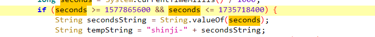
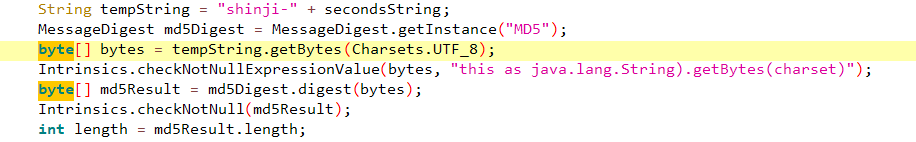
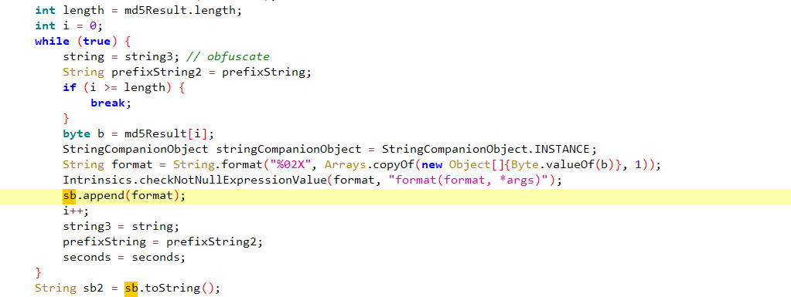
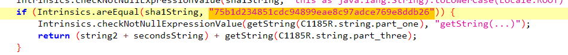
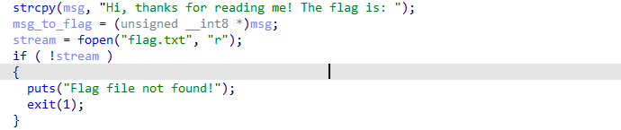
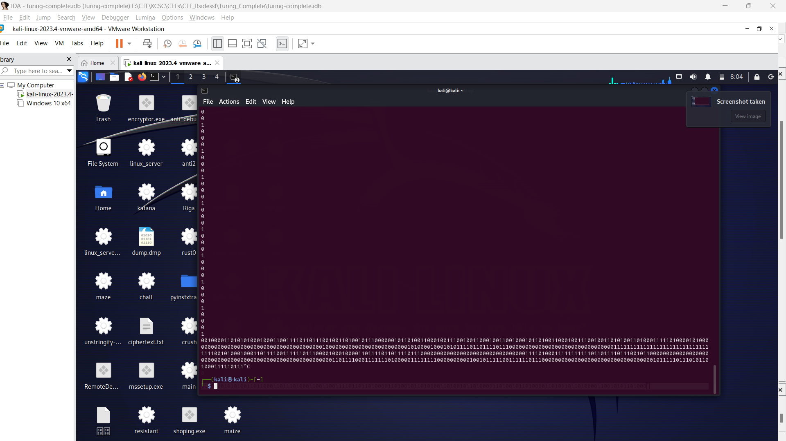
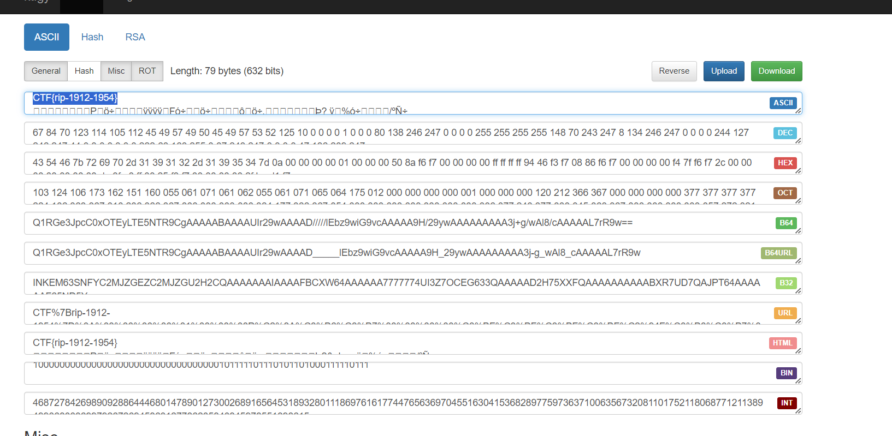

## CTFs/BsidesSF

- Cũng một thời gian mình mới quay lại với các giải CTF thường nhật. Mặc dù giải này mình không chủ động chơi nhưng có đứa em hỏi nên tiện tay giải 2 bài để lấy đà cuối tuần làm KCSCCTF vậy^^.

### Shinji

- Chall: [shinji.apk](Shinji/shinji.apk)

- Chall cấp cho ta một file `apk`. Mình sẽ sử dụng jadx để giải bài này.

```java
package com.eva.shinji;

import android.os.Bundle;
import android.util.Log;
import android.widget.TextView;
import androidx.appcompat.app.AppCompatActivity;
import java.security.MessageDigest;
import java.util.Arrays;
import java.util.Locale;
import kotlin.Metadata;
import kotlin.jvm.internal.Intrinsics;
import kotlin.jvm.internal.StringCompanionObject;
import kotlin.text.Charsets;

/* compiled from: MainActivity.kt */
@Metadata(m26d1 = {"\u0000\u001e\n\u0002\u0018\u0002\n\u0002\u0018\u0002\n\u0002\b\u0002\n\u0002\u0010\u000e\n\u0000\n\u0002\u0010\u0002\n\u0000\n\u0002\u0018\u0002\n\u0000\b\u0007\u0018\u00002\u00020\u0001B\u0005¢\u0006\u0002\u0010\u0002J\u0006\u0010\u0003\u001a\u00020\u0004J\u0012\u0010\u0005\u001a\u00020\u00062\b\u0010\u0007\u001a\u0004\u0018\u00010\bH\u0015¨\u0006\t"}, m25d2 = {"Lcom/eva/shinji/MainActivity;", "Landroidx/appcompat/app/AppCompatActivity;", "()V", "flagDisplay", "", "onCreate", "", "savedInstanceState", "Landroid/os/Bundle;", "app_debug"}, m24k = 1, m23mv = {1, 9, 0}, m21xi = 48)
/* loaded from: classes3.dex */
public final class MainActivity extends AppCompatActivity {
    public static final int $stable = 0;

    /* JADX INFO: Access modifiers changed from: protected */
    @Override // androidx.fragment.app.FragmentActivity, androidx.activity.ComponentActivity, androidx.core.app.ComponentActivity, android.app.Activity
    public void onCreate(Bundle savedInstanceState) {
        super.onCreate(savedInstanceState);
        setContentView(C1185R.C1188layout.activity_main);
        String flag = flagDisplay();
        Log.d("Flag:", flag);
        TextView textView = (TextView) findViewById(C1185R.C1187id.textView);
        textView.setText(flag);
    }

    public final String flagDisplay() {
        String string;
        String string2;
        String string3 = getString(C1185R.string.app_string);
        Intrinsics.checkNotNullExpressionValue(string3, "getString(...)");
        String prefixString = "shinji-";
        StringBuilder sb = new StringBuilder();
        long seconds = System.currentTimeMillis() / 1000;
        if (seconds >= 1577865600 && seconds <= 1735718400) {
            String secondsString = String.valueOf(seconds);
            String tempString = "shinji-" + secondsString;
            MessageDigest md5Digest = MessageDigest.getInstance("MD5");
            byte[] bytes = tempString.getBytes(Charsets.UTF_8);
            Intrinsics.checkNotNullExpressionValue(bytes, "this as java.lang.String).getBytes(charset)");
            byte[] md5Result = md5Digest.digest(bytes);
            Intrinsics.checkNotNull(md5Result);
            int length = md5Result.length;
            int i = 0;
            while (true) { // obfuscate
                string = string3;
                String prefixString2 = prefixString;
                if (i >= length) {
                    break;
                }
                byte b = md5Result[i];
                StringCompanionObject stringCompanionObject = StringCompanionObject.INSTANCE;
                String format = String.format("%02X", Arrays.copyOf(new Object[]{Byte.valueOf(b)}, 1));
                Intrinsics.checkNotNullExpressionValue(format, "format(format, *args)");
                sb.append(format);
                i++;
                string3 = string;
                prefixString = prefixString2;
                seconds = seconds;
            }
            String sb2 = sb.toString();
            Intrinsics.checkNotNullExpressionValue(sb2, "toString(...)");
            String md5String = sb2.toLowerCase(Locale.ROOT);
            Intrinsics.checkNotNullExpressionValue(md5String, "this as java.lang.String).toLowerCase(Locale.ROOT)");
            MessageDigest sha1Digest = MessageDigest.getInstance("SHA-1");
            byte[] bytes2 = md5String.getBytes(Charsets.UTF_8);
            Intrinsics.checkNotNullExpressionValue(bytes2, "this as java.lang.String).getBytes(charset)");
            byte[] sha1Result = sha1Digest.digest(bytes2);
            StringBuilder sb22 = new StringBuilder();
            Intrinsics.checkNotNull(sha1Result);
            int length2 = sha1Result.length;
            int i2 = 0;
            while (i2 < length2) { // obfuscate
                byte b2 = sha1Result[i2];
                StringCompanionObject stringCompanionObject2 = StringCompanionObject.INSTANCE;
                byte[] sha1Result2 = sha1Result;
                String format2 = String.format("%02X", Arrays.copyOf(new Object[]{Byte.valueOf(b2)}, 1));
                Intrinsics.checkNotNullExpressionValue(format2, "format(format, *args)");
                sb22.append(format2);
                i2++;
                length2 = length2;
                sha1Result = sha1Result2;
            }
            String sb3 = sb22.toString();
            Intrinsics.checkNotNullExpressionValue(sb3, "toString(...)");
            String sha1String = sb3.toLowerCase(Locale.ROOT);
            Intrinsics.checkNotNullExpressionValue(sha1String, "this as java.lang.String).toLowerCase(Locale.ROOT)");
            if (Intrinsics.areEqual(sha1String, "75b1d234851cdc94899eae8c97adce769e8ddb26")) {
                Intrinsics.checkNotNullExpressionValue(getString(C1185R.string.part_one), "getString(...)");
                return (string2 + secondsString) + getString(C1185R.string.part_three);
            }
            return string;
        }
        return string3;
    }
}
```

- Trên đây là toàn bộ nội dung hàm `MainActivity` được decompile bằng jadx, cũng là đoạn chương trình duy nhất ta cần focus vào.

- Trông có vẻ dài, nhưng khi đọc kĩ thì mình thấy chẳng qua chương trình bị `obfuscate` chứ cũng không phức tạp.

- Tóm tắt chương trình, chương trình thực hiện random giá trị trong khoảng `[1577865600,1735718400]` vào và ghép với `prefix` là `"shinji-"`.



- Sau đó thực hiện hash MD5 với chuỗi này và tiến tới đoạn `obfuscate`. Nói một chút về đoạn mã hóa, chuỗi `"shinji-***"` sau khi gen ra đã được đưa về dạng bytes char, và output sau khi hash cũng là dạng `bytes[]` như hình dưới.



- Chương trình thực hiện `obfuscate` bằng cách thêm một đoạn convert `hash output` về dạng string như hình dưới. Dễ thấy giá trị `md5Result[i]` ~ `b(kdl là byte)` được convert thành biến `format(kdl là String)` rồi thêm vào chuỗi `sb`.



- Rồi một loạt thực hiện uppercase, lowercase sau đó. Nhưng tới bước hash lần 2 bằng `SHA-1`, chuỗi hash `MD5` lại được convert thành dạng `bytes[]` :v.

- Cuối cùng thực hiện so sánh chuỗi hash 2 lần với 1 string có sẵn, nếu giống thì trả về `return (string2 + secondsString) + getString(C1185R.string.part_three);`. Trong đó string2 rỗng, `seconstring` là con số được rand ra ở đầu trước khi ghép với prefix `shinji-`, về `getString(C1185R.string.part_three)` mình không rõ là gì lắm, nó được gọi ra ở một số vị trí, cụ thể là ở `string3` bên trên nhưng không được sử dụng bao giờ, lần đầu lấy được `secondstring` mình đã xref tới `C1185R.string.part_three` rồi ghép chúng lại thành 1 string nhưng flag lại không đúng. Sau đó mình chỉ sử dụng `seconstring` và đó là đáp án của chall này. Nếu có công cụ để chạy file này thì mình có thể cho ra một lời giải thích thuyết phục hơn dựa vào output, nhưng chall này mình hoàn toàn phải phân tích tĩnh nên chỉ có thể suy đoán thôi@@.



- Tóm lại, Chương trình thực hiện hash 2 lần chuỗi `"shinji-secondstring"`, `MD5` và `SHA-1` rồi so sánh `"75b1d234851cdc94899eae8c97adce769e8ddb26"`. Khá đơn giản rồi, dưới đây là chương trình vét cạn của mình bằng `python` và `java`.

```python
import hashlib


def md5(input_string):
    return hashlib.md5(input_string.encode()).hexdigest()


def sha1(input_string):
    return hashlib.sha1(input_string.encode()).hexdigest()


target_hash = "75b1d234851cdc94899eae8c97adce769e8ddb26"
start_time = 1577865600
end_time = 1735718400

for seconds in range(start_time, end_time + 1):
    temp_string = "shinji-" + str(seconds)

    tmp1 = md5(temp_string)
    tmp2 = sha1(tmp1)

    if tmp2 == target_hash:
        print("CTF{"+str(seconds)+"}")
        break
print("???")
```

```java
import java.security.MessageDigest;
import java.security.NoSuchAlgorithmException;

public static void main(String[] args) {
    // String header = "shinji-";
    String tmp1 = ""; // Khởi tạo tmp1
    String tmp2 = ""; // Khởi tạo tmp2
    for (int seconds = 1577865600; seconds <= 1735718400; ++seconds) {
        String secondsString = String.valueOf(seconds);
        String tempString = "shinji-" + secondsString;

        try {
            MessageDigest md5Digest = MessageDigest.getInstance("MD5");
            byte[] bytes = tempString.getBytes();
            byte[] md5Result = md5Digest.digest(bytes);
            tmp1 = bytesToHex(md5Result);
        } catch (NoSuchAlgorithmException e) {
            e.printStackTrace();
        }

        try {
            MessageDigest sha1Digest = MessageDigest.getInstance("SHA-1");
            byte[] bytes = tmp1.getBytes();
            byte[] sha1Result = sha1Digest.digest(bytes);
            tmp2 = bytesToHex(sha1Result);
        } catch (NoSuchAlgorithmException e) {
            e.printStackTrace();
        }

        // System.out.println(tmp2);
        if (tmp2.equals("75b1d234851cdc94899eae8c97adce769e8ddb26")) {
            System.out.println(seconds);
            break;
        }
    }
}

private static String bytesToHex(byte[] bytes) {
    StringBuilder sb = new StringBuilder();
    for (byte b : bytes) {
        sb.append(String.format("%02x", b));
    }
    return sb.toString();
}
```

```
flag: CTF{1615212000}
```

### Turing Complete

- Chall: [Turning-Complete](Turing_Complete/turing-complete)

- Chall này khá dễ :v.

- Chương trình thực hiện đọc nội dung từ file `flag.txt`(trên sever) và viết vào sau dải string `"Hi, thanks for reading me! The flag is: "`.



- Chương trình thực hiện thông qua 2 truy vấn ta truyền vào được điều chỉnh trong hàm `binary_resolve()` dưới.

```C
unsigned __int8 __cdecl binary_resolve()
{
  int v1; // [esp+Ch] [ebp-Ch]

  do
  {
    v1 = getchar();
    if ( v1 == -1 || !v1 || v1 == 'q' )
      return 2;
    if ( v1 == '0' )
      return 0;
  }
  while ( v1 != '1' );
  return 1;
}
```

- Các bộ truy vấn gồm:

```
0 0 : tăng vị trí con trỏ trỏ tới string "Hi, thanks for reading me! The flag is: + flag" lên 1 đơn vị.
0 1 : giảm vị trí con trỏ trỏ tới string "Hi, thanks for reading me! The flag is: + flag" lên 1 đơn vị.
1 0 : in ra giá trị kí tự ở vị trí hiện đang được trỏ tới.
1 1 : mã hóa kí tự ở vị trí hiện được trỏ tới.
```

- Những chức năng này dễ dàng nhìn ra được khi debug thôi. Nhiệm vụ của ta là lấy ra được flag đằng sau chuỗi `"Hi, thanks for reading me! The flag is: "`, vậy ta cần di chuyển liên tục tới len của chuỗi này rồi vừa in ra vừa di chuyển 1 đơn vị là được. Dưới đây là script lấy ra bộ truy vấn của mình. Nếu có gì cần lưu ý thì, chương trình nhận input bằng hàm `getchar()` nên đừng nhập vào 1 chuỗi truy vấn nhé :v.

```python
for i in range(0, 40*2): # chạy tới đuôi của chuỗi prefix
    print("0")
for i in range(0, 40*2): # in ra từng kí tự một rồi di chuyển tiếp
    print("0\n0\n1\n0")
```



- Nhặt chuỗi nhị phân đầu ra sau khi truyền vào bộ truy vấn trên, convert lại sang dạng char, ta thu được flag.



```
flag: CTF{rip-1912-1954}
```

## Mong WRITEUP này giúp ích cho các bạn!

```
from KMA
Author: 13r_ə_Rɪst
```
