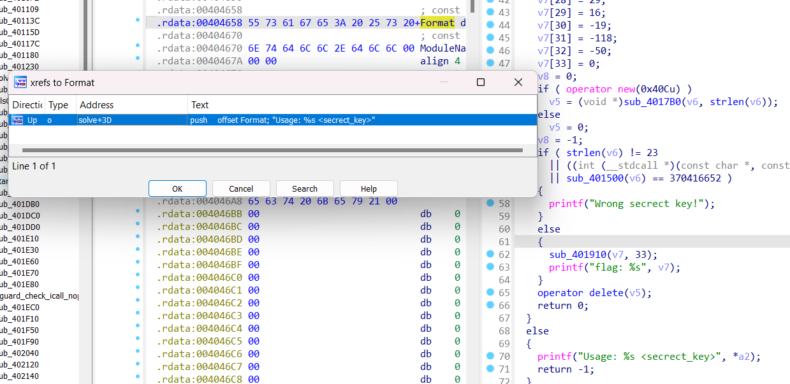

## CTFs/kmactf

- Mình được anh Dũng cho đề giải này lúc mới vào nhưng có vẻ khi đó mình chưa đủ kiến thức để làm, đây là WU của mình sau khi quay lại làm tiếp với 2 tháng kiến thức được training^^.

### Encryptor

- Chall này cấp cho ta hai file [flag.bmp.encrypted](flag.bmp.encrypted) và [encryptor.exe](encryptor.exe).

- Một chút tư duy sơ bộ khi thấy những thứ được cấp, ta có thể hình dung rằng file `flag.bmp.encrypted` là file được mã hóa bởi chương trình `encryptor`.


- Quăng vào `IDA` và làm đẹp mã giả, ta có thể tóm tắt nội dung chương trình với một số công đoạn.

- Chương trình cần truyền vào 2 `argv`, là `file` và `key`. `argv[2]` sẽ được convert sang `bytes` và truyền vào `key[4]` để thực hiện mã hóa `RC4` input `file` trong `argv[1]`.

- Nói về `key`, với key sẽ được xử lý thành dạng 4byte hex, và được sử dụng như một mảng 4 phần tử 1 byte để mã hóa. ví dụ như input key của mình là `9999` thì sẽ được convert thành `[0f, 27, 00, 00]`,


- File ảnh `.bmp` được mã hóa `RC4` với `key` sẽ được thêm đuôi `.encrypted` như đề bài đã cấp. Vậy nhiệm vụ của mình sẽ là khôi phục lại file `.bmp` ban đầu.


- RC4 là dạng mã hóa đối xứng. Với một `key`, ta có thể `decrypt` file bị mã hóa RC4 bằng cách truyền lại vào hàm `RC4` này.

- Vậy thứ ta cần vét cạn là `key`, mình sẽ duyệt từ `0x00000000` đến `0xffffffff` tức là từ 0 đến `MAX_INT`. Về phần file gốc `.bmp` ta sẽ nhận dạng nó bằng cách kiểm tra `HEADER` file là `BM`, nếu đúng định dạng thì ta sẽ break và truyền nội dung vào một file khác là hoàn thành việc khôi phục.


- Dưới đây là chương trình mình xây dựng để vét `key`.

```python
with open("flag.bmp.encrypted", "rb") as encrypted_file:
    lines = encrypted_file.read()

for K in range(4294967296):
    cnt = K
    f = 1
    data = []
    for i in lines:
        data.append((i))

    key = []
    for num in range(4):
        key.append((K & 0xff))
        K = (K-(K & 0xff)) >> 8
    # print(key)

    this = [i for i in range(0, 256)]
    tmp1 = 0
    tmp2 = 0
    for i in range(0, 256):
        tmp1 = ((key[i % 4]) + this[i] + tmp1) % 256
        tmp2 = this[i] & 0xff
        this[i] = this[tmp1]
        this[tmp1] = tmp2

    i = j = 0
    for ch in range(len(data)):
        i = (i + 1) % 256
        j = (j + this[i]) % 256
        this[i], this[j] = this[j], this[i]
        data[ch] = (data[ch] ^ this[(this[i] + this[j]) % 256]) & 0xff
        if (ch == 0 and data[0] != 66) or (ch == 1 and data[1] != 77):
            f = 0
            break

    if f == 1:
        print(cnt)
        byte_data = bytes(data)
        with open("flag.bmp", "wb") as encrypted_file:
            encrypted_file.write(byte_data)
        break
    f = 1
```

- file ảnh sau khi được decrypt


```
flag: KMACTF{th3_k3y_is_t00_w3ak}
```

### Little_chall

- Chall: [Little_chall](3_little_chall/unpacked_little_challenge.exe)

- Chall này được bị pack nên mọi người cần unpack nó trước khi giải.

- Bài này mình khá thiếu cẩn thận khi làm. Vốn tưởng rằng điều mình cần lưu ý là luồng khác ở `TLS_call_back()` là luồng chuẩn và phải patch tại khâu `IsDebuggerPresent()` trước khi `xor` nhưng không @@. Cụ thể là sao thì mọi người đọc tiếp để biết thêm chi tiết^^.

- Phân tích sơ bộ chall này. Mình `xref` dựa theo các string xuất hiện ở chương trình thực thi để tìm tới hàm xử lý.




```C++
int __cdecl solve(int a1, const char **a2)
{
  int (__cdecl *strcmp)(const char *, const char *); // [esp+8h] [ebp-70h]
  HMODULE hModule; // [esp+20h] [ebp-58h]
  _BYTE *inited; // [esp+28h] [ebp-50h]
  _DWORD *Map; // [esp+2Ch] [ebp-4Ch]
  const char *key; // [esp+34h] [ebp-44h]
  char cipher[36]; // [esp+44h] [ebp-34h] BYREF
  int v9; // [esp+74h] [ebp-4h]

  if ( a1 == 2 )
  {
    key = a2[1];
    hModule = GetModuleHandleA("ntdll.dll");
    strcmp = (int (__cdecl *)(const char *, const char *))GetProcAddress(hModule, "strcmp");
    qmemcpy(cipher, "@F", 2);
    cipher[2] = 0xCE;
    cipher[3] = 0xA9;
    cipher[4] = 0x8C;
    cipher[5] = 0xC4;
    cipher[6] = 0x6D;
    cipher[7] = 128;
    cipher[8] = 0x5F;
    cipher[9] = 0xB1;
    cipher[10] = 0xFE;
    cipher[11] = 0xF;
    cipher[12] = 0xC2;
    cipher[13] = 0x7E;
    cipher[14] = 0xAA;
    cipher[15] = 0x17;
    cipher[16] = 0xC2;
    cipher[17] = 0xF7;
    cipher[18] = 0x34;
    cipher[19] = 0x27;
    cipher[20] = 0x62;
    cipher[21] = 0xA;
    cipher[22] = 0x99;
    cipher[23] = 0xAC;
    cipher[24] = 0x58;
    cipher[25] = 0x30;
    cipher[26] = 0xC1;
    cipher[27] = 0xAC;
    cipher[28] = 0x1D;
    cipher[29] = 0x10;
    cipher[30] = 0xED;
    cipher[31] = 0x8A;
    cipher[32] = 0xCE;
    cipher[33] = 0;
    Map = operator new(0x40Cu);
    v9 = 0;
    if ( Map )
      inited = init_map_RC4(Map, (int)key, strlen(key));
    else
      inited = 0;
    v9 = -1;
    if ( strlen(key) != 23
      || ((int (__stdcall *)(const char *, const char *))strcmp)(key, "Mai ben nhau ban nhe :)")
      || checker(key) == 370416652 )
    {
      printf("Wrong secrect key!");
    }
    else
    {
      encryptor_RC4(inited, (int)cipher, 0x21u);
      printf("flag: %s", cipher);
    }
    operator delete(inited);
    return 0;
  }
  else
  {
    printf("Usage: %s <secrect_key>", *a2);
    return -1;
  }
}
```

- Chương trình thực hiện encrypt `RC4` mảng `cipher` bằng secret là argv[]. Mình thử dựng lại nhưng gặp 1 vấn đề ở khâu `checker()`, với key là `"Mai ben nhau ban nhe :)"` được strcmp trước đó, `checker()` sẽ luôn trả về giá trị bằng `370416652`. Bỏ qua nó thì flag in ra cũng chỉ là data rác.

- Tiến hành phân tích `TLS_call_back()`. Luồng chương trình này thực hiện check debugger, nếu ta debug thì chương trình sẽ nhảy tới khối lệnh xử lý bên trong, ta thực hiện bypass để nhảy vào.


- Sau đoạn tính toán ở trên, ta thấy biến `lpAddress` trỏ tới địa chỉ của hàm `ntdll_strcmp` được tái định nghĩa trong hàm xử lý chính thay vì gọi trực tiếp WinAPI `strcmp` bình thường.


- Tới đây thì mình cũng hình dung ra một chút, ở khúc dưới đây chương trình thực hiện so sánh không phải `strcmp` giữa `key` và `const` string mà thực chất là truyền chúng vào hàm kiểm tra được ghi đè lên trong luồng `TLS_call_back`.


- Chuyển hướng tới kiểm tra hàm này.


```cpp
int __stdcall sub_4015D0(const void *a1, const char *a2)
{
  int v3; // [esp+Ch] [ebp-74h]
  _BYTE *inited; // [esp+28h] [ebp-58h]
  _DWORD *v5; // [esp+2Ch] [ebp-54h]
  int i; // [esp+38h] [ebp-48h]
  char v7; // [esp+3Fh] [ebp-41h]
  _BYTE Buf1[23]; // [esp+40h] [ebp-40h] BYREF
  char v9; // [esp+57h] [ebp-29h]
  char Buf2[24]; // [esp+58h] [ebp-28h] BYREF
  int v11; // [esp+7Ch] [ebp-4h]

  v7 = IsDebuggerPresent() ^ 0xAA;
  Buf2[0] = 0xE3;
  Buf2[1] = 0x2E;
  Buf2[2] = 0xD0;
  Buf2[3] = 0xA6;
  Buf2[4] = 0xD6;
  Buf2[5] = 0x7D;
  Buf2[6] = 0x54;
  Buf2[7] = 0x3F;
  Buf2[8] = 0xAC;
  Buf2[9] = 0xF;
  Buf2[10] = 0x24;
  Buf2[11] = 0x10;
  Buf2[12] = 0x9C;
  Buf2[13] = 0xCB;
  Buf2[14] = 0x26;
  Buf2[15] = 0xBC;
  Buf2[16] = 0xB3;
  Buf2[17] = 0x89;
  Buf2[18] = 0x84;
  Buf2[19] = 0x24;
  Buf2[20] = 128;
  Buf2[21] = 0xBD;
  Buf2[22] = 0x48;
  v9 = 0;
  qmemcpy(Buf1, a1, sizeof(Buf1));
  for ( i = 0; i < 23; ++i )
    Buf1[i] ^= v7;
  v5 = operator new(0x40Cu);
  v11 = 0;
  if ( v5 )
    inited = init_map_RC4(v5, (int)a2, strlen(a2));
  else
    inited = 0;
  v11 = -1;
  encryptor_RC4(inited, (int)Buf1, 0x17u);
  v3 = memcmp(Buf1, Buf2, 0x17u);
  operator delete(inited);
  return v3;
}
```

- Nội dung của hàm được ghi đè như trên. Hàm này lấy biến `input_key` của ta thành cipher và mã hóa RC4 với key là `"Mai ben nhau ban nhe :)"`, rồi kiểm tra encrypted_key của ta với `Buf2`. Vậy ta hoàn toàn có thể decrypt bằng cách truyền ngược lại `Buf2` vào.

- Một vấn đề nhỏ xuất hiện ở đây, mình thấy biến này xor với `IsDebuggerPresent()` trước khi xor với `key`, mình cho rằng nó phải là 0 bởi Nếu là 1 thì đã hỏng từ khâu kiểm tra ở ngoài.

  

- Nhưng thực ra chương trình, chỉ nhảy vào trong khi chương trình đang bị debug :v. Hơi ngược, và v7 = 1 ^ 0xAA = 0xAB.

  

- Cuối cùng, Chương trình thực hiện decrypt cipher có sẵn với `key` trả ra `true` ở hàm trên.


- Dưới đây là chương trình mà mình dựng lại dựa trên luồng chuẩn đã phân tích ở trên.

```python
secret = "Mai ben nhau ban nhe :)"
# true_secret = "9FPIU6vUxfQOHaisOChDY1F"

v7_key = [0x40, 0x46, 0xCE, 0xA9, 0x8C, 0xC4, 0x6D, 0x80, 0x5F, 0xB1,
          0xFE, 0x0F, 0xC2, 0x7E, 0xAA, 0x17, 0xC2, 0xF7, 0x34, 0x27,
          0x62, 0x0A, 0x99, 0xAC, 0x58, 0x30, 0xC1, 0xAC, 0x1D, 0x10,
          0xED, 0x8A, 0xCE]

Buf2 = [0xE3, 0x2E, 0xD0, 0xA6, 0xD6, 0x7D, 0x54, 0x3F, 0xAC, 0xF, 0x24,
        0x10, 0x9C, 0xCB, 0x26, 0xBC, 0xB3, 0x89, 0x84, 0x24, 0x80, 0xBD, 0x48]

this = [i for i in range(0, 256)]
tmp1 = 0
tmp2 = 0

# KSA Phase
for i in range(0, 256):
    tmp1 = (ord(secret[i % 0x17]) + this[i] + tmp1) % 256
    tmp2 = this[i] & 0xff
    this[i] = this[tmp1]
    this[tmp1] = tmp2

# PRGA Phase
i = j = 0
for ch in range(len(Buf2)):
    i = (i + 1) % 256
    j = (j + this[i]) % 256
    this[i], this[j] = this[j], this[i]
    Buf2[ch] = (Buf2[ch] ^ this[(this[i] + this[j]) % 256]) & 0xff

for i in range(len(Buf2)):
    # Buf2[i] = Buf2[i] ^ 0xAA
    Buf2[i] = Buf2[i] ^ 0xAB

for i in Buf2:
    print(chr(i), end='')
print()

# KSA Phase
this = [i for i in range(0, 256)]
tmp1 = 0
tmp2 = 0
for i in range(0, 256):
    tmp1 = (Buf2[i % 0x17] + this[i] + tmp1) % 256
    tmp2 = this[i] & 0xff
    this[i] = this[tmp1]
    this[tmp1] = tmp2

# PRGA Phase
i = j = 0
for ch in range(len(v7_key)):
    i = (i + 1) % 256
    j = (j + this[i]) % 256
    this[i], this[j] = this[j], this[i]
    v7_key[ch] = (v7_key[ch] ^ this[(this[i] + this[j]) % 256]) & 0xff
# for i in range(len(Buf2)):
#     Buf2[i] = Buf2[i] ^ 0xAA


for i in v7_key:
    print(chr(i), end='')
print()

print(hex(0 ^ 0xAA))
print(hex(1 ^ 0xAA))
```

```
flag: KMACTF{A_littl3_tricky_chall3ng3}
```

### Guess_my_flag

- Chall: [guess.exe](Guess%20my%20flag/guess.exe)

- Bài này hơi guessing, kể cả có hint thì việc giải nó cũng không thể nói là thuyết phục, hoàn toàn dựa vào phán đoán.

- Tiếp cận với chall này, những dữ liệu mình thu được gồm `data[]` được khởi tạo từ trước và dùng `input_key` mà mình nhập vào để thực hiện một vài phép toán với nó.


- Tiến tới `encryptor()`, Mình thấy một thứ khá tương đồng với các chall trước.


- Ngó thử hàm `init_map()` thì thấy đúng là trong vừa lạ vừa quen, khá giống với `RC4` nhưng không phải. `Map` được sinh ra từ key chỉ có độ lớn 128(`RC4` là 256).


- Phần `encrypt()` dựa vào Map được khởi tạo thông qua `input_key` cũng na ná `RC4` thực hiện việc đảo vị trí dựa trên Map. Mình nghĩ ràng một chương trình mã hóa giống RC4 thế này chắc có thể tra được trên mạng, tuy vậy mình có search thử RC2(vì độ lớn map bằng một nửa RC4 :v) nhưng không có kết quả.


- Dù vậy mình vẫn thử dựng lại để thử xem đây có phải mã hóa đối xứng không. Vầ đúng là chương trình mã hóa đối xứng. Với data chương trình cấp sẵn và `input_key = [1,2,3,4,5]`, mình lấy output truyền ngược lại và ra `data[]` ban đầu.


- Vấn đề phát sinh ở đây, chương trình không có `checker` hay thứ gì tương tự để ta giới hạn `input_key`. Điều này khiến việc vét cạn là không thể, bởi thậm chí còn không có độ dài của `input_key` để mà vét. Mình xem có `hint` như sau.


- Hint này làm mình chú ý tới đoạn gán data ở đầu chương trình. Trước khâu gán giá trị vào `data`, có một đoạn giá trị cũng được truyền vào một dải data nào đó. Với thứ duy nhất mình thiếu hiện tại là `input_key`, mình thử thay nó vào vị trí của `input_key` và thu được `encrypted_data` là flag.


```python
data = [0x22, 0x70, 0x6A, 0x0C, 0x58, 0x3F, 0x05, 0x08, 0x74, 0x3A,
        0x53, 0x0C, 0x79, 0x55, 0x77, 0x51, 0x4F, 0x4A, 0x2A, 0x37,
        0x45, 0x70, 0x5C, 0x52, 0x45, 0x7E, 0x71, 0x61, 0x51, 0x56,
        0x4F, 0x04, 0x5E, 0x59, 0x69, 0x10, 0x26, 0x50, 0x28, 0x68,
        0x06, 0x3B, 0x39, 0x30, 0x29, 0x01, 0x69, 0x71, 0x33, 0x41,
        0x47, 0x70, 0x2A, 0x7E, 0x14, 0x72, 0x1B, 0x5B, 0x42, 0x11,
        0x7C, 0x51, 0x2B, 0x78, 0x23, 0x68, 0x0C, 0x76, 0x27, 0x05,
        0x00]

input_key = [0x45, 0x32, 0x55, 0x35, 0x14, 0x0F, 0x5D, 0x63, 0x26, 0x76,
             0x74, 0x06, 0x02, 0x31, 0x05, 0x34, 0x51, 0x77, 0x5C, 0x2C,
             0x3F, 0x2B, 0x3E, 0x36, 0x28, 0x07, 0x50, 0x7D, 0x40, 0x58,
             0x24, 0x15, 0x65, 0x79, 0x6F, 0x5A, 0x3A, 0x59, 0x3B, 0x04,
             0x5C, 0x4C, 0x2F, 0x3D, 0x26, 0x11, 0x38, 0x2A, 0x17, 0x42,
             0x30, 0x4E, 0x1B, 0x05, 0x06, 0x49]
Map = [0]*128

# print(Map)
# print(len(Map))
# print(len(key))

for i in range(128):
    Map[i] = i

v4 = 0
for j in range(128):
    v4 = (input_key[j % len(input_key)] + v4 + Map[j]) % 128
    # swap( & Map[j], & Map[v4])
    Map[j], Map[v4] = Map[v4], Map[j]

encypted_data = [0]*len(data)
cnt = 0
v6 = 0
for i in range(len(data)):
    cnt = (cnt+1) % 128
    v6 = (v6+Map[cnt]) % 128
    Map[cnt], Map[v6] = Map[v6], Map[cnt]
    encypted_data[i] = (Map[(Map[v6] + Map[cnt]) % 128] ^ data[i]) & 0xff

for i in encypted_data:
    print(hex(i), end=" ")
# print(encypted_data)
for i in encypted_data:
    print(chr(i), end="")
```

```
flag: KMA{haycuvotuvalacquanlenemoichilakhongyeuthuongthoisaonuocmatphairoi}
```

### Callfuscate

- Chall: [Callfuscate.exe](CallFuscate/callfuscate.exe)

- Chall này kiến mình nhận ra khả năng reverse các phép toán vẫn gà loz lắm vì còn sơ suất trong việc đối chiếu kiểu dữ liệu giữa mã máy và mã giả.

- Một chút khái quát về chall này, đây là một chương trình được xây dựng khá cơ bản, gồm các khâu `get_input()`, `encrypt()`, `check()`.


- Thứ khiến chall này độc đáo là cách gọi ra những chức năng này. Dưới đây là một phần của `to_Encrypt()`. Chương trình không thực hiện gọi trực tiếp chúng ra mà thực hiện rất nhiều các phép toán để sinh ra địa chỉ của hàm này. Rồi ép kiểu và `call` nó.


- Tuy trông khá độc lạ, việc làm rối chương trình lại không phải thứ khiến chall này trở nên khó khăn, bởi các hàm này đều là `const`, bởi đối số chỉ được dùng ở một vị trí duy nhất là làm input của hàm được tính toán ra. Mọi người có thể tự kiểm tra bằng `xref`. Mình nghĩ việc gây phức tạp thay vì thực hiện gọi trực tiếp là để chống debug tĩnh chăng?


- Tất nhiên là mình debug động :v. Tiếp cận bài toán, vì đã xác định rằng không cần quan tâm tới các phép toán sinh ra hàm, mình setup `breakpoint` ngay tại các vị trí gọi hàm sau khi tính toán để tiến tới những hàm xử lý thực sự.


- Sau khi nhập input, ta tiến tới hàm encrypt và dưới đây là 2 hàm xử lý của chall.

- Hàm xử lý chính của `encryptor()`.

```c++
__int64 __fastcall sub_7FF7D3951170(const char *a1)
{
  int v2; // eax
  int v3; // ebx
  signed int v4; // ebx
  __int64 result; // rax
  __int64 v6; // rbx
  __int64 v7; // rdi
  __int64 v8[3]; // [rsp+28h] [rbp-40h] BYREF

  v2 = strlen(a1);
  v3 = v2 + 7;
  if ( v2 >= 0 )
    v3 = v2;
  v4 = (v3 & 0xFFFFFFF8) + 8;
  result = 0x64657375666E6F63i64;               // Confused
  *(__int64 *)((char *)&v8[1] + 1) = 0x64657375666E6F63i64;// Confused
  if ( v4 >= 8 )
  {
    v6 = (unsigned int)v4 >> 3;
    v7 = 0i64;
    do
    {
      v8[0] = *(_QWORD *)&a1[8 * v7];
      sub_7FF7D3951200((__int64)v8);
      result = v8[0];
      *(_QWORD *)&a1[8 * v7++] = v8[0];
    }
    while ( v6 != v7 );
  }
  return result;
}
```

- Hàm này được gọi từ `sub_7FF7D3951200()`

```c++
char __fastcall sub_7FF7D3951000(char *a1)
{
  char V_0; // r8
  char V_1; // r10
  char V_2; // r15
  char V_3; // dl
  char V_4; // si
  char V_5; // di
  char K_5; // r13
  char V_6; // bl
  char K_6; // r9
  char V_7; // al
  char K_7; // cl
  int v12; // r11d
  char K_4; // [rsp+8h] [rbp-68h]
  char K_3; // [rsp+10h] [rbp-60h]
  char K_2; // [rsp+18h] [rbp-58h]
  char K_1; // [rsp+20h] [rbp-50h]
  char K_0; // [rsp+28h] [rbp-48h]

  V_0 = *a1;
  V_1 = a1[1];
  K_0 = a1[9];
  K_1 = a1[10];
  V_2 = a1[2];
  K_2 = a1[11];
  V_3 = a1[3];
  K_3 = a1[12];
  V_4 = a1[4];
  K_4 = a1[13];
  V_5 = a1[5];
  K_5 = a1[14];
  V_6 = a1[6];
  K_6 = a1[15];
  V_7 = a1[7];
  K_7 = a1[16];
  v12 = 100;
  do
  {
    V_1 = __ROL1__(key[(unsigned __int8)(V_0 + K_0)] + V_1, 1);
    V_2 = __ROL1__(key[(unsigned __int8)(V_1 + K_1)] + V_2, 1);
    V_3 = __ROL1__(key[(unsigned __int8)(V_2 + K_2)] + V_3, 1);
    V_4 = __ROL1__(key[(unsigned __int8)(V_3 + K_3)] + V_4, 1);
    V_5 = __ROL1__(key[(unsigned __int8)(V_4 + K_4)] + V_5, 1);
    V_6 = __ROL1__(key[(unsigned __int8)(V_5 + K_5)] + V_6, 1);
    V_7 = __ROL1__(key[(unsigned __int8)(K_6 + V_6)] + V_7, 1);
    V_0 = __ROL1__(key[(unsigned __int8)(K_7 + V_7)] + V_0, 1);
    --v12;
  }
  while ( v12 );
  a1[1] = V_1;
  a1[2] = V_2;
  a1[3] = V_3;
  a1[4] = V_4;
  a1[5] = V_5;
  a1[6] = V_6;
  a1[7] = V_7;
  *a1 = V_0;
  return V_7;
}
```

- Dễ thấy `v8[0] = *(_QWORD *)&a1[8 * v7];` thực hiện nhặt 8 phần tử một từ mảng `a1` ~ `input` và truyền vào `sub_7FF7D3951200((__int64)v8);` để thực hiện mã hóa.

- Trong hàm `sub_7FF7D3951000()` được gen ra bởi `sub_7FF7D3951200()`, chương trình thực hiện `rol`(8 byte) 1 đơn vị lần lượt 100 lần.


- Các thành phần được sử dụng trong phép tính này gồm 2 const cần nhặt ra là chuỗi `seed = "confused"` và `key[256]` mà mọi người có thể dễ ràng trace tới.


- Dưới đây là chương trình mình dựng lại từ 2 hàm này để phục vụ `bruteforces` khi cần.

```python
def ror(n, rotations=1, bits=8):
    return ((n >> rotations) | (n << (bits - rotations))) & ((1 << bits) - 1)
def rol(n, rotations=1, bits=8):
    return ((n << rotations) | (n >> (bits - rotations))) & ((1 << bits) - 1)

for i in range(0, len(ans), 8):
    for j in range(100):
        ans[i+1] = rol((key[(ord(seed[0]) + ans[i+0]) & 0xff]+ans[i+1]) & 0xff)
        ans[i+2] = rol((key[(ord(seed[1]) + ans[i+1]) & 0xff]+ans[i+2]) & 0xff)
        ans[i+3] = rol((key[(ord(seed[2]) + ans[i+2]) & 0xff]+ans[i+3]) & 0xff)
        ans[i+4] = rol((key[(ord(seed[3]) + ans[i+3]) & 0xff]+ans[i+4]) & 0xff)
        ans[i+5] = rol((key[(ord(seed[4]) + ans[i+4]) & 0xff]+ans[i+5]) & 0xff)
        ans[i+6] = rol((key[(ord(seed[5]) + ans[i+5]) & 0xff]+ans[i+6]) & 0xff)
        ans[i+7] = rol((key[(ord(seed[6]) + ans[i+6]) & 0xff]+ans[i+7]) & 0xff)
        ans[i+0] = rol((key[(ord(seed[7]) + ans[i+7]) & 0xff]+ans[i+0]) & 0xff)
```

- Tiếp tới là `to_Checker()`, chương trình khá đơn giản. Chỉ là trực tiếp kiểm tra `encrypted_data` với dải data từ `unk_7FF7D3976000` với độ dài 0x30.


- Khi mọi thứ rõ ràng đến vậy thì không cần bruteforce, mà thực ra dù muốn vét cạn cũng không được bởi chỉ riêng việc quét tất cả các bộ 8 kí tự 1 lần thôi đã đủ nổ máy rồi :v.

- Vậy nên ở đây ta cần giải một bài toán nho nhỏ. Từng kí tự khi được rol luôn phụ thuộc vào kí tự trước đó, riêng `ans[i+0]` thì phụ thuộc vào `ans[i+7]`. Vậy thì giả sử sau lần lặp thứ 100, ta có:

```python
(j=100)
ans[i+0] = rol((key[(ord(seed[7]) + ans[i+7]) & 0xff]+ans[i+0]) & 0xff)
-> ((key[(ord(seed[7]) + ans[i+7]) & 0xff]+ans[i+0]) & 0xff) = ror(ans[i+0])
-> với seed[] và key[] là `const`, vậy nên hoàn toàn phụ thuộc vào `ans[i+7]` thì được cho sẵn là chuỗi data từ checker ~ `unk_7FF7D3976000`
-> Vấn đề ở đây là việc `&0xff` làm mất byte nên ta đành phải duyệt `ans[i+0]` ở vế trái trong khoảng 0-0xff.
Việc chứng minh nó luôn tồn tại duy nhất 1 giá trị thỏa mãn biểu thức mọi người hoàn toàn có thể duyệt một mẫu nhỏ hơn để chứng minh.
```

- Dưới đây là script reverse của mình

```python
key = [0x63, 0x7C, 0x77, 0x7B, 0xF2, 0x6B, 0x6F, 0xC5, 0x30, 0x01,
       0x67, 0x2B, 0xFE, 0xD7, 0xAB, 0x76, 0xCA, 0x82, 0xC9, 0x7D,
       0xFA, 0x59, 0x47, 0xF0, 0xAD, 0xD4, 0xA2, 0xAF, 0x9C, 0xA4,
       0x72, 0xC0, 0xB7, 0xFD, 0x93, 0x26, 0x36, 0x3F, 0xF7, 0xCC,
       0x34, 0xA5, 0xE5, 0xF1, 0x71, 0xD8, 0x31, 0x15, 0x04, 0xC7,
       0x23, 0xC3, 0x18, 0x96, 0x05, 0x9A, 0x07, 0x12, 0x80, 0xE2,
       0xEB, 0x27, 0xB2, 0x75, 0x09, 0x83, 0x2C, 0x1A, 0x1B, 0x6E,
       0x5A, 0xA0, 0x52, 0x3B, 0xD6, 0xB3, 0x29, 0xE3, 0x2F, 0x84,
       0x53, 0xD1, 0x00, 0xED, 0x20, 0xFC, 0xB1, 0x5B, 0x6A, 0xCB,
       0xBE, 0x39, 0x4A, 0x4C, 0x58, 0xCF, 0xD0, 0xEF, 0xAA, 0xFB,
       0x43, 0x4D, 0x33, 0x85, 0x45, 0xF9, 0x02, 0x7F, 0x50, 0x3C,
       0x9F, 0xA8, 0x51, 0xA3, 0x40, 0x8F, 0x92, 0x9D, 0x38, 0xF5,
       0xBC, 0xB6, 0xDA, 0x21, 0x10, 0xFF, 0xF3, 0xD2, 0xCD, 0x0C,
       0x13, 0xEC, 0x5F, 0x97, 0x44, 0x17, 0xC4, 0xA7, 0x7E, 0x3D,
       0x64, 0x5D, 0x19, 0x73, 0x60, 0x81, 0x4F, 0xDC, 0x22, 0x2A,
       0x90, 0x88, 0x46, 0xEE, 0xB8, 0x14, 0xDE, 0x5E, 0x0B, 0xDB,
       0xE0, 0x32, 0x3A, 0x0A, 0x49, 0x06, 0x24, 0x5C, 0xC2, 0xD3,
       0xAC, 0x62, 0x91, 0x95, 0xE4, 0x79, 0xE7, 0xC8, 0x37, 0x6D,
       0x8D, 0xD5, 0x4E, 0xA9, 0x6C, 0x56, 0xF4, 0xEA, 0x65, 0x7A,
       0xAE, 0x08, 0xBA, 0x78, 0x25, 0x2E, 0x1C, 0xA6, 0xB4, 0xC6,
       0xE8, 0xDD, 0x74, 0x1F, 0x4B, 0xBD, 0x8B, 0x8A, 0x70, 0x3E,
       0xB5, 0x66, 0x48, 0x03, 0xF6, 0x0E, 0x61, 0x35, 0x57, 0xB9,
       0x86, 0xC1, 0x1D, 0x9E, 0xE1, 0xF8, 0x98, 0x11, 0x69, 0xD9,
       0x8E, 0x94, 0x9B, 0x1E, 0x87, 0xE9, 0xCE, 0x55, 0x28, 0xDF,
       0x8C, 0xA1, 0x89, 0x0D, 0xBF, 0xE6, 0x42, 0x68, 0x41, 0x99,
       0x2D, 0x0F, 0xB0, 0x54, 0xBB, 0x16]

ans = [0xE5, 0xA8, 0x07, 0x2E, 0xE8, 0x67, 0xB5, 0x0C, 0xF9, 0x05,
       0xA1, 0xA8, 0xFA, 0x05, 0x0A, 0x66, 0xA0, 0xC1, 0x20, 0x4E,
       0xE3, 0x7D, 0xD0, 0x04, 0x21, 0x67, 0xEC, 0x9E, 0x7D, 0xBC,
       0x2D, 0x8D, 0x9B, 0x65, 0xDC, 0x71, 0xE4, 0x57, 0x81, 0x11,
       0x1A, 0x71, 0x7F, 0x84, 0x2C, 0x88, 0x25, 0x94]

seed = "confused"

def ror(n, rotations=1, bits=8):
    return ((n >> rotations) | (n << (bits - rotations))) & ((1 << bits) - 1)

def rol(n, rotations=1, bits=8):
    return ((n << rotations) | (n >> (bits - rotations))) & ((1 << bits) - 1)

flag_comp = 'abcdefghijklmnopqrstuvwxyzABCDEFGHIJKLMNOPQRSTUVWXYZ0123456789!@#$%^&*()_+-=<>,.?/{}[]\|~:;"\''
flag = ""

for i in range(0, len(ans), 8):
    for cnt in range(100):
        for j in range(256):
            if ((key[(ord(seed[7]) + ans[i+7]) & 0xff]) + j) & 0xff == ror(ans[i+0]):
                ans[i+0] = j
                break
        for j in range(256):
            if ((key[(ord(seed[6]) + ans[i+6]) & 0xff]) + j) & 0xff == ror(ans[i+7]):
                ans[i+7] = j
                break
        for j in range(256):
            if ((key[(ord(seed[5]) + ans[i+5]) & 0xff]) + j) & 0xff == ror(ans[i+6]):
                ans[i+6] = j
                break
        for j in range(256):
            if ((key[(ord(seed[4]) + ans[i+4]) & 0xff]) + j) & 0xff == ror(ans[i+5]):
                ans[i+5] = j
                break
        for j in range(256):
            if ((key[(ord(seed[3]) + ans[i+3]) & 0xff]) + j) & 0xff == ror(ans[i+4]):
                ans[i+4] = j
                break
        for j in range(256):
            if ((key[(ord(seed[2]) + ans[i+2]) & 0xff]) + j) & 0xff == ror(ans[i+3]):
                ans[i+3] = j
                break
        for j in range(256):
            if ((key[(ord(seed[1]) + ans[i+1]) & 0xff]) + j) & 0xff == ror(ans[i+2]):
                ans[i+2] = j
                break
        for j in range(256):
            if ((key[(ord(seed[0]) + ans[i+0]) & 0xff]) + j) & 0xff == ror(ans[i+1]):
                ans[i+1] = j
                break

for k in ans:
    print(hex(k), end=" ")
print()
for k in ans:
    flag += chr(k)
print(flag)
```


```rust
flag: KMA{e81eabf0-db79-463d-b227-ea47dcf6cac6}
```

### HEA

- Chall: [HEA.exe](HEA/HEA.exe)

- Chương trình tựa tựa thuật toán mã hóa `TEA`.

```C
int __cdecl main(int argc, const char **argv, const char **envp)
{
  unsigned int cnt; // edi
  int suffix_len; // esi
  FILE *v5; // rax
  size_t v6; // rax
  int v7; // esi
  __int64 buffer_len; // rbx
  int Buffer_len; // eax
  int suffix_val; // edx
  _QWORD *Buf2; // rdx
  unsigned __int64 v12; // r8
  __int64 sum; // r10
  unsigned __int64 v14; // r9
  __int64 round_32; // r11
  __int64 i; // rax
  char Buffer[1040]; // [rsp+20h] [rbp-438h] BYREF

  cnt = 0;
  suffix_len = 0;
  memset(Buffer, 0, sizeof(Buffer));
  print("Enter flag: ");
  v5 = _acrt_iob_func(0);
  fgets(Buffer, 1024, v5);
  v6 = strcspn(Buffer, "\n");
  if ( v6 >= 0x410 )
  {
    _report_rangecheckfailure();
    JUMPOUT(0x7FF7AD4812BBi64);
  }
  Buffer[v6] = 0;
  if ( (strlen(Buffer) & 0xF) != 0 )
  {
    v7 = 16 - (strlen(Buffer) & 0xF);
    suffix_len = strlen(Buffer) + v7;
  }
  buffer_len = suffix_len / 16;
  Buffer_len = strlen(Buffer);
  suffix_val = Buffer_len;
  if ( Buffer_len < (__int64)suffix_len )
  {
    LOBYTE(suffix_val) = 0xCC;
    memset(&Buffer[Buffer_len], suffix_val, suffix_len - (__int64)Buffer_len);
  }
  if ( buffer_len > 0 )
  {
    Buf2 = Buffer;
    do
    {
      v12 = *Buf2;
      sum = 0i64;
      v14 = Buf2[1];
      round_32 = 32i64;
      do
      {
        sum += 0x123457898765432i64;
        v12 += (sum + v14) ^ (16 * v14 - 0x1EC32D622D0480D8i64) ^ ((v14 >> 5) + 0x488D27F32AE91451i64);
        v14 += (sum + v12) ^ (16 * v12 - 0x2CBDA60BFD707FD3i64) ^ ((v12 >> 5) + 0x424F0D99A012A826i64);
        --round_32;
      }
      while ( round_32 );
      *Buf2 = v12;
      Buf2[1] = v14;
      Buf2 += 2;
      --buffer_len;
    }
    while ( buffer_len );
  }
  i = 0i64;
  do
  {
    if ( Buffer[i] != ans[i] )
    {
      puts("Wrong!");
      exit(1);
    }
    ++cnt;
    ++i;
  }
  while ( cnt < 80 );
  puts("Correct!");
  return 0;
}
```

- Chương trình từ `input` lấy ra các bộ 8bytes một để mã hóa rồi so sánh với `ans[80]`.


- Tham khảo cách decrypt của HEA, mình xây dựng 1 chương trình tương tự. Nếu có gì cần lưu ý thì, vì chương trình nhặt ra các bộ 8bytes một để mã hóa nên ta cần để ý cách lưu dữ liệu của 1 chương trình, ở đây là `little edian` - với kiểu dữ liệu `__int64` ~ `DWORD` mỗi 8byte một cần đảo lại vị trí thấp đến cao^^.


```py
enc = [0x49d5350d575ca310, 0xbffc208e9ef90f6a, 0x644681c7bb0cb7a2, 0x83e83897e0b61bea, 0x13ce365e5a9f6ddd,
       0x5b575f2b16d0f43d, 0xe537e3c7e41557c0, 0x89bda52571c130de, 0x2c9b3c6c4919e15f, 0x30a09411d777e851]
dec = []

__sum = 0x123457898765432*32

# print(__sum)
# i = 0

for i in range(0, 9, 2):
    _round = 32
    # print(hex(enc[i]))
    # print(hex(enc[i+1]))
    tmp = __sum
    while _round > 0:
        enc[i+1] -= (tmp + enc[i]) ^ (16 * enc[i] - 0x2CBDA60BFD707FD3) ^ ((enc[i] >> 5) + 0x424F0D99A012A826)
        enc[i+1] = enc[i+1] & 0xffffffffffffffff
        enc[i] -= (tmp + enc[i+1]) ^ (16 * enc[i+1] - 0x1EC32D622D0480D8) ^ ((enc[i+1] >> 5) + 0x488D27F32AE91451)
        enc[i] = enc[i] & 0xffffffffffffffff
        tmp -= 0x123457898765432
        _round -= 1

for i in enc:
    j = i
    while j != 0:
        dec.append(j & 0xff)
        j >>= 8
for i in dec:
    print(chr(i), end="")
```

```ru
flag: KCSC{833N_5p3nD1N'_m057_7H31r_L1v35_l1v1n'_1n_7H3_G4ng574'5_p4R4d123}
```

## Mong WRITEUP này giúp ích cho các bạn!

```
from KMA
Author: 13r_ə_Rɪst
```
