## CTFs/KMActf_2024

- KMActf2024 Là giải kmactf đầu tiên mình tham gia. Mình thấy bản thân thể hiện chưa tốt, cơ hội làm bài tư cách cá nhân hiếm hoi giúp mình thấy được khá nhiều khuyết điểm mà lâu nay chưa để ý. Hôm qua khá choke, phần lớn thời gian cuối giờ mình dùng để tự vấn, sao lại choke vậy nhỉ?

- Trong các giải khác, việc nghĩ ra hướng đi lệch là điều hết sức bình thường, cần phải debug, xem xét nhiều lần mới cho ra hướng đi chính xác. Tuy nhiên điều khác biệt mình ngộ ra là lần này mình không có các anh hỗ trợ như các lần trước nữa. Việc trao đổi thường xuyên giúp mình kiểm chứng suy luận và nắm bắt chall nhanh hơn. Nhưng lần này đấu đơn nên khi mindset lệch khiến mình khá nản, sử dụng thời gian không tốt, vài cái sai nhỏ kéo theo những cái sai lớn hơn...

- Một điều nữa mình nghĩ đến là việc kiến thức chỉ nằm trong RE khiến mình trở nên bị động trong lần thi này. RE đợt này chỉ có 2 bài, 1 bài dễ, bài còn lại không khó nhưng không hiểu sao về nhà mới solve được@@. Mình hoàn thành bài 1 khá sớm và stuck ở bài 2, tuy nhiên lại không có cơ hội đá sang bài khác vì hết rồi còn đâu :v. Mảng khác thì không biết làm còn mảng của mình thì stuck, thời gian cuối của cuộc thi với mình trở nên kinh khủng, bất lực ngồi bấm f8 và tự kiểm điểm bản thân.

- Nên là, việc chia nhỏ lại team để tự chơi có lẽ là khoảng thời gian cần hard cá nhân hơn, đồng thời là cơ hội để nghiêm túc học thêm 1 mảng khác bổ trợ song song nhằm tránh bị động trước độ khó, số lượng chall của các giải cá nhân khác và cũng là để bù vào phần khuyết của team.

- Chút tâm sự vậy thôi, giờ thì là phần wu :v

### EzMath

- Chall này thực hiện mã hóa `Input` rồi check với `target`.

  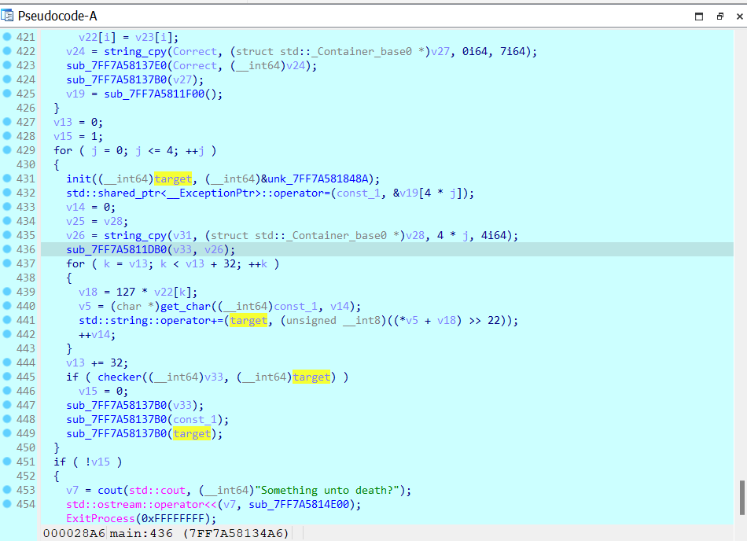

- Đối tượng ta cần quan sát là `v33`, mình sẽ trace ngược lên để xem những thành phần nào biến đổi ra `v33`. từ đó lần ra: `v33` -> `v26` -> `v31`.

  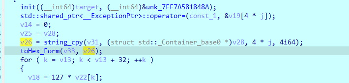

- `v31` có 2 luồng, nếu kí tự đầu là `E` thì v31 sẽ được gen ra từ `Input` và `v20`, nếu không sẽ là `Input` và `v21`. Để ý kĩ hơn thì ta thấy được rằng các kí tự của Input được biến đổi độc lập với nhau, và có `cnt = 400/21 ~ 20` lần tương ứng với 20 kí tự.

  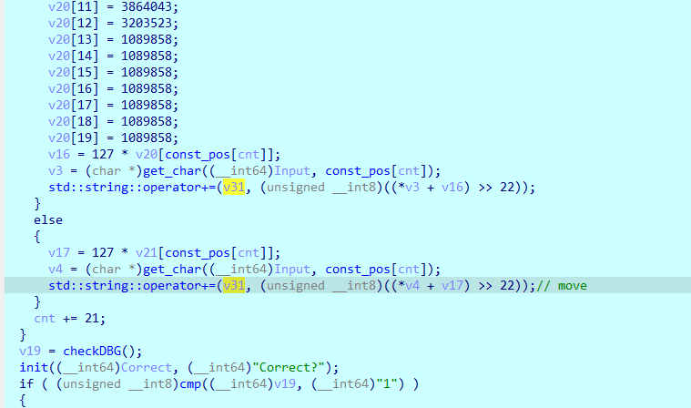

- Nhập thử input với kí tự đầu là `E` và độ dài 20, ta thấy v31 như này.

  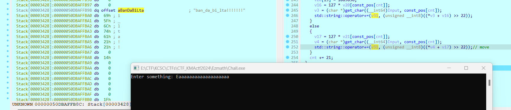

- Khá ngạc nhiên khi với 1 cái input vu vơ lại gen ra 1 chuỗi gần có nghĩa, mình thử 1 Input khác hoàn toàn vẫn trả ra kết quả giống vậy, khả năng cao 1 chuỗi có nghĩa được gen ra sẽ là giá trị chuẩn.

  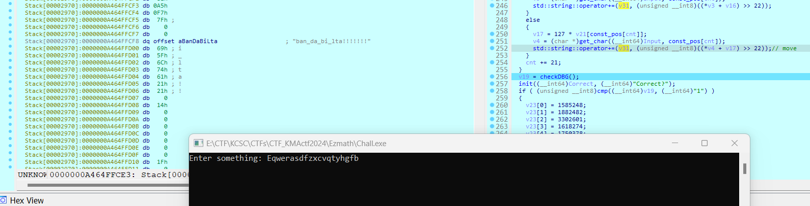

- Vì các phần tử được gen ra độc lập nên dễ dàng vét hết các giá trị, cộng thêm 2 chuỗi trên mình kết luận được chuỗi chuẩn là `ban_da_bi_lua!!!!!!!`(đoạn này bắt đầu nghĩ chuỗi gì mà sus thế :v).

- Sau khi loay hoay 1 hồi thì mình nhảy xuống luồng còn lại và nhận được chuỗi khá giống nội dung flag.

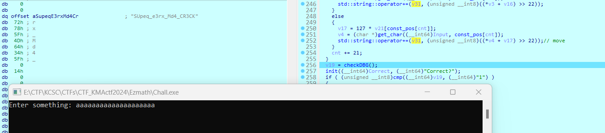

- Có vẻ đúng hướng, mình brute hết các case và in ra các phần tử có thể xuất hiện trong các vị trí tương ứng.

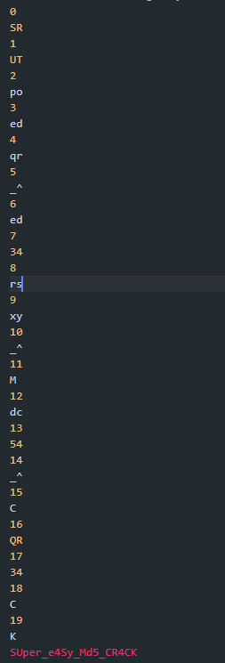

- Sau vài lần nhập nữa kết hợp với đối chiếu list trên thì ra được `Input` chuẩn

```python
pos = [0x0, 0x27, 0x0A, 0x18, 0x15, 0x8, 0x1E, 0x26, 0x0F, 0x5, 0x8, 0x0F, 0x0A, 0x18, 0x7, 0x10, 0x14, 0x11, 0x8, 0x5, 0x18, 0x1, 0x1D, 0x0F, 0x9, 0x19, 0x28, 0x16, 0x26, 0x2, 0x5, 0x1B, 0x0E, 0x12, 0x26, 0x26, 0x11, 0x6, 0x20, 0x4, 0x1A, 0x17, 0x2, 0x0C, 0x11, 0x1, 0x14, 0x0C, 0x25, 0x1A, 0x25, 0x1C, 0x3, 0x0E, 0x4, 0x21, 0x0C, 0x18, 0x9, 0x24, 0x17, 0x1A, 0x20, 0x3, 0x27, 0x8, 0x0E, 0x11, 0x18, 0x4, 0x18, 0x11, 0x1E, 0x4, 0x10, 0x5, 0x0C, 0x0D, 0x0D, 0x8, 0x3, 0x0F, 0x0E, 0x17, 0x4, 0x17, 0x1E, 0x7, 0x1C, 0x15, 0x23, 0x0, 0x0D, 0x1E, 0x11, 0x11, 0x25, 0x27, 0x0A, 0x20, 0x10, 0x21, 0x21, 0x0C, 0x0, 0x5, 0x1A, 0x18, 0x3, 0x1C, 0x0C, 0x21, 0x1D, 0x28, 0x11, 0x10, 0x1C, 0x28, 0x6, 0x0, 0x20, 0x22, 0x15, 0x1D, 0x26, 0x9, 0x6, 0x0, 0x23, 0x6, 0x1D, 0x2, 0x1, 0x2, 0x28, 0x9, 0x1A, 0x0, 0x10, 0x16, 0x8, 0x0C, 0x1C, 0x1, 0x1A, 0x27, 0x2, 0x7, 0x3, 0x19, 0x27, 0x1B, 0x15, 0x11, 0x1F, 0x0C, 0x26, 0x7, 0x16, 0x1A, 0x5, 0x3, 0x24, 0x17, 0x28, 0x6, 0x7, 0x20, 0x8, 0x0D, 0x12, 0x10, 0x21, 0x11, 0x0C, 0x15, 0x23, 0x1A, 0x0A, 0x21, 0x13, 0x0C, 0x11, 0x9, 0x1B, 0x13, 0x0B, 0x1E, 0x15, 0x9, 0x2, 0x1F, 0x0D, 0x3, 0x15, 0x1C, 0x25, 0x28, 0x16, 0x4,
       0x17, 0x26, 0x2, 0x15, 0x12, 0x1E, 0x7, 0x0A, 0x1D, 0x9, 0x0A, 0x0A, 0x15, 0x1E, 0x0A, 0x4, 0x2, 0x0E, 0x1E, 0x4, 0x1D, 0x1B, 0x15, 0x18, 0x20, 0x21, 0x1B, 0x0B, 0x0D, 0x1C, 0x3, 0x0B, 0x19, 0x13, 0x9, 0x15, 0x0A, 0x1D, 0x1F, 0x0C, 0x10, 0x20, 0x1D, 0x27, 0x26, 0x28, 0x12, 0x1F, 0x27, 0x1, 0x23, 0x0, 0x0C, 0x25, 0x0, 0x5, 0x2, 0x1, 0x1D, 0x0D, 0x26, 0x25, 0x15, 0x17, 0x16, 0x8, 0x5, 0x24, 0x4, 0x15, 0x16, 0x26, 0x24, 0x0D, 0x11, 0x5, 0x1D, 0x1, 0x9, 0x19, 0x16, 0x17, 0x7, 0x0B, 0x16, 0x3, 0x1B, 0x0E, 0x12, 0x27, 0x5, 0x25, 0x21, 0x1D, 0x0E, 0x1D, 0x0A, 0x1E, 0x25, 0x28, 0x1D, 0x13, 0x1F, 0x25, 0x14, 0x12, 0x0E, 0x18, 0x19, 0x25, 0x4, 0x11, 0x1E, 0x4, 0x27, 0x0F, 0x28, 0x5, 0x22, 0x19, 0x9, 0x28, 0x28, 0x0D, 0x9, 0x3, 0x15, 0x24, 0x9, 0x0C, 0x5, 0x0A, 0x16, 0x14, 0x6, 0x4, 0x10, 0x27, 0x22, 0x1D, 0x14, 0x12, 0x13, 0x5, 0x17, 0x16, 0x9, 0x24, 0x1E, 0x1E, 0x6, 0x25, 0x0, 0x2, 0x0F, 0x0F, 0x0A, 0x11, 0x6, 0x24, 0x2, 0x22, 0x0B, 0x2, 0x27, 0x0B, 0x1C, 0x16, 0x25, 0x1E, 0x13, 0x18, 0x5, 0x0E, 0x1B, 0x0D, 0x0C, 0x4, 0x12, 0x28, 0x25, 0x5, 0x0F, 0x1C, 0x4, 0x0F, 0x0B, 0x19, 0x8, 0x23, 0x20, 0x0C, 0x1, 0x12, 0x6, 0x7, 0x8, 0x28, 0x23, 0x13]
v20 = [3236549, 3203523, 3632861, 3137471, 3302601, 3203523, 3137471, 3236549, 3467731, 3137471,
       3566809, 3864043, 3203523, 1089858, 1089858, 1089858, 1089858, 1089858, 1089858, 1089858]
v21 = [2741159, 2807211, 3698913, 3335627, 3764965, 3137471, 3335627, 1717352, 3797991, 3996147,
       3137471, 2543003, 3302601, 1750378, 3137471, 2212743, 2708133, 1717352, 2212743, 2476951]
v22 = [1816430, 1717352, 1783404, 3368653, 1618274, 1750378, 1684326, 1816430, 1684326, 3203523, 1651300, 1816430, 1750378, 3335627, 1684326, 1717352, 1684326, 1684326, 1585248, 1618274, 1585248, 3335627, 1684326, 1750378, 1651300, 3203523, 3236549, 3335627, 3236549, 3368653, 1849456, 1816430, 1717352, 1585248, 3368653, 1717352, 1816430, 1651300, 1684326, 1585248, 3368653, 1750378, 3203523, 3302601, 1651300, 1651300, 1717352, 1849456, 1882482, 1816430, 1816430, 1783404, 1717352, 3203523, 1684326, 3368653, 1882482, 1816430, 3203523, 3368653, 1849456, 1585248, 1750378, 1816430, 3236549, 1783404, 3236549, 3236549, 1585248, 3236549, 3335627, 1750378, 3269575, 1684326, 1684326, 1717352, 1783404, 1783404, 1882482, 3368653,
       3236549, 3269575, 1717352, 3236549, 1750378, 1717352, 1849456, 3335627, 3236549, 3236549, 1816430, 3236549, 3203523, 1684326, 3335627, 1651300, 1783404, 1717352, 1618274, 3368653, 3203523, 1750378, 3335627, 1717352, 1750378, 3236549, 3302601, 1882482, 1750378, 1684326, 3269575, 1816430, 1684326, 1684326, 1585248, 1816430, 1882482, 1585248, 1651300, 3368653, 1783404, 1783404, 3302601, 3302601, 1618274, 1783404, 1816430, 1684326, 1882482, 1849456, 3203523, 3236549, 3335627, 1684326, 3203523, 1651300, 1849456, 1684326, 1849456, 1684326, 1750378, 1585248, 1618274, 3368653, 1717352, 3236549, 3368653, 3302601, 1651300, 3302601, 1882482, 1585248, 1816430, 1816430, 1849456, 1651300, 1585248, 3368653, 1618274, 1618274]
v23 = [1585248, 1882482, 3302601, 1618274, 1750378, 3236549, 1882482, 3368653, 1651300, 1717352, 1783404, 1717352, 3269575, 3368653, 1585248, 1651300, 1651300, 1849456, 1717352, 3203523, 1816430, 3335627, 1618274, 3203523, 3236549, 3302601, 3236549, 1618274, 3368653, 3302601, 1618274, 1816430, 3335627, 1816430, 3269575, 1750378, 1585248, 3335627, 3203523, 1816430, 1849456, 1717352, 3269575, 1684326, 1684326, 3368653, 1717352, 3269575, 1882482, 3203523, 3368653, 1783404, 3269575, 1618274, 1585248, 1849456, 1849456, 1717352, 3368653, 1717352, 1684326, 1651300, 3236549, 1618274, 1618274, 3236549, 1849456, 1882482, 1618274, 1585248, 3302601, 1651300, 1882482, 1717352, 1750378, 1783404, 1651300, 1849456, 3302601, 1618274,
       1816430, 1816430, 1651300, 1651300, 3236549, 3203523, 1717352, 1618274, 1816430, 1651300, 3368653, 3335627, 1783404, 3302601, 3269575, 1849456, 1618274, 3236549, 3335627, 3335627, 3335627, 3335627, 1849456, 1849456, 1618274, 1651300, 1816430, 3236549, 3236549, 3368653, 3203523, 3368653, 3368653, 3236549, 3335627, 3302601, 3335627, 3203523, 1618274, 1783404, 1618274, 3302601, 1849456, 1651300, 1750378, 1651300, 1684326, 1585248, 3269575, 3236549, 1618274, 3269575, 3203523, 1585248, 1585248, 1849456, 1651300, 1651300, 1717352, 1783404, 1816430, 1750378, 3203523, 1816430, 1618274, 1750378, 1849456, 3236549, 1585248, 3335627, 3335627, 1684326, 3368653, 3302601, 1684326, 3335627, 3335627, 1585248, 1849456, 3269575]

ans = 'SUper_e4sy_Md5_CR4CK'
# print(len(ans))
Input = 'aaa0aa0aa0akaaaaaaaa'
flag_comp = 'abcdefghijklmnopqrstuvwxyzABCDEFGHIJKLMNOPQRSTUVWXYZ0123456789!@#$%^&*()_+-=<>,./{[]\|~:;?"\''
v9 = 0
enc = []
v31 = [0]*50
cnt = 0
while v9 < 400:
    for i in flag_comp:
        a = (127*v21[pos[v9]]) & 0xffffffff
        b = ((ord(i)+a) & 0xffffffff) >> 22
        if (b == ord(ans[cnt])):
            print(chr(b), end='')
            enc.append(i)
            break
    cnt += 1
    v9 += 21

print()
for i in enc:
    print(i, end='')

v22 = v23
lua = [0x62, 0x61, 0x6E, 0x5E, 0x64, 0x61, 0x5E, 0x62, 0x69, 0x5E,
       0x6C, 0x75, 0x61, 0x21, 0x21, 0x21, 0x21, 0x21, 0x21, 0x21,
       ]
enc = []

for j in range(20):
    for i in flag_comp:
        v17 = (127*v21[j]) & 0xffffffff
        v31[j] = (ord(i)+v17) >> 22
        if (v31[j] == lua[j]):
            enc.append(ord(i))
for i in enc:
    print(chr(i), end='')
```

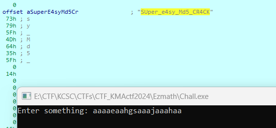
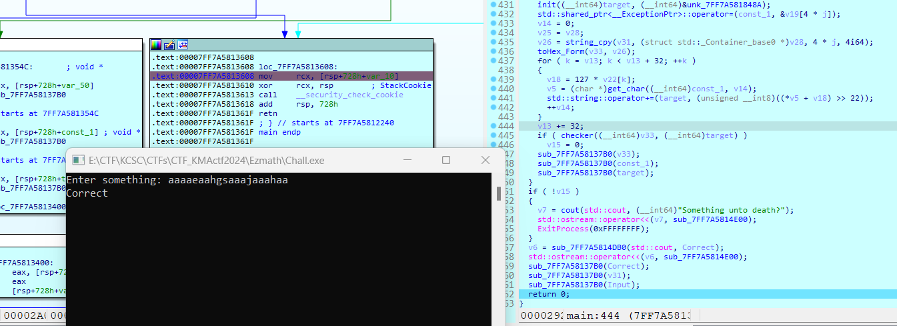

```rust
flag: KMACTF{SUper_e4sy_Md5_CR4CK}
```

### PUSHwindowPOPnothing

- Đừng ai debug nó ở local như mình 🐧.

- Dành cho ai không debug được và bị pop up lên thông báo `CreateProcess failed: The requested operation requires elevation.`, ta sẽ phải chạy IDA trên quyền admin(huhu 1h fix của tôi).

- Đi vào phân tích, chương trình này yêu cầu ta nhập flag rồi check, nếu sai thì...

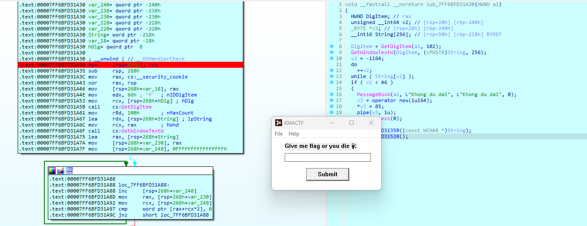

- Trong chương trình này ngoài khúc kiểm tra độ dài ra thì không thấy checker đâu, tìm một lúc thì thấy gọi `pipe`, thứ dùng để truyền dữ liệu giữa các tiến trình độc lập.

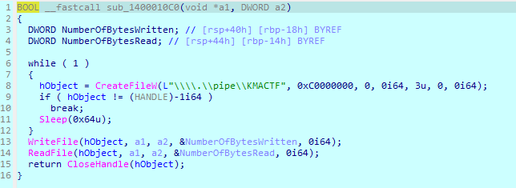

- Mình xác định được hướng đi của bài này, khả năng bài sẽ gen ra 1 chương trình checker và nhận input của `KMACTF.exe` rồi xử lý và trả lại `correct/incorrect` thông qua `pipe`. Vậy ta cần phải tìm được path của file `check` giấu trong chall gốc và phân tích nó.

- Tìm kiếm một lúc và thấy `checker2.exe`.


- Nhảy tới path `C:\Users\ADMINZ\AppData\Local\Temp\`, thực hiện phân tích checker.

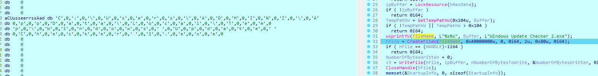

- Trông có vẻ đúng là thứ mình cần tìm rồi.

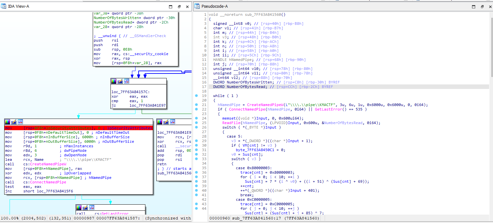

- Thực hiện debug động `checker2`, một lưu ý rằng để `checker2` mình debug nhận được thông tin mà `KMACTF.exe` gửi vào `pipe`, mình sẽ phải kill tiến trình `checker2` được khởi chạy trước đó.

- Tiếp đến là về nội dung của `checker`.

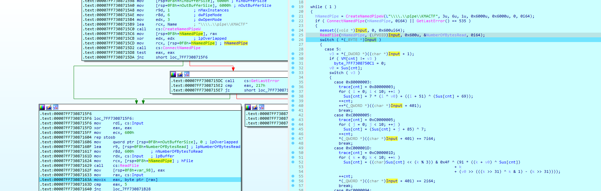

- Checker gồm 2 phần mã hóa, trước tiên mã hóa input thành `base64` và biến đổi từng kí tự một theo các case tương ứng của mảng `VM`.

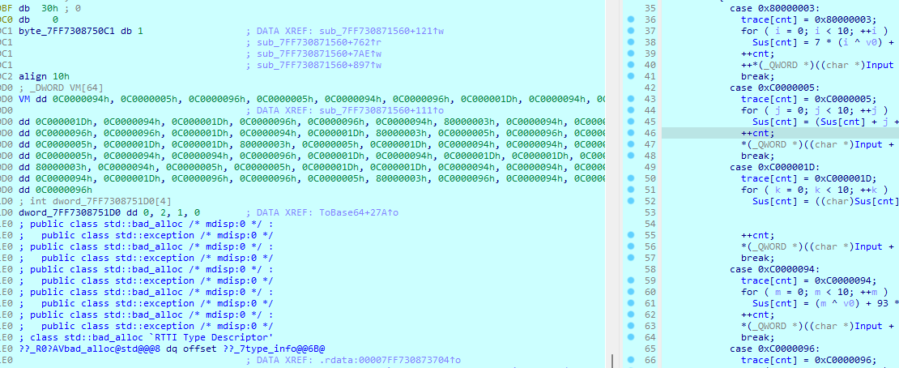

- Cuối cùng là kiểm tra với dải 64 phần tử và trả về `Correct/Incorrect`.

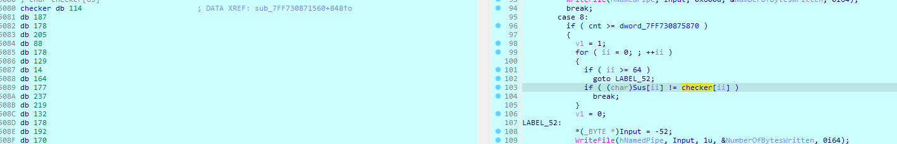

- Về cơ bản thì code mã giả gen cho khá đẹp nên ta hoàn toàn có thể chép hết sang để viết script, nhưng có 1 thứ mình không để ý làm mất khá nhiều thời gian tìm lỗi là đây. Nội dung của `case 0xC0000096`, nếu ai chưa biết thì lệnh `movsx` sẽ khác `mov` 1 chút khi các biến của ta để ở dạng `signed`.
  - `MOV`: chỉ sao chép dữ liệu mà không thay đổi giá trị.
  - `MOVSX`: sao chép dữ liệu và mở rộng dấu của giá trị nguồn trước khi sao chép vào đích.

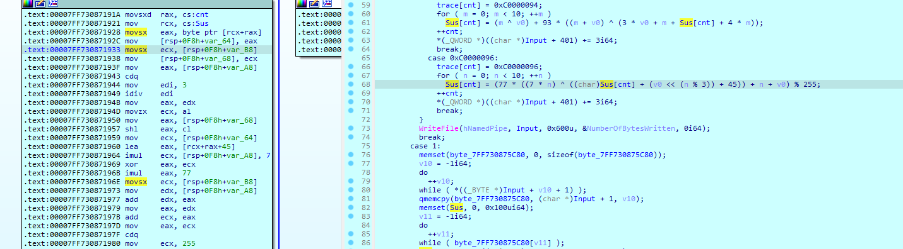

- Điều này sẽ không ảnh hưởng nếu ta tính toán trên các thanh ghi có độ lớn bằng nhau, nhưng trong bài này thì khác. `Sus[cnt]` được chuyển từ dạng byte vào thanh ghi 4 byte `eax`, vậy khi giá trị của `Sus[cnt]` có bit đầu bằng 1, nó sẽ tự động thêm vào `0xffffff` để giữ tính chất.

- Vậy là giải quyết xong vấn đề tính toán, còn làm sao để tính ra flag đây? Đầu tiên mình thử `z3` nhưng quá nhiều phép toán bit xen vào nên chuyển qua brute.

- Lý do để brute thì mình đã nói ở trên, chương trình biến đổi lần lượt từng giá trị của các phần tử một cách độc lập nên độ phức tạp không lớn. Thêm vào đó, bỏ qua bước `base64`, thứ ta brute không phải flag mà là chuỗi `base64` trước khi bị biến đổi. `base64` ở đây là một chuỗi 64 kí tự, khi biến đổi thì thành giá trị trong mảng `checker[]` tức là trong các phần tử hợp lệ cấu thành chuỗi `base64` sẽ có ít nhất 1 kí tự trả ra giá trị tương ứng.

- `ABCDEFGHIJKLMNOPQRSTUVWXYZabcdefghijklmnopqrstuvwxyz0123456789+/=`

- Dưới đây là script vét của mình.

```python
Checker = [0x72, 0xBB, 0xB2, 0xCD, 0x58, 0xB2, 0x81, 0x0E, 0xA4, 0xB1,
           0xED, 0xDB, 0x84, 0xB2, 0xC0, 0xAA, 0x60, 0xD0, 0xE8, 0xE8,
           0xB0, 0x12, 0x81, 0x1E, 0xED, 0xD0, 0xF3, 0x05, 0xB0, 0xB1,
           0x04, 0x04, 0x7D, 0xF3, 0xC0, 0xE8, 0xED, 0x12, 0xF3, 0xC2,
           0x7D, 0x0E, 0x0E, 0x0E, 0x7D, 0x04, 0xC0, 0xBB, 0xED, 0xB1,
           0x81, 0xED, 0xA4, 0xCF, 0xC0, 0x68, 0x84, 0xD0, 0xE2, 0x1B,
           0xC2, 0x58, 0x30, 0x30]
vm = [0xC0000094, 0xC0000005, 0xC0000096, 0xC0000005, 0xC0000094, 0xC0000096, 0xC000001D, 0xC0000094, 0xC0000094, 0xC000001D, 0xC0000094, 0xC000001D, 0xC0000096, 0xC0000096, 0xC0000094, 0x80000003, 0xC0000094, 0xC0000096, 0xC0000096, 0xC0000096, 0xC000001D, 0xC0000094, 0xC000001D, 0x80000003, 0xC0000005, 0xC0000096, 0xC0000094, 0xC0000005, 0xC000001D, 0xC000001D, 0x80000003, 0xC0000005,
      0xC000001D, 0xC0000094, 0xC0000094, 0xC0000096, 0xC0000005, 0xC0000094, 0xC0000094, 0xC0000096, 0xC000001D, 0xC0000094, 0xC000001D, 0xC000001D, 0xC000001D, 0x80000003, 0xC0000094, 0xC0000005, 0xC0000005, 0xC000001D, 0xC000001D, 0xC0000094, 0xC0000094, 0xC0000005, 0xC0000094, 0xC000001D, 0xC0000096, 0xC0000096, 0xC0000005, 0x80000003, 0xC0000096, 0xC0000094, 0xC0000096, 0xC0000096]
aAbcdefghijklmn = [0x41, 0x42, 0x43, 0x44, 0x45, 0x46, 0x47, 0x48, 0x49, 0x4A,
                   0x4B, 0x4C, 0x4D, 0x4E, 0x4F, 0x50, 0x51, 0x52, 0x53, 0x54,
                   0x55, 0x56, 0x57, 0x58, 0x59, 0x5A, 0x61, 0x62, 0x63, 0x64,
                   0x65, 0x66, 0x67, 0x68, 0x69, 0x6A, 0x6B, 0x6C, 0x6D, 0x6E,
                   0x6F, 0x70, 0x71, 0x72, 0x73, 0x74, 0x75, 0x76, 0x77, 0x78,
                   0x79, 0x7A, 0x30, 0x31, 0x32, 0x33, 0x34, 0x35, 0x36, 0x37,
                   0x38, 0x39, 0x2B, 0x2F, 0x00]
dword_7FF6E10151D0 = [0, 2, 1, 0]
dword_7FF783225880 = [0]*100
sus = [0x4b, 0x4d, 0x41, 0x43, 0x54, 0x46, 0x7b, 0x20, 0x20, 0x20, 0x20, 0x20, 0x20, 0x20, 0x20, 0x20, 0x20, 0x20, 0x20, 0x20, 0x20, 0x20, 0x20,
       0x20, 0x20, 0x20, 0x20, 0x20, 0x20, 0x20, 0x20, 0x20, 0x20, 0x20, 0x20, 0x20, 0x20, 0x20, 0x20, 0x20, 0x20, 0x20, 0x20, 0x20, 0x20, 0x20, 0x7d]

Input = [0x4b, 0x4d, 0x41, 0x43, 0x54, 0x46, 0x7b, 0x20, 0x20, 0x20, 0x20, 0x20, 0x20, 0x20, 0x20, 0x20, 0x20, 0x20, 0x20, 0x20, 0x20, 0x20, 0x20,
         0x20, 0x20, 0x20, 0x20, 0x20, 0x20, 0x20, 0x20, 0x20, 0x20, 0x20, 0x20, 0x20, 0x20, 0x20, 0x20, 0x20, 0x20, 0x20, 0x20, 0x20, 0x20, 0x20, 0x7d]

cnt = 0
p = 'ABCDEFGHIJKLMNOPQRSTUVWXYZabcdefghijklmnopqrstuvwxyz0123456789+/='

pp = 'S01BQ1RGe2'
for r in vm:
    print()
    print(cnt, end=": ")
    for ii in p:
        v1 = ord(ii)
        v0 = ord(ii)
        if r == 0x80000003:
            dword_7FF783225880[cnt] = 0x80000003
            if v1 & 0x80:
                v1 |= 0xFFFFFF00
            for i in range(10):
                v1 = (7 * (i ^ v0) + ((i + 51) ^ (v1 + 69))) & 0xff
            cnt += 1
        if r == 0xC0000005:
            dword_7FF783225880[cnt] = 0xC0000005
            if v1 & 0x80:
                v1 |= 0xFFFFFF00
            for i in range(10):
                v1 = ((v1 + i + 85) ^ 7) & 0xff
            cnt += 1
            # print("0xC0000005", sus)
            # break
        if r == 0xC000001D:
            dword_7FF783225880[cnt] = 0xC000001D
            if v1 & 0x80:
                v1 |= 0xFFFFFF00
            for k in range(10):
                v1 = ((v1 << (k % 3)) & 0x4F ^ (
                    91 * ((k + v0) ^ v1) + k + (v0 >> (((k >> 31) ^ k & 1) - (k >> 31))))) & 0xff
            cnt += 1
        if r == 0xC0000094:
            dword_7FF783225880[cnt] = 0xC0000094
            if v1 & 0x80:
                v1 |= 0xFFFFFF00
            for m in range(10):
                v1 = ((m ^ v0) + 93 * ((m + v0) ^
                                       (3 * v0 + m + v1 + 4 * m))) & 0xff
            cnt += 1
        if r == 0xC0000096:
            dword_7FF783225880[cnt] = 0xC0000096
            for n in range(10):
                if v1 & 0x80:
                    v1 |= 0xFFFFFF00
                v1 = (
                    ((77 * ((7 * n) ^ ((v1 + ((v0 << (n % 3))) + 45) & 0xffffffff))) + n + v0) % 255) & 0xff
            cnt += 1
        if (v1 == Checker[cnt-1]):
            print(ii, end=" ")
            pp += ii
        if ii != '=':
            cnt -= 1
```

- Kết quả trả ra có 7 cặp có 2 giá trị thỏa mãn => 128 mã `base64`.

```
ans:
0: S
1: 0
2: 1
3: B
4: Q
5: 1
6: R
7: G
8: e
9: 2
10: h
11: v
12: d
13: 1
14: 9
15: t
16: Y
17: W v
18: 5
19: 5
20: X
21: 3
22: R
23: p
24: b
25: W v
26: V
27: z
28: X
29: 2
30: F
31: y
32: Z
33: V
34: 9
35: 5
36: b
37: 3
38: V
39: f
40: Z
41: G
42: c l
43: c l
44: Z
45: F
46: 9
47: 0
48: b
49: 2
50: R
51: h
52: e
53: T
54: 9
55: o
56: d
57: W v
58: g
59: /
60: f
61: Q
62: O =
63: O =
```

- Script tạo tổ hợp và decode `base64`.

```python
from itertools import product
import base64
dick = {0: ['S'], 1: ['0'], 2: ['1'], 3: ['B'], 4: ['Q'], 5: ['1'], 6: ['R'], 7: ['G'], 8: ['e'], 9: ['2'], 10: ['h'], 11: ['v'], 12: ['d'], 13: ['1'], 14: ['9'], 15: ['t'], 16: ['Y'], 17: ['W', 'v'], 18: ['5'], 19: ['5'], 20: ['X'], 21: ['3'], 22: ['R'], 23: ['p'], 24: ['b'], 25: ['W', 'v'], 26: ['V'], 27: ['z'], 28: ['X'], 29: ['2'], 30: ['F'], 31: ['y'], 32: [
    'Z'], 33: ['V'], 34: ['9'], 35: ['5'], 36: ['b'], 37: ['3'], 38: ['V'], 39: ['f'], 40: ['Z'], 41: ['G'], 42: ['c', 'l'], 43: ['c', 'l'], 44: ['Z'], 45: ['F'], 46: ['9'], 47: ['0'], 48: ['b'], 49: ['2'], 50: ['R'], 51: ['h'], 52: ['e'], 53: ['T'], 54: ['9'], 55: ['o'], 56: ['d'], 57: ['W', 'v'], 58: ['g'], 59: ['/'], 60: ['f'], 61: ['Q'], 62: ['O', '='], 63: ['O', '=']}
all_combinations = list(product(*[dick[i] for i in range(64)]))

for combination in all_combinations:
    print(''.join(combination))
print("Total combinations:", len(all_combinations))
ans = ['S01BQ1RGe2hvd19tYW55X3RpbWVzX2FyZV95b3VfZGccZF90b2RheT9odWg/fQOO', 'S01BQ1RGe2hvd19tYW55X3RpbWVzX2FyZV95b3VfZGccZF90b2RheT9odWg/fQO=', 'S01BQ1RGe2hvd19tYW55X3RpbWVzX2FyZV95b3VfZGccZF90b2RheT9odWg/fQ=O', 'S01BQ1RGe2hvd19tYW55X3RpbWVzX2FyZV95b3VfZGccZF90b2RheT9odWg/fQ==', 'S01BQ1RGe2hvd19tYW55X3RpbWVzX2FyZV95b3VfZGccZF90b2RheT9odvg/fQOO', 'S01BQ1RGe2hvd19tYW55X3RpbWVzX2FyZV95b3VfZGccZF90b2RheT9odvg/fQO=', 'S01BQ1RGe2hvd19tYW55X3RpbWVzX2FyZV95b3VfZGccZF90b2RheT9odvg/fQ=O', 'S01BQ1RGe2hvd19tYW55X3RpbWVzX2FyZV95b3VfZGccZF90b2RheT9odvg/fQ==', 'S01BQ1RGe2hvd19tYW55X3RpbWVzX2FyZV95b3VfZGclZF90b2RheT9odWg/fQOO', 'S01BQ1RGe2hvd19tYW55X3RpbWVzX2FyZV95b3VfZGclZF90b2RheT9odWg/fQO=', 'S01BQ1RGe2hvd19tYW55X3RpbWVzX2FyZV95b3VfZGclZF90b2RheT9odWg/fQ=O', 'S01BQ1RGe2hvd19tYW55X3RpbWVzX2FyZV95b3VfZGclZF90b2RheT9odWg/fQ==', 'S01BQ1RGe2hvd19tYW55X3RpbWVzX2FyZV95b3VfZGclZF90b2RheT9odvg/fQOO', 'S01BQ1RGe2hvd19tYW55X3RpbWVzX2FyZV95b3VfZGclZF90b2RheT9odvg/fQO=', 'S01BQ1RGe2hvd19tYW55X3RpbWVzX2FyZV95b3VfZGclZF90b2RheT9odvg/fQ=O', 'S01BQ1RGe2hvd19tYW55X3RpbWVzX2FyZV95b3VfZGclZF90b2RheT9odvg/fQ==', 'S01BQ1RGe2hvd19tYW55X3RpbWVzX2FyZV95b3VfZGlcZF90b2RheT9odWg/fQOO', 'S01BQ1RGe2hvd19tYW55X3RpbWVzX2FyZV95b3VfZGlcZF90b2RheT9odWg/fQO=', 'S01BQ1RGe2hvd19tYW55X3RpbWVzX2FyZV95b3VfZGlcZF90b2RheT9odWg/fQ=O', 'S01BQ1RGe2hvd19tYW55X3RpbWVzX2FyZV95b3VfZGlcZF90b2RheT9odWg/fQ==', 'S01BQ1RGe2hvd19tYW55X3RpbWVzX2FyZV95b3VfZGlcZF90b2RheT9odvg/fQOO', 'S01BQ1RGe2hvd19tYW55X3RpbWVzX2FyZV95b3VfZGlcZF90b2RheT9odvg/fQO=', 'S01BQ1RGe2hvd19tYW55X3RpbWVzX2FyZV95b3VfZGlcZF90b2RheT9odvg/fQ=O', 'S01BQ1RGe2hvd19tYW55X3RpbWVzX2FyZV95b3VfZGlcZF90b2RheT9odvg/fQ==', 'S01BQ1RGe2hvd19tYW55X3RpbWVzX2FyZV95b3VfZGllZF90b2RheT9odWg/fQOO', 'S01BQ1RGe2hvd19tYW55X3RpbWVzX2FyZV95b3VfZGllZF90b2RheT9odWg/fQO=', 'S01BQ1RGe2hvd19tYW55X3RpbWVzX2FyZV95b3VfZGllZF90b2RheT9odWg/fQ=O', 'S01BQ1RGe2hvd19tYW55X3RpbWVzX2FyZV95b3VfZGllZF90b2RheT9odWg/fQ==', 'S01BQ1RGe2hvd19tYW55X3RpbWVzX2FyZV95b3VfZGllZF90b2RheT9odvg/fQOO', 'S01BQ1RGe2hvd19tYW55X3RpbWVzX2FyZV95b3VfZGllZF90b2RheT9odvg/fQO=', 'S01BQ1RGe2hvd19tYW55X3RpbWVzX2FyZV95b3VfZGllZF90b2RheT9odvg/fQ=O', 'S01BQ1RGe2hvd19tYW55X3RpbWVzX2FyZV95b3VfZGllZF90b2RheT9odvg/fQ==', 'S01BQ1RGe2hvd19tYW55X3RpbvVzX2FyZV95b3VfZGccZF90b2RheT9odWg/fQOO', 'S01BQ1RGe2hvd19tYW55X3RpbvVzX2FyZV95b3VfZGccZF90b2RheT9odWg/fQO=', 'S01BQ1RGe2hvd19tYW55X3RpbvVzX2FyZV95b3VfZGccZF90b2RheT9odWg/fQ=O', 'S01BQ1RGe2hvd19tYW55X3RpbvVzX2FyZV95b3VfZGccZF90b2RheT9odWg/fQ==', 'S01BQ1RGe2hvd19tYW55X3RpbvVzX2FyZV95b3VfZGccZF90b2RheT9odvg/fQOO', 'S01BQ1RGe2hvd19tYW55X3RpbvVzX2FyZV95b3VfZGccZF90b2RheT9odvg/fQO=', 'S01BQ1RGe2hvd19tYW55X3RpbvVzX2FyZV95b3VfZGccZF90b2RheT9odvg/fQ=O', 'S01BQ1RGe2hvd19tYW55X3RpbvVzX2FyZV95b3VfZGccZF90b2RheT9odvg/fQ==', 'S01BQ1RGe2hvd19tYW55X3RpbvVzX2FyZV95b3VfZGclZF90b2RheT9odWg/fQOO', 'S01BQ1RGe2hvd19tYW55X3RpbvVzX2FyZV95b3VfZGclZF90b2RheT9odWg/fQO=', 'S01BQ1RGe2hvd19tYW55X3RpbvVzX2FyZV95b3VfZGclZF90b2RheT9odWg/fQ=O', 'S01BQ1RGe2hvd19tYW55X3RpbvVzX2FyZV95b3VfZGclZF90b2RheT9odWg/fQ==', 'S01BQ1RGe2hvd19tYW55X3RpbvVzX2FyZV95b3VfZGclZF90b2RheT9odvg/fQOO', 'S01BQ1RGe2hvd19tYW55X3RpbvVzX2FyZV95b3VfZGclZF90b2RheT9odvg/fQO=', 'S01BQ1RGe2hvd19tYW55X3RpbvVzX2FyZV95b3VfZGclZF90b2RheT9odvg/fQ=O', 'S01BQ1RGe2hvd19tYW55X3RpbvVzX2FyZV95b3VfZGclZF90b2RheT9odvg/fQ==', 'S01BQ1RGe2hvd19tYW55X3RpbvVzX2FyZV95b3VfZGlcZF90b2RheT9odWg/fQOO', 'S01BQ1RGe2hvd19tYW55X3RpbvVzX2FyZV95b3VfZGlcZF90b2RheT9odWg/fQO=', 'S01BQ1RGe2hvd19tYW55X3RpbvVzX2FyZV95b3VfZGlcZF90b2RheT9odWg/fQ=O', 'S01BQ1RGe2hvd19tYW55X3RpbvVzX2FyZV95b3VfZGlcZF90b2RheT9odWg/fQ==', 'S01BQ1RGe2hvd19tYW55X3RpbvVzX2FyZV95b3VfZGlcZF90b2RheT9odvg/fQOO', 'S01BQ1RGe2hvd19tYW55X3RpbvVzX2FyZV95b3VfZGlcZF90b2RheT9odvg/fQO=', 'S01BQ1RGe2hvd19tYW55X3RpbvVzX2FyZV95b3VfZGlcZF90b2RheT9odvg/fQ=O', 'S01BQ1RGe2hvd19tYW55X3RpbvVzX2FyZV95b3VfZGlcZF90b2RheT9odvg/fQ==', 'S01BQ1RGe2hvd19tYW55X3RpbvVzX2FyZV95b3VfZGllZF90b2RheT9odWg/fQOO', 'S01BQ1RGe2hvd19tYW55X3RpbvVzX2FyZV95b3VfZGllZF90b2RheT9odWg/fQO=', 'S01BQ1RGe2hvd19tYW55X3RpbvVzX2FyZV95b3VfZGllZF90b2RheT9odWg/fQ=O', 'S01BQ1RGe2hvd19tYW55X3RpbvVzX2FyZV95b3VfZGllZF90b2RheT9odWg/fQ==', 'S01BQ1RGe2hvd19tYW55X3RpbvVzX2FyZV95b3VfZGllZF90b2RheT9odvg/fQOO', 'S01BQ1RGe2hvd19tYW55X3RpbvVzX2FyZV95b3VfZGllZF90b2RheT9odvg/fQO=', 'S01BQ1RGe2hvd19tYW55X3RpbvVzX2FyZV95b3VfZGllZF90b2RheT9odvg/fQ=O', 'S01BQ1RGe2hvd19tYW55X3RpbvVzX2FyZV95b3VfZGllZF90b2RheT9odvg/fQ==',
       'S01BQ1RGe2hvd19tYv55X3RpbWVzX2FyZV95b3VfZGccZF90b2RheT9odWg/fQOO', 'S01BQ1RGe2hvd19tYv55X3RpbWVzX2FyZV95b3VfZGccZF90b2RheT9odWg/fQO=', 'S01BQ1RGe2hvd19tYv55X3RpbWVzX2FyZV95b3VfZGccZF90b2RheT9odWg/fQ=O', 'S01BQ1RGe2hvd19tYv55X3RpbWVzX2FyZV95b3VfZGccZF90b2RheT9odWg/fQ==', 'S01BQ1RGe2hvd19tYv55X3RpbWVzX2FyZV95b3VfZGccZF90b2RheT9odvg/fQOO', 'S01BQ1RGe2hvd19tYv55X3RpbWVzX2FyZV95b3VfZGccZF90b2RheT9odvg/fQO=', 'S01BQ1RGe2hvd19tYv55X3RpbWVzX2FyZV95b3VfZGccZF90b2RheT9odvg/fQ=O', 'S01BQ1RGe2hvd19tYv55X3RpbWVzX2FyZV95b3VfZGccZF90b2RheT9odvg/fQ==', 'S01BQ1RGe2hvd19tYv55X3RpbWVzX2FyZV95b3VfZGclZF90b2RheT9odWg/fQOO', 'S01BQ1RGe2hvd19tYv55X3RpbWVzX2FyZV95b3VfZGclZF90b2RheT9odWg/fQO=', 'S01BQ1RGe2hvd19tYv55X3RpbWVzX2FyZV95b3VfZGclZF90b2RheT9odWg/fQ=O', 'S01BQ1RGe2hvd19tYv55X3RpbWVzX2FyZV95b3VfZGclZF90b2RheT9odWg/fQ==', 'S01BQ1RGe2hvd19tYv55X3RpbWVzX2FyZV95b3VfZGclZF90b2RheT9odvg/fQOO', 'S01BQ1RGe2hvd19tYv55X3RpbWVzX2FyZV95b3VfZGclZF90b2RheT9odvg/fQO=', 'S01BQ1RGe2hvd19tYv55X3RpbWVzX2FyZV95b3VfZGclZF90b2RheT9odvg/fQ=O', 'S01BQ1RGe2hvd19tYv55X3RpbWVzX2FyZV95b3VfZGclZF90b2RheT9odvg/fQ==', 'S01BQ1RGe2hvd19tYv55X3RpbWVzX2FyZV95b3VfZGlcZF90b2RheT9odWg/fQOO', 'S01BQ1RGe2hvd19tYv55X3RpbWVzX2FyZV95b3VfZGlcZF90b2RheT9odWg/fQO=', 'S01BQ1RGe2hvd19tYv55X3RpbWVzX2FyZV95b3VfZGlcZF90b2RheT9odWg/fQ=O', 'S01BQ1RGe2hvd19tYv55X3RpbWVzX2FyZV95b3VfZGlcZF90b2RheT9odWg/fQ==', 'S01BQ1RGe2hvd19tYv55X3RpbWVzX2FyZV95b3VfZGlcZF90b2RheT9odvg/fQOO', 'S01BQ1RGe2hvd19tYv55X3RpbWVzX2FyZV95b3VfZGlcZF90b2RheT9odvg/fQO=', 'S01BQ1RGe2hvd19tYv55X3RpbWVzX2FyZV95b3VfZGlcZF90b2RheT9odvg/fQ=O', 'S01BQ1RGe2hvd19tYv55X3RpbWVzX2FyZV95b3VfZGlcZF90b2RheT9odvg/fQ==', 'S01BQ1RGe2hvd19tYv55X3RpbWVzX2FyZV95b3VfZGllZF90b2RheT9odWg/fQOO', 'S01BQ1RGe2hvd19tYv55X3RpbWVzX2FyZV95b3VfZGllZF90b2RheT9odWg/fQO=', 'S01BQ1RGe2hvd19tYv55X3RpbWVzX2FyZV95b3VfZGllZF90b2RheT9odWg/fQ=O', 'S01BQ1RGe2hvd19tYv55X3RpbWVzX2FyZV95b3VfZGllZF90b2RheT9odWg/fQ==', 'S01BQ1RGe2hvd19tYv55X3RpbWVzX2FyZV95b3VfZGllZF90b2RheT9odvg/fQOO', 'S01BQ1RGe2hvd19tYv55X3RpbWVzX2FyZV95b3VfZGllZF90b2RheT9odvg/fQO=', 'S01BQ1RGe2hvd19tYv55X3RpbWVzX2FyZV95b3VfZGllZF90b2RheT9odvg/fQ=O', 'S01BQ1RGe2hvd19tYv55X3RpbWVzX2FyZV95b3VfZGllZF90b2RheT9odvg/fQ==', 'S01BQ1RGe2hvd19tYv55X3RpbvVzX2FyZV95b3VfZGccZF90b2RheT9odWg/fQOO', 'S01BQ1RGe2hvd19tYv55X3RpbvVzX2FyZV95b3VfZGccZF90b2RheT9odWg/fQO=', 'S01BQ1RGe2hvd19tYv55X3RpbvVzX2FyZV95b3VfZGccZF90b2RheT9odWg/fQ=O', 'S01BQ1RGe2hvd19tYv55X3RpbvVzX2FyZV95b3VfZGccZF90b2RheT9odWg/fQ==', 'S01BQ1RGe2hvd19tYv55X3RpbvVzX2FyZV95b3VfZGccZF90b2RheT9odvg/fQOO', 'S01BQ1RGe2hvd19tYv55X3RpbvVzX2FyZV95b3VfZGccZF90b2RheT9odvg/fQO=', 'S01BQ1RGe2hvd19tYv55X3RpbvVzX2FyZV95b3VfZGccZF90b2RheT9odvg/fQ=O', 'S01BQ1RGe2hvd19tYv55X3RpbvVzX2FyZV95b3VfZGccZF90b2RheT9odvg/fQ==', 'S01BQ1RGe2hvd19tYv55X3RpbvVzX2FyZV95b3VfZGclZF90b2RheT9odWg/fQOO', 'S01BQ1RGe2hvd19tYv55X3RpbvVzX2FyZV95b3VfZGclZF90b2RheT9odWg/fQO=', 'S01BQ1RGe2hvd19tYv55X3RpbvVzX2FyZV95b3VfZGclZF90b2RheT9odWg/fQ=O', 'S01BQ1RGe2hvd19tYv55X3RpbvVzX2FyZV95b3VfZGclZF90b2RheT9odWg/fQ==', 'S01BQ1RGe2hvd19tYv55X3RpbvVzX2FyZV95b3VfZGclZF90b2RheT9odvg/fQOO', 'S01BQ1RGe2hvd19tYv55X3RpbvVzX2FyZV95b3VfZGclZF90b2RheT9odvg/fQO=', 'S01BQ1RGe2hvd19tYv55X3RpbvVzX2FyZV95b3VfZGclZF90b2RheT9odvg/fQ=O', 'S01BQ1RGe2hvd19tYv55X3RpbvVzX2FyZV95b3VfZGclZF90b2RheT9odvg/fQ==', 'S01BQ1RGe2hvd19tYv55X3RpbvVzX2FyZV95b3VfZGlcZF90b2RheT9odWg/fQOO', 'S01BQ1RGe2hvd19tYv55X3RpbvVzX2FyZV95b3VfZGlcZF90b2RheT9odWg/fQO=', 'S01BQ1RGe2hvd19tYv55X3RpbvVzX2FyZV95b3VfZGlcZF90b2RheT9odWg/fQ=O', 'S01BQ1RGe2hvd19tYv55X3RpbvVzX2FyZV95b3VfZGlcZF90b2RheT9odWg/fQ==', 'S01BQ1RGe2hvd19tYv55X3RpbvVzX2FyZV95b3VfZGlcZF90b2RheT9odvg/fQOO', 'S01BQ1RGe2hvd19tYv55X3RpbvVzX2FyZV95b3VfZGlcZF90b2RheT9odvg/fQO=', 'S01BQ1RGe2hvd19tYv55X3RpbvVzX2FyZV95b3VfZGlcZF90b2RheT9odvg/fQ=O', 'S01BQ1RGe2hvd19tYv55X3RpbvVzX2FyZV95b3VfZGlcZF90b2RheT9odvg/fQ==', 'S01BQ1RGe2hvd19tYv55X3RpbvVzX2FyZV95b3VfZGllZF90b2RheT9odWg/fQOO', 'S01BQ1RGe2hvd19tYv55X3RpbvVzX2FyZV95b3VfZGllZF90b2RheT9odWg/fQO=', 'S01BQ1RGe2hvd19tYv55X3RpbvVzX2FyZV95b3VfZGllZF90b2RheT9odWg/fQ=O', 'S01BQ1RGe2hvd19tYv55X3RpbvVzX2FyZV95b3VfZGllZF90b2RheT9odWg/fQ==', 'S01BQ1RGe2hvd19tYv55X3RpbvVzX2FyZV95b3VfZGllZF90b2RheT9odvg/fQOO', 'S01BQ1RGe2hvd19tYv55X3RpbvVzX2FyZV95b3VfZGllZF90b2RheT9odvg/fQO=', 'S01BQ1RGe2hvd19tYv55X3RpbvVzX2FyZV95b3VfZGllZF90b2RheT9odvg/fQ=O', 'S01BQ1RGe2hvd19tYv55X3RpbvVzX2FyZV95b3VfZGllZF90b2RheT9odvg/fQ==']


def convert_base64_to_string(base64_string):
    try:
        byte_data = base64.b64decode(base64_string)
        decoded_string = byte_data.decode('utf-8')
        return decoded_string
    except (base64.binascii.Error, UnicodeDecodeError) as e:
        raise ValueError("")


for i in ans:
    try:
        base64_string = i
        result = convert_base64_to_string(base64_string)
        print(f"case: {result}")
    except ValueError as e:
        print(e)
```

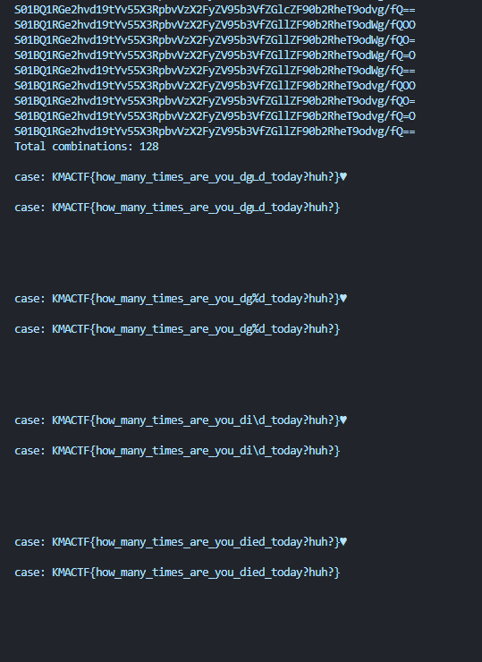

```rust
flag: KMACTF{how_many_times_are_you_died_today?huh?}
```

#### Note


- Thực ra bên chall gốc còn có 1 điều kiện để lọc 1 vài kí tự ra nữa nên sẽ chỉ còn 1 cái `base64` hợp lệ chứ không phải 128 case như solution của mình, nhưng xóa đi viết lại thì phí script trên quá nên thôi mình note đây vậy :v.

  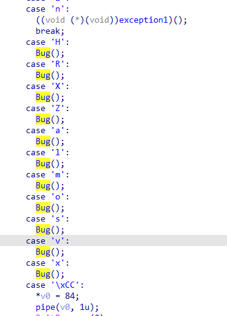

## Mong WRITEUP này giúp ích cho các bạn!

```
from KMA
Author: 13r_ə_Rɪst
```
