## CTFs/L3akCTF

### Hidden

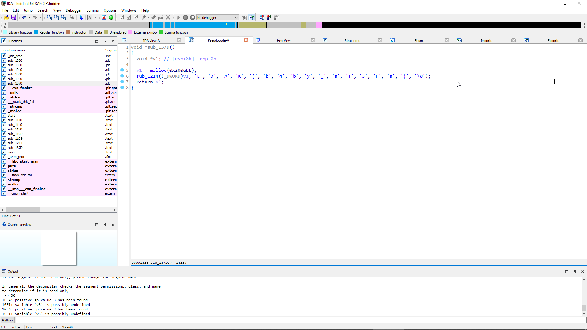

- -\_-

```
flag: L3AK{b4by_sT3Ps}
```

### Angry

- Chall: [angry](Angry/angry_patched_skill_issues)

- Bài này....

- Dù được fix sau vài tiếng khi bắt đầu giải, có vẻ ý định của author là để người chơi phải đoán khi vẫn có những đoạn không thể giải được mà buộc phải guessing để hoàn thiện.


```python
from z3 import *

a1 = [BitVec(f'a1[{i}]', 8) for i in range(37)]
solver = Solver()

solver.add(a1[0] == 76)
solver.add(a1[3] == 75)
solver.add(a1[4] == 123)
solver.add(a1[2] == 65)
solver.add(a1[6] == 110)
solver.add(a1[7] == 103)
solver.add(a1[8] == 114)
solver.add(a1[9] == 95)
solver.add((4 * a1[10]) == 208)
solver.add(a1[11] == 95)
solver.add(a1[12] == 108)
solver.add(a1[18] == 48)
solver.add(a1[19] == 110)
solver.add(a1[20] == 116)
solver.add(a1[22] == 100)
solver.add(a1[23] == 111)
solver.add(a1[24] == 95)
solver.add(a1[27] == 95)
solver.add(a1[29] == 52)
solver.add(a1[30] == 110)
solver.add(a1[33] == 108)
solver.add(a1[34] == 108)
solver.add(a1[35] == 121)
solver.add(a1[36] == 125)
solver.add(a1[17] == 100)
solver.add(a1[5] == 97)
solver.add(a1[15] == 51)
solver.add(a1[26] == 116)

solver.add((a1[25] - a1[5]) == 8)
solver.add((a1[33] - a1[1]) == 57)
solver.add((a1[34] + a1[31]) == 193)
solver.add((a1[32] + a1[33]) == 160)
solver.add((a1[21] + a1[28] - a1[25]) == 99)
solver.add((a1[16] + 51 + a1[14] + 100) == 348)
solver.add((a1[21] + a1[16] - a1[25]) == 85)
solver.add(a1[26] != 1)
solver.add((a1[15] ^ a1[1]) != 65)
solver.add((a1[17] - a1[32] + a1[33]) == 156)
solver.add((a1[21] ^ a1[17]) == 59)
solver.add((a1[1] ^ a1[0] ^ a1[13] ^ a1[2] ^ a1[3]) == 68)
solver.add((a1[10] & 0xCF) <= 9)

if solver.check() == sat:
    model = solver.model()
    print("Solution found:")
    print(model)

else:
    print("No solution found")
```

- Nếu có gì cần lưu ý thì, ta biết rằng format flag là `L3AK{}`. Nên ta có thể thay 5 phần tử đầu thành mã ascii tương ứng. Đồng thời, phần tử duy nhất phải guessing là `a1[26] = 'i'`.

```
flag: L3AK{angr_4_l1f3_d0nt_do_it_m4nU4lly}
```

### Wires

- Chall: [wires](Wires/wires)

- Chall này khá hay, mình cần đi qua nhiều hướng giải quyết mới có phương pháp tiếp cận đúng đắn. Tưởng rằng là một thể loại quen nên đã đi theo một số lối mòn rồi bế tắc, nhưng khi thay đổi mindset và giải ra thì thấy nó rất tuyệt^^.

- Chương trình yêu cầu ta truyền thêm `argv` để thực thi theo đúng flow. Cụ thể là cần truyền vào một file tên myFlag, khi đó chương trình gen ra 1 cửa sổ có những đoạn text với các truy vấn cơ bản như `Up`, `Down`, `Left`, `Right`...

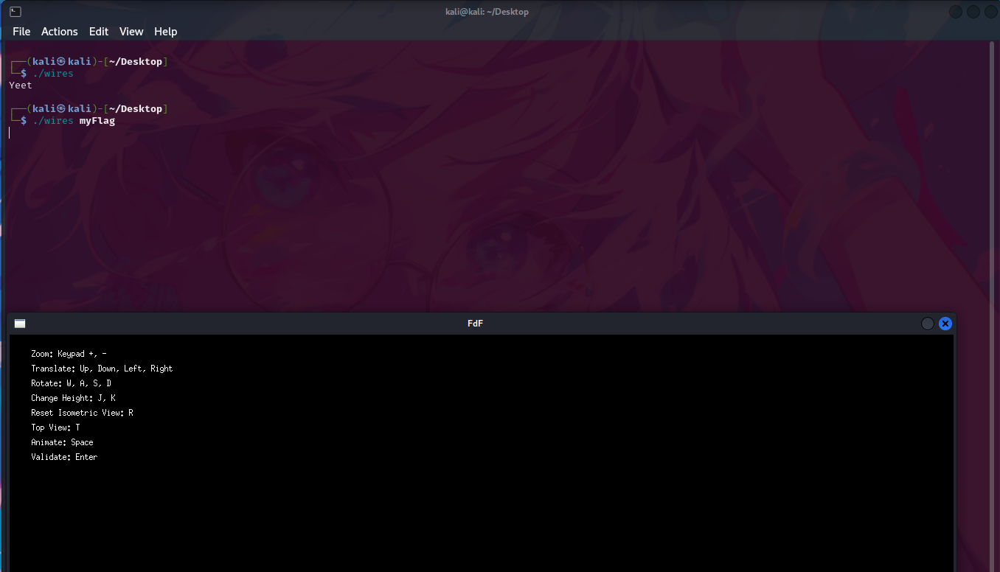

- Load vào `IDA` để phân tích sâu hơn, ta thấy được chương trình thực hiện một số thao tác cơ bản trong quá trình debug như: `check file name`, `read file`, `execute`, `check flag`.

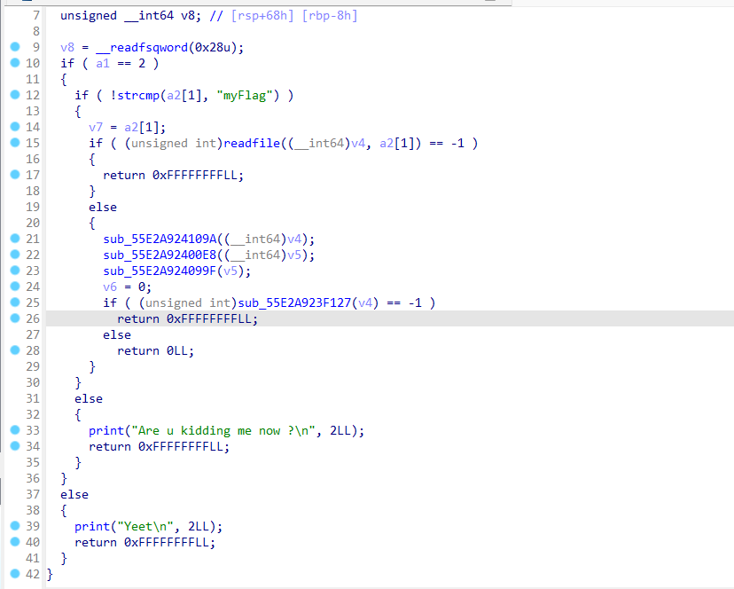

- Từ đây mình cho rằng đây khả năng là một bài giải ma trận, vì cửa sổ được gen ra có các thao tác tương tự các hướng di chuyển và mình cũng nghĩ rằng file truyền vào sẽ là flag và được convert thành các hướng đi của ta trong ma trận.

- Từ hướng suy nghĩ mình đặt ra ở trên, mình thực hiện debug để tìm kiếm map. Ở đây mình phát hiện rằng chức năng `validate` được trigger bằng phím `Enter` đóng vai trò là checker, thực hiện nhảy vào và debug tiếp.Tới đây thì hàm checker không thể convert sang mã giả được buộc mình phải đọc mã máy.

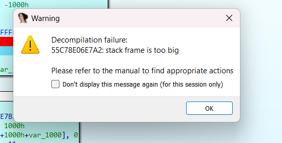
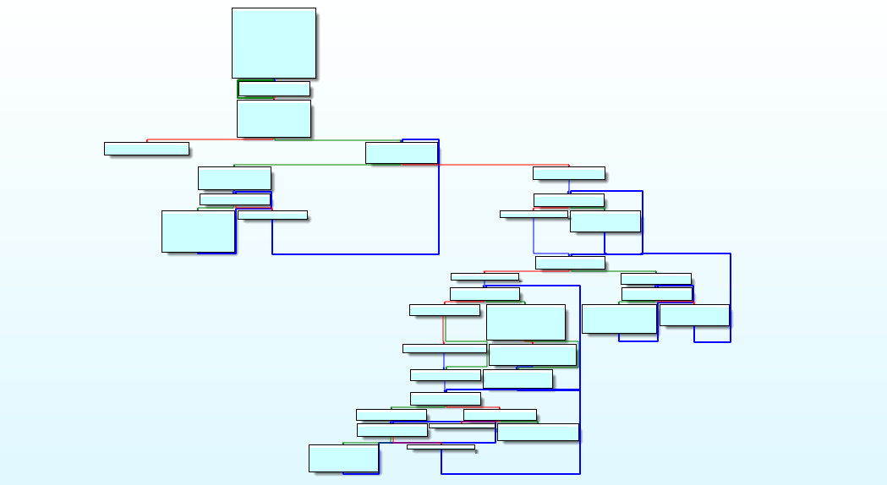

- Tuy nhiên mình không tìm thấy thứ gì giống ma trận ở đây. Từ đó mình bỏ qua hàm này và tìm kiếm khắp nơi, nhưng cũng không có kết quả. Mình đã suy nghĩ tới việc file truyền vào mới là map, tuy nhiên điều này cũng hơi vô lý nên mình gạt bỏ ý tưởng này.

- Nói thì đơn giản nhưng mình stuck ở đây gần 1 ngày @@. Bất lực tìm kiếm, mình chuyển hướng sang osint các thông tin có trong chương trình, và khi tìm kiếm tên của trình hiển thị là `fdf`, thấy rằng đây khả năng là một loại file nên tìm kiếm thử. Và thấy một thứ khá thú vị.

- [fdf file descript](https://github.com/francisrafal/FdF)

- Thậm chí giao diện của file `fdf` trong [video demo](https://www.youtube.com/watch?v=Ov3ljgXXIAQ) còn giống hệt với chall này. Đổi hướng đi, truyền giá trị trong file [42.fdf](Wires/42.fdf) vào myFlag. Khi thực thi thì ta thấy chương trình biểu diễn như dưới.

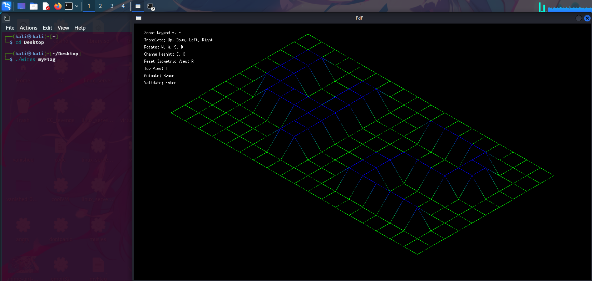

- Tới đây mình đã mường tượng ra chương trình làm gì, nó sẽ đọc data từ file `myFlag`, thực hiện biểu diễn lên cửa sổ và bấm `enter` để check.

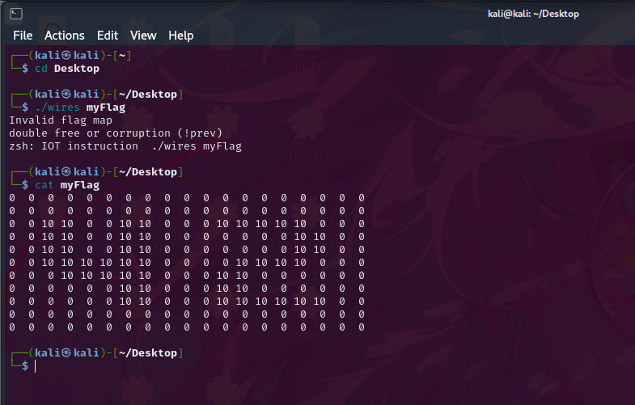

- Giờ thì mục tiêu của ta là tìm và rev lại được cách convert data từ file của chương trình, đồng thời lấy giá trị từ được mang ra kiểm tra và dịch sang output từ file `convert` được rì vợt.

- Dù hàm check ta nhảy tới sau khi thực hiện truy vấn `enter-validate` không thể dịch sang mã giả như đã đề cập trên, ta thấy không khó để đọc được. Hàm này thực hiện đọc từng dòng một trong nội dung file truyền vào, xóa bỏ khoảng trắng, bỏ xuống dòng(`0xa`), convert char thành int... rồi truyền nó vào một ma trận. Sau đó là duyệt từng khối một trong ma trận(nói là `con trỏ cấp 2` kiểm soát các `con trỏ cấp 1`(mảng 1 chiều) tương ứng với các dòng cho dễ hình dung).

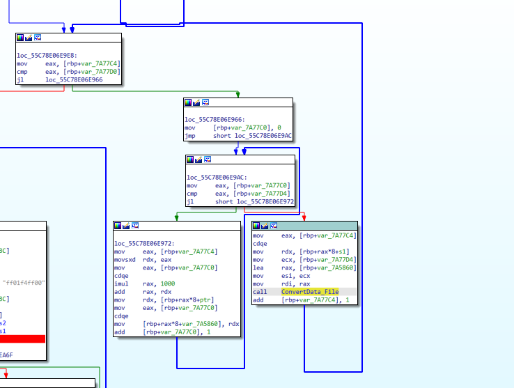

- Dưới đây là nội dung hàm `convert`.

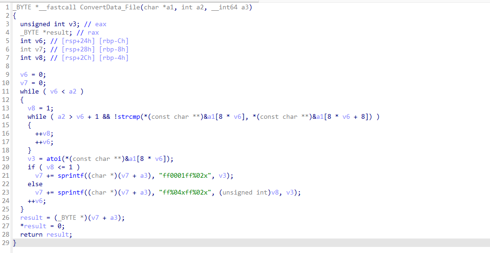

- Khá dễ hiểu, hàm này duyệt mảng chứa nội dung của dòng. Kiểm tra xem `input[i]` có giống với `input[i+1]` hay không. Nếu giống, tiếp tục duyệt tới khi khác/null, và convert sang dạng string với format `ff[hex(số lượng số giống nhau)]ff[hex(input[i])]`.

- Tóm lại, 1 hàng trong file input là `0 0 0 0 0 0 0 0 0 0 0` thì sẽ được convert như sau.

```python
`0 0 0 0 0 0 0 0 0 0 0\n`
-> ['0', '0', '0', '0', '0', '0', '0', '0', '0', '0', '0']
-> atoi() -> [0, 0, 0, 0, 0, 0, 0, 0, 0, 0, 0]
-> ["ff000bff00"]

hoặc trong 1 trường hợp khác:

`0 1 0 0 0 1 1 1 0 0 0` -> ["ff0001ff00", "ff0001ff01", "ff0003ff00", "ff0003ff01", "ff0003ff00"]
```

- Lưu ý rằng dãy kí tự được convert sang dạng số bằng `atoi()` nên ta có thể kết luận rằng trong file myFlag sẽ chỉ chứa các giá trị từ 1-10.^^

- Khi đã nắm được cách convert của chương trình, mình viết hàm reverse như sau:

```py
_str = 'ff0003ff10'
ans = []
tmp = 0
tmp_str = ''
Ans = []
for i in _str:
    tmp_str += i
    tmp += 1
    if tmp % 10 == 0:
        ans.append(tmp_str)
        tmp = 0
        tmp_str = ''
for i in ans:
    _hex = int(i, 16)
    a = _hex & 0xff
    _hex >>= 16
    _len = _hex & 0xffff
    for i in range(_len):
        print(a, end=" ")
print()
```

- Giờ thì mình chạy tới hàm kiểm tra, tuy nhiên ở đây lại chỉ gọi ra 1 giá trị duy nhất là `ff01f4ff00`.

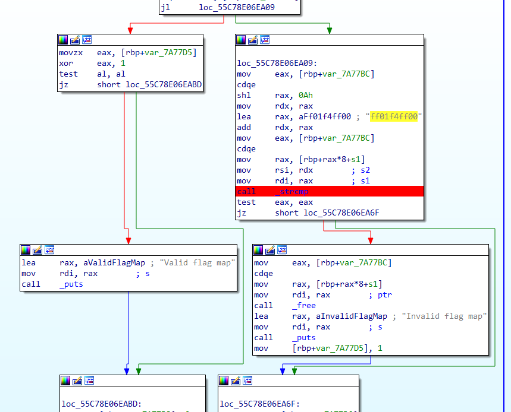

- Chương trình check tương ứng với số dòng của input, tuy nhiên việc check với 1 dải toàn `0` thì cũng chẳng thu được gì.

- Với ý tưởng rằng flag hẳn phải ở đâu đó trong chương trình. Mình thử xref giá trị được đem ra so sánh xem có khúc nào bị chèn không nhưng cũng không có thêm thông tin. Sau một hồi thì thấy trong mục strings có khá nhiều giá trị được `encrypt` tại đây.

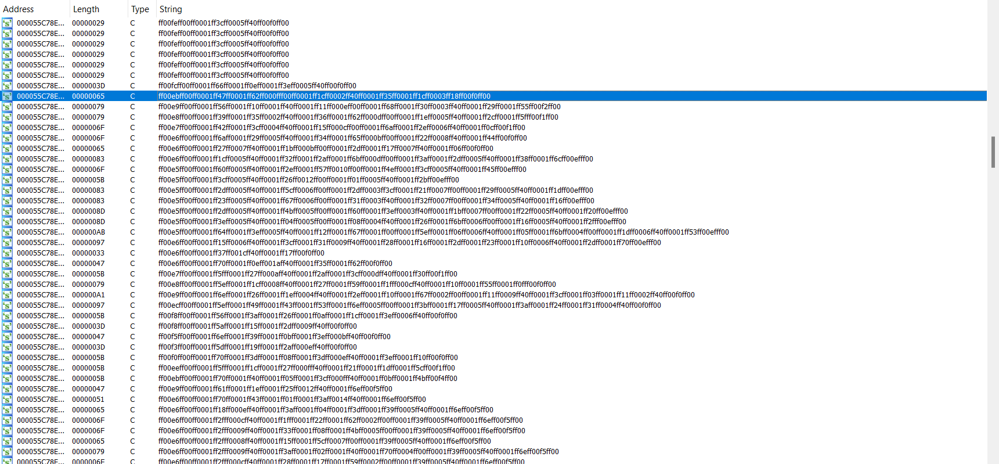

- Nhặt chúng ra để viết script:

```python
maybeFlag = ['ff01f4ff00','ff01f4ff00','ff01f4ff00','ff01f4ff00','ff01f4ff00','ff01f4ff00','ff01f4ff00','ff01f4ff00','ff01f4ff00','ff01f4ff00','ff01f4ff00','ff01f4ff00','ff01f4ff00','ff01f4ff00','ff01f4ff00','ff01f4ff00','ff01f4ff00','ff01f4ff00','ff01f4ff00','ff01f4ff00','ff01f4ff00','ff01f4ff00','ff01f4ff00','ff01f4ff00','ff01f4ff00','ff01f4ff00','ff01f4ff00','ff01f4ff00','ff01f4ff00','ff01f4ff00','ff01f4ff00','ff01f4ff00','ff01f4ff00','ff01f4ff00','ff01f4ff00','ff01f4ff00','ff01f4ff00','ff01f4ff00','ff01f4ff00','ff01f4ff00','ff01f4ff00','ff01f4ff00','ff01f4ff00','ff01f4ff00','ff01f4ff00','ff01f4ff00','ff01f4ff00','ff01f4ff00','ff00e6ff00ff0001ff3cff001dff37ff00f0ff00','ff00e6ff00ff0001ff2fff001dff40ff00f0ff00','ff00e6ff00ff0001ff2fff001dff40ff00f0ff00','ff00e6ff00ff0001ff2fff001dff40ff00f0ff00','ff00e6ff00ff0001ff2fff001dff40ff00f0ff00','ff00e6ff00ff0001ff2fff001dff40ff00f0ff00','ff00e6ff00ff0001ff2fff001dff40ff00f0ff00','ff00e6ff00ff0001ff20ff0017ff1aff0001ff3eff0005ff40ff00f0ff00','ff00feff00ff0001ff3cff0005ff40ff00f0ff00','ff00feff00ff0001ff3cff0005ff40ff00f0ff00','ff00feff00ff0001ff3cff0005ff40ff00f0ff00','ff00feff00ff0001ff3cff0005ff40ff00f0ff00','ff00feff00ff0001ff3cff0005ff40ff00f0ff00','ff00feff00ff0001ff3cff0005ff40ff00f0ff00','ff00feff00ff0001ff3cff0005ff40ff00f0ff00','ff00feff00ff0001ff3cff0005ff40ff00f0ff00','ff00fcff00ff0001ff66ff0001ff0eff0001ff3eff0005ff40ff00f0ff00','ff00ebff00ff0001ff47ff0001ff62ff000fff00ff0001ff1cff0002ff40ff0001ff35ff0001ff1cff0003ff18ff00f0ff00','ff00e9ff00ff0001ff56ff0001ff10ff0001ff40ff0001ff11ff000eff00ff0001ff68ff0001ff30ff0003ff40ff0001ff29ff0001ff55ff00f2ff00','ff00e8ff00ff0001ff39ff0001ff35ff0002ff40ff0001ff36ff0001ff62ff000dff00ff0001ff1eff0005ff40ff0001ff2cff0001ff5fff00f1ff00','ff00e7ff00ff0001ff42ff0001ff3cff0004ff40ff0001ff15ff000cff00ff0001ff6aff0001ff2eff0006ff40ff0001ff0cff00f1ff00','ff00e6ff00ff0001ff6aff0001ff29ff0005ff40ff0001ff34ff0001ff65ff000bff00ff0001ff22ff0008ff40ff0001ff44ff00f0ff00','ff00e6ff00ff0001ff27ff0007ff40ff0001ff1bff000bff00ff0001ff2dff0001ff17ff0007ff40ff0001ff06ff00f0ff00','ff00e6ff00ff0001ff1cff0005ff40ff0001ff32ff0001ff2aff0001ff6bff000dff00ff0001ff3aff0001ff2dff0005ff40ff0001ff38ff0001ff6cff00efff00','ff00e5ff00ff0001ff60ff0005ff40ff0001ff2eff0001ff57ff0010ff00ff0001ff4eff0001ff3cff0005ff40ff0001ff45ff00efff00','ff00e5ff00ff0001ff3cff0005ff40ff0001ff26ff0012ff00ff0001ff01ff0005ff40ff0001ff2bff00efff00','ff00e5ff00ff0001ff2dff0005ff40ff0001ff5cff0006ff00ff0001ff2dff0003ff3cff0001ff21ff0007ff00ff0001ff29ff0005ff40ff0001ff1dff00efff00','ff00e5ff00ff0001ff23ff0005ff40ff0001ff67ff0006ff00ff0001ff31ff0003ff40ff0001ff32ff0007ff00ff0001ff34ff0005ff40ff0001ff16ff00efff00','ff00e5ff00ff0001ff2dff0005ff40ff0001ff4bff0005ff00ff0001ff60ff0001ff3eff0003ff40ff0001ff1bff0007ff00ff0001ff22ff0005ff40ff0001ff20ff00efff00','ff00e5ff00ff0001ff3eff0005ff40ff0001ff04ff0005ff00ff0001ff08ff0004ff40ff0001ff26ff0001ff6bff0006ff00ff0001ff16ff0005ff40ff0001ff2fff00efff00','ff00e5ff00ff0001ff64ff0001ff3eff0005ff40ff0001ff12ff0001ff67ff0001ff00ff0001ff5eff0001ff06ff0006ff40ff0001ff05ff0001ff6bff0004ff00ff0001ff1dff0006ff40ff0001ff53ff00efff00','ff00e6ff00ff0001ff15ff0006ff40ff0001ff3cff0001ff31ff0009ff40ff0001ff28ff0001ff16ff0001ff2dff0001ff23ff0001ff10ff0006ff40ff0001ff2dff0001ff70ff00efff00','ff00e6ff00ff0001ff37ff001cff40ff0001ff17ff00f0ff00','ff00e6ff00ff0001ff70ff0001ff0eff001aff40ff0001ff35ff0001ff62ff00f0ff00','ff00e7ff00ff0001ff5fff0001ff27ff000aff40ff0001ff2aff0001ff3cff000dff40ff0001ff30ff00f1ff00','ff00e8ff00ff0001ff5eff0001ff1cff0008ff40ff0001ff27ff0001ff59ff0001ff1fff000cff40ff0001ff10ff0001ff55ff0001ff0fff00f0ff00','ff00e9ff00ff0001ff6eff0001ff26ff0001ff1eff0004ff40ff0001ff2eff0001ff10ff0001ff67ff0002ff00ff0001ff11ff0009ff40ff0001ff3cff0001ff03ff0001ff11ff0002ff40ff00f0ff00','ff00ecff00ff0001ff5eff0001ff49ff0001ff43ff0001ff53ff0001ff6eff0005ff00ff0001ff3bff0001ff17ff0005ff40ff0001ff3aff0001ff24ff0001ff31ff0004ff40ff00f0ff00','ff00f8ff00ff0001ff56ff0001ff3aff0001ff26ff0001ff0aff0001ff1cff0001ff3eff0006ff40ff00f0ff00','ff00f8ff00ff0001ff5aff0001ff15ff0001ff2dff0009ff40ff00f0ff00','ff00f5ff00ff0001ff6eff0001ff39ff0001ff0bff0001ff3eff000bff40ff00f0ff00','ff00f3ff00ff0001ff5dff0001ff19ff0001ff2aff000eff40ff00f0ff00','ff00f0ff00ff0001ff70ff0001ff3dff0001ff08ff0001ff3dff000eff40ff0001ff3eff0001ff10ff00f0ff00','ff00eeff00ff0001ff5fff0001ff1cff0001ff27ff000fff40ff0001ff21ff0001ff1dff0001ff5cff00f1ff00','ff00ebff00ff0001ff70ff0001ff40ff0001ff05ff0001ff3cff000fff40ff0001ff0bff0001ff4bff00f4ff00','ff00e9ff00ff0001ff61ff0001ff1eff0001ff25ff0012ff40ff0001ff6eff00f5ff00','ff00e6ff00ff0001ff70ff0001ff43ff0001ff01ff0001ff3aff0014ff40ff0001ff6eff00f5ff00','ff00e6ff00ff0001ff18ff000eff40ff0001ff3aff0001ff04ff0001ff3dff0001ff39ff0005ff40ff0001ff6eff00f5ff00','ff00e6ff00ff0001ff2fff000cff40ff0001ff1fff0001ff22ff0001ff62ff0002ff00ff0001ff39ff0005ff40ff0001ff6eff00f5ff00','ff00e6ff00ff0001ff2fff0009ff40ff0001ff33ff0001ff08ff0001ff4bff0005ff00ff0001ff39ff0005ff40ff0001ff6eff00f5ff00','ff00e6ff00ff0001ff2fff0008ff40ff0001ff15ff0001ff5cff0007ff00ff0001ff39ff0005ff40ff0001ff6eff00f5ff00','ff00e6ff00ff0001ff2fff0009ff40ff0001ff3aff0001ff02ff0001ff40ff0001ff70ff0004ff00ff0001ff39ff0005ff40ff0001ff6eff00f5ff00','ff00e6ff00ff0001ff2fff000cff40ff0001ff28ff0001ff17ff0001ff59ff0002ff00ff0001ff39ff0005ff40ff0001ff6eff00f5ff00','ff00e6ff00ff0001ff10ff000eff40ff0001ff3eff0001ff10ff0001ff31ff0001ff3aff0005ff40ff0001ff6eff00f5ff00','ff00e7ff00ff0001ff4eff0001ff09ff0001ff35ff0014ff40ff0001ff6eff00f5ff00','ff00e9ff00ff0001ff68ff0001ff2aff0001ff1aff0012ff40ff0001ff6eff00f5ff00','ff00ecff00ff0001ff4bff0001ff06ff0001ff36ff000fff40ff0001ff01ff0001ff3eff0001ff6eff00f3ff00','ff00eeff00ff0001ff67ff0001ff27ff0001ff1eff000fff40ff0001ff2dff0001ff11ff0001ff51ff00f1ff00','ff00f1ff00ff0001ff48ff0001ff02ff0001ff38ff000fff40ff0001ff1aff00f0ff00','ff00f3ff00ff0001ff65ff0001ff24ff0001ff20ff000eff40ff00f0ff00','ff00f6ff00ff0001ff45ff0001ff00ff0001ff3aff000bff40ff00f0ff00','ff00f8ff00ff0001ff62ff0001ff20ff0001ff23ff0009ff40ff00f0ff00','ff00faff00ff0001ff70ff0001ff42ff0001ff03ff0001ff3cff0006ff40ff00f0ff00','ff00e6ff00ff0001ff14ff0016ff0dff0001ff05ff0001ff17ff0001ff35ff0004ff40ff00f0ff00','ff00e6ff00ff0001ff2fff001dff40ff00f0ff00','ff00e6ff00ff0001ff2fff001dff40ff00f0ff00','ff00e6ff00ff0001ff2fff001dff40ff00f0ff00','ff00e6ff00ff0001ff2fff001dff40ff00f0ff00','ff00e6ff00ff0001ff2fff001dff40ff00f0ff00','ff00e6ff00ff0001ff2fff001dff40ff00f0ff00','ff00e6ff00ff0001ff48ff000aff45ff0001ff2bff0001ff37ff0004ff40ff0001ff17ff0001ff43ff000bff45ff00f0ff00','ff00f0ff00ff0001ff43ff0001ff30ff0006ff40ff0001ff08ff0001ff6aff00faff00','ff00efff00ff0001ff2bff0001ff3cff0008ff40ff0001ff19ff0001ff60ff00f9ff00','ff00edff00ff0001ff6fff0001ff0eff000bff40ff0001ff27ff0001ff52ff00f8ff00','ff00ecff00ff0001ff67ff0001ff09ff000dff40ff0001ff33ff0001ff42ff00f7ff00','ff00ebff00ff0001ff5aff0001ff1eff000fff40ff0001ff3aff0001ff2eff00f6ff00','ff00eaff00ff0001ff47ff0001ff2eff0008ff40ff0001ff2eff0009ff40ff0001ff18ff00f5ff00','ff00e9ff00ff0001ff30ff0001ff3aff0007ff40ff0001ff3aff0001ff2dff0001ff62ff0001ff15ff0009ff40ff0001ff02ff0001ff6dff00f3ff00','ff00e7ff00ff0001ff70ff0001ff14ff0008ff40ff0001ff30ff0001ff44ff0002ff00ff0001ff6aff0001ff07ff0009ff40ff0001ff10ff0001ff66ff00f2ff00','ff00e6ff00ff0001ff6aff0001ff05ff0008ff40ff0001ff23ff0001ff57ff0004ff00ff0001ff6fff0001ff0aff0009ff40ff0001ff1fff0001ff5bff00f1ff00','ff00e6ff00ff0001ff13ff0008ff40ff0001ff10ff0001ff64ff0007ff00ff0001ff1eff0009ff40ff0001ff2dff0001ff4cff00f0ff00','ff00e6ff00ff0001ff2fff0007ff40ff0001ff05ff0001ff6dff0009ff00ff0001ff31ff0001ff3aff0008ff40ff0001ff36ff00f0ff00','ff00e6ff00ff0001ff2fff0005ff40ff0001ff3eff0001ff1eff000cff00ff0001ff42ff0001ff34ff0008ff40ff00f0ff00','ff00e6ff00ff0001ff2fff0004ff40ff0002ff37ff000eff00ff0001ff50ff0001ff2aff0007ff40ff00f0ff00','ff00e6ff00ff0001ff2fff0003ff40ff0001ff2dff0001ff4bff0010ff00ff0001ff5cff0001ff1fff0006ff40ff00f0ff00','ff00e6ff00ff0001ff2fff0002ff40ff0001ff1cff0001ff5cff0012ff00ff0001ff65ff0001ff10ff0005ff40ff00f0ff00','ff00e6ff00ff0001ff2fff0001ff40ff0001ff09ff0001ff68ff0014ff00ff0001ff6cff0001ff01ff0004ff40ff00f0ff00','ff00e6ff00ff0001ff2fff0001ff0eff0001ff6fff0016ff00ff0001ff70ff0001ff10ff0003ff40ff00f0ff00','ff00e6ff00ff0001ff32ff0010ff00ff0001ff4eff0002ff37ff0001ff40ff0006ff00ff0001ff24ff0001ff3eff0001ff40ff00f0ff00','ff00f7ff00ff0001ff06ff0002ff40ff0001ff32ff0001ff70ff0006ff00ff0001ff37ff0001ff39ff00f0ff00','ff00f6ff00ff0001ff49ff0001ff3aff0003ff40ff0001ff21ff0007ff00ff0001ff46ff00f0ff00','ff00e7ff00ff0001ff6cff0001ff34ff0001ff0dff0001ff05ff0001ff14ff0009ff15ff0001ff21ff0001ff3dff0005ff40ff0001ff29ff000aff15ff0001ff0aff0001ff08ff0001ff27ff0001ff62ff00e9ff00','ff00e6ff00ff0001ff40ff0001ff2aff0022ff40ff0001ff36ff0001ff22ff00e8ff00','ff00e5ff00ff0001ff4cff0001ff3cff0025ff40ff0001ff27ff00e7ff00','ff00e5ff00ff0001ff0dff0012ff40ff0001ff3aff0001ff27ff0012ff40ff0001ff32ff0001ff6cff00e6ff00','ff00e4ff00ff0001ff6aff0001ff3cff0011ff40ff0001ff3dff0001ff2bff0001ff4bff0001ff30ff0012ff40ff0001ff43ff00e6ff00','ff00e4ff00ff0001ff58ff0005ff40ff0001ff3dff0001ff1fff0009ff13ff0001ff0dff0001ff0bff0001ff4cff0002ff00ff0001ff5cff0001ff16ff0001ff09ff0009ff13ff0001ff19ff0001ff37ff0005ff40ff0001ff2fff00e6ff00','ff00e4ff00ff0001ff50ff0004ff40ff0001ff34ff0001ff4dff001cff00ff0001ff60ff0001ff1cff0004ff40ff0001ff27ff00e6ff00','ff00e4ff00ff0001ff50ff0004ff40ff0001ff0fff0010ff00ff0001ff6bff0001ff18ff0001ff00ff0001ff22ff000aff00ff0001ff38ff0004ff40ff0001ff27ff00e6ff00','ff00e4ff00ff0001ff50ff0004ff40ff0001ff22ff000fff00ff0001ff48ff0001ff21ff0002ff40ff0001ff05ff000aff00ff0001ff4aff0004ff40ff0001ff27ff00e6ff00','ff00e4ff00ff0001ff60ff0004ff1aff0001ff49ff000dff00ff0001ff6bff0001ff10ff0001ff3dff0003ff40ff0001ff05ff000aff00ff0001ff5eff0004ff1aff0001ff4bff00e6ff00','ff00f6ff00ff0001ff48ff0001ff22ff0005ff40ff0001ff05ff00f6ff00','ff00f4ff00ff0001ff6aff0001ff0fff0001ff3dff0006ff40ff0001ff05ff00f6ff00','ff00f3ff00ff0001ff47ff0001ff23ff0008ff40ff0001ff05ff00f6ff00','ff00f1ff00ff0001ff6aff0001ff0fff0001ff3dff0009ff40ff0001ff05ff00f6ff00','ff00f0ff00ff0001ff47ff0001ff23ff000bff40ff0001ff05ff00f6ff00','ff00eeff00ff0001ff6aff0001ff0eff0001ff3eff000cff40ff0001ff05ff00f6ff00','ff00edff00ff0001ff46ff0001ff23ff0008ff40ff0001ff2cff0005ff40ff0001ff05ff00f6ff00','ff00ebff00ff0001ff6aff0001ff0eff0001ff3eff0007ff40ff0001ff32ff0001ff2aff0001ff3cff0005ff40ff0001ff05ff00f6ff00','ff00eaff00ff0001ff45ff0001ff23ff0008ff40ff0001ff01ff0001ff60ff0001ff00ff0001ff3dff0005ff40ff0001ff05ff00f6ff00','ff00e8ff00ff0001ff6aff0001ff0dff0001ff3eff0007ff40ff0001ff26ff0001ff3eff0003ff00ff0001ff3dff0005ff40ff0001ff05ff00f6ff00','ff00e7ff00ff0001ff45ff0001ff24ff0007ff40ff0001ff3cff0001ff12ff0001ff6aff0004ff00ff0001ff3dff0005ff40ff0001ff05ff00f6ff00','ff00e6ff00ff0001ff10ff0001ff3eff0007ff40ff0001ff17ff0001ff50ff0006ff00ff0001ff3dff0005ff40ff0001ff05ff00f6ff00','ff00e6ff00ff0001ff2fff0008ff40ff0001ff35ff0007ff32ff0001ff35ff0005ff40ff0001ff3cff0006ff32ff00f0ff00','ff00e6ff00ff0001ff2fff001dff40ff00f0ff00','ff00e6ff00ff0001ff2fff001dff40ff00f0ff00','ff00e6ff00ff0001ff2fff001dff40ff00f0ff00','ff00e6ff00ff0001ff2fff001dff40ff00f0ff00','ff00e6ff00ff0001ff2fff001dff40ff00f0ff00','ff00e6ff00ff0001ff29ff0010ff22ff0001ff06ff0005ff40ff0001ff1eff0006ff22ff00f0ff00','ff00f7ff00ff0001ff3dff0005ff40ff0001ff05ff00f6ff00','ff00f7ff00ff0001ff3dff0005ff40ff0001ff05ff00f6ff00','ff00ecff00ff0001ff5dff0001ff0eff0001ff30ff0008ff00ff0001ff40ff0005ff32ff0001ff01ff0003ff00ff0001ff52ff0001ff34ff0001ff40ff00f0ff00','ff00eaff00ff0001ff6eff0001ff1dff0001ff37ff0001ff40ff0001ff26ff0001ff6dff0010ff00ff0001ff62ff0001ff26ff0002ff40ff00f0ff00','ff00e9ff00ff0001ff59ff0001ff16ff0004ff40ff0001ff2dff000fff00ff0001ff6aff0001ff16ff0003ff40ff00f0ff00','ff00e8ff00ff0001ff4eff0001ff2dff0005ff40ff0001ff23ff0001ff6fff000dff00ff0001ff6dff0001ff0bff0004ff40ff00f0ff00','ff00e7ff00ff0001ff5eff0001ff2dff0007ff40ff0001ff32ff000cff00ff0001ff70ff0001ff01ff0005ff40ff00f0ff00','ff00e7ff00ff0001ff0dff0008ff40ff0001ff18ff000bff00ff0001ff70ff0001ff06ff0006ff40ff00f0ff00','ff00e6ff00ff0001ff3eff0007ff40ff0001ff35ff0001ff19ff0001ff63ff000bff00ff0001ff0bff0007ff40ff00f0ff00','ff00e6ff00ff0001ff0cff0006ff40ff0001ff10ff0001ff5fff000cff00ff0001ff0fff0008ff40ff00f0ff00','ff00e5ff00ff0001ff62ff0001ff3cff0005ff40ff0001ff03ff0001ff6dff000bff00ff0001ff70ff0001ff0dff0009ff40ff00f0ff00','ff00e5ff00ff0001ff3fff0005ff40ff0001ff1aff0001ff6eff000bff00ff0001ff70ff0001ff07ff000aff40ff00f0ff00','ff00e5ff00ff0001ff2cff0005ff40ff0001ff2aff000bff00ff0001ff6aff0001ff04ff000bff40ff00f0ff00','ff00e5ff00ff0001ff24ff0005ff40ff0001ff36ff000aff00ff0001ff60ff0001ff17ff000cff40ff00f0ff00','ff00e5ff00ff0001ff2fff0005ff40ff0001ff1cff0009ff00ff0001ff42ff0001ff2aff0006ff40ff0001ff17ff0001ff3cff0005ff40ff00f0ff00','ff00e5ff00ff0001ff3bff0005ff40ff0001ff25ff0001ff69ff0006ff00ff0001ff6cff0001ff14ff0001ff3eff0006ff40ff0001ff34ff0001ff57ff0001ff3cff0005ff40ff00f0ff00','ff00e5ff00ff0001ff58ff0006ff40ff0001ff10ff0001ff55ff0003ff00ff0001ff70ff0001ff38ff0001ff23ff0008ff40ff0001ff36ff0001ff00ff0001ff3cff0005ff40ff00f0ff00','ff00e6ff00ff0001ff2cff0007ff40ff0001ff1aff0002ff00ff0001ff29ff0009ff40ff0001ff1cff0002ff00ff0001ff3cff0005ff40ff00f0ff00','ff00e6ff00ff0001ff05ff0013ff40ff0001ff0bff0003ff00ff0001ff3cff0005ff40ff00f0ff00','ff00e6ff00ff0001ff4eff0012ff40ff0001ff05ff0001ff70ff0003ff00ff0001ff3cff0005ff40ff00f0ff00','ff00e7ff00ff0001ff05ff0010ff40ff0001ff0cff0001ff70ff0004ff00ff0001ff3cff0005ff40ff00f0ff00','ff00e7ff00ff0001ff62ff0001ff28ff000dff40ff0001ff3cff0001ff22ff0006ff00ff0001ff3cff0005ff40ff00f0ff00','ff00e8ff00ff0001ff5cff0001ff1dff000bff40ff0001ff23ff0001ff44ff0007ff00ff0001ff3cff0005ff40ff00f0ff00','ff00e9ff00ff0001ff6dff0001ff1fff0001ff2eff0007ff40ff0001ff30ff0001ff1eff0001ff6cff0008ff00ff0001ff3cff0005ff40ff0001ff5dff0002ff45ff0001ff55ff00ecff00','ff00ebff00ff0001ff6cff0001ff3bff0001ff13ff0001ff02ff0001ff0bff0001ff0dff0001ff08ff0001ff34ff0001ff6aff000aff00ff0001ff3cff0005ff40ff0001ff22ff0002ff40ff0001ff05ff00ecff00','ff00feff00ff0001ff3bff0005ff3aff0001ff22ff0002ff40ff0001ff05ff00ecff00','ff0104ff00ff0001ff22ff0002ff40ff0001ff05ff00ecff00','ff0104ff00ff0001ff22ff0002ff40ff0001ff05ff00ecff00','ff0104ff00ff0001ff22ff0002ff40ff0001ff05ff00ecff00','ff0104ff00ff0001ff22ff0002ff40ff0001ff05ff00ecff00','ff0104ff00ff0001ff22ff0002ff40ff0001ff05ff00ecff00','ff0104ff00ff0001ff22ff0002ff40ff0001ff05ff00ecff00','ff0104ff00ff0001ff22ff0002ff40ff0001ff05ff00ecff00','ff0104ff00ff0001ff22ff0002ff40ff0001ff05ff00ecff00','ff0104ff00ff0001ff22ff0002ff40ff0001ff05ff00ecff00','ff0104ff00ff0001ff22ff0002ff40ff0001ff05ff00ecff00','ff0104ff00ff0001ff22ff0002ff40ff0001ff05ff00ecff00','ff0104ff00ff0001ff22ff0002ff40ff0001ff05ff00ecff00','ff0104ff00ff0001ff22ff0002ff40ff0001ff05ff00ecff00','ff0104ff00ff0001ff22ff0002ff40ff0001ff05ff00ecff00','ff00ebff00ff0001ff04ff0005ff35ff0001ff2aff0001ff61ff0011ff00ff0001ff22ff0002ff40ff0001ff05ff00ecff00','ff00eaff00ff0001ff34ff0006ff40ff0001ff2bff0012ff00ff0001ff22ff0002ff40ff0001ff05ff00ecff00','ff00e9ff00ff0001ff64ff0001ff2eff0005ff40ff0001ff10ff0001ff70ff0012ff00ff0001ff55ff0002ff32ff0001ff49ff00ecff00','ff00e9ff00ff0001ff02ff0005ff40ff0001ff37ff0001ff58ff0103ff00','ff00e8ff00ff0007ff40ff0001ff1fff0014ff6eff00f0ff00','ff00e7ff00ff0001ff69ff0001ff27ff001bff40ff00f0ff00','ff00e7ff00ff0001ff0dff001cff40ff00f0ff00','ff00e6ff00ff0001ff48ff0001ff3eff001cff40ff00f0ff00','ff00e6ff00ff0001ff1bff001dff40ff00f0ff00','ff00e6ff00ff0001ff2fff001dff40ff00f0ff00','ff00e6ff00ff0001ff2fff001dff40ff00f0ff00','ff00e6ff00ff0001ff0eff001aff18ff0001ff26ff0001ff20ff0001ff18ff00f0ff00','ff00f5ff00ff0001ff4fff0001ff38ff0001ff3bff0001ff5fff0006ff00ff0001ff52ff0001ff10ff0001ff40ff0001ff25ff0001ff6bff00f0ff00','ff00f3ff00ff0001ff43ff0001ff23ff0003ff40ff0001ff3dff0001ff0bff0001ff6eff0002ff00ff0001ff67ff0001ff0eff0001ff3cff0003ff40ff0001ff24ff00f0ff00','ff00f2ff00ff0001ff40ff0001ff3cff0006ff40ff0001ff06ff0002ff00ff0001ff67ff0001ff23ff0004ff40ff0001ff20ff00f0ff00','ff00f1ff00ff0001ff69ff0001ff2aff0008ff40ff0001ff34ff0002ff00ff0001ff41ff0005ff40ff0001ff59ff00efff00','ff00f1ff00ff0001ff28ff0009ff40ff0001ff2aff0001ff6bff0002ff00ff0001ff13ff0004ff40ff0001ff31ff00efff00','ff00f1ff00ff0001ff10ff000aff40ff0001ff2bff0002ff00ff0001ff2cff0004ff40ff0001ff1fff00efff00','ff00f0ff00ff0001ff70ff0001ff33ff0003ff40ff0001ff3cff0001ff1bff0005ff40ff0001ff17ff0002ff00ff0001ff47ff0004ff40ff0001ff14ff00efff00','ff00f0ff00ff0001ff65ff0004ff40ff0001ff17ff0001ff00ff0001ff12ff0005ff40ff0001ff4cff0001ff00ff0001ff34ff0004ff40ff0001ff19ff00efff00','ff00f0ff00ff0001ff5cff0004ff40ff0001ff31ff0001ff00ff0001ff5cff0001ff3eff0004ff40ff0001ff23ff0001ff19ff0001ff27ff0004ff40ff0001ff24ff00efff00','ff00f0ff00ff0001ff60ff0004ff40ff0001ff2bff0002ff00ff0001ff17ff000bff40ff0001ff3dff00efff00','ff00f0ff00ff0001ff6cff0001ff3dff0003ff40ff0001ff0cff0002ff00ff0001ff1fff000aff40ff0001ff3eff0001ff5fff00efff00','ff00f1ff00ff0001ff22ff0003ff40ff0001ff28ff0001ff70ff0001ff00ff0001ff61ff0001ff38ff0009ff40ff0001ff15ff00f0ff00','ff00f1ff00ff0001ff05ff0004ff40ff0001ff3aff0002ff00ff0001ff16ff0009ff40ff0001ff3aff00f0ff00','ff00f1ff00ff0001ff37ff0002ff40ff0001ff26ff0001ff2cff0001ff6dff0002ff00ff0001ff6cff0001ff15ff0007ff40ff0001ff07ff0001ff00ff0001ff22ff0002ff40ff0001ff05ff00ecff00','ff00f1ff00ff0001ff6cff0001ff15ff0001ff2cff0001ff6dff0005ff00ff0001ff67ff0001ff07ff0001ff3aff0003ff40ff0001ff2eff0001ff23ff0001ff70ff0001ff00ff0001ff22ff0002ff40ff0001ff05ff00ecff00','ff00fcff00ff0001ff65ff0001ff44ff0001ff3eff0001ff4fff0001ff6fff0003ff00ff0001ff22ff0002ff40ff0001ff05ff00ecff00','ff0104ff00ff0001ff22ff0002ff40ff0001ff05ff00ecff00','ff0104ff00ff0001ff22ff0002ff40ff0001ff05ff00ecff00','ff0104ff00ff0001ff22ff0002ff40ff0001ff05ff00ecff00','ff0104ff00ff0001ff22ff0002ff40ff0001ff05ff00ecff00','ff0104ff00ff0001ff22ff0002ff40ff0001ff05ff00ecff00','ff0104ff00ff0001ff22ff0002ff40ff0001ff05ff00ecff00','ff0104ff00ff0001ff22ff0002ff40ff0001ff05ff00ecff00','ff0104ff00ff0001ff22ff0002ff40ff0001ff05ff00ecff00','ff0104ff00ff0001ff22ff0002ff40ff0001ff05ff00ecff00','ff0104ff00ff0001ff22ff0002ff40ff0001ff05ff00ecff00','ff0104ff00ff0001ff22ff0002ff40ff0001ff05ff00ecff00','ff0104ff00ff0001ff22ff0002ff40ff0001ff05ff00ecff00','ff00f1ff00ff0001ff5fff0004ff52ff0001ff68ff000dff00ff0001ff22ff0002ff40ff0001ff05ff00ecff00','ff00f1ff00ff0001ff07ff0004ff40ff0001ff3dff000dff00ff0001ff22ff0002ff40ff0001ff05ff00ecff00','ff00f1ff00ff0001ff07ff0004ff40ff0001ff3dff000dff00ff0001ff22ff0002ff40ff0001ff05ff00ecff00','ff00eaff00ff0001ff44ff0006ff1dff0001ff18ff0004ff40ff0001ff02ff0006ff1dff0001ff1eff0001ff27ff0001ff40ff0001ff67ff0003ff00ff0001ff41ff0002ff07ff0001ff2eff00ecff00','ff00eaff00ff0001ff14ff0015ff40ff0001ff38ff0001ff07ff0001ff60ff00f1ff00','ff00eaff00ff0001ff14ff0017ff40ff0001ff28ff0001ff59ff00f0ff00','ff00eaff00ff0001ff14ff0018ff40ff0001ff11ff00f0ff00','ff00eaff00ff0001ff14ff0019ff40ff0001ff52ff00efff00','ff00eaff00ff0001ff14ff0019ff40ff0001ff28ff00efff00','ff00eaff00ff0001ff1bff0006ff32ff0001ff3aff0004ff40ff0001ff35ff0005ff32ff0001ff37ff0007ff40ff0001ff18ff00efff00','ff00f1ff00ff0001ff07ff0004ff40ff0001ff3dff0006ff00ff0001ff60ff0001ff01ff0005ff40ff0001ff17ff00efff00','ff00f1ff00ff0001ff07ff0004ff40ff0001ff3dff0007ff00ff0001ff42ff0005ff40ff0001ff29ff00efff00','ff00f1ff00ff0001ff07ff0004ff40ff0001ff3dff0007ff00ff0001ff14ff0005ff40ff0001ff4dff00efff00','ff00e4ff00ff0001ff56ff000cff1eff0001ff2fff0004ff3aff0001ff26ff0007ff1eff0001ff21ff0001ff2aff0001ff35ff0001ff3eff0001ff40ff0001ff3bff0001ff70ff00efff00','ff00e4ff00ff0001ff50ff001fff40ff00f0ff00','ff00e4ff00ff0001ff50ff001fff40ff00f0ff00','ff00e4ff00ff0001ff50ff001fff40ff00f0ff00','ff00e4ff00ff0001ff50ff001fff40ff00f0ff00','ff00e4ff00ff0001ff50ff001fff40ff00f0ff00','ff00e4ff00ff0001ff5eff000eff0aff0001ff2aff0004ff40ff0001ff15ff0001ff08ff000aff0aff00f0ff00','ff00f2ff00ff0001ff32ff0003ff40ff0001ff3aff0001ff37ff00fcff00','ff00f1ff00ff0001ff5eff0001ff35ff0003ff40ff0001ff24ff00fdff00','ff00f1ff00ff0001ff0bff0003ff40ff0001ff38ff0001ff6cff00fdff00','ff00f1ff00ff0001ff2fff0003ff40ff0001ff27ff00feff00','ff00f0ff00ff0001ff62ff0004ff40ff0001ff3cff0001ff63ff00fdff00','ff00f0ff00ff0001ff5eff0005ff40ff0001ff01ff0001ff6dff00fcff00','ff00f0ff00ff0001ff6cff0001ff3cff0005ff40ff0001ff20ff0001ff24ff0001ff3fff000aff42ff00f0ff00','ff00f1ff00ff0001ff1cff0012ff40ff00f0ff00','ff00f1ff00ff0001ff18ff0012ff40ff00f0ff00','ff00f1ff00ff0001ff5cff0001ff3aff0011ff40ff00f0ff00','ff00f2ff00ff0001ff18ff0011ff40ff00f0ff00','ff00f2ff00ff0001ff70ff0001ff03ff0010ff40ff00f0ff00','ff00f4ff00ff0001ff37ff0001ff12ff0001ff3eff000dff40ff00f0ff00','ff00ebff00ff0001ff6aff0001ff6dff0009ff00ff0001ff6dff0001ff5cff0004ff55ff0001ff1fff0001ff40ff0001ff3bff0001ff0cff0001ff54ff0003ff55ff00f0ff00','ff00e9ff00ff0001ff6cff0001ff19ff0001ff35ff0001ff26ff000eff00ff0001ff70ff0001ff21ff0003ff40ff0001ff0cff0001ff69ff00f2ff00','ff00e8ff00ff0001ff57ff0001ff1dff0002ff40ff0001ff29ff0001ff6dff000dff00ff0001ff34ff0005ff40ff0001ff12ff0001ff6cff00f1ff00','ff00e7ff00ff0001ff59ff0001ff2cff0004ff40ff0001ff2aff000cff00ff0001ff70ff0001ff1fff0006ff40ff0001ff10ff00f1ff00','ff00e6ff00ff0001ff70ff0001ff13ff0005ff40ff0001ff26ff0001ff6dff000bff00ff0001ff37ff0007ff40ff0001ff3dff0001ff57ff00f0ff00','ff00e6ff00ff0001ff3bff0007ff40ff0001ff2dff000bff00ff0001ff11ff0001ff38ff0007ff40ff0001ff0bff00f0ff00','ff00e6ff00ff0001ff0eff0006ff40ff0001ff00ff0001ff4eff000cff00ff0001ff65ff0001ff0fff0001ff3cff0005ff40ff0001ff2fff0001ff70ff00efff00','ff00e5ff00ff0001ff69ff0001ff3aff0004ff40ff0001ff3cff0001ff36ff0010ff00ff0001ff30ff0006ff40ff0001ff4fff00efff00','ff00e5ff00ff0001ff42ff0005ff40ff0001ff12ff0012ff00ff0001ff13ff0005ff40ff0001ff2eff00efff00','ff00e5ff00ff0001ff30ff0005ff40ff0001ff52ff0006ff00ff0001ff03ff0003ff0eff0001ff32ff0007ff00ff0001ff22ff0005ff40ff0001ff20ff00efff00','ff00e5ff00ff0001ff24ff0005ff40ff0001ff69ff0006ff00ff0001ff2fff0003ff40ff0001ff31ff0007ff00ff0001ff34ff0005ff40ff0001ff16ff00efff00','ff00e5ff00ff0001ff2aff0005ff40ff0001ff54ff0005ff00ff0001ff6aff0001ff3cff0003ff40ff0001ff24ff0007ff00ff0001ff29ff0005ff40ff0001ff1dff00efff00','ff00e5ff00ff0001ff38ff0005ff40ff0001ff14ff0005ff00ff0001ff25ff0004ff40ff0001ff14ff0007ff00ff0001ff04ff0005ff40ff0001ff2aff00efff00','ff00e5ff00ff0001ff5aff0005ff40ff0001ff3aff0001ff3cff0003ff00ff0001ff31ff0001ff3aff0005ff40ff0001ff1eff0005ff00ff0001ff42ff0001ff3dff0005ff40ff0001ff48ff00efff00','ff00e6ff00ff0001ff25ff0006ff40ff0001ff17ff0001ff05ff0001ff22ff0008ff40ff0001ff03ff0001ff41ff0001ff59ff0001ff4eff0001ff1aff0001ff38ff0005ff40ff0001ff36ff0001ff6dff00efff00','ff00e6ff00ff0001ff23ff001cff40ff0001ff04ff00f0ff00','ff00e6ff00ff0001ff69ff0001ff25ff001aff40ff0001ff3eff0001ff52ff00f0ff00','ff00e7ff00ff0001ff49ff0001ff3aff000aff40ff0001ff3dff000eff40ff0001ff11ff00f1ff00','ff00e8ff00ff0001ff42ff0001ff35ff0008ff40ff0001ff3aff0001ff3eff0001ff01ff000cff40ff0001ff13ff0001ff6dff00f1ff00','ff00e9ff00ff0001ff5aff0001ff04ff0001ff3dff0005ff40ff0001ff19ff0001ff4cff0001ff00ff0001ff6aff0001ff15ff000aff40ff0001ff0bff0001ff6aff0002ff00ff0001ff35ff0002ff10ff0001ff1fff00ecff00','ff00ebff00ff0001ff62ff0001ff32ff0001ff1eff0001ff18ff0001ff28ff0001ff50ff0004ff00ff0001ff6dff0001ff10ff0001ff39ff0006ff40ff0001ff2eff0001ff2bff0001ff70ff0003ff00ff0001ff22ff0002ff40ff0001ff05ff00ecff00','ff00f7ff00ff0001ff65ff0001ff2bff0001ff0fff0001ff02ff0001ff05ff0001ff16ff0001ff42ff0001ff6dff0005ff00ff0001ff22ff0002ff40ff0001ff05ff00ecff00','ff0104ff00ff0001ff22ff0002ff40ff0001ff05ff00ecff00','ff0104ff00ff0001ff22ff0002ff40ff0001ff05ff00ecff00','ff0104ff00ff0001ff22ff0002ff40ff0001ff05ff00ecff00','ff0104ff00ff0001ff22ff0002ff40ff0001ff05ff00ecff00','ff0104ff00ff0001ff22ff0002ff40ff0001ff05ff00ecff00','ff0104ff00ff0001ff22ff0002ff40ff0001ff05ff00ecff00','ff0104ff00ff0001ff22ff0002ff40ff0001ff05ff00ecff00','ff0104ff00ff0001ff22ff0002ff40ff0001ff05ff00ecff00','ff0104ff00ff0001ff22ff0002ff40ff0001ff05ff00ecff00','ff0104ff00ff0001ff22ff0002ff40ff0001ff05ff00ecff00','ff0104ff00ff0001ff22ff0002ff40ff0001ff05ff00ecff00','ff0104ff00ff0001ff22ff0002ff40ff0001ff05ff00ecff00','ff0104ff00ff0001ff22ff0002ff40ff0001ff05ff00ecff00','ff00f7ff00ff0001ff51ff0001ff24ff0001ff0dff0001ff00ff0001ff07ff0001ff16ff0001ff3dff0001ff69ff0005ff00ff0001ff22ff0002ff40ff0001ff05ff00ecff00','ff00f5ff00ff0001ff37ff0001ff1cff0007ff40ff0001ff35ff0001ff12ff0001ff63ff0003ff00ff0001ff22ff0002ff40ff0001ff05ff00ecff00','ff00f3ff00ff0001ff69ff0001ff00ff000bff40ff0001ff29ff0001ff48ff0002ff00ff0001ff2dff0002ff23ff0001ff14ff00ecff00','ff00f2ff00ff0001ff6cff0001ff10ff000dff40ff0001ff38ff0001ff47ff00f1ff00','ff00f2ff00ff0001ff08ff000fff40ff0001ff30ff0001ff61ff00f0ff00','ff00f1ff00ff0001ff4eff0001ff3eff0010ff40ff0001ff08ff00f0ff00','ff00f1ff00ff0001ff08ff0011ff40ff0001ff39ff0001ff69ff00efff00','ff00f1ff00ff0001ff2aff0006ff40ff0001ff0bff0001ff39ff0001ff51ff0001ff48ff0001ff1cff0001ff30ff0006ff40ff0001ff3bff00efff00','ff00f0ff00ff0001ff6aff0006ff40ff0001ff17ff0005ff00ff0001ff59ff0001ff2cff0005ff40ff0001ff22ff00efff00','ff00f0ff00ff0001ff5cff0005ff40ff0001ff18ff0007ff00ff0001ff32ff0005ff40ff0001ff16ff00efff00','ff00f0ff00ff0001ff66ff0005ff40ff0001ff22ff0007ff00ff0001ff68ff0005ff40ff0001ff20ff00efff00','ff00f1ff00ff0001ff32ff0004ff40ff0001ff33ff0008ff00ff0001ff36ff0004ff40ff0001ff39ff00efff00','ff00f1ff00ff0001ff04ff0004ff40ff0001ff21ff0007ff00ff0001ff67ff0004ff40ff0001ff39ff0001ff68ff00efff00','ff00f1ff00ff0001ff3fff0004ff40ff0001ff1aff0001ff70ff0006ff00ff0001ff2dff0004ff40ff0001ff0eff00f0ff00','ff00f2ff00ff0001ff0dff0004ff40ff0001ff12ff0005ff00ff0001ff51ff0001ff30ff0003ff40ff0001ff24ff0001ff65ff00f0ff00','ff00f1ff00ff0001ff4eff0001ff2aff0001ff3cff0004ff40ff0001ff10ff0001ff33ff0001ff4bff0001ff42ff0001ff12ff0001ff36ff0003ff40ff0001ff3cff0001ff2dff0001ff45ff00f0ff00','ff00f1ff00ff0001ff07ff0012ff40ff00f0ff00','ff00f1ff00ff0001ff07ff0012ff40ff00f0ff00','ff00f1ff00ff0001ff07ff0012ff40ff00f0ff00','ff00f1ff00ff0001ff07ff0012ff40ff00f0ff00','ff00f1ff00ff0001ff07ff0012ff40ff00f0ff00','ff00f1ff00ff0001ff07ff0012ff40ff00f0ff00','ff00f1ff00ff0001ff67ff0012ff60ff00f0ff00','ff00f1ff00ff0001ff19ff0012ff1eff00f0ff00','ff00f1ff00ff0001ff07ff0012ff40ff00f0ff00','ff00f1ff00ff0001ff07ff0012ff40ff00f0ff00','ff00f1ff00ff0001ff07ff0012ff40ff00f0ff00','ff00f1ff00ff0001ff07ff0012ff40ff00f0ff00','ff00f1ff00ff0001ff07ff0012ff40ff00f0ff00','ff00f1ff00ff0001ff32ff0001ff0aff0001ff2aff0004ff40ff0001ff15ff0001ff08ff000aff0aff00f0ff00','ff00f2ff00ff0001ff32ff0003ff40ff0001ff3aff0001ff37ff00fcff00','ff00f1ff00ff0001ff5eff0001ff35ff0003ff40ff0001ff24ff00fdff00','ff00f1ff00ff0001ff0bff0003ff40ff0001ff38ff0001ff6cff00fdff00','ff00f1ff00ff0001ff2fff0003ff40ff0001ff27ff00feff00','ff00f0ff00ff0001ff62ff0004ff40ff0001ff3cff0001ff63ff00fdff00','ff00f0ff00ff0001ff5eff0005ff40ff0001ff01ff0001ff6dff00fcff00','ff00f0ff00ff0001ff6cff0001ff3cff0005ff40ff0001ff20ff0001ff24ff0001ff3fff000aff42ff00f0ff00','ff00f1ff00ff0001ff1cff0012ff40ff00f0ff00','ff00f1ff00ff0001ff18ff0012ff40ff00f0ff00','ff00f1ff00ff0001ff5cff0001ff3aff0011ff40ff00f0ff00','ff00f2ff00ff0001ff18ff0011ff40ff00f0ff00','ff00f2ff00ff0001ff70ff0001ff03ff0010ff40ff00f0ff00','ff00f4ff00ff0001ff37ff0001ff12ff0001ff3eff000dff40ff00f0ff00','ff00f5ff00ff0001ff4fff0001ff35ff0001ff2dff0001ff46ff0006ff55ff0001ff3bff0001ff18ff0001ff40ff0001ff2aff0001ff50ff00f0ff00','ff00f3ff00ff0001ff43ff0001ff23ff0003ff40ff0001ff3dff0001ff0bff0001ff6eff0002ff00ff0001ff67ff0001ff0eff0001ff3cff0003ff40ff0001ff24ff00f0ff00','ff00f2ff00ff0001ff40ff0001ff3cff0006ff40ff0001ff06ff0002ff00ff0001ff67ff0001ff23ff0004ff40ff0001ff20ff00f0ff00','ff00f1ff00ff0001ff69ff0001ff2aff0008ff40ff0001ff34ff0002ff00ff0001ff41ff0005ff40ff0001ff59ff00efff00','ff00f1ff00ff0001ff28ff0009ff40ff0001ff2aff0001ff6bff0002ff00ff0001ff13ff0004ff40ff0001ff31ff00efff00','ff00f1ff00ff0001ff10ff000aff40ff0001ff2bff0002ff00ff0001ff2cff0004ff40ff0001ff1fff00efff00','ff00f0ff00ff0001ff70ff0001ff33ff0003ff40ff0001ff3cff0001ff1bff0005ff40ff0001ff17ff0002ff00ff0001ff47ff0004ff40ff0001ff14ff00efff00','ff00f0ff00ff0001ff65ff0004ff40ff0001ff17ff0001ff00ff0001ff12ff0005ff40ff0001ff4cff0001ff00ff0001ff34ff0004ff40ff0001ff19ff00efff00','ff00f0ff00ff0001ff5cff0004ff40ff0001ff31ff0001ff00ff0001ff5cff0001ff3eff0004ff40ff0001ff23ff0001ff19ff0001ff27ff0004ff40ff0001ff24ff00efff00','ff00f0ff00ff0001ff60ff0004ff40ff0001ff2bff0002ff00ff0001ff17ff000bff40ff0001ff3dff00efff00','ff00f0ff00ff0001ff6cff0001ff3dff0003ff40ff0001ff0cff0002ff00ff0001ff1fff000aff40ff0001ff3eff0001ff5fff00efff00','ff00f1ff00ff0001ff22ff0003ff40ff0001ff28ff0001ff70ff0001ff00ff0001ff61ff0001ff38ff0009ff40ff0001ff15ff00f0ff00','ff00f1ff00ff0001ff12ff0004ff40ff0001ff3aff0002ff00ff0001ff16ff0009ff40ff0001ff3aff00f0ff00','ff00f1ff00ff0001ff10ff0002ff40ff0001ff28ff0001ff2cff0001ff6dff0002ff00ff0001ff6cff0001ff15ff0007ff40ff0001ff07ff00f1ff00','ff00f1ff00ff0001ff05ff0002ff40ff0001ff36ff0001ff16ff0001ff67ff0003ff00ff0001ff67ff0001ff07ff0001ff3aff0003ff40ff0001ff2eff0001ff23ff0001ff70ff00f1ff00','ff00f1ff00ff0001ff07ff0004ff40ff0001ff2fff0001ff23ff0001ff6cff0003ff00ff0001ff65ff0001ff44ff0001ff3eff0001ff4fff0001ff6fff00f3ff00','ff00f1ff00ff0001ff07ff0006ff40ff0001ff27ff0001ff2fff0001ff70ff00f9ff00','ff00f1ff00ff0001ff07ff0008ff40ff0001ff1eff0001ff3bff00f8ff00','ff00f1ff00ff0001ff07ff000aff40ff0001ff13ff0001ff48ff00f6ff00','ff00f1ff00ff0001ff1cff000cff40ff0001ff07ff0001ff52ff00f4ff00','ff00f2ff00ff0001ff52ff0001ff05ff0001ff3aff000aff40ff0001ff3dff0001ff05ff0001ff5cff00f2ff00','ff00f4ff00ff0001ff60ff0001ff16ff0001ff30ff000aff40ff0001ff39ff0001ff10ff0001ff64ff00f0ff00','ff00f6ff00ff0001ff6aff0001ff27ff0001ff24ff000aff40ff0001ff33ff00f0ff00','ff00f8ff00ff0001ff70ff0001ff37ff0001ff15ff0009ff40ff00f0ff00','ff00f9ff00ff0001ff6cff0001ff2dff0001ff2eff0008ff40ff00f0ff00','ff00f7ff00ff0001ff63ff0001ff1cff0001ff2dff000aff40ff00f0ff00','ff00f5ff00ff0001ff55ff0001ff08ff0001ff38ff000bff40ff0001ff1bff00f0ff00','ff00f3ff00ff0001ff42ff0001ff09ff0001ff3eff000aff40ff0001ff3eff0001ff09ff0001ff43ff00f1ff00','ff00f1ff00ff0001ff40ff0001ff1cff000bff40ff0001ff37ff0001ff09ff0001ff55ff00f3ff00','ff00f1ff00ff0001ff07ff000aff40ff0001ff2dff0001ff1cff0001ff63ff00f5ff00','ff00f1ff00ff0001ff07ff0008ff40ff0001ff23ff0001ff2eff0001ff6cff00f7ff00','ff00f1ff00ff0001ff07ff0008ff40ff0001ff3aff0001ff03ff0001ff50ff00f7ff00','ff00f1ff00ff0001ff07ff000bff40ff0001ff0fff0001ff3dff0001ff70ff00f4ff00','ff00f1ff00ff0001ff59ff0001ff0cff0001ff36ff000bff40ff0001ff20ff0001ff2aff0001ff6bff00f2ff00','ff00f3ff00ff0001ff65ff0001ff1fff0001ff29ff000bff40ff0001ff2fff0001ff17ff0001ff60ff00f0ff00','ff00f5ff00ff0001ff6dff0001ff32ff0001ff18ff000bff40ff0001ff3aff00f0ff00','ff00f8ff00ff0001ff46ff0001ff05ff0001ff3dff0009ff40ff00f0ff00','ff00faff00ff0001ff4bff0001ff2eff0008ff40ff00f0ff00','ff00f8ff00ff0001ff59ff0001ff0cff0001ff36ff0009ff40ff00f0ff00','ff00f6ff00ff0001ff49ff0001ff04ff0001ff3dff000aff40ff0001ff15ff00f0ff00','ff00f3ff00ff0001ff70ff0001ff38ff0001ff14ff000bff40ff0001ff20ff0001ff39ff00f1ff00','ff00f1ff00ff0001ff6aff0001ff27ff0001ff23ff000bff40ff0001ff28ff0001ff2dff0001ff6fff00f2ff00','ff00f1ff00ff0001ff08ff000bff40ff0001ff30ff0001ff21ff0001ff6cff00f4ff00','ff00f1ff00ff0001ff07ff0009ff40ff0001ff37ff0001ff14ff0001ff66ff00f6ff00','ff00f1ff00ff0001ff07ff0007ff40ff0001ff3cff0001ff08ff0001ff5eff00f8ff00','ff00f1ff00ff0001ff07ff0006ff40ff0001ff03ff0001ff56ff00faff00','ff00f1ff00ff0001ff07ff0004ff40ff0001ff11ff0001ff1cff0001ff01ff0001ff19ff0001ff2aff0001ff21ff0001ff0eff0001ff1dff0001ff57ff00f5ff00','ff00f1ff00ff0001ff07ff0002ff40ff0001ff1aff0001ff15ff0001ff27ff0007ff40ff0001ff3cff0001ff09ff0001ff65ff00f3ff00','ff00f1ff00ff0001ff07ff0001ff24ff0001ff32ff0001ff11ff000bff40ff0001ff22ff0001ff59ff00f2ff00','ff00f1ff00ff0001ff4fff0001ff6dff0001ff10ff000dff40ff0001ff2aff0001ff60ff00f1ff00','ff00f2ff00ff0001ff34ff000fff40ff0001ff13ff0001ff70ff00f0ff00','ff00f1ff00ff0001ff6bff0001ff2aff0010ff40ff0001ff32ff00f0ff00','ff00f1ff00ff0001ff28ff0005ff40ff0001ff3eff0003ff40ff0001ff2cff0001ff22ff0006ff40ff0001ff1fff00f0ff00','ff00f1ff00ff0001ff0cff0003ff40ff0001ff3cff0001ff1eff0001ff65ff0001ff39ff0002ff40ff0001ff0aff0001ff00ff0001ff4eff0001ff26ff0005ff40ff0001ff58ff00efff00','ff00f1ff00ff0001ff38ff0003ff40ff0001ff12ff0002ff00ff0001ff39ff0002ff40ff0001ff0aff0002ff00ff0001ff46ff0005ff40ff0001ff2eff00efff00','ff00f0ff00ff0001ff66ff0004ff40ff0001ff55ff0002ff00ff0001ff39ff0002ff40ff0001ff0aff0003ff00ff0001ff17ff0004ff40ff0001ff1eff00efff00','ff00f0ff00ff0001ff5dff0004ff40ff0001ff68ff0002ff00ff0001ff39ff0002ff40ff0001ff0aff0003ff00ff0001ff07ff0004ff40ff0001ff14ff00efff00','ff00f0ff00ff0001ff69ff0004ff40ff0001ff52ff0002ff00ff0001ff39ff0002ff40ff0001ff0aff0003ff00ff0001ff06ff0004ff40ff0001ff1cff00efff00','ff00f1ff00ff0001ff33ff0003ff40ff0001ff08ff0002ff00ff0001ff39ff0002ff40ff0001ff0aff0003ff00ff0001ff13ff0004ff40ff0001ff2dff00efff00','ff00f1ff00ff0001ff08ff0004ff40ff0001ff0aff0001ff57ff0001ff39ff0002ff40ff0001ff0aff0002ff00ff0001ff53ff0001ff3cff0004ff40ff0001ff4aff00efff00','ff00f1ff00ff0001ff2bff0009ff40ff0001ff0aff0001ff00ff0001ff66ff0001ff1cff0004ff40ff0001ff32ff0001ff6eff00efff00','ff00f1ff00ff0001ff6cff0001ff2dff0008ff40ff0001ff0aff0001ff00ff0001ff1eff0005ff40ff0001ff0bff00f0ff00','ff00f2ff00ff0001ff37ff0008ff40ff0001ff0aff0001ff00ff0001ff62ff0001ff36ff0003ff40ff0001ff38ff0001ff5bff00f0ff00','ff00f3ff00ff0001ff16ff0007ff40ff0001ff0aff0002ff00ff0001ff13ff0003ff40ff0001ff25ff00f1ff00','ff00f4ff00ff0001ff28ff0001ff36ff0005ff40ff0001ff0aff0002ff00ff0001ff62ff0001ff35ff0001ff40ff0001ff12ff00f2ff00','ff00f1ff00ff0001ff69ff0003ff63ff0001ff54ff0001ff0cff0001ff23ff0003ff40ff0001ff04ff0003ff63ff0001ff15ff0001ff24ff0003ff63ff00f0ff00','ff00f1ff00ff0001ff07ff0012ff40ff00f0ff00','ff00f1ff00ff0001ff07ff0012ff40ff00f0ff00','ff00f1ff00ff0001ff07ff0012ff40ff00f0ff00','ff00f1ff00ff0001ff07ff0012ff40ff00f0ff00','ff00f1ff00ff0001ff07ff0012ff40ff00f0ff00','ff00f1ff00ff0001ff07ff0012ff40ff00f0ff00','ff00f1ff00ff0001ff4cff0001ff34ff0001ff13ff0001ff3dff0003ff40ff0001ff22ff0001ff1cff000aff34ff00f0ff00','ff00f2ff00ff0001ff4eff0001ff35ff0003ff40ff0001ff15ff0001ff70ff00fbff00','ff00f1ff00ff0001ff64ff0001ff2aff0003ff40ff0001ff1aff00fdff00','ff00f1ff00ff0001ff14ff0004ff40ff0001ff17ff00fdff00','ff00f1ff00ff0001ff2aff0004ff40ff0001ff20ff00fdff00','ff00f0ff00ff0001ff62ff0005ff40ff0001ff0dff00fdff00','ff00f0ff00ff0001ff5eff0005ff40ff0001ff25ff0001ff6fff00fcff00','ff00f0ff00ff0001ff6dff0001ff38ff0004ff40ff0001ff2dff0001ff4fff00fcff00','ff00e4ff00ff0001ff5eff0004ff0dff0001ff43ff0007ff00ff0001ff0eff0002ff40ff0001ff2dff0001ff23ff0001ff6aff0011ff00ff0001ff5bff0004ff0dff0001ff46ff00e6ff00','ff00e4ff00ff0001ff50ff0004ff40ff0001ff22ff0007ff00ff0001ff33ff0001ff2aff0001ff25ff0001ff6bff0013ff00ff0001ff4aff0004ff40ff0001ff27ff00e6ff00','ff00e4ff00ff0001ff50ff0004ff40ff0001ff0bff0007ff00ff0001ff70ff0001ff6cff0015ff00ff0001ff34ff0004ff40ff0001ff27ff00e6ff00','ff00e4ff00ff0001ff50ff0004ff40ff0001ff38ff0001ff40ff001cff00ff0001ff56ff0001ff23ff0004ff40ff0001ff28ff00e6ff00','ff00e4ff00ff0001ff59ff0006ff40ff0001ff2eff0009ff20ff0001ff1aff0001ff03ff0001ff40ff0002ff00ff0001ff53ff0001ff08ff0001ff17ff0009ff20ff0001ff27ff0001ff3eff0005ff40ff0001ff30ff00e6ff00','ff00e4ff00ff0001ff6cff0001ff3aff0012ff40ff0001ff1fff0001ff43ff0001ff37ff0012ff40ff0001ff46ff00e6ff00','ff00e5ff00ff0001ff06ff0012ff40ff0001ff3cff0001ff2eff0012ff40ff0001ff2dff0001ff6eff00e6ff00','ff00e5ff00ff0001ff55ff0001ff37ff0025ff40ff0001ff31ff00e7ff00','ff00e6ff00ff0001ff4cff0001ff1fff0022ff40ff0001ff2eff0001ff32ff00e8ff00','ff00e7ff00ff0001ff70ff0001ff43ff0001ff1bff0001ff08ff0001ff06ff0009ff08ff0001ff13ff0001ff39ff0005ff40ff0001ff1bff0009ff08ff0001ff07ff0001ff03ff0001ff16ff0001ff35ff0001ff6aff00e9ff00','ff00f6ff00ff0001ff53ff0001ff37ff0003ff40ff0001ff2dff00f8ff00','ff00f7ff00ff0001ff03ff0002ff40ff0001ff30ff00f9ff00','ff00f7ff00ff0001ff57ff0002ff45ff0001ff4bff00f9ff00','ff01f4ff00','ff01f4ff00','ff01f4ff00','ff01f4ff00','ff01f4ff00','ff01f4ff00','ff01f4ff00','ff01f4ff00','ff01f4ff00','ff01f4ff00','ff01f4ff00','ff01f4ff00','ff01f4ff00','ff01f4ff00','ff01f4ff00','ff01f4ff00','ff01f4ff00','ff01f4ff00','ff01f4ff00','ff01f4ff00','ff01f4ff00','ff01f4ff00','ff01f4ff00','ff01f4ff00','ff01f4ff00','ff01f4ff00','ff01f4ff00','ff01f4ff00','ff01f4ff00','ff01f4ff00','ff01f4ff00','ff01f4ff00','ff01f4ff00','ff01f4ff00','ff01f4ff00','ff01f4ff00','ff01f4ff00','ff01f4ff00','ff01f4ff00','ff01f4ff00','ff01f4ff00','ff01f4ff00','ff01f4ff00','ff01f4ff00','ff01f4ff00','ff01f4ff00','ff01f4ff00','ff01f4ff00']

for qq in maybeFlag:
    _str = qq
    ans = []
    tmp = 0
    tmp_str = ''
    Ans = []
    for i in _str:
        tmp_str += i
        tmp += 1
        if tmp % 10 == 0:
            ans.append(tmp_str)
            tmp = 0
            tmp_str = ''
    # print(ans)
    for i in ans:
        _hex = int(i, 16)
        # print(hex(_hex))
        a = _hex & 0xff
        # print(a)
        _hex >>= 16
        _len = _hex & 0xffff
        for i in range(_len):
            print(a, end=" ")
    print()
    # print("")

```

- Quăng output vào `myFlag`, và chạy lại chương trình. Và đây là thành quả 2 ngày mò mẫm^^.

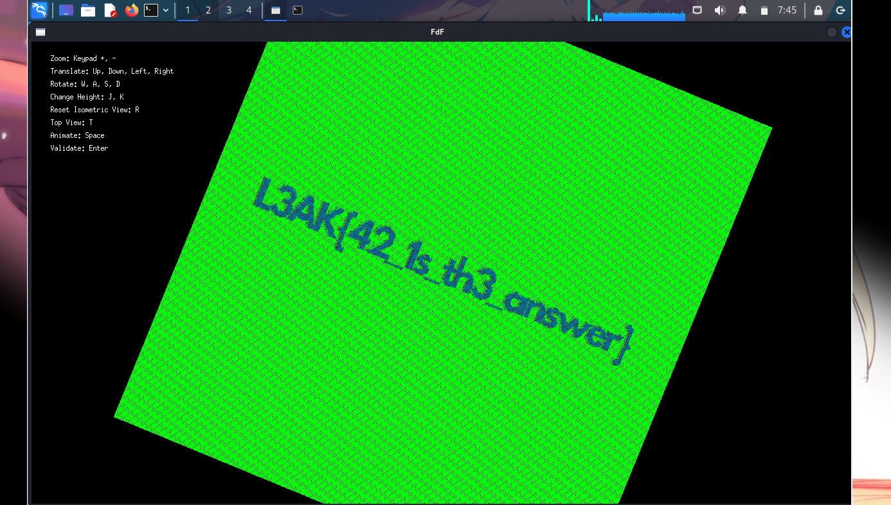

```
flag: L3AK{42_1s_th3_answer}
```

### CC

- Chall: [remake_CC](CC/CC), [flag.bin](CC/flag_root.bin)

- Bài này đơn giản mà mình nghĩ hơi nhiều nên đi sai hướng @@.

- Sơ bộ về Chall, ta được cấp 1 file thực thi `CC`, và `flag.bin`. Rõ ràng là `CC` sẽ mang chức năng `encrypt`.

- Về nội dung của encryptor, ta thấy chương trình thực hiện mã hóa 1 link youtube mà ai cũng biết là gì 🐧.

- Các bước thao tác cơ bản trong chương trình là: thêm byte, tách chuỗi, mã hóa khối, rồi xuất ra file `ciphertext.bin`.

- Chương trình kiểm tra xem input có độ dài là bội của `0xf` hay không. Nếu không, chương trình sẽ thêm byte `0x5` vào đuôi cho tới khi đủ.


- Tiếp đó là chương trình sẽ tách và mã hóa 16 byte một. Ở đây, chương trình tách tiếp thành 2 giá trị 8 byte và làm seed.


- Mô tả về hàm mã hóa, chương trình lặp 32 lần công đoạn mã hóa. Với mỗi lần lặp, một giá trị mới được sinh từ các phép xor với `round_key[]` và map lại bằng `sbox[]`. Dưới đây là chương trình mô tả lại quá trình hoạt động của hàm mình dựng lại.

```python
# # # Input = 'https://www.youtube.com/watch?v=dQw4w9WgXcQ'

def outPut(comp):
    arr = []
    while comp != 0:
        arr.append(comp & 0xff)
        comp = comp >> 8
    return arr


_sbox = [0xAA, 0x9B, 0x70, 0x39, 0x46, 0x27, 0xAC, 0xE5, 0x22, 0xF3,
         0x28, 0xD1, 0x3E, 0xFF, 0xE4, 0xFD, 0x9A, 0x4B, 0xE0, 0x69,
         0x36, 0xD7, 0x1C, 0x15, 0x12, 0xA3, 0x98, 0x01, 0x2E, 0xAF,
         0x54, 0x2D, 0x8A, 0xFB, 0x50, 0x99, 0x26, 0x87, 0x8C, 0x45,
         0x02, 0x53, 0x08, 0x31, 0x1E, 0x5F, 0xC4, 0x5D, 0x7A, 0xAB,
         0xC0, 0xC9, 0x16, 0x37, 0xFC, 0x75, 0xF2, 0x03, 0x78, 0x61,
         0x0E, 0x0F, 0x34, 0x8D, 0x6A, 0x5B, 0x30, 0xF9, 0x06, 0xE7,
         0x6C, 0xA5, 0xE2, 0xB3, 0xE8, 0x91, 0xFE, 0xBF, 0xA4, 0xBD,
         0x5A, 0x0B, 0xA0, 0x29, 0xF6, 0x97, 0xDC, 0xD5, 0xD2, 0x63,
         0x58, 0xC1, 0xEE, 0x6F, 0x14, 0xED, 0x4A, 0xBB, 0x10, 0x59,
         0xE6, 0x47, 0x4C, 0x05, 0xC2, 0x13, 0xC8, 0xF1, 0xDE, 0x1F,
         0x84, 0x1D, 0x3A, 0x6B, 0x80, 0x89, 0xD6, 0xF7, 0xBC, 0x35,
         0xB2, 0xC3, 0x38, 0x21, 0xCE, 0xCF, 0xF4, 0x4D, 0x2A, 0x1B,
         0xF0, 0xB9, 0xC6, 0xA7, 0x2C, 0x65, 0xA2, 0x73, 0xA8, 0x51,
         0xBE, 0x7F, 0x64, 0x7D, 0x1A, 0xCB, 0x60, 0xE9, 0xB6, 0x57,
         0x9C, 0x95, 0x92, 0x23, 0x18, 0x81, 0xAE, 0x2F, 0xD4, 0xAD,
         0x0A, 0x7B, 0xD0, 0x19, 0xA6, 0x07, 0x0C, 0xC5, 0x82, 0xD3,
         0x88, 0xB1, 0x9E, 0xDF, 0x44, 0xDD, 0xFA, 0x2B, 0x40, 0x49,
         0x96, 0xB7, 0x7C, 0xF5, 0x72, 0x83, 0xF8, 0xE1, 0x8E, 0x8F,
         0xB4, 0x0D, 0xEA, 0xDB, 0xB0, 0x79, 0x86, 0x67, 0xEC, 0x25,
         0x62, 0x33, 0x68, 0x11, 0x7E, 0x3F, 0x24, 0x3D, 0xDA, 0x8B,
         0x20, 0xA9, 0x76, 0x17, 0x5C, 0x55, 0x52, 0xE3, 0xD8, 0x41,
         0x6E, 0xEF, 0x94, 0x6D, 0xCA, 0x3B, 0x90, 0xD9, 0x66, 0xC7,
         0xCC, 0x85, 0x42, 0x93, 0x48, 0x71, 0x5E, 0x9F, 0x04, 0x9D,
         0xBA, 0xEB, 0x00, 0x09, 0x56, 0x77, 0x3C, 0xB5, 0x32, 0x43,
         0xB8, 0xA1, 0x4E, 0x4F, 0x74, 0xCD]
_round_keys = [0x0BAD6B3201, 0x0DEADBEEF00000000, 0x5D6B532CD00, 0x56DF778000000000, 0x175AD4CB3EBD858, 0x0DDE0000000000000, 0x0A9967D7B0BB071EF, 0x2EB5, 0x0B0BB071EF0ABCDEF, 0x2EB5A9967D7, 0x855E6F7800ABDAB5, 0x0D4CB3EBD85D838F7, 0x0AF6AD7532C513BF8, 0x60E3DE1579BDE002, 0x77F0C1C7BC813E94, 0x0C0055ED5AEA658A2, 0x94C0055ED5056BB7, 0x0A277F0C1C7BC813E, 0x0D13BF860E3758D70, 0x4A6002AF6A82B5DB, 0x9800ABDAA006BB1B, 0x4EFE1838DD635C12, 0x0C3071BAC6B299EEF, 0x157B5400D76369DF, 0x400D76369D57FD9E, 0x0BAC6B299EEF157B5, 0x0CF778ABDAAABA65E, 0x0B4EABFECF5D63594, 0x0D758D6533D75E719, 0x0AAAE997AD3AAFFB3, 0x55FF67AEB1076B95, 0x0EBCE33555D32F5A7,
               0x0F5A755FF67057CE8, 0x6B95EBCE33555D32, 0x997AD3AAFF184F51, 0x7435CAF5E719AAAE, 0x0A65EB4EABF6DDE3B, 0x5D0D72BD79C66AAB, 0x0CBD69D57ED100A84, 0x0A1AE57AF38CD5574, 0x69D57ED1000387F5, 0x0E57AF38CD5574CBD, 0x0F688001C3F04E638, 0x9C66AABA65EB4EAB, 0x70FC1398E2DA5745, 0x0E997AD3AAFDA2000, 0x0C5B4AE8BD384979A, 0x5FB44000E1F82731, 0x84979A5FB4EBCD0E, 0x0F82731C5B4AE8BD3, 0x0E6877C13984917B8, 0x45E9C24BCD2FDA75, 0x0EE117A7092588619, 0x9D79A1DF04E61245, 0x33AF343BE0370FA7, 0x0BDC22F4E124B10C3, 0x0DC22F4E1241AC1DC, 0x3AF343BE0370FA7B, 0x9A1DF01B8778130E, 0x17A70920D60EE1D7, 0x2483583B87F5A598, 0x0C06E1DE04C385E9C, 0x0C09870BD38E2CB5F, 0x770FEB4B3180DC3B]

enc_flag = "https://www.youtube.com/watch?v="

enc_flag_head = enc_flag[:16]
enc_flag_head_1 = enc_flag_head[:8]
enc_flag_head_2 = enc_flag_head[8:]

enc_flag_head_1 = enc_flag_head_1.encode().hex()
enc_flag_head_2 = enc_flag_head_2.encode().hex()

enc_flag_head_1 = int(enc_flag_head_1, 16)
enc_flag_head_2 = int(enc_flag_head_2, 16)

comp = [enc_flag_head_1, enc_flag_head_2]
# print(comp)
tmp = 0
cur = enc_flag_head_2
# print(cur)
for i in range(32):
    tmp1 = cur ^ _round_keys[i*2+1]
    tmp2 = 0
    cnt = 0
    print("tmp1: ", hex(tmp1))
    while (tmp1 != 0):
        _tmp = _sbox[tmp1 & 0xff]
        tmp1 >>= 8
        tmp2 += (_tmp << cnt)
        cnt += 8
    print("tmp2: ", hex(tmp2))
    print("cur: ", hex(cur))
    print("comp[i]: ", hex(cur))

    tmp2 ^= _round_keys[i*2]
    tmp2 ^= comp[i]
    print(hex(comp[i]))
    comp.append(tmp2)
    cur = tmp2
    print(i, ": ", hex(tmp2))
    print()
```

- Để kiểm chứng, sau khi mã hóa xong ta nhảy tới hàm push để kiểm tra giá trị truyền vào so với output nằm ở file `ciphertext.bin`.

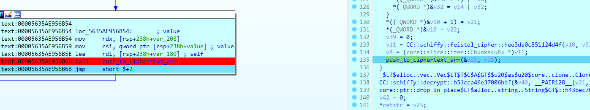

- Rõ ràng là đúng khi giá trị tại lần lặp cuối là tương đương.

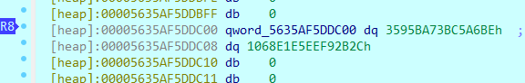
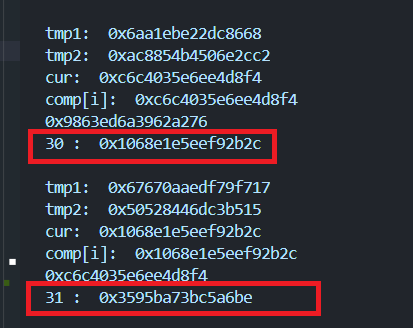

- Từ chương trình ta mô phỏng lại cách encrypt trên, ta hoàn toàn có thể xây dựng script giải mã.

- Tạm thời bỏ qua các bước tính toán trung gian, khi ta quan sát giá trị đầu ra của từng round sẽ thấy rằng kết quả của round trước sẽ lại được dùng để mã hóa cho round sau. Vậy với giá trị trong file `flag.bin`, tách ra phần đầu tương ứng với giá trị tại round 31, 30 tương ứng. Rev các vòng lại để lấy được giá trị của round 29, 28, 27...Điều này không khó nêu mọi người chịu ngồi đọc hiểu chúng vì đa phần toàn phép `xor` mà thôi.

- Dưới đây là script giải của mình.

```python
_sbox = [0xAA, 0x9B, 0x70, 0x39, 0x46, 0x27, 0xAC, 0xE5, 0x22, 0xF3,
         0x28, 0xD1, 0x3E, 0xFF, 0xE4, 0xFD, 0x9A, 0x4B, 0xE0, 0x69,
         0x36, 0xD7, 0x1C, 0x15, 0x12, 0xA3, 0x98, 0x01, 0x2E, 0xAF,
         0x54, 0x2D, 0x8A, 0xFB, 0x50, 0x99, 0x26, 0x87, 0x8C, 0x45,
         0x02, 0x53, 0x08, 0x31, 0x1E, 0x5F, 0xC4, 0x5D, 0x7A, 0xAB,
         0xC0, 0xC9, 0x16, 0x37, 0xFC, 0x75, 0xF2, 0x03, 0x78, 0x61,
         0x0E, 0x0F, 0x34, 0x8D, 0x6A, 0x5B, 0x30, 0xF9, 0x06, 0xE7,
         0x6C, 0xA5, 0xE2, 0xB3, 0xE8, 0x91, 0xFE, 0xBF, 0xA4, 0xBD,
         0x5A, 0x0B, 0xA0, 0x29, 0xF6, 0x97, 0xDC, 0xD5, 0xD2, 0x63,
         0x58, 0xC1, 0xEE, 0x6F, 0x14, 0xED, 0x4A, 0xBB, 0x10, 0x59,
         0xE6, 0x47, 0x4C, 0x05, 0xC2, 0x13, 0xC8, 0xF1, 0xDE, 0x1F,
         0x84, 0x1D, 0x3A, 0x6B, 0x80, 0x89, 0xD6, 0xF7, 0xBC, 0x35,
         0xB2, 0xC3, 0x38, 0x21, 0xCE, 0xCF, 0xF4, 0x4D, 0x2A, 0x1B,
         0xF0, 0xB9, 0xC6, 0xA7, 0x2C, 0x65, 0xA2, 0x73, 0xA8, 0x51,
         0xBE, 0x7F, 0x64, 0x7D, 0x1A, 0xCB, 0x60, 0xE9, 0xB6, 0x57,
         0x9C, 0x95, 0x92, 0x23, 0x18, 0x81, 0xAE, 0x2F, 0xD4, 0xAD,
         0x0A, 0x7B, 0xD0, 0x19, 0xA6, 0x07, 0x0C, 0xC5, 0x82, 0xD3,
         0x88, 0xB1, 0x9E, 0xDF, 0x44, 0xDD, 0xFA, 0x2B, 0x40, 0x49,
         0x96, 0xB7, 0x7C, 0xF5, 0x72, 0x83, 0xF8, 0xE1, 0x8E, 0x8F,
         0xB4, 0x0D, 0xEA, 0xDB, 0xB0, 0x79, 0x86, 0x67, 0xEC, 0x25,
         0x62, 0x33, 0x68, 0x11, 0x7E, 0x3F, 0x24, 0x3D, 0xDA, 0x8B,
         0x20, 0xA9, 0x76, 0x17, 0x5C, 0x55, 0x52, 0xE3, 0xD8, 0x41,
         0x6E, 0xEF, 0x94, 0x6D, 0xCA, 0x3B, 0x90, 0xD9, 0x66, 0xC7,
         0xCC, 0x85, 0x42, 0x93, 0x48, 0x71, 0x5E, 0x9F, 0x04, 0x9D,
         0xBA, 0xEB, 0x00, 0x09, 0x56, 0x77, 0x3C, 0xB5, 0x32, 0x43,
         0xB8, 0xA1, 0x4E, 0x4F, 0x74, 0xCD]
_round_keys = [0x0BAD6B3201, 0x0DEADBEEF00000000, 0x5D6B532CD00, 0x56DF778000000000, 0x175AD4CB3EBD858, 0x0DDE0000000000000, 0x0A9967D7B0BB071EF, 0x2EB5, 0x0B0BB071EF0ABCDEF, 0x2EB5A9967D7, 0x855E6F7800ABDAB5, 0x0D4CB3EBD85D838F7, 0x0AF6AD7532C513BF8, 0x60E3DE1579BDE002, 0x77F0C1C7BC813E94, 0x0C0055ED5AEA658A2, 0x94C0055ED5056BB7, 0x0A277F0C1C7BC813E, 0x0D13BF860E3758D70, 0x4A6002AF6A82B5DB, 0x9800ABDAA006BB1B, 0x4EFE1838DD635C12, 0x0C3071BAC6B299EEF, 0x157B5400D76369DF, 0x400D76369D57FD9E, 0x0BAC6B299EEF157B5, 0x0CF778ABDAAABA65E, 0x0B4EABFECF5D63594, 0x0D758D6533D75E719, 0x0AAAE997AD3AAFFB3, 0x55FF67AEB1076B95, 0x0EBCE33555D32F5A7,
               0x0F5A755FF67057CE8, 0x6B95EBCE33555D32, 0x997AD3AAFF184F51, 0x7435CAF5E719AAAE, 0x0A65EB4EABF6DDE3B, 0x5D0D72BD79C66AAB, 0x0CBD69D57ED100A84, 0x0A1AE57AF38CD5574, 0x69D57ED1000387F5, 0x0E57AF38CD5574CBD, 0x0F688001C3F04E638, 0x9C66AABA65EB4EAB, 0x70FC1398E2DA5745, 0x0E997AD3AAFDA2000, 0x0C5B4AE8BD384979A, 0x5FB44000E1F82731, 0x84979A5FB4EBCD0E, 0x0F82731C5B4AE8BD3, 0x0E6877C13984917B8, 0x45E9C24BCD2FDA75, 0x0EE117A7092588619, 0x9D79A1DF04E61245, 0x33AF343BE0370FA7, 0x0BDC22F4E124B10C3, 0x0DC22F4E1241AC1DC, 0x3AF343BE0370FA7B, 0x9A1DF01B8778130E, 0x17A70920D60EE1D7, 0x2483583B87F5A598, 0x0C06E1DE04C385E9C, 0x0C09870BD38E2CB5F, 0x770FEB4B3180DC3B]

__enc = [0xfcb1c794d07e590d, 0xbf163efcab46fdf2,
         0xe5a0fcfa17673ce7, 0x149dafbd7289845]

# __enc = [0x1068E1E5EEF92B2C, 0x3595BA73BC5A6BE,
#          0x0C5D83B1ECF84D295, 0x6E3FD231D3F8ACB6]
ans = 0

for k in range(2):
    cnt = 0
    comp = [__enc[k*2+1], __enc[k*2]]
    for i in range(31, -1, -1):
        tmp1 = comp[cnt+1] ^ _round_keys[i*2+1]
        tmp2 = 0
        cnt1 = 0
        while (tmp1 != 0):
            _tmp = _sbox[tmp1 & 0xff]
            tmp1 >>= 8
            tmp2 += (_tmp << cnt1)
            cnt1 += 8
        cur = comp[cnt] ^ _round_keys[i*2] ^ tmp2
        print(hex(cur))
        comp.append(cur)
        print()
        cnt += 1
    ans <<= 64
    ans += comp[-1]
    ans <<= 64
    ans += comp[-2]

print("hex flag: ",hex(ans))
```

```
flag: L3AK{its_all_sta0ted_wit`_C}
```

### CC_Revenge

- Chall: [CC_revenge](CC_Revenge/CC_revenge), [flag.bin](CC_Revenge/flag.bin)

- Khi giải được bài trên rồi thì chall này chẳng còn gì đáng nói, điểm khác biệt duy nhất là chall này xor thêm 2 const `0xDEADBEEF00000000` trong phần mã hóa, và đảo 2 hàm get data của `round_keys[]` cho nhau.

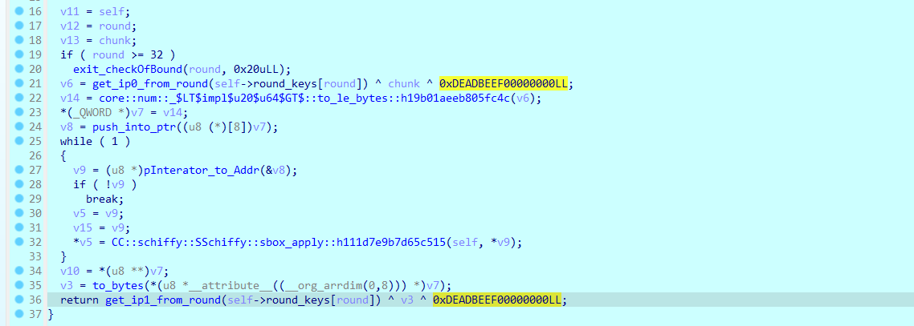

- Việc ta cần làm chỉ là nhặt lại sbox, round_keys, sửa một vài chỗ bị thay đổi và để decrypt script làm việc của nó^^.

```python
_sbox = [0xFF, 0xE4, 0xFD, 0x9A, 0x4B, 0xE0, 0x69, 0x36, 0xD7, 0x1C,
         0x15, 0x12, 0xA3, 0x98, 0x01, 0x2E, 0xAF, 0x54, 0x2D, 0x8A,
         0xFB, 0x50, 0x99, 0x26, 0x87, 0x8C, 0x45, 0x02, 0x53, 0x08,
         0x31, 0x1E, 0x5F, 0xC4, 0x5D, 0x7A, 0xAB, 0xC0, 0xC9, 0x16,
         0x37, 0xFC, 0x75, 0xF2, 0x03, 0x78, 0x61, 0x0E, 0x0F, 0x34,
         0x8D, 0x6A, 0x5B, 0x30, 0xF9, 0x06, 0xE7, 0x6C, 0xA5, 0xE2,
         0xB3, 0xE8, 0x91, 0xFE, 0xBF, 0xA4, 0xBD, 0x5A, 0x0B, 0xA0,
         0x29, 0xF6, 0x97, 0xDC, 0xD5, 0xD2, 0x63, 0x58, 0xC1, 0xEE,
         0x6F, 0x14, 0xED, 0x4A, 0xBB, 0x10, 0x59, 0xE6, 0x47, 0x4C,
         0x05, 0xC2, 0x13, 0xC8, 0xF1, 0xDE, 0x1F, 0x84, 0x1D, 0x3A,
         0x6B, 0x80, 0x89, 0xD6, 0xF7, 0xBC, 0x35, 0xB2, 0xC3, 0x38,
         0x21, 0xCE, 0xCF, 0xF4, 0x4D, 0x2A, 0x1B, 0xF0, 0xB9, 0xC6,
         0xA7, 0x2C, 0x65, 0xA2, 0x73, 0xA8, 0x51, 0xBE, 0x7F, 0x64,
         0x7D, 0x1A, 0xCB, 0x60, 0xE9, 0xB6, 0x57, 0x9C, 0x95, 0x92,
         0x23, 0x18, 0x81, 0xAE, 0x2F, 0xD4, 0xAD, 0x0A, 0x7B, 0xD0,
         0x19, 0xA6, 0x07, 0x0C, 0xC5, 0x82, 0xD3, 0x88, 0xB1, 0x9E,
         0xDF, 0x44, 0xDD, 0xFA, 0x2B, 0x40, 0x49, 0x96, 0xB7, 0x7C,
         0xF5, 0x72, 0x83, 0xF8, 0xE1, 0x8E, 0x8F, 0xB4, 0x0D, 0xEA,
         0xDB, 0xB0, 0x79, 0x86, 0x67, 0xEC, 0x25, 0x62, 0x33, 0x68,
         0x11, 0x7E, 0x3F, 0x24, 0x3D, 0xDA, 0x8B, 0x20, 0xA9, 0x76,
         0x17, 0x5C, 0x55, 0x52, 0xE3, 0xD8, 0x41, 0x6E, 0xEF, 0x94,
         0x6D, 0xCA, 0x3B, 0x90, 0xD9, 0x66, 0xC7, 0xCC, 0x85, 0x42,
         0x93, 0x48, 0x71, 0x5E, 0x9F, 0x04, 0x9D, 0xBA, 0xEB, 0x00,
         0x09, 0x56, 0x77, 0x3C, 0xB5, 0x32, 0x43, 0xB8, 0xA1, 0x4E,
         0x4F, 0x74, 0xCD, 0xAA, 0x9B, 0x70, 0x39, 0x46, 0x27, 0xAC,
         0xE5, 0x22, 0xF3, 0x28, 0xD1, 0x3E]
_round_keys = [0x0BAD1E1101, 0x0DEADBEEF00000000, 0x5D68FD66E00, 0x56DF778000000000, 0x175A3F59B5EFB58, 0x0DDE0000000000000, 0x7EB36BDF6BC552EF, 0x2EB4, 0x0F6BC552EF0DEEEEF, 0x2EB47EB36BD, 0x86F7777800DEF9B5, 0x3F59B5EFB5E2A977, 0x7BE6D4FD66095038, 0x8AA5DE1BDDDDE003, 0x0A071154BBCE95554, 0x0C006F7CDA9FACC12, 0x54C006F7CD771423, 0x12A071154BBCE955, 0x8950388AA5009A45, 0x0AA60037BE6BB8A11, 0x9800DEF9AE3C6A8D, 0x540E22A94026916A, 0x0C4552804D2F3BDEF, 0x1BDF35C78D51AA81, 0x5C78D51AA8C2ABBD, 0x804D2F3BDEF1BDF3, 0x0DEF78DEF9A3D2847, 0x0D546155DEC026979, 0x0B009A5E77B00D951, 0x68F4A11F55185577, 0x30AAEF6013952019, 0x1B2A2D1E9423EAA,
               0x3EAA30AAEFBEFD7A, 0x201901B2A2D1E942, 0x0A11F551855A93191, 0x0BD100C80D95168F4, 0x2847D54615B4A28B, 0x6F44032036545A3D, 0x8FAA8C2B64ABF82, 0x0E8806406CA8B47A5, 0x0AA8C2B64AB26C067, 0x6406CA8B47A508F, 0x5B25593603E6DCEC, 0x6545A3D2847D5461, 0x0D80F9B73B14BF860, 0x4A11F551856C9564, 0x6297F0C094FD044C, 0x0AD92AC9B01F36E7, 0x0FD044C0AD9F4275F, 0x1F36E76297F0C094, 0x13AF8F9B736FA517, 0x604A7E8226056CFA, 0x45D8129FA0576FB4, 0x3E84EBE3E6DCDBE9, 0x87D09D7C7C057592, 0x28BB0253F40AEDF6, 0x8BB0253F40703187, 0x7D09D7C7C0575922, 0x4EBE3E02BA17FAB2, 0x8129FA03818C3BE8, 0x0E80E0630EF7FD417, 0x0F80AE85FEACA04A7, 0x0BFD594094F0EF2E3, 0x61DEFFA82FF015D0]
enc = []
with open('E:\\CTF\\KCSC\\CTFs\\CTF_L3ak\\CC_Revenge\\flag.bin', 'rb') as file:
    data = file.read()
for i in range(len(data)):
    enc.append(data[i])

# print(len(enc))
# __enc = [0x97e2fe9add63c9cb, 0x851ec85a2de0711b,
#          0x1ef59aee4ce65035, 0xd1bbfe36199378f6]
__enc = []
__tmp = 0
for i in range(len(enc)):
    if i % 8 == 0 and i != 0:
        __enc.append(__tmp)
        __tmp = 0
    __tmp <<= 8
    __tmp += enc[i]
    if i == 31:
        __enc.append(__tmp)
for i in __enc:
    print(hex(i))
# print(__enc)

ans = 0

for k in range(2):
    cnt = 0
    comp = [__enc[k*2+1], __enc[k*2]]
    for i in range(31, -1, -1):
        tmp1 = comp[cnt+1] ^ _round_keys[i*2] ^ 0xDEADBEEF00000000
        tmp2 = 0
        cnt1 = 0
        while (tmp1 != 0):
            _tmp = _sbox[tmp1 & 0xff]
            tmp1 >>= 8
            tmp2 += (_tmp << cnt1)
            cnt1 += 8
        cur = comp[cnt] ^ _round_keys[i*2+1] ^ tmp2 ^ 0xDEADBEEF00000000
        print(hex(cur))
        comp.append(cur)
        print()
        cnt += 1
    ans <<= 64
    ans += comp[-1]
    ans <<= 64
    ans += comp[-2]

print("hex flag: ",hex(ans))
```

```
flag: L3AK{R3venge_0f_Th3_Sch1ffy}
```

## Mong WRITEUP này giúp ích cho các bạn!

```py
from KMA
Author: 13r_ə_Rɪst
```
