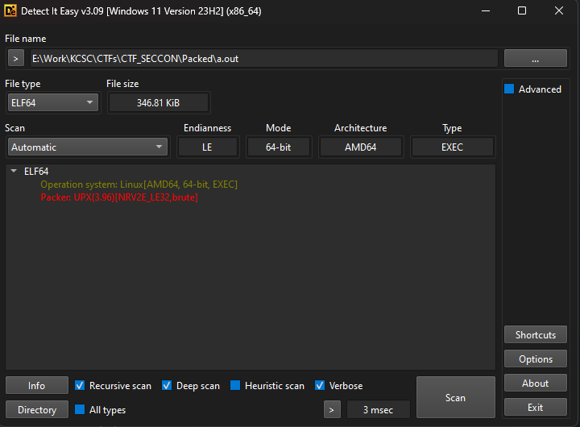
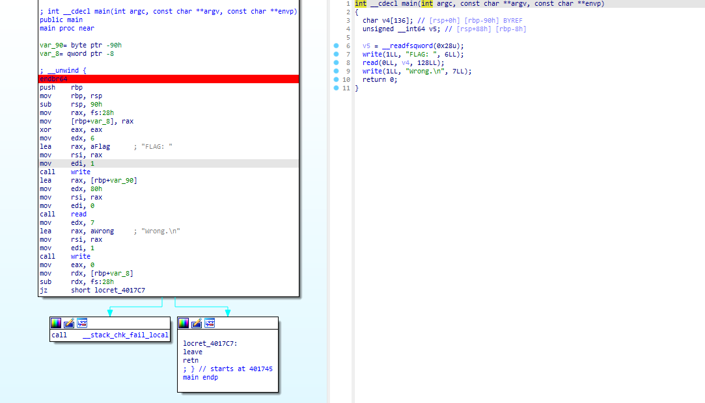
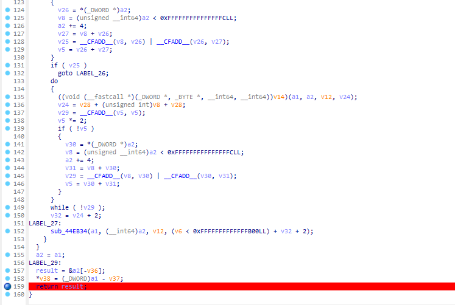
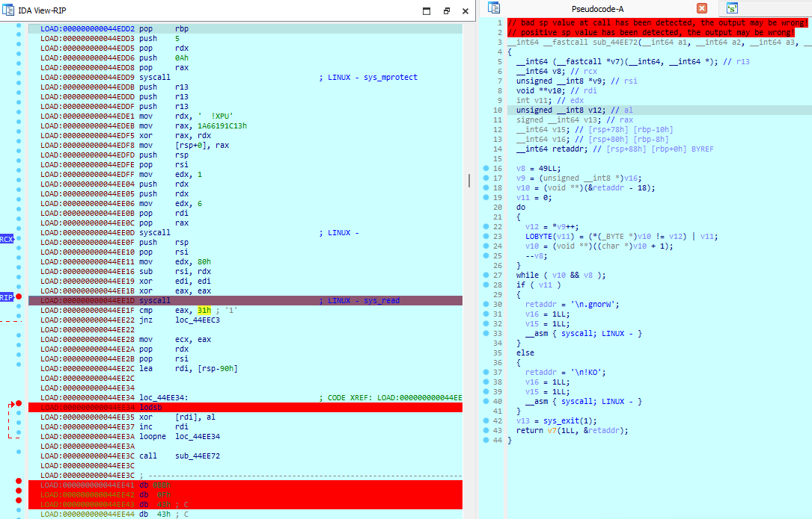
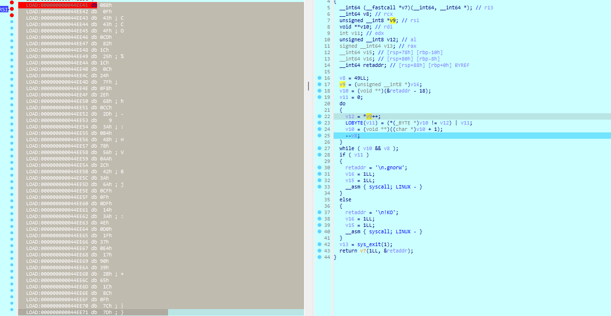
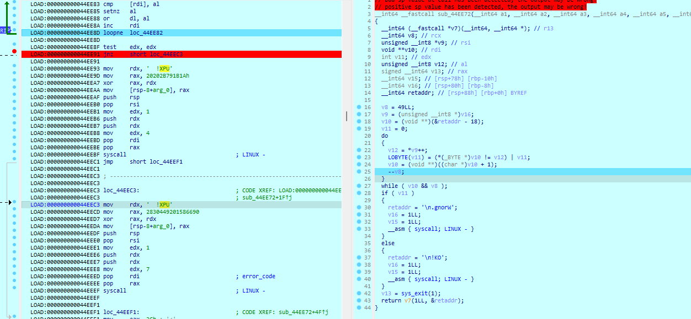

## CTFs/SECCON13 Quals

wu này không có bài khó, tuy nhiên dạo này lười viết wu rồi thấy có bài này idea lạ nên thôi viết để duy trì thói quen vậy :v

### Packed

Từ cái tên đề bài khiến mình quăng vào DiE như một thói quen, và tất nhiên là bị pack rồi.



UPX là một packer khá phổ biến, dễ dàng tìm [tool](https://github.com/upx/upx/releases/tag/v4.2.4) để unpack cho ai chưa có sẵn.

Phân tích chương trình sau khi unpack, ta thấy vấn đề ở đây rồi :v.



Không thấy phần check ở luồng chính, ban đầu mình nghĩ khả năng là có antidebug ở đây, nhưng sau khi kiểm tra ở init hay các dấu hiệu đa luồng đều không thấy gì.

Từ đây mình chuyển hướng qua file bị pack `a.out`. Vì file unpack có khả năng thiếu sót gì đấy nên khả năng ta phải manual unpack.

Đơn giản là ta cắm 1 bp sau phần unpack của chương trình. tại hàm được call ngay trong `start`.



Ở đây ta thấy một cái checker đơn giản `sub_44EE72` mà không có trong file unpacked. Vậy ở phía trên rõ ràng là đoạn biến đổi.



Đơn giản thì là kiểm tra độ dài flag bằng `0x31-1(flag_len - "\n")` rồi xor. Giá trị đem ra xor với input lấy từ ptr ở thanh ghi `rsi` trỏ đến, chuyển vào `al` thông qua lệnh `lodsb`.

Nhặt ra đem xor với target = `v9`.



```python
target = [0xBB, 0x0F, 0x43, 0x43, 0x4F, 0xCD, 0x82, 0x1C, 0x25, 0x1C,
     0x0C, 0x24, 0x7F, 0xF8, 0x2E, 0x68, 0xCC, 0x2D, 0x09, 0x3A,
     0xB4, 0x48, 0x78, 0x56, 0xAA, 0x2C, 0x42, 0x3A, 0x6A, 0xCF,
     0x0F, 0xDF, 0x14, 0x3A, 0x4E, 0xD0, 0x1F, 0x37, 0xE4, 0x17,
     0x90, 0x39, 0x2B, 0x65, 0x1C, 0x8C, 0x0F, 0x7C, 0x7D]
c = [0xE8, 0x4A, 0x00, 0x00, 0x00, 0x83, 0xF9, 0x49, 0x75, 0x44,
     0x53, 0x57, 0x48, 0x8D, 0x4C, 0x37, 0xFD, 0x5E, 0x56, 0x5B,
     0xEB, 0x2F, 0x48, 0x39, 0xCE, 0x73, 0x32, 0x56, 0x5E, 0xAC,
     0x3C, 0x80, 0x72, 0x0A, 0x3C, 0x8F, 0x77, 0x06, 0x80, 0x7E,
     0xFE, 0x0F, 0x74, 0x06, 0x2C, 0xE8, 0x3C, 0x01, 0x77, 0xE4,
     0x48, 0x39, 0xCE, 0x73, 0x16, 0x56, 0xAD, 0x28, 0xD0, 0x75,
     0xDF, 0x5F, 0x0F, 0xC8, 0x29, 0xF8, 0x01, 0xD8, 0xAB, 0x48,
     0x39, 0xCE, 0x73, 0x03, 0xAC, 0xEB, 0xDF, 0x5B, 0xC3, 0x58,
     0x41, 0x56, 0x41, 0x57, 0x50, 0x48, 0x89, 0xE6, 0x48, 0x81,
     0xEC, 0x00, 0x10]
for i in range(len(a)):
    print(chr(target[i] ^ c[i]), end="")
```

```ru
flag: SECCON{UPX_s7ub_1s_a_g0od_pl4c3_f0r_h1din6_c0d3}
```

### Cách mà Unpacker phá vỡ cấu trúc chương trình?

Chall này đơn giản vậy thôi, nhưng vì sao lại có sự khác biệt lớn ở chương trình sau khi unpack nhỉ?

Là do `UPX stub` "UPX!", unpacker gặp khúc này sẽ tự bỏ qua.



### JUMP

Bài này không có gì đặc biệt, chương trình ngắn, hoàn toàn có thể debug tĩnh và guessing khi biết flag header.

```python
flag = [0x357b4e4f, 0x336b3468, 0x357b4e4f, 0x355f7075]
# print(hex(0xCAFEBABE ^ 0xF9958ED6))
# print(hex(0xC0FFEE ^ 0x5FB4CEB1))
# print(hex(0xDEADBEEF ^ 0xEBD6F0A0))
# print(0x9D9D6295-flag)
# print(0x94D3A1D4-flag) done
# print(0x47CB363B+flag)
# print(0x43434553)
# print(0x9D949DDD-flag)
x = [0x9D9D6295, -0x47CB363B]
# for i in x:
#     print(hex(i-0x357b4e4f))
# print(hex(0x47CB363B+0x357b4e4f))
# 0x336b3468
# 0x5f74315f
# cur = 0x355f7075
# for i in x:
#     for j in flag:
#         print(f'{hex(j)} - {hex(i)} = {hex(j-i)}')
# 0x94d3a1d4 - 0x336b3468 = 0x61686d6c
# 0x94d3a1d4 - 0x5f74315f = 0x355f7075
# _1t_up_5
# lmha
# h4k3
# print(0x47CB363B+cur)
# print(hex(0x47CB363B+0x68352d68))
# print(hex(0x9D949DDD-cur))
cur = 0x3568352d
for i in x:
    print(hex(i-cur))
# 5h5-
# -5h5
# }3kh
# SECCON{5h4k3_1t_up_5h-5h-5h5hk3}
```

```ru
flag: SECCON{5h4k3_1t_up_5h-5h-5h5hk3}
```

## Mong WRITEUP này giúp ích cho các bạn!

```
from KCSC
Author: sonvh
```
