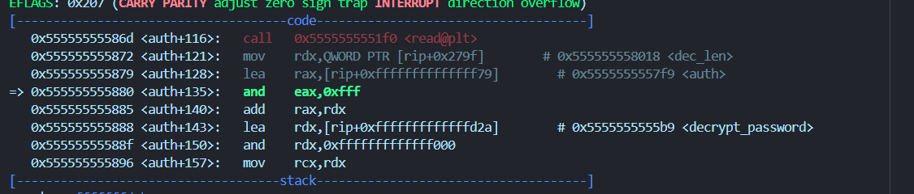

## CTFs/TamuCTF

### Reveille_Petter

- Tùy thuộc vào cách tiếp cận khác nhau, độ khó của chall này có thể thay đổi một chút^^.

- Test qua sơ bộ chương trình, một giao diện khá thú vị, yêu cầu rằng ta phải click vào con pet `405204` lần để lấy flag, tuy nhiên sau 10 lần bấm thì ta được yêu cầu restart.


- Sau khi quăng vào `IDA` và đặt breakpoint lòng vòng nhưng không thu được gì, mình quyết định chọn một hướng đi khác.

- Bởi đây là một chương trình có giao diện cụ thể, và mục tiêu là một target thông số rõ ràng, nên mình nghĩ tới một tool khá hữu ích trong việc thay đổi thông số `Cheat Engine`.


- Về cách sử dụng tool này thì các bạn có thể tham khảo tại [đây](https://www.youtube.com/watch?v=ku6AtIY-Lu0). Khá dễ sử dụng thôi.

```
flag: gigem{r3v_1s_cut3!!}
```

### Resistant

- Chall này mình sẽ sử dụng đồng thời `GDB` và `IDA` để phân tích.

- Sơ bộ về chương trình, một khối lệnh khá cơ bản trong `main()`, Chương trình thực hiện `check_debug()` rồi sửa nội dung dải dữ liệu `auth` và thực thi nó.

```cpp
int __cdecl main(int argc, const char **argv, const char **envp)
{
  setvbuf(stdin, 0LL, 2, 0LL);
  setvbuf(stdout, 0LL, 2, 0LL);
  setvbuf(stderr, 0LL, 2, 0LL);
  prctl(4, 0LL);
  if ( (unsigned __int8)check_debug() != 1 )
  {
    mprotect((void *)((unsigned __int64)&auth & 0xFFFFFFFFFFFFF000LL), auth_len + ((unsigned __int64)&auth & 0xFFF), 7);
    decrypt_func(&auth, (unsigned int)auth_len);
    mprotect((void *)((unsigned __int64)&auth & 0xFFFFFFFFFFFFF000LL), auth_len + ((unsigned __int64)&auth & 0xFFF), 5);
    ((void (*)(void))auth)();
    ptrace(PTRACE_KILL, 0LL, 0LL, 0LL);
  }
  return 0;
}
```

- Sử dụng `gdb` để phân tích động. Đầu tiên ta sẽ bypass qua khâu `check_bug()`. Đặt giá trị `$rax` về 0.


- Sau đó chương trình thay đổi quyền truy cập của vùng dữ liệu mà `auth` trỏ tới, chúng được xor để tạo thành 1 hàm hoàn chỉnh để thực thi sau đó. Đoạn này hoàn toàn là const nên ta có thể skip tới đoạn gọi hàm xủ lý chương trình sau khi được decrypt.


- Hàm `auth` yêu cầu ta nhập input và `decrypt` nó.



- Sau một đoạn decrypt, mình thấy có câu lệnh kiểm tra, quan sát giá trị trong 2 thanh ghi `rsi` và `rdi` lần lượt là input của mình và 1 chuỗi có nghĩa, có vẻ đây là password rồi^^.


- Conect tới sever và lấy flag thôi.


```
flag: gigem{a_b4ttl3_4_th3_hist0ry_b00ks}
```

## Mong WRITEUP này giúp ích cho các bạn!

```
from KMA
Author: 13r_ə_Rɪst
```
