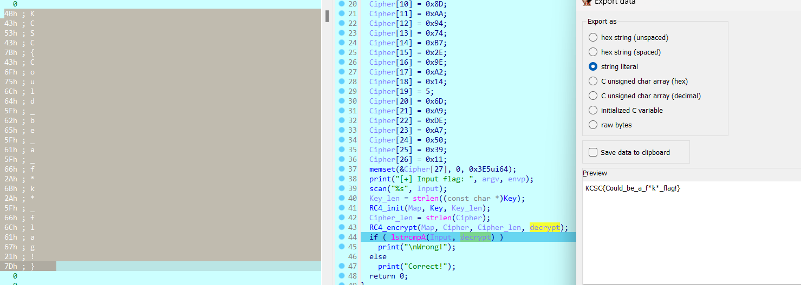
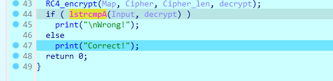
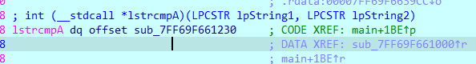
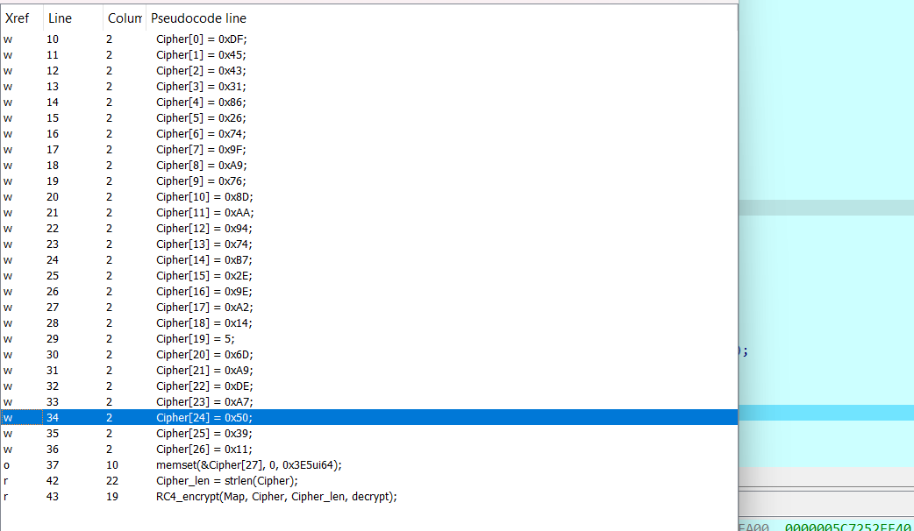
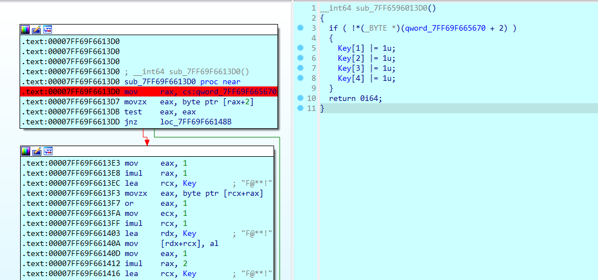
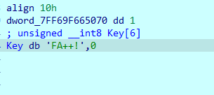
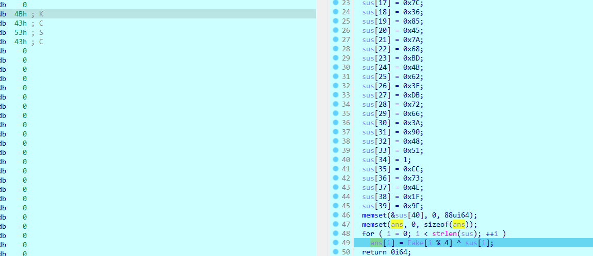
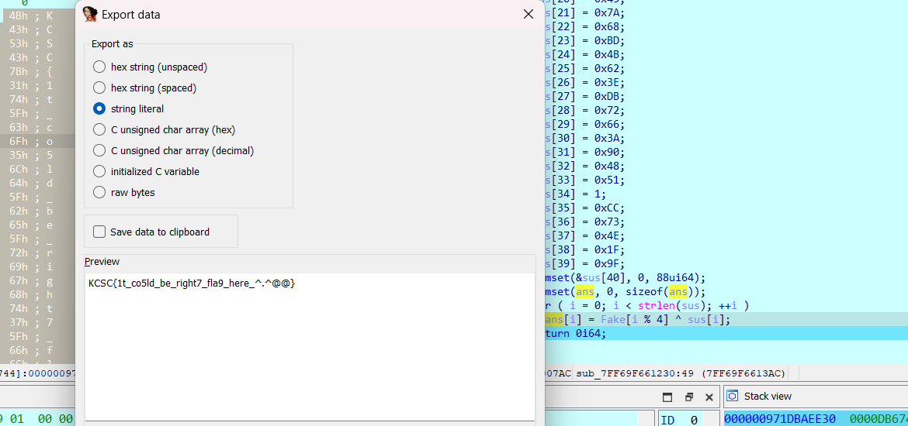

## CTFs/KCSCctf_2024

### rev_f@k3

- Vẫn là hàm mã hóa RC4 quen thuộc nhưng cách các thông tin được giấu đi hợp lý khiến chall trở nên thú vị^^.

- Nội dung hàm `main()` khá đơn giản, chương trình thực hiện decrypt `Cipher` được khởi tạo sẵn bằng `RC4` với `key` là `"F@**!"`. Sau đó kiểm tra `Input` với `decrypt data`.

  

- Nhưng khi chạy tới đoạn kiểm tra thì kết quả trả ra lại là một fake flag.

  

- Đoạn này mình có nghĩ tới việc ~~tấn công vũ phu~~vét cạn `key` nhưng nhanh chóng gạt bỏ bởi chương trình không nhắc tới độ dài cố định của key.

- Khi tiếp tục debug để tìm kiếm thêm thông tin, mình thấy hàm `lstrcmpA()` khá đáng nghi vì luôn trả về `false` và in ra `"Correct"`.

  

- Trace tới thì thấy ra là nó không phải hàm `strcmp` bình thường mà là một hàm xử lí được `#define` lại với cái tên na ná thế thôi :v.

  

- Nội dung thực sự của hàm "strcmp fake" như sau.

```C
__int64 __fastcall sub_7FF69F661230(__int64 input, _BYTE *Fake)
{
  int i; // [rsp+20h] [rbp-128h]
  char sus[128]; // [rsp+30h] [rbp-118h] BYREF
  char ans[128]; // [rsp+B0h] [rbp-98h] BYREF

  qmemcpy(sus, "fM", 2);
  sus[2] = 0xC;
  sus[3] = 0xA1;
  sus[4] = 0x56;
  sus[5] = 0x3F;
  sus[6] = 0x2B;
  sus[7] = 0xBD;
  sus[8] = 0x4E;
  sus[9] = 0x61;
  sus[10] = 0x6A;
  sus[11] = 0x8E;
  sus[12] = 0x49;
  sus[13] = 0x51;
  sus[14] = 0x3D;
  sus[15] = 0x87;
  sus[16] = 0x72;
  sus[17] = 0x7C;
  sus[18] = 0x36;
  sus[19] = 0x85;
  sus[20] = 0x45;
  sus[21] = 0x7A;
  sus[22] = 0x68;
  sus[23] = 0xBD;
  sus[24] = 0x4B;
  sus[25] = 0x62;
  sus[26] = 0x3E;
  sus[27] = 0xDB;
  sus[28] = 0x72;
  sus[29] = 0x66;
  sus[30] = 0x3A;
  sus[31] = 0x90;
  sus[32] = 0x48;
  sus[33] = 0x51;
  sus[34] = 1;
  sus[35] = 0xCC;
  sus[36] = 0x73;
  sus[37] = 0x4E;
  sus[38] = 0x1F;
  sus[39] = 0x9F;
  memset(&sus[40], 0, 88ui64);
  memset(ans, 0, sizeof(ans));
  for ( i = 0; i < strlen(sus); ++i )
    ans[i] = Fake[i % 4] ^ sus[i];
  return 0i64;
}
```

- Tới đây mình xem xét hàm này dựa trên tham số đầu vào thì thấy 2 điều. Hàm này hoàn toàn không phụ thuộc vào `input`. Đồng thời chỉ sử dụng 4 kí tự đầu của `decrypted data`.

- Ở đây bắt đầu thấy ngờ ngợ, bởi 4 kí tự đầu của `decrypted data` là một phần của format flag: `"KCSC"`. Mà nếu flag thực sự được sinh ra ở đây thì một trong 2 `sus[]` hoặc `Fake[]` phải sai hoặc bị chèn ở đâu đó. Bởi phép `xor` chỉ trả về 4 kí tự đầu là `"KCSC"` khi 4 kí tự đầu của `sus[]` bằng 0 hoặc 4 kí tự đầu của `Fake[]` phải khác `"KCSC"` thì mới có cơ hội cho ra kết quả.

- Mình thoáng nghĩ tới việc decrypt `RC4` hàm `sus[]` bằng key ngoài `main()` nhưng cũng chỉ ra byte rác.

- Từ đây mình trace cả 2 thằng và `sus[]` không có gì khả nghi khi trong hàm này cũng không thấy gọi ra gì thêm, cũng không có sự xuất hiện của đa luồng. Ngược lại, `Fake[]` ~ `decrypted data` lại khả nghi hơn khi nó được giải mã từ `Cipher[]` và `key` trong `main()` như mình đã phân tích trước đó.

- Thực hiện trace `Cipher[]` và `key`, Cipher thì hoàn toàn xác định được, kiểm tra cả trong mã máy lẫn mã giả đều hoàn toàn khớp.

  

- Về phần `key`. Thì ra đây là mấu chốt giải quyết `chall` này. `key` được gọi ra khá nhiều lần ở 1 hàm ngoài `main()` dự đoán rằng có thể `key` được biến đổi tại đây.

  

- Rõ ràng là vậy. Khi mình đặt breakpoint tại đây và debug lại chương trình, hàm này được gọi ra trước `main()` và câu lệnh kiểm tra ở đây luôn trả về `false`.

  

- SetIP để nhảy vào, sau 4 phép `or` thì `key` được biến đổi thành một chuỗi có nghĩa, điều này chứng tỏ mình đang đi đúng hướng^^.

  

- Quay lại decrypt rồi nhảy vào hàm `strcmp fake` để quan sát output là gì.

- Sau 4 phép `xor` đầu tiên thấy được cụm `KCSC` như ánh sáng cuối con đường vậy@@.



- Giờ thì gặt flag thôi ⸜(｡˃ ᵕ ˂ )⸝♡.



```
flag: KCSC{1t_co5ld_be_right7_fla9_here_^.^@@}
```

## Mong WRITEUP này giúp ích cho các bạn!

```
from KMA
Author: 13r_ə_Rɪst
```
