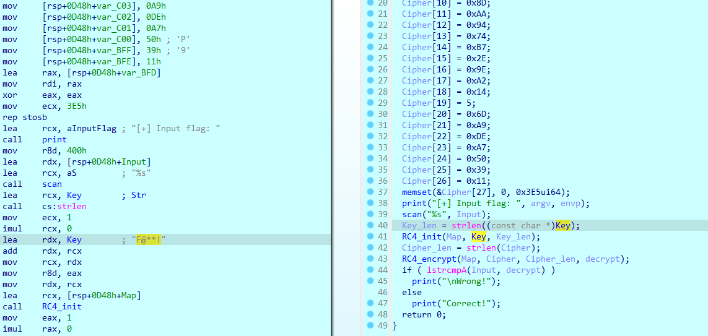
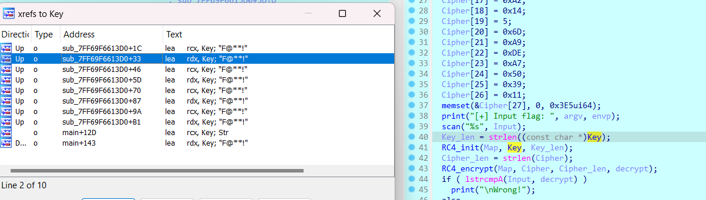

## CTFs/KCSCctf_2024

### rev_f@k3

- Chall: [f@k3](Fake/re_fk3.exe)

- Vẫn là hàm mã hóa RC4 quen thuộc nhưng cách các thông tin được giấu đi hợp lý khiến chall trở nên thú vị^^.

- Nội dung hàm `main()` khá đơn giản, chương trình thực hiện decrypt `Cipher` được khởi tạo sẵn bằng `RC4` với `key` là `"F@**!"`. Sau đó kiểm tra `Input` với `decrypt data`.

  

- Nhưng khi chạy tới đoạn kiểm tra thì kết quả trả ra lại là một fake flag.

  

- Đoạn này mình có nghĩ tới việc ~~tấn công vũ phu~~vét cạn `key` nhưng nhanh chóng gạt bỏ bởi chương trình không nhắc tới độ dài cố định của key.

- Khi tiếp tục debug để tìm kiếm thêm thông tin, mình thấy hàm `lstrcmpA()` khá đáng nghi vì luôn trả về `false` và in ra `"Correct"`.

  

- Trace tới thì thấy ra là nó không phải hàm `strcmp` bình thường mà là một hàm xử lí được `#define` lại với cái tên na ná thế thôi :v.

  

- Nội dung thực sự của hàm "strcmp fake" như sau.

```C
__int64 __fastcall sub_7FF69F661230(__int64 input, _BYTE *Fake)
{
  int i; // [rsp+20h] [rbp-128h]
  char sus[128]; // [rsp+30h] [rbp-118h] BYREF
  char ans[128]; // [rsp+B0h] [rbp-98h] BYREF

  qmemcpy(sus, "fM", 2);
  sus[2] = 0xC;
  sus[3] = 0xA1;
  sus[4] = 0x56;
  sus[5] = 0x3F;
  sus[6] = 0x2B;
  sus[7] = 0xBD;
  sus[8] = 0x4E;
  sus[9] = 0x61;
  sus[10] = 0x6A;
  sus[11] = 0x8E;
  sus[12] = 0x49;
  sus[13] = 0x51;
  sus[14] = 0x3D;
  sus[15] = 0x87;
  sus[16] = 0x72;
  sus[17] = 0x7C;
  sus[18] = 0x36;
  sus[19] = 0x85;
  sus[20] = 0x45;
  sus[21] = 0x7A;
  sus[22] = 0x68;
  sus[23] = 0xBD;
  sus[24] = 0x4B;
  sus[25] = 0x62;
  sus[26] = 0x3E;
  sus[27] = 0xDB;
  sus[28] = 0x72;
  sus[29] = 0x66;
  sus[30] = 0x3A;
  sus[31] = 0x90;
  sus[32] = 0x48;
  sus[33] = 0x51;
  sus[34] = 1;
  sus[35] = 0xCC;
  sus[36] = 0x73;
  sus[37] = 0x4E;
  sus[38] = 0x1F;
  sus[39] = 0x9F;
  memset(&sus[40], 0, 88ui64);
  memset(ans, 0, sizeof(ans));
  for ( i = 0; i < strlen(sus); ++i )
    ans[i] = Fake[i % 4] ^ sus[i];
  return 0i64;
}
```

- Tới đây mình xem xét hàm này dựa trên tham số đầu vào thì thấy 2 điều. Hàm này hoàn toàn không phụ thuộc vào `input`. Đồng thời chỉ sử dụng 4 kí tự đầu của `decrypted data`.

- Ở đây bắt đầu thấy ngờ ngợ, bởi 4 kí tự đầu của `decrypted data` là một phần của format flag: `"KCSC"`. Mà nếu flag thực sự được sinh ra ở đây thì một trong 2 `sus[]` hoặc `Fake[]` phải sai hoặc bị chèn ở đâu đó. Bởi phép `xor` chỉ trả về 4 kí tự đầu là `"KCSC"` khi 4 kí tự đầu của `sus[]` bằng 0 hoặc 4 kí tự đầu của `Fake[]` phải khác `"KCSC"` thì mới có cơ hội cho ra kết quả.

- Mình thoáng nghĩ tới việc decrypt `RC4` hàm `sus[]` bằng key ngoài `main()` nhưng cũng chỉ ra byte rác.

- Từ đây mình trace cả 2 thằng và `sus[]` không có gì khả nghi khi trong hàm này cũng không thấy gọi ra gì thêm, cũng không có sự xuất hiện của đa luồng. Ngược lại, `Fake[]` ~ `decrypted data` lại khả nghi hơn khi nó được giải mã từ `Cipher[]` và `key` trong `main()` như mình đã phân tích trước đó.

- Thực hiện trace `Cipher[]` và `key`, Cipher thì hoàn toàn xác định được, kiểm tra cả trong mã máy lẫn mã giả đều hoàn toàn khớp.

  

- Về phần `key`. Thì ra đây là mấu chốt giải quyết `chall` này. `key` được gọi ra khá nhiều lần ở 1 hàm ngoài `main()` dự đoán rằng có thể `key` được biến đổi tại đây.

  

- Rõ ràng là vậy. Khi mình đặt breakpoint tại đây và debug lại chương trình, hàm này được gọi ra trước `main()` và câu lệnh kiểm tra ở đây luôn trả về `false`.

  

- SetIP để nhảy vào, sau 4 phép `or` thì `key` được biến đổi thành một chuỗi có nghĩa, điều này chứng tỏ mình đang đi đúng hướng^^.

  

- Quay lại decrypt rồi nhảy vào hàm `strcmp fake` để quan sát output là gì.

- Sau 4 phép `xor` đầu tiên thấy được cụm `KCSC`.


- Giờ thì gặt flag thôi ⸜(｡˃ ᵕ ˂ )⸝♡.


```
flag: KCSC{1t_co5ld_be_right7_fla9_here_^.^@@}
```

### rev_RExRust

- Chall: [RExRust](RExRust/rexrust)

- Đáng tiếc đây là bài mình solve được khi giải đã kết thúc, từ đấy mới thấy được việc kiên trì và bình tĩnh quan trọng như nào. Giờ thì vào bài thôi^^.

- Chall này cấp cho ta một file `flag.enc` và 1 file ELF `rexrust`. Vậy khả năng file thực thi này là encryptor.

- Dưới đây là `main()` của chương trình sau khi mình đọc nội dung các hàm bên trong và sửa tên để clean code. Tóm tắt sơ bộ, chương trình thực hiện đọc data từ file `flag.txt` rồi `encrypt` nó 4 lần, cuối cùng là ghi `encrypted data` ra file `flag.enc`.


- Ban đầu mình còn tưởng nó là thuật toán encrypt đặc thù nào đấy, nhưng khi phân tích kĩ hơn thì có vẻ hoàn toàn không phải. Mình sẽ detect từng `Phase` một rồi rì vợt nó.

#### Phase 1

- Trông có vẻ không rõ ràng lắm, nhưng kết hợp giữa việc phân tích và đối chiếu với ouput của hàm, mình kết luận chức năng của hàm này là để đảo ngược chuỗi.


- Nếu mọi người cần phân tích kĩ hơn thì, dễ thấy được trong quá trình debug rằng `*(_QWORD *)&v9.gap0[8]` là một `interator` để duyệt `input` xuyên suốt vòng `while()`. `v3` = `v5` - vị trí hiện tại. `v5` = `Input.len()` - 1. Ở dòng 40, `Input.data` tại vị trí `interator` trỏ tới, được gán bằng `Input.data[v3]`.

- Dễ hiểu hơn là: `Input[i] = Input[Input.len() - 1]`.

- Sau đó, tại dòng 46 có một phép gán tương tự, `v2`~`Input.length - 1 - v6`, `v6 = *(_QWORD *)&v9.gap0[8]`. `v4 = Input.data_ptr[*(_QWORD *)&v9.gap0[8]]`.

- Tức là: `Input[Input.len() - 1] = Input[i]`.

- `Phase` này hoàn toàn có thể truyền ngược input vào để lấy được chuỗi gốc nên không cần rev. Dưới đây là script mô phỏng cho phase1.

```python
def phase1(str):
    return str[::-1]
```

#### Phase 2

- `Phase2` có vẻ dễ đọc hơn, hàm này thực hiện swap byte của từng cặp phần tử liền kề cho nhau. Đi kèm với đó là các câu điều kiện để kiểm tra `index out of bound` hay `invalid index`.


- Hàm này cũng giống `Phase1`, truyền lại giá trị vào hàm để lấy lại được data gốc.

```python
def phase2(str):
    for i in range(0, len(str)-1, 2):
        # print(i)
        j = i+1
        v1 = (str[i] & 0xf) | (str[j] & 0xf0)
        str[i] = (str[j] & 0xf) | (str[i] & 0xf0)
        str[j] = v1
    return str
```

#### Phase 3

- Tới được hàm này rồi thì mình cũng không nhắc lại về cách `interator` hoạt động hay những hàm kiểm tra để làm dày code lên nữa.


- Mô tả bằng câu từ dễ gây lú nên mình viết một đoạn chương trình mô phỏng cách hoạt động của hàm này cho mọi người dễ quan sát^^.

```C
for (int i=0;i<str.length()-2;++i)
{
  int tmp1 = str[i];
  int tmp2 = str[i+2];
  str[i] = (tmp1 - tmp2)&0xff;
  str[i+2] = (tmp2 - tmp1)&0xff;
}
```

- Giờ thì ta có một bài toán nho nhỏ.

```s
x = (x0 - y0) & 0xff
y = (y0 - x0) & 0xff

biết x,y tìm x0, y0
```

- Giải ra sẽ là:

```s
y0 = (x + y) & 0xff
x0 = (x + y0) & 0xff
```

- Đúng là một lợi thế lớn nếu trong team có 1 crypto :v. Vì chương trình duyệt từ đầu đến cuối `encrypted data` nên ta cần duyệt ngược lại rồi dùng phép toán trên để dịch ngược ra `data` ban đầu.

```python
def rev_phase3(str):
    for i in range(len(str)-1, 1, -1):
        v5 = str[i-2]
        v6 = str[i]
        str[i] = (v5+v6) & 0xff
        str[i-2] = (v5+str[i]) & 0xff
    return str
```

- Nhớ rằng phải `&0xff` bởi giá trị ở đây là kiểu byte, đồng thời việc trừ 2 số có thể cho ra kết quả âm nếu không `&0xff`.

#### Phase 4

- Cuối cùng là `Phase 4`, cũng là phase mình mất nhiều thời gian nhất@@.


- Hàm này thực hiện lấy `random()` một số `4 byte` rồi tách ra thành 4 phần tử `1 byte` và xor các phần tử trong `encryted data` với các byte này.

- Ban đầu mình tính vét từ `0-0xffffffff` nhưng thời gian ước tính là 17 tiếng...


- Khi không vét được, mình tính lọc các trường hợp trùng nhau như `00 01 02 03` với `03 02 01 00` vì các bộ này đều cho ra kết quả giống nhau. Nhưng khá phức tạp để lọc.

- Lúc này `mindset` mình hơi lệch chút, rằng mình đi kiểm tra xem hàm random có phải bị custom và có sẵn một `key pool` hay không. Sau vài lần debug thì mình đành phải chuyển hướng vì có vẻ nó `"random"` thật :(.

- Nghĩ một hồi thì ngộ ra rằng cho dù có là random thì cũng phải tách thành 4 phần tử 1 byte, vậy nên chúng `xor` với nhau chắc chắn sẽ ra giá trị trong khoảng `0-0xff`. Vậy là ta rút về duyệt từ 4 tỉ còn 256 phần tử @@.

```python
def phase4(str, num): # mô phỏng hàm Phase4
    a = ((num >> 8) & 0xff) ^ ((num >> 16) & 0xff) ^ (
        (num >> 24) & 0xff) ^ (num & 0xff)
    for i in range(len(str)):
        str[i] ^= a
    return str

def rev_phase4(str, num): # rì vợt hàm Phase4
    # a = ((num >> 8) & 0xff) ^ ((num >> 16) & 0xff) ^ (
    #     (num >> 24) & 0xff) ^ (num & 0xff)
    # print(hex(num))
    for i in range(len(str)):
        # str[i] ^= a
        str[i] ^= num
    return str
```

####

- Xong xuôi rồi, giờ thì truyền ngược vào để lấy flag thôi^^.

#### Dưới đây là Script khôi phục lại flag

```python
# with open('E:\\CTF\\KCSC\\CTFs\\KCSC2024\\RExRust\\root_flag.enc', 'rb') as file:
#     data = file.read()
#     print(data)
# enc = []
# for i in data:
#     enc.append(i)
# print(enc)
flag_format = "KCSC{"

def phase1(str):
    return str[::-1]

def phase2(str):
    for i in range(0, len(str)-1, 2):
        # print(i)
        j = i+1
        v1 = (str[i] & 0xf) | (str[j] & 0xf0)
        str[i] = (str[j] & 0xf) | (str[i] & 0xf0)
        str[j] = v1
    return str

def phase3(str):
    for i in range(0, len(str)-2):
        v5 = str[i]
        v6 = str[i+2]
        str[i] = (v5-v6) & 0xff
        str[i+2] = (v6-str[i]) & 0xff
    return str

def rev_phase3(str):
    for i in range(len(str)-1, 1, -1):
        v5 = str[i-2]
        v6 = str[i]
        str[i] = (v5+v6) & 0xff
        str[i-2] = (v5+str[i]) & 0xff
    return str

def phase4(str, num):
    a = ((num >> 8) & 0xff) ^ ((num >> 16) & 0xff) ^ (
        (num >> 24) & 0xff) ^ (num & 0xff)
    for i in range(len(str)):
        str[i] ^= a
    return str

def rev_phase4(str, num):
    # a = ((num >> 8) & 0xff) ^ ((num >> 16) & 0xff) ^ (
    #     (num >> 24) & 0xff) ^ (num & 0xff)
    # print(hex(num))
    for i in range(len(str)):
        # str[i] ^= a
        str[i] ^= num
    return str


for i in range(0, 0xff):

    str = [68, 114, 184, 134, 66, 134, 170, 161, 128, 41, 65, 213, 228, 126, 61, 50, 148, 226, 153, 45, 54, 195, 15, 72, 222,
           195, 40, 21, 214, 206, 11, 122, 20, 118, 242, 111, 190, 176, 134, 13, 126, 255, 142, 69, 62, 154, 206, 74, 237, 105]
    enc = ""
    tmp = phase1(phase2(rev_phase3(rev_phase4(str, i))))
    for i in tmp:
        enc += chr(i)
    print(enc)
```

####


```
flag: KCSC{r3v3rs3_rust_1s_funny_4nd_34sy_227da29931351}
```

### rev_BehindTheScenes

- Bài này mình hoàn toàn không có ý tưởng gì trong giờ thi. Có một số vấn đề xuất hiện trong chall mà sau khi được anh Bình hướng dẫn mình mới có thể xử lý một phần.

- Đầu tiên là việc không chuyển chế độ được. Mình không có cách nào convert mã máy sang `graph view` nên khi làm hơi "cụt tay", có thể do mình đang bị phụ thuộc vào mã giả nhiều quá.


- Nguyên do khúc đầu chương trình không thể gen ra mã giả bởi chall đã bị nhét thêm byte rác vào. Chúng là những giá trị không làm ảnh hưởng tới chương trình và xuất hiện dưới dạng những câu lệnh không có ý nghĩa như dưới đây.


- Sau khi được hướng dẫn cách tìm và loại bỏ chúng rồi build lại, mình thu được hàm xử lý như sau.

```C
int MainProcess()
{
  const char *v0; // eax
  int v1; // eax
  const char *v3; // eax
  char v4; // al
  char v5; // al
  int (__cdecl *v6)(char *); // [esp+10h] [ebp-118h]
  int i; // [esp+14h] [ebp-114h]
  int v8; // [esp+18h] [ebp-110h]
  char v9[4]; // [esp+1Ch] [ebp-10Ch] BYREF
  char v10[260]; // [esp+20h] [ebp-108h] BYREF

  (*(void (__thiscall **)(int, int, char *))(*(_DWORD *)dword_E57794 + 32))(dword_E57794, 260, v10);
  v0 = (const char *)base64Decrypt("Q2FjaGVkYXRhLmJpbg==", v9);
  sprintf_s(byte_E57658, 0x104u, "%s%s", v10, v0);
  for ( i = 0; i < 48; ++i )
    ;
  if ( (unsigned __int8)sub_E52240(byte_E57658) )
  {
    v3 = (const char *)base64Decrypt("S0NTQy5kbGw=", v9);
    sprintf_s(Buffer, 0x104u, "%s%s", v10, v3);
    sub_E53860(byte_E57658, Buffer);
    v8 = (**(int (__thiscall ***)(int, char *))dword_E57794)(dword_E57794, Buffer);
    if ( v8 )
    {
      v6 = (int (__cdecl *)(char *))(*(int (__thiscall **)(int, int, const char *))(*(_DWORD *)dword_E57794 + 8))(
                                      dword_E57794,
                                      v8,
                                      "HelloWorld");
      if ( v6 )
      {
        if ( v6(aUefhnioujqwefn) )
        {
          (*(void (__thiscall **)(int, int))(*(_DWORD *)dword_E57794 + 4))(dword_E57794, v8);
          v4 = sub_E53340("Q29ycmVjdA==", v9);
          sub_E51F20("%s", v4);
        }
        else
        {
          (*(void (__thiscall **)(int, int))(*(_DWORD *)dword_E57794 + 4))(dword_E57794, v8);
          v5 = sub_E53340("V3Jvbmc=", v9);
          sub_E51F20("%s", v5);
        }
        (*(void (__thiscall **)(int, int))(*(_DWORD *)dword_E57794 + 4))(dword_E57794, v8);
        return 0;
      }
      else
      {
        return 0;
      }
    }
    else
    {
      return 0;
    }
  }
  else
  {
    v1 = Print(std::cerr, "Wrong");
    std::ostream::operator<<(v1, sub_E52930);
    return 0;
  }
}
```

- Như ở trên, có rất nhiều những địa chỉ được call nhưng không rõ chức năng. Chúng được gọi thông qua các hàm `resolve API` rồi `call` ngay sau đó.


- Ta có thể đặt bp sau hàm này và kiểm tra giá trị trả về(`eax`) để xác định hàm được gọi.

- Ở dòng 14 xuất hiện 1 hàm được gọi ra là GetTempPathA, với output trả ra nằm ở `v10`. Trace tới `v10` thấy xuất hiện path `"C:\Users\ADMINZ\AppData\Local\Temp\"` cùng với `"Cachedata.bin"` nằm trong `v0`.


- Đường dẫn này được nối vào 1 `const` khác.


- Sau đó chương trình với các bước gọi hàm như vừa rồi, thực hiện lấy ra địa chỉ hàm `wininet_InternetOpenA()`. Đồng thời thực hiện sinh 1 đường dẫn để conect tới là `http://172.245.6.189:4444/test.txt` sau khi đem const data được khai báo `xor` với 0x55.


- Một hồi debug mình cũng hiểu đại khái khi thấy một file `dll` được tải xuống ở đường dẫn `v10`.


- Sau đó hàm xử lý đường truyền vào `v8` và truyền vào trong 1 `resolve API` như 1 tham số.


- Nhảy tới thì thấy hàm được resolve ra khá quen thuộc trong việc thực hiện `dll injection`. Vậy thì có thể khẳng định rằng chương trình thực hiện tải từ trên mạng về 1 file dll tại đường dẫn ở trên, sau đó lưu tại `C:\Users\ADMINZ\AppData\Local\Temp\` với cái tên `"KCSC.dll"` rồi thực hiện inject nó vào chương trình.


- Ta hoàn toàn có thể tìm kiếm nó ở đường dẫn này.


- Thực thi đoạn chương trình được inject vào. ta có một hàm kiểm tra như dưới.


```C
int __cdecl kcsc_HelloWorld(int a1)
{
  const char *v1; // eax
  int v2; // ecx
  const char *v3; // esi
  char v4; // al
  char v5; // bl
  unsigned int v6; // edi
  char v7; // bh
  bool v8; // zf
  int v9; // edx
  int v10; // eax
  int v11; // edx
  int v12; // edx
  int v13; // edx
  char v14; // al
  unsigned int v15; // edx
  char v16; // al
  bool v17; // cf
  int v18; // edx
  int v19; // eax
  int v20; // edx
  int v21; // edx
  int v22; // edx
  char v23; // al
  int v24; // edx
  int v25; // esi
  __int128 v27[2]; // [esp+4h] [ebp-618h] BYREF
  int v28; // [esp+24h] [ebp-5F8h]
  int v29; // [esp+28h] [ebp-5F4h]
  int v30; // [esp+2Ch] [ebp-5F0h]
  int v31; // [esp+30h] [ebp-5ECh]
  char v32; // [esp+37h] [ebp-5E5h]
  const char *v33; // [esp+38h] [ebp-5E4h]
  __int128 v34[69]; // [esp+3Ch] [ebp-5E0h]
  int v35; // [esp+48Ch] [ebp-190h]
  __int16 v36; // [esp+490h] [ebp-18Ch]
  char v37[390]; // [esp+492h] [ebp-18Ah] BYREF

  if ( ucrtbase_strncmp(a1, "de(RYpt3d_bu", 0xCu) )
    return 0;
  v34[0] = xmmword_629E3360;
  v34[1] = xmmword_629E3510;
  v34[2] = xmmword_629E3430;
  v34[3] = xmmword_629E3370;
  v34[4] = xmmword_629E32B0;
  v34[5] = xmmword_629E34A0;
  v34[6] = xmmword_629E32D0;
  v34[7] = xmmword_629E3200;
  v34[8] = xmmword_629E3260;
  v34[9] = xmmword_629E3520;
  v34[10] = xmmword_629E33F0;
  v34[11] = xmmword_629E32C0;
  v34[12] = xmmword_629E32A0;
  v34[13] = xmmword_629E31F0;
  v34[14] = xmmword_629E34D0;
  v34[15] = xmmword_629E3160;
  v34[16] = xmmword_629E33B0;
  v34[17] = xmmword_629E3140;
  v34[18] = xmmword_629E3170;
  v34[19] = xmmword_629E3490;
  v34[20] = xmmword_629E30C0;
  v34[21] = xmmword_629E33C0;
  v34[22] = xmmword_629E3440;
  v34[23] = xmmword_629E3110;
  v34[24] = xmmword_629E3480;
  v34[25] = xmmword_629E3320;
  v34[26] = xmmword_629E3450;
  v34[27] = xmmword_629E3500;
  v34[28] = xmmword_629E34B0;
  v34[29] = xmmword_629E3460;
  v34[30] = xmmword_629E33D0;
  v34[31] = xmmword_629E34E0;
  v34[32] = xmmword_629E3130;
  v34[33] = xmmword_629E3120;
  v34[34] = xmmword_629E3230;
  v34[35] = xmmword_629E33A0;
  v34[36] = xmmword_629E30F0;
  v34[37] = xmmword_629E3350;
  v34[38] = xmmword_629E3190;
  v34[39] = xmmword_629E3150;
  v34[40] = xmmword_629E32E0;
  v34[41] = xmmword_629E3210;
  v34[42] = xmmword_629E31C0;
  v35 = 1691263788;
  v34[43] = xmmword_629E3270;
  v36 = 20889;
  v34[44] = xmmword_629E3330;
  v34[45] = xmmword_629E33E0;
  v34[46] = xmmword_629E3290;
  v34[47] = xmmword_629E32F0;
  v34[48] = xmmword_629E34F0;
  v34[49] = xmmword_629E3240;
  v34[50] = xmmword_629E3380;
  v34[51] = xmmword_629E31D0;
  v34[52] = xmmword_629E3340;
  v34[53] = xmmword_629E3400;
  v34[54] = xmmword_629E3220;
  v34[55] = xmmword_629E31A0;
  v34[56] = xmmword_629E3180;
  v34[57] = xmmword_629E3420;
  v34[58] = xmmword_629E34C0;
  v34[59] = xmmword_629E3250;
  v34[60] = xmmword_629E3280;
  v34[61] = xmmword_629E31B0;
  v34[62] = xmmword_629E3410;
  v34[63] = xmmword_629E3300;
  v34[64] = xmmword_629E30E0;
  v34[65] = xmmword_629E30D0;
  v34[66] = xmmword_629E3100;
  v34[67] = xmmword_629E3390;
  v34[68] = xmmword_629E3310;
  ((void (__cdecl *)(char *, _DWORD, int))unk_629E2371)(v37, 0, 390);
  v27[0] = xmmword_629E3470;
  v27[1] = xmmword_629E31E0;
  v28 = 698264022;
  v29 = 1219130212;
  v30 = -1161672993;
  v1 = (const char *)ucrtbase__mbsdup(a1);
  v2 = 0;
  v3 = v1;
  v31 = 0;
  if ( strlen(v1) == 44 )
  {
    v32 = v4;
    v5 = v4;
    while ( 1 )
    {
      v6 = 0;
      if ( (v4 & 1) != 0 )
      {
        v7 = *v3;
        v33 = v3 + 1;
        v8 = &v3[strlen(v3) + 1] == v3 + 1;
        v9 = v31;
        if ( !v8 )
        {
          while ( 1 )
          {
            v10 = v9 / 3;
            v11 = v31++;
            v12 = v11 - 3 * v10;
            if ( !v12 )
            {
              v33 = v3 + 1;
              v15 = (unsigned int)&v3[strlen(v3) + 1];
              v16 = v7;
              if ( v6 != v15 - (_DWORD)(v3 + 1) - 1 )
                v16 = v3[v6 + 1];
              v3[v6] ^= v16 - *((_BYTE *)v34 + v2);
              goto LABEL_19;
            }
            v13 = v12 - 1;
            if ( !v13 )
              break;
            if ( v13 == 1 )
            {
              v33 = v3 + 1;
              if ( v6 == strlen(v3) - 1 )
                v3[v6] = v7 + *((_BYTE *)v34 + v2) - v3[v6];
              else
                v3[v6] = *((_BYTE *)v34 + v2) + v3[v6 + 1] - v3[v6];
LABEL_19:
              ++v2;
            }
            ++v6;
            v33 = v3 + 1;
            v17 = v6 < strlen(v3);
            v9 = v31;
            if ( !v17 )
              goto LABEL_40;
          }
          v33 = v3 + 1;
          if ( v6 == strlen(v3) - 1 )
            v14 = v7 ^ *((_BYTE *)v34 + v2);
          else
            v14 = *((_BYTE *)v34 + v2) ^ v3[v6 + 1];
          v3[v6] += v14;
          goto LABEL_19;
        }
        goto LABEL_40;
      }
      v33 = v3 + 1;
      v8 = &v3[strlen(v3) + 1] == v3 + 1;
      v18 = v31;
      if ( !v8 )
        break;
LABEL_40:
      v4 = v32 + 1;
      v32 = v4;
      if ( v4 >= 24 )
        goto LABEL_41;
    }
    while ( 1 )
    {
      v19 = v18 / 3;
      v20 = v31++;
      v21 = v20 - 3 * v19;
      if ( !v21 )
      {
        if ( !v6 )
        {
          v5 = *v3 ^ *((_BYTE *)v34 + v2);
          goto LABEL_36;
        }
        v23 = v3[v6] ^ (v3[v6 - 1] - *((_BYTE *)v34 + v2));
        goto LABEL_35;
      }
      v22 = v21 - 1;
      if ( !v22 )
        break;
      if ( v22 == 1 )
      {
        if ( !v6 )
        {
          v5 = *v3 - *((_BYTE *)v34 + v2);
LABEL_36:
          ++v2;
          goto LABEL_37;
        }
        v23 = v3[v6 - 1] + *((_BYTE *)v34 + v2) - v3[v6];
        goto LABEL_35;
      }
LABEL_37:
      if ( v6 == strlen(v3) - 1 )
        v3[v6] = v5;
      ++v6;
      v33 = v3 + 1;
      v17 = v6 < strlen(v3);
      v18 = v31;
      if ( !v17 )
        goto LABEL_40;
    }
    if ( !v6 )
    {
      v5 = *v3 + *((_BYTE *)v34 + v2);
      goto LABEL_36;
    }
    v23 = v3[v6] + (v3[v6 - 1] ^ *((_BYTE *)v34 + v2));
LABEL_35:
    v3[v6 - 1] = v5;
    v5 = v23;
    goto LABEL_36;
  }
LABEL_41:
  v24 = 0;
  v25 = v3 - (const char *)v27;
  while ( *((_BYTE *)v27 + v24 + v25) == *((_BYTE *)v27 + v24) )
  {
    if ( ++v24 >= 44 )
      return 1;
  }
  return 0;
}
```

## Mong WRITEUP này giúp ích cho các bạn!

```
from KMA
Author: 13r_ə_Rɪst
```
