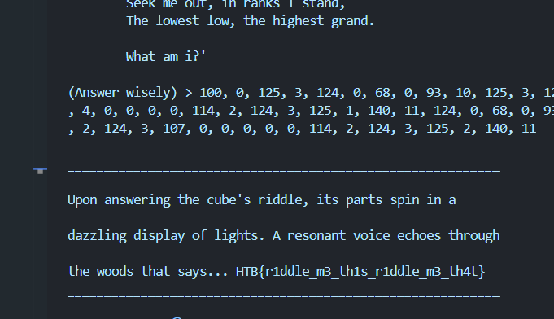
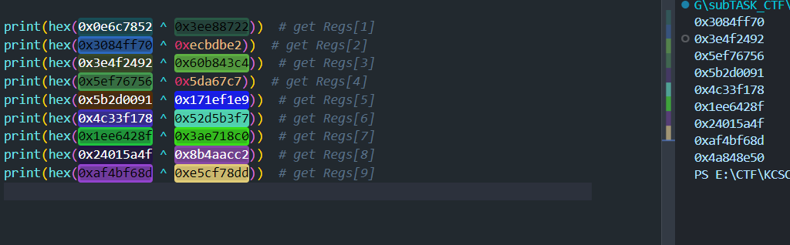
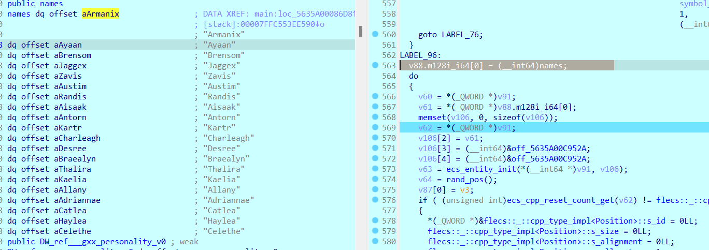
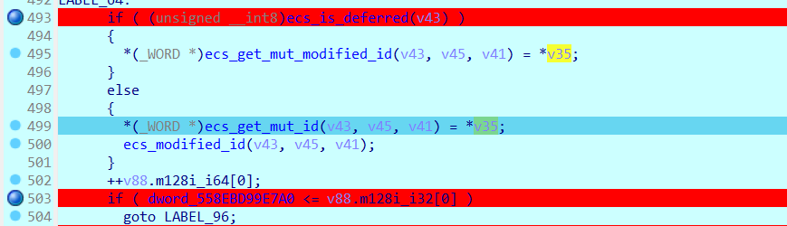

## CTFs/apocalyspeHTB

### misc_cubicle_riddle

- Chương trình thực hiện gọi hàm với nội dung chạy opcode được ghép bởi `self.co_code_start = b"d\x01}\x01d\x02}\x02"`, `self.co_code_end = b"|\x01|\x02f\x02S\x00"` và ở giữa là input của ta. Nhiệm vụ là truyền input sao cho khớp và trả về kết quả chương trình mong muốn.


- Ở đây chương trình yêu cầu ta nhặt ra giá trị lớn nhất và nhỏ nhất của mảng được random, tuy không thể kiểm soát được `randInt()`, thứ ta truyền vào là opcode để duyệt và nhặt ra min và max.


```python
def _ans(num_list, min, max, num):
    min = 1000
    max = -1000
    for num in range(0, 10, 1):
        if min > num_list[num]:
            min = num
        if max < num_list[num]:
            max = num
    return (min, max)

answer_func = create_answer_func()
code_obj = answer_func.__code__
print(code_obj.co_code)
```

- Thực thi chương trình khi đã có đoạn opcode đầu và đuôi khớp với `co_code_start` và `co_code_end`. ta nhặt đoạn ở giữa ra rồi gửi tới sever.



```
flag: HTB{r1ddle_m3_th1s_r1ddle_m3_th4t}
```

### rev_Crushing


- Chall này cấp cho người chơi 2 file, `message.txt.cz` cùng `crush`. Dựa trên mô tả của chall, file `message.txt.cz` chính là đoạn hội thoại bị mã hóa. Vậy file `crush` có vẻ là file mã hóa ta cần detect.

- Chương trình mã hóa khá ngắn gọn. Thoạt nhìn không giống mã hóa đối xứng nên không thể truyền ngược vào được. Mình cần phân tích xem chương trình hoạt động ra sao để giải mã.
  

- Chương trình mã hóa nhặt từng kí tự từ `input` và đẩy vào hàm `add_char_to_map()`. Nếu kí tự được truyền vào lần đầu, thì thực hiện khối lệnh `else` ở dưới, nếu không chạy dòng lệnh trên.


- Thứ ta cần quan tâm ở đây là `v6`. Cẩn thận quan sát, `Map[input]` được ép kiểu về `_QWORD **` khi gán với `v6`, tức là giá trị lưu trong `Map[]` là con trỏ, Nếu debug kí hơn với giá trị truyền vào cụ thể, ta có thể dễ dàng thấy được bản chất mảng `Map[]` chính là một mảng được xây dựng thủ công mô phỏng lại `STL Map<>` như `C++`. Nó lưu theo dạng ánh xạ, `v6` = Map[input] ~ một địa chỉ trỏ tới một dải data khác, nếu vị trí trỏ tới được lưu vào giá trị bằng `v5 = i` trước đó, thực hiện dịch con trỏ lên cho tới `null` và lưu giá trị vào. Tóm lại là lưu data theo dạng `key - Arr:value`, Con trỏ của kí tự `a` trỏ tới con trỏ kiểm soát vị trí nó được xuất hiện `i`.


- Nêu một ví dụ dễ hiểu, nếu chuỗi đầu vào của ta là `abcdefgh1234abcdef4321`. Các giá trị được lưu như sau.


- Vậy ta đã rõ cách lấy giá trị của chương trình. Tới hàm `serialize_and_output`, phần `output` được in ra gồm 2 thứ. Số lần kí tự `chr(i)` xuất hiện = `ptr = list_len(Map[i])`. Và vị trí của các kí tự đó `j = (void *)*v2`.


- Vậy chương trình mã hóa sẽ mã hóa sẽ lấy ra vị trí của các kí tự trong văn bản rồi in lần lượt chúng ra theo thứ tự trong bảng mã `ASCII`, bằng chứng là nó duyệt `Map[]` từ 0-254 trong hàm `serialize_and_output`. Sau đó in lần lượt vị trí của kí tự đó ra.

- Kiểm chứng bằng cách xem giá trị trong văn bản bị mã hóa. Dễ dàng thấy được kí tự đầu tiên xuất hiện là kí tự thứ 10 ~ `0xa` ~ `\n`.


- Lưu ý rằng các giá trị được in ra dạng 8 byte một, convert sang số nguyên bằng cách dịch bit và cộng thêm là được.


- Sau đây là script của mình để giải mã file `message.txt.cz`.

```python
with open('message.txt.cz', 'rb') as file:
    content = file.read()
i = 0
tmp = 0
b = 0
message = [0]*9000
__to_Int_Cipher = []
while i < len(content):
    if (i+1) % 8 != 0:
        # content[i] <<= 8*tmp
        b += content[i] << (8*tmp)
        tmp += 1
    else:
        __to_Int_Cipher.append(b)
        tmp = 0
        b = 0
    i += 1

# # print(__to_Int_Cipher)

i = 0
mod = 0
while i < len(__to_Int_Cipher):
    j = i + 1
    tmpDec = __to_Int_Cipher[i]
    k = i-mod
    while tmpDec != 0:
        mod += 1
        message[__to_Int_Cipher[j]] = k
        j += 1
        tmpDec -= 1
    i += __to_Int_Cipher[i]+1
# print(message)
msg = ''
for p in message:
    msg += chr(p)
print(msg)
```

- Đoạn hội thoại sau khi được giải mã:

```txt
Organizer 1: Hey, did you finalize the password for the next... you know?

Organizer 2: Yeah, I did. It's "HTB{4_v3ry_b4d_compr3ss1on_sch3m3}"

Organizer 1: "HTB{4_v3ry_b4d_compr3ss1on_sch3m3}," got it. Sounds ominous enough to keep things interesting. Where do we spread the word?

Organizer 2: Let's stick to the usual channels: encrypted messages to the leaders and discreetly slip it into the training manuals for the participants.

Organizer 1: Perfect. And let's make sure it's not leaked this time. Last thing we need is an early bird getting the worm.

Organizer 2: Agreed. We can't afford any slip-ups, especially with the stakes so high. The anticipation leading up to it should be palpable.

Organizer 1: Absolutely. The thrill of the unknown is what keeps them coming back for more. "HTB{4_v3ry_b4d_compr3ss1on_sch3m3}" it is then.
```

```
Flag: HTB{4_v3ry_b4d_compr3ss1on_sch3m3}
```

### rev_Metagaming

- Chall này cấp cho ta source `C++`. Chương trình không thể thực thi nên mình đọc chay.

- Tóm gọn chương trình như sau. Chương trình thực thi gồm 2 đoạn chính, `mã hóa` và `kiểm tra`.

- Flag được truyền vào hàm mã hóa với các truy vấn cụ thể gồm 3 phần, `opcode` dùng để rẽ nhánh trong hàm xử lý, `op0` và `op1` tùy mục đích mà thay đổi trong từng case.

```C++
struct insn_t
{
    uint32_t opcode = 0;
    uint32_t op0 = 0;
    uint32_t op1 = 0;
};
```

- Sau khi xử lý, `Flag` được mã hóa thành `registers` và kiểm tra với từng số nguyên một.


- Quan sát cẩn ở case `opcode == 0`, đây là case lấy giá trị từ `flag[op1]` vào `regs[op0]`. Ý tưởng của mình là tìm các case `insn_t(0, 0->3, op1)` bởi ta biết được format flag là `HTB{}` nên hoàn toàn có thể giải được `Regs[0]`.


- Nhặt ra các case có op0 = 1.

```C++
insn_t(21, 0, 0)
insn_t(0, 14, 0)
insn_t(24, 14, 0)
insn_t(5, 0, 14)
insn_t(0, 14, 1)
insn_t(5, 0, 14)
insn_t(0, 14, 2)
insn_t(5, 0, 14)
insn_t(0, 14, 3)
insn_t(5, 0, 14)
insn_t(8, 0, 2769503260)
insn_t(10, 0, 997841014)
insn_t(2, 0, 4065997671)
insn_t(8, 0, 690011675)
insn_t(8, 0, 540576667)
insn_t(2, 0, 1618285201)
insn_t(8, 0, 1123989331)
insn_t(8, 0, 1914950564)
insn_t(8, 0, 4213669998)
insn_t(8, 0, 1529621790)
insn_t(10, 0, 865446746)
insn_t(8, 0, 449019059)
insn_t(8, 0, 906976959)
insn_t(8, 0, 892028723)
insn_t(10, 0, 1040131328)
insn_t(2, 0, 3854135066)
insn_t(2, 0, 4133925041)
insn_t(2, 0, 1738396966)
insn_t(8, 0, 550277338)
insn_t(10, 0, 1043160697)
insn_t(3, 0, 1)
```

- Mình nhặt ra các lệnh có `op0 = 0` bởi thấy `insn_t(0, 14, 0-3)` Chương trình thực hiện nhặt ra giá trị từng kí tự của flag bộ 4 lần một và nối chúng thành một số nguyên.

```C++
Flag[0] = (int)'H';
Flag[1] = (int)'T';
Flag[2] = (int)'B';
Flag[3] = (int)'{';

Regs[0] = 0;

// nhặt kí tự thứ 0 của flag rồi ghép lại
Regs[14] = Flag[0];
Regs[14] <<= 0;
Regs[0] |= Regs[14];
// nhặt kí tự thứ 1 của flag rồi ghép lại
Regs[14] = Flag[1];
Regs[14] <<= 8;
Regs[0] |= Regs[14];
// nhặt kí tự thứ 2 của flag rồi ghép lại
Regs[14] = Flag[2];
Regs[14] <<= 16;
Regs[0] |= Regs[14];
// nhặt kí tự thứ 3 của flag rồi ghép lại
Regs[14] = Flag[3];
Regs[14] <<= 24;
Regs[0] |= Regs[14];

Regs[0] ^= 1176768057;
Regs[0] -= 2368952475;
Regs[0] ^= 2826144967;
Regs[0] += 1275301297;
Regs[0] -= 2955899422;
Regs[0] ^= 2241699318;
Regs[0] += 537794314;
Regs[0] += 473021534;
Regs[0] += 2381227371;
Regs[0] -= 3973380876;
Regs[0] -= 1728990628;
Regs[0] += 2974252696;
Regs[0] += 1912236055;
Regs[0] ^= 3620744853;
Regs[0] ^= 2628426447;
Regs[0] -= 486914414;
Regs[0] -= 1187047173;
```

- Cuối cùng là truy vấn `insn_t(3, 0, 1)`. Thực hiện xor(Regs[0],Regs[1]). Sau đó so sánh Regs[0] với `0x3ee88722` với 4 kí tự đầu có trước, ta suy ngược ra giá trị Regs[1] tại thời điểm `xor`.



Điều tương tự xuất hiện với Regs[0] -> Regs[9].


Vậy ta có thể dựa vào nó mà bruteForce. 10 biến, mỗi biến nhặt ra bộ 4 kí tự một liên tiếp của `flag`, từ source ta còn biết ràng `flag` có độ dài 40 tương ứng với 10 `Regs[]` đầu. Vậy chỉ cần nhặt ra truy vấn của từng `op0` một sẽ ra được đáp án.


- script vét cạn như sau 

```
flag: HTB{m4n_1_l0v4_cXX_TeMpl4t35_9fb60c17b0}
```

### rev_QuickScan

- Truy cập sever, Chall cấp ta một mã `base64`, giải ra một file ELF với nội dung cơ bản là như nhau ở mọi lần truy vấn.

  

- Với nội dung đoạn đầu luôn là xử lý chuỗi số bên dưới, ta xây dựng chương trình getdata từ sever và giải mã rồi gửi trả.

  

```python
from pwn import *
import base64


def from_bytes(b):
    num = int.from_bytes(b, byteorder='little')
    if num >= 2**(len(b)*8 - 1):
        num -= 2**(len(b)*8)
    return num


def find_sequence_and_extract_bytes(byte_sequence):
    sequence = bytes([0x48, 0x83, 0xEC, 0x18, 0x48, 0x8D, 0x35])
    data = byte_sequence
    index = data.find(sequence)
    four_bytes = data[index + len(sequence): index + len(sequence) + 4]
    b = from_bytes(four_bytes)
    s = index + 4 + 7 + b # cộng với địa chỉ lea và thêm độ dài của lea = 7
    extracted_bytes = data[s: s + 24]

    return extracted_bytes.hex()


r = remote('94.237.53.82', 41821)

first_message = r.recvuntil("Bytes? ").decode()  # truy vấn đầu tiên
print(first_message)

first_answer = first_message.split("Expected bytes: ")[1].split("\n")[0]
r.sendline(first_answer)

solved = 0

while True:

    try:
        second_message = r.recvuntil("Bytes? ").decode()
    except Exception as e:
        print("solve: ", solved)
        print("An error occurred: ", str(e))
        print("Received so far: ", r.recv().decode())

    print(second_message)

    elf_base64 = second_message.split("ELF:  ")[1].split("\n")[0]
    elf = base64.b64decode(elf_base64)
    answer = find_sequence_and_extract_bytes(elf)

    print(answer)
    r.sendline(answer)

flag = r.recv().decode()
print(flag)
r.close()

# HTB{y0u_4n4lyz3d_th3_p4tt3ns!}
```


### rev_Boxcutter

- Chương trình khá đơn giản, thực hiện phép `xor` các kí tự trong mảng `File[]` với `0x37`. Sau đó thực hiện mở `File`.


- Nhặt data ra và for, ta thu được `flag`.

```python
file1 = [0x54, 0x03, 0x45, 0x43, 0x4C, 0x75, 0x63, 0x7F][::-1]
file2 = [0x68, 0x04, 0x5F, 0x43, 0x68, 0x50, 0x59, 0x06][::-1]
file3 = [0x37, 0x4A, 0x02, 0x5B, 0x5B, 0x03, 0x54, 0x68][::-1]
for i in file1:
    print(chr(i ^ 0x37), end="")
for i in file2:
    print(chr(i ^ 0x37), end="")
for i in file3:
    print(chr(i ^ 0x37), end="")
```

```
flag: HTB{tr4c1ng_th3__c4ll5}
```

### rev_Lootstash

- Chương trình thực hiện in random một trong những string nằm ở một dải cụ thể trong chương trình. Vậy mình chỉ cần search theo format flag ở trong chương trình là được.


```
flag: HTB{n33dl3_1n_a_l00t_stack}
```

### rev_Packedaway

- Chạy chương trình mình thấy trong khá nham nhở, sử dụng `die` để kiểm tra, thông báo rằng chương trình được pack bằng `upx` `Packer: UPX(4.22)[NRV2B_LE32,best]`. Mọi người có thể lấy unpack tool ở .


- Chạy chương trình đã unpack, flag có thể search ra ngay trong mục `string`. Lý do mình kiếm ở mục `string` là do lúc detect file thực thi chưa được unpack mình đã thấy một và mẩu flag chưa hoàn thiện.


```
flag: HTB{unp4ck3d_th3_s3cr3t_0f_th3_p455w0rd}
```

### rev_flecksofgold


- Chall này cấp cho ta một chương trình khá dài, không có input. Từ mô tả của đề, cùng với việc quan sát chương trình, mình tóm gọn nội dung bài như sau:

- Các object được tạo ra trong bài gồm có `Person` và `FlagPart`.
  - `Person` có các thuộc tính quan trọng là `Position` và `CanMove`, hành động là `run`.
  - `FlagPart` có thuộc tính quan trọng là `Position`.
- Chương trình thực hiện khởi tạo các `FlagPart` và quăng chúng trong bản đồ, thực hiện tạo ra các thực thể `Person` gồm 20 phần tử là các tên riêng.

  

- Các cá nhân được tạo ra sẽ di chuyển trong map cho tới khi nào vị trí của `Person` trùng với vị trí của `FlagPart` thì sẽ trả về chuỗi `flag` và in ra. Nếu ta trace ngược lại sẽ thấy `flag` là chuỗi `?????????????????????????????`. Ngay gần mảng `names`

  
  

- Vậy ta có 2 hướng đi để giải Chall này, một là trace flag thông qua `FlagPart`, hai là để `Person` mang `flag` về.

- Ở cách đầu tiên. Mình thấy `FlagPart` xuất hiện ở 2 vùng, tuy nhiên vùng trên là để khởi tạo, mình sẽ trace ở vùng dưới.

  

- Suy nghĩ đơn giản rằng sau công đoạn khởi tạo, check thành phần thì `FlagPart` sẽ được gán giá trị, cụ thể ở đây là các mẩu `flag`. `FlagPart` được sinh ra trong vòng while kết thúc tại dòng 505, việc khởi tạo `FlagPart` hoàn thiện sau khi gán `ID` ở trên đó, nó được `v41` trỏ tới .

  

- Sau đó là công đoạn xử lý `FlagPart` được tạo ra, ta thấy có 2 dòng lệnh trỏ hàm `ecs_get_mut_modified_id()` tới `*v35`. Tham số của hàm này gồm `v41` và các `const` nên mình trace theo `v35` thử.

  

- v35 được gán với 1 const trước khi khởi tạo `FlagPart`, ta thấy const `qword_558EBD99E7A8` này được gọi ra 2 lần, tìm đến vị trí còn lại nó được gọi ra và thấy biến này được gán bởi các `const`.

  
  

- Rõ nguồn gốc của các giá trị trên, quay trở lại với `v35`. Ta thấy `v35` trỏ tới một dải giá trị gồm các kí tự dễ nhận biết. Có đủ format của flag.

  

- Mỗi cụm gồm 2 thành phần vừa đủ cho size của `FlagPart` là 2 byte, đồng thời xem kĩ một chút ta thấy trên kí tự `H` là 0 và kí tự `T` là 1. Mạnh dạn kết luận rằng từng cặp đôi một là vị trí và kí tự tại vị trí đó. Nhặt ra rồi viết đoạn script nhỏ.

```python
data = [0x15, 0x30, 0x1B, 0x72, 0x10, 0x72, 0x13, 0x5F, 0x02, 0x42,
        0x18, 0x74, 0x04, 0x62, 0x0E, 0x70, 0x06, 0x31, 0x16, 0x67,
        0x00, 0x48, 0x07, 0x6E, 0x0F, 0x34, 0x09, 0x5F, 0x01, 0x54,
        0x0B, 0x68, 0x05, 0x72, 0x08, 0x67, 0x14, 0x74, 0x0D, 0x5F,
        0x0C, 0x33, 0x1C, 0x7D, 0x11, 0x74, 0x1A, 0x33, 0x19, 0x68,
        0x0A, 0x74, 0x12, 0x35, 0x17, 0x33, 0x03, 0x7B]

flag = [0]*100
output = ''

for i in range(len(data)):
    if i % 2 == 0:
        flag[data[i]] = data[i+1]

for i in flag:
    output += chr(i)

print(output)
# HTB{br1ng_th3_p4rt5_t0g3th3r}
```

- Ở cách 2, sau khi các mảnh flag được quăng đi, ta nhảy được nhảy tới `LABEL96` đây là phần khởi tạo các `Person` để đi tìm `flag`.


- Tuy nhiên vòng lặp khởi tạo này lại cản trở ta nhảy tới bước di chuyển của `Person`, mình quyểt định force jump ở đây sau khi tạo ra được một `Person` đầu tiên là `Armanix`.


- Giờ thì `f9` và đợi `Armanix` mang flag về thôi^^.


## Mong WRITEUP này giúp ích cho các bạn!

```

from KMA
Author: 13r_ə_Rɪst
Email: sonvha2k23@cvp.vn

```
