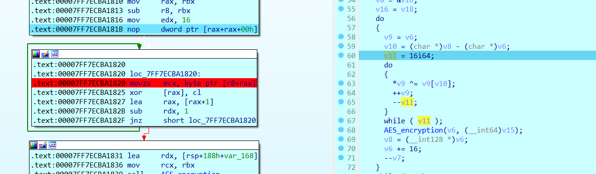

## CTFs/JerseyCTF

### PasswordManager

- Một khối lệnh duy nhất thực hiện kiểm tra chương trình, đơn giản rằng ta chỉ cần nhặt dữ liệu ra rồi viết script bởi chỉ có duy nhất một phép `xor` nên hoàn toàn đủ khả năng lấy được `password`


```python
cipher = [0x4f, 0x46, 0x51, 0x43, 0x5e, 0x52, 0x4d, 0x16,
          0x57, 0x16, 0x56, 0x7a, 0x48, 0x65, 0x5c, 0x65, 0x1A, 0x58]
password = ""

for i in cipher:
    i ^= 0x25
    password += chr(i)

print(password)
```

- Nếu có gì cần lưu ý thì đối với những bạn mới học cần cẩn thận quan sát cách bố trí dữ liệu, nhặt data ra theo vị trí từ thấp đến cao^^.


```
flag: jctf{wh3r3s_m@y@?}
```

### The-heist-1

- Về mặt trình bày, chall này tương tự chall trên.


- Chall này các bạn nên đọc mã máy phần mã hóa input `PIN` thì sẽ rõ ràng hơn nếu không thạo sửa kiểu dữ liệu trong chương trình^^. Các phép toán đều thực hiện trên thanh `al`, tức là mình cần cẩn thận những phép toán có thể cho ra giá trị lớn hơn 2 byte, để giải quyết thì chỉ cần `& 0xff` là được.


```python
def rol_byte(value, shift):
    return ((value << shift) & 0xFF) | ((value & 0xFF) >> (8 - shift))

flag_comp = 'abcdefghijklmnopqrstuvwxyzABCDEFGHIJKLMNOPQRSTUVWXYZ0123456789!@#$%^&*()_+-=<>,./{[]\|~:;?"\''
key = [0xC3, 0x83, 0x23, 0x23, 0xB3, 0xC3, 0x83, 0xE3, 0xA3, 0xE3, 0x33, 0x0C]

for i in key:
    for j in flag_comp:
        if (rol_byte((~(ord(j)+96)) & 0xff, 4) ^ 0x55) == i:
            print(j)
# jctf{62881624049}
```

### The-heist-2

- Khi quăng chương trình vào `IDA`, cảm thấy khá thiếu sót nên mình check lại bằng `die` và thấy chương trình được pack bởi `upx`.


- Sau khi unpack, quay lại với `IDA`, ta thấy chương trình này thực hiện mã hóa `AES`.


- Ở khúc cuối mình thấy một đoạn kiểm tra đơn giản giữa `Buffer` sau khi được mã hóa và `Cipher`. Vậy là ta đã có Cipher và cần lấy được Buffer. Vì `AES` là một dạng mã hóa đối xứng nên khi nhặt đủ `key` và `iv`, ta hoàn toàn có thể decrypt thông qua `Cipher`.


- Ta sẽ trace ngược theo các tham số được truyền vào hàm `encrypt` để nhặt ra `key` và `iv`


- Trước tiên là key, từ `v15` ta trace ngược lên thì thấy `v15` là expanded_key với key gốc được tạo ở khâu trên đó, dù là `rand()` nhưng vì seed cố định nên không ảnh hưởng tới `key` gốc.


- Sau khi nhặt ra `key` gốc, ta tìm `iv`. Trong CBC mode, `iv` là chuỗi 16 bytes dùng để `xor` với input trước khi mã hóa. Ở đây mình thấy 1 vòng lặp 16 lần thực hiện `xor` giá trị `v9` ~ `v6` ~ `buffer`.



- Đã thu được ciphertext, key, iv. Giờ tới bước giải mã, dưới đây là bộ khung giải mã AES mình xin được chỉ việc lắp data vào thôi^^. Không nên tin cybherchef lắm vì lần này mình dùng cyberchef để giải mà không được nên mới cần đến khung decrypt viết tay.

```python
#pip install pycryptodome
from Crypto.Util.number import *
from Crypto.Cipher import AES

ct = [0x5C, 0xA3, 0x41, 0xAB, 0x64, 0xBA, 0xCF, 0xC3, 0xD0, 0x61,
      0x1E, 0x18, 0x56, 0xA3, 0x2D, 0x1E, 0xF6, 0x93, 0x87, 0x58,
      0x09, 0x16, 0x8C, 0x63, 0x8C, 0x43, 0x2B, 0x9E, 0x6D, 0x73,
      0x7F, 0xC5]

ct = b''.join([bytes([i]) for i in ct])
iv = bytes.fromhex('697C742271495259527A77606F6A542D')
key = bytes.fromhex("653C26273471785B3824637339767D61697C742271495259527A77606F6A542D")[:16]

# print(ct)
cipher = AES.new(key, AES.MODE_CBC, iv)
print(cipher.decrypt(ct))

iv = [0x69, 0x7C, 0x74, 0x22, 0x71, 0x49, 0x52, 0x59, 0x52, 0x7A,
      0x77, 0x60, 0x6F, 0x6A, 0x54, 0x2D]

key = [0x65, 0x3C, 0x26, 0x27, 0x34, 0x71, 0x78, 0x5B, 0x38, 0x24,
       0x63, 0x73, 0x39, 0x76, 0x7D, 0x61, 0x69, 0x7C, 0x74, 0x22,
       0x71, 0x49, 0x52, 0x59, 0x52, 0x7A, 0x77, 0x60, 0x6F, 0x6A,
       0x54, 0x2D]

cipher = [0x5C, 0xA3, 0x41, 0xAB, 0x64, 0xBA, 0xCF, 0xC3, 0xD0, 0x61,
          0x1E, 0x18, 0x56, 0xA3, 0x2D, 0x1E, 0xF6, 0x93, 0x87, 0x58,
          0x09, 0x16, 0x8C, 0x63, 0x8C, 0x43, 0x2B, 0x9E, 0x6D, 0x73,
          0x7F, 0xC5]
# jctf{iLikE_M0ney$$$}
```

```
flag: jctf{iLikE_M0ney$$$}
```

## Mong WRITEUP này giúp ích cho các bạn!

```
from KMA
Author: 13r_ə_Rɪst
```
