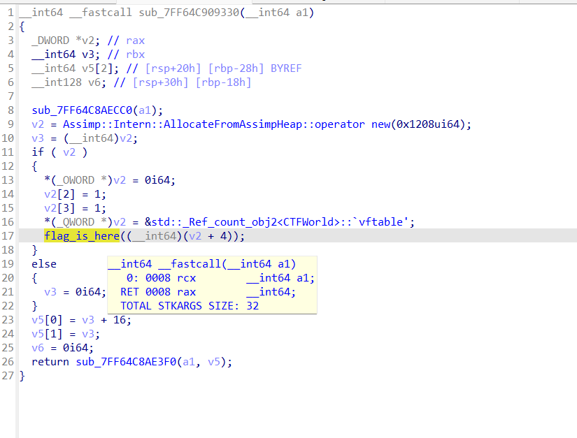

## CTFs/WolvCTF

### rev_BabyRE

- Chall warmup nên cũng không cần nghĩ nhiều, `f12` thôi^^.


```
flag: wctf{n1c3_oNe_y0u_Found_m3}
```

### rev_Shredded

- Chall yêu cầu ta giải mã đoạn code `shredded.c` để lấy được chương trình `checkflag`. Vấn đề duy nhất ở đây là các file `shred{*}.txt` bị shuffle nên cần trace lại. Đây là script của mình.

```python
shuffledLine = [2, 4, 18, 31, 19, 21, 13, 5, 12, 30, 27, 28, 25, 9,
                16, 6, 26, 24, 17, 29, 11, 14, 1, 3, 15, 7, 32, 0, 20, 23, 10, 8, 22]
lines = []
code_C = ["" for _ in range(40)]*35

for i in shuffledLine:
    with open("shred{i}.txt", 'r') as file:
        tmp = file.read()
        lines.append(tmp.rstrip())

for line in lines:
    for i in range(len(line)):
        if line[i] != '\n':
            code_C[i] += line[i]

for i in code_C:
    print(i)
```


- Mở file `code.c` mới được truyền dữ liệu vào, ta có đoạn chương trình sau.

```C
#include <stdio.h>
#include <string.h>
int main()
{
    char flag[] = "REDACTED";
    char inter[51];
    int len = strlen(flag);
    for (int i = 0; i < len; i++)
    {
        inter[i] = flag[i];
    }
    for (int i = len; i < 50; i++)
    {
        inter[i] = inter[(i * 2) % len];
    }
    inter[50] = '\0';
    char a;
    for (int i = 0; i < 50; i++)
    {
        a = inter[i];
        inter[i] = inter[((i + 7) * 15) % 50];
        inter[((i + 7) * 15) % 50] = a;
    }
    for (int i = 0; i < 50; i++)
    {
        a = inter[i];
        inter[i] = inter[((i + 3) * 7) % 50];
        inter[((i + 3) * 7) % 50] = a;
    }
    for (int i = 0; i < 50; i++)
    {
        inter[i] = inter[i] ^ 0x20;
        inter[i] = inter[i] ^ 0x5;
    }
    for (int i = 0; i < 50; i++)
    {
        a = inter[i];
        inter[i] = inter[((i + 83) * 12) % 50];
        inter[((i + 83) * 12) % 50] = a;
    }
    for (int i = 0; i < 50; i++)
    {
        printf("\\x%X", inter[i]);
    }
    return 0;
}
```

- Vì viết script ngược lại ra data rác, mình cần viết script có hướng tiếp cận khác, mình sẽ viết xuôi các lần shuffle rồi map lại các vị trí của 50 kí tự sau khi thay đổi, và xếp ngược lại vị trí bạn đầu.(cũng không hiểu sao viết ngược lại không đúng nữa vì chỉ toàn `swap` thôi mà nhỉ@@).

```python
inter = [0x14, 0x5D, 0x14, 0x57, 0x16, 0x43, 0x46, 0x7A, 0x56, 0x16, 0x57, 0x17, 0x4B, 0x16, 0x52, 0x4C, 0x61, 0x1C, 0x1C, 0x7A, 0x1D, 0x7A, 0x11, 0x51, 0x52,
         0x16, 0x5E, 0x62, 0x6D, 0x5E, 0x61, 0x7A, 0x16, 0x17, 0x61, 0x16, 0x6B, 0x61, 0x4E, 0x69, 0x14, 0x6B, 0x6D, 0x51, 0x57, 0x6D, 0x6D, 0x58, 0x5D, 0x4B]
flag = ""

shuffledPos = [i for i in range(0, 50)] # mảng này sẽ cho biết vị trí ban đầu của các giá trị sau khi shuffle

for i in range(len(inter)):
    a = shuffledPos[i]
    shuffledPos[i] = shuffledPos[((i + 7) * 15) % 50]
    shuffledPos[((i + 7) * 15) % 50] = a

for i in range(len(inter)):
    inter[i] = inter[i] ^ 0x5 ^ 0x20

for i in range(len(inter)):
    a = shuffledPos[i]
    shuffledPos[i] = shuffledPos[((i + 3) * 7) % 50]
    shuffledPos[((i + 3) * 7) % 50] = a

for i in range(len(inter)):
    a = shuffledPos[i]
    shuffledPos[i] = shuffledPos[((i + 83) * 12) % 50]
    shuffledPos[((i + 83) * 12) % 50] = a

# print(shuffledPos) # in ra để biết thêm chi tiết^^

for j in range(50):
    for i in range(len(shuffledPos)):
        if shuffledPos[i] == j:
            flag += chr(inter[i])

print(flag)
```

```
flag: wctf{sHr3DDinG_L1k3_H3NDr1x_93284}
```

### rev_Doubledelete's revenge

- Chương trình cấp cho ta file thực thi mã hóa `reveng1` và flag đã bị mã hóa `flag.txt.enc`.

- Một phép toán duy nhất được sử dụng là `__ROL4__`, xoay trái với tham số truyền vào mặc định là 13.


- Đọc data từ `encrypted_flag`, có độ dài 48 gấp 4 lần số lần lặp là 12. Check lại mã máy, giá trị được rol nằm trong `eax`~4 byte.


- Chương trình `rol` 13 đơn vị cặp 4 kí tự một rồi trả về từng byte, vậy ta sẽ ghép lại 4 byte một và `ror` 13 đơn vị để đảo ngược lại.

```python
def ror(n, rotations=13, bits=32):
    return ((n >> rotations) | (n << (bits - rotations))) & ((1 << bits) - 1)

flag = ""
final_ouput = []
segment = []
enc_flag = []

with open("flag.txt.enc", 'rb') as file:
    enc_flag = file.read()

for i in range(0, len(enc_flag), 4):
    segment.append(int.from_bytes(enc_flag[i:i+4], byteorder='little'))

for i in segment:
    tmp = ror(i)
    final_ouput.append(tmp.to_bytes(4, byteorder='little'))

for i in final_ouput:
    flag += i.decode()

print(flag)
```

```
flag: wctf{i_th1nk_y0u_m1sund3rst00d_h0w_r0t13_w0rk5}
```

### rev_Assembled

- Đây là lần đầu mình gặp chall trình bày như này^^. kiểu biểu diễn luồng chương trình khá lạ nhưng cũng không phức tạp.

- Những thứ cần nhặt ra ở đây là mảng `data`, `seed` = 0x3148, và mảng `key[256]`.

- Một chút phân tích chương trình, hàm kiểm tra gồm 24 lần lặp, mỗi lần sẽ thực hiện biến đổi `seed`(trong `eax`) với giá trị khởi tạo luôn quan sát được là 0x3148.


- Giá trị này sau khi được xử lý qua vài phép toán như trên sẽ dùng để lấy giá trị trong một dải data khác rồi xor với flag nên mình viết một đoạn script để nhặt các giá trị này ra luôn.

```python
seed = 0x003148

for i in range(len(data)):
    if seed % 2 == 0:
        seed >>= 1
    else:
        tmp = seed
        seed <<= 1
        seed += tmp
        seed += 1
    print(hex(seed))
```

- Thu được chuỗi sau:

```python
final_key = [0x3148, 0x18a4, 0xc52, 0x629, 0x127c, 0x93e, 0x49f,  0xdde, 0x6ef, 0x14ce, 0xa67, 0x1f36,
             0xf9b, 0x2ed2, 0x1769, 0x463c, 0x231e, 0x118f, 0x34ae, 0x1a57, 0x4f06, 0x2783, 0x768a, 0x3b45, 0xb1d0]
```

- Tiếp đó, chương trình lấy ra giá trị tại rsp[al=final_key], cùng với kí tự trong input flag và `xor`, rồi kiểm tra với giá trị tương ứng trong mảng `data`.


- Vậy ta chỉ cần `xor` ngược lại là lấy được flag. Nhớ là phải lấy byte thấp của `final_key` trước khi truy cập vào key để lấy giá trị ra `xor`^^.

```python
data = [0xF2, 0x0F, 0x6C, 0xEC, 0x1A, 0xE2, 0x57, 0x70, 0x70, 0x86,
        0xEA, 0xBA, 0xB5, 0x63, 0xCF, 0x8C, 0xF8, 0x0B, 0x6C, 0xE0,
        0x6E, 0x15, 0x53, 0x45]

key = [0x49, 0x89, 0xC6, 0x41, 0xB8, 0x00, 0x00, 0x00, 0x00, 0xB8,
       0x00, 0x00, 0x00, 0x00, 0x48, 0x8D, 0x1C, 0x25, 0x0E, 0x11,
       0x40, 0x00, 0x66, 0xB8, 0x48, 0x31, 0xF9, 0xFF, 0xE3, 0x41,
       0x88, 0xC1, 0x4D, 0x0F, 0xB6, 0xC9, 0x42, 0x8A, 0x0C, 0x0C,
       0x43, 0x8A, 0x3C, 0x10, 0x48, 0x8D, 0x1D, 0x0A, 0x00, 0x00,
       0x00, 0x4C, 0x8D, 0x0D, 0xDE, 0xFF, 0xFF, 0xFF, 0x41, 0xFF,
       0xE1, 0x41, 0x8A, 0xB8, 0x83, 0x11, 0x40, 0x00, 0x40, 0x38,
       0xF9, 0x0F, 0x85, 0x41, 0xFF, 0xFF, 0xFF, 0x66, 0xA9, 0x01,
       0x00, 0x74, 0x18, 0x66, 0x89, 0xC3, 0x66, 0xD1, 0xE0, 0x66,
       0x01, 0xD8, 0x66, 0xFF, 0xC0, 0x49, 0xFF, 0xC0, 0x49, 0x83,
       0xF8, 0x18, 0x7C, 0xB5, 0x41, 0xFF, 0xE6, 0x66, 0xD1, 0xE8,
       0x49, 0xFF, 0xC0, 0x49, 0x83, 0xF8, 0x18, 0x7C, 0xA6, 0x41,
       0xFF, 0xE6, 0x66, 0x6C, 0x61, 0x67, 0x3F, 0x20, 0x63, 0x6F,
       0x72, 0x72, 0x65, 0x63, 0x74, 0x21, 0x0A, 0x77, 0x72, 0x6F,
       0x6E, 0x67, 0x20, 0x3A, 0x28, 0x0A, 0xF2, 0x0F, 0x6C, 0xEC,
       0x1A, 0xE2, 0x57, 0x70, 0x70, 0x86, 0xEA, 0xBA, 0xB5, 0x63,
       0xCF, 0x8C, 0xF8, 0x0B, 0x6C, 0xE0, 0x6E, 0x15, 0x53, 0x45,
       0x00, 0x00, 0x00, 0x00, 0x00, 0x00, 0x00, 0x00, 0x00, 0x00,
       0x00, 0x00, 0x00, 0x00, 0x00, 0x00, 0x00, 0x00, 0x00, 0x00,
       0x00, 0x00, 0x00, 0x00, 0x00, 0x00, 0x00, 0x00, 0x00, 0x01,
       0x00, 0x00, 0x00, 0x04, 0x00, 0xF1, 0xFF, 0x00, 0x00, 0x00,
       0x00, 0x00, 0x00, 0x00, 0x00, 0x00, 0x00, 0x00, 0x00, 0x00,
       0x00, 0x00, 0x00, 0x0A, 0x00, 0x00, 0x00, 0x00, 0x00, 0x01,
       0x00, 0x5D, 0x10, 0x40, 0x00, 0x00, 0x00, 0x00, 0x00, 0x00,
       0x00, 0x00, 0x00, 0x00, 0x00, 0x00, 0x00, 0x20, 0x00, 0x00,
       0x00, 0x00, 0x00, 0x01, 0x00, 0x5F]

final_key = [0x3148, 0x18a4, 0xc52, 0x629, 0x127c, 0x93e, 0x49f,  0xdde, 0x6ef, 0x14ce, 0xa67, 0x1f36,
             0xf9b, 0x2ed2, 0x1769, 0x463c, 0x231e, 0x118f, 0x34ae, 0x1a57, 0x4f06, 0x2783, 0x768a, 0x3b45, 0xb1d0]

flag = ""

for i in range(len(data)):
    flag += chr(key[final_key[i] & 0xff] ^ data[i])
print(flag)
```

```
flag: wctf{h4ppy_d3c0mp1l1ng!}
```

### rev_Missing_resources

- Chall này có tên `Missing resources` có lẽ bởi việc cung cấp thiếu tài nguyên để thực thi chương trình, cài đặt các dll thiếu tại [đây](Missing_resources/CD/).


- Sau khi hoàn thành cài đặt và tiến hành debug động, thì dưới đây là vị trí duy nhất ta phải `patch` để bypass và nhảy vào hàm xử lý.


- Sau đó là một loạt các lượt `xor` của dải data `v11`.


- Cuối cùng là kết quả của phép `xor` trên.


```
flag: wctf{ch@mp1on-d11-sn1ff3r}
```

### rev_Game_graphics_debugging

- Hơi khó hiểu Chall này còn cùi hơn cả mấy bài warmup nữa @@. Ta được cấp một file thực thi. Khi chạy nó ta thu được chút thông tin rằng có sự xuất hiện của các string như `The flag is somewhere inside me...` hay `ooh spinny` sẽ xuất hiện trong chương trình. Đó cũng là hướng tiếp cận Chall này của mình.


- Chương trình khá đồ sộ và đồng thời không có `input` và `output`, sẽ rất khó để giải quyết theo cách thông thường, thay vào đó mình sẽ trace theo string được cấp ở phần giao diện quan sát được.


- Thấy được một string quen thuộc trong `f12` ta xref theo tới một hàm xử lý.


- Quan sát từng hàm một, mình thấy có một đoạn xor liên tục như bài `Missing resources` trên nên thực hiện debug động và nhặt data ra.




- Hơi bất ngờ vì dễ(--\*).


```
flag: wctf{your-d3sc3nt-into-gamedev-beg1ns}
```

### rev_Befudged_up

- Chall này cấp cho ta một file gồm các tổ hợp lệnh truy vấn `prog.befunge` và hai file python xử lý input và thực thi theo tổ hợp truy vấn.

  

- Khi mình thử in ra các giá trị trong từng truy vấn, mình nhận thấy một điểm khá đáng chú ý. Rằng ở `case 'g'`, tùy thuộc vào độ chính xác của `flag` mà lượng output sẽ có độ chênh lệch.

  

- Cụ thể, với input là `wctf{`, độ dài của output là 899 nói cách khác là số lần thực thi truy vấn `g` `case 'g':` là 899 lần.


- Tuy nhiên, với input là `wctf*` với \* là bất kì kí tự khác. Số lượng thực thi có vẻ khác, tuy nhiên không có độ xê dịch lớn.


- Từ manh mối này mình thử thay đổi cách lấy input để quét qua dải kí tự xem suy đoán của bản thân có đúng không. Bằng cách đặt biến đếm trong đoạn xử lý của truy vấn `g` và thay đổi chương trình một chút để nhận input từ mảng được khởi tạo thay vì `stdin` ở truy vấn `~`, mn có thể quan sát ở dưới.

```python
from befunge import read_in, befunge

prog = read_in('prog.befunge')
print('flag? ')

flag_comp = 'abcdefghijklmnopqrstuvwxyzABCDEFGHIJKLMNOPQRSTUVWXYZ0123456789!@#$%^&*()_+-=<>,.?/{}[]\|~:;"\''
flag = ['w', 'c', 't', 'f', '{', '', '', '', '', '', '', '', '',]
i = 5

for j in flag_comp:
    flag[i] = j
    ret = befunge(prog, flag)
    print(ret)
```

```python
def befunge(GRID, flag):
    ret = 0
    i = -1
    PC = [0, 0]
    DIR = 0
    DIR_DELTAS = [0, 1, 0, -1, 0]
    STACK = []
    STRINGMODE = False

    MAXITER = 2**20

    for _ in range(MAXITER):
        try:
            ch = GRID[PC[0]][PC[1]]
            if STRINGMODE:
                if ch == '"':
                    STRINGMODE = False
                else:
                    STACK.append(ord(ch))
            else:
                match ch:
                    case '0' | '1' | '2' | '3' | '4' | '5' | '6' | '7' | '8' | '9':
                        STACK.append(int(ch))
                    case '+':
                        a = STACK.pop()
                        b = STACK.pop()
                        STACK.append(a+b)
                    case '-':
                        a = STACK.pop()
                        b = STACK.pop()
                        STACK.append(b-a)
                    case '*':
                        a = STACK.pop()
                        b = STACK.pop()
                        STACK.append(a*b)
                    case '/':
                        a = STACK.pop()
                        b = STACK.pop()
                        STACK.append(b//a)
                    case '%':
                        a = STACK.pop()
                        b = STACK.pop()
                        STACK.append(b % a)
                    case '!':
                        a = STACK.pop()
                        if a == 0:
                            STACK.append(1)
                        else:
                            STACK.append(0)
                    case '`':
                        a = STACK.pop()
                        b = STACK.pop()
                        if b > a:
                            STACK.append(1)
                        else:
                            STACK.append(0)
                    case '>' | '^' | '<' | 'v':
                        DIR = '>v<^'.index(ch)
                    case '_':
                        a = STACK.pop()
                        if a == 0:
                            DIR = 0
                        else:
                            DIR = 2
                    case '|':
                        a = STACK.pop()
                        if a == 0:
                            DIR = 1
                        else:
                            DIR = 3
                    case '"':
                        STRINGMODE = True
                    case ':':
                        STACK.append(STACK[-1])
                    case '\\':
                        STACK[-2], STACK[-1] = STACK[-1], STACK[-2]
                    case '$':
                        STACK.pop()
                    case '.':
                        print(STACK.pop(), end=' ')
                    case ',':
                        print(chr(STACK.pop()), end='')
                    case '#':
                        PC[0] += DIR_DELTAS[DIR]
                        PC[1] += DIR_DELTAS[DIR + 1]
                    case 'p':
                        y = STACK.pop()
                        x = STACK.pop()
                        v = STACK.pop()
                        GRID[y][x] = chr(v)
                    case 'g':
                        y = STACK.pop()
                        x = STACK.pop()
                        STACK.append(ord(GRID[y][x]))
                        ret += 1
                        # print((GRID[y][x]))  # test
                    case '~':
                        i += 1
                        x = flag[i]
                        # x = sys.stdin.read(1)
                        STACK.append(ord(x))
                    case '@':
                        break
                    case ' ':
                        pass
                    case _:
                        print(f'Error: unknown character "{ch}"')
                        break
                # end match
            PC[0] += DIR_DELTAS[DIR]
            PC[1] += DIR_DELTAS[DIR + 1]
        except Exception as e:
            print('oh no', e, PC)
            break
    return ret
```

- Đầu ra thể hiện như dự đoán, một kí tự chính xác sẽ có gọi tới truy vấn `g`. Nói cách khác, chương trình có vẻ là sẽ check từng kí tự một và dừng ngay khi xuất hiện kí tự không đúng. Hay nếu xuất hiện kí tự chuẩn, lượng `ret` sẽ lớn hơn trung bình, cụ thể ở đây là kí tự thứ 16 trong chuỗi `flag_comp`~`p`^^.


- Từ ý tưởng này, mình viết một script để vét cạn như sau. Chặn đuôi bằng kí tự `}` và duyệt.

```python
from befunge import read_in, befunge

prog = read_in('prog.befunge')
print('flag? ')
flag = ['w', 'c', 't', 'f', '{', 'p', '', '', '', '', '', '', '', '', '', '', '', '', '', '', '', '', '', '', '', '', '',
        '', '', '', '', '', '', '', '', '', '', '', '', '', '', '', '', '', '', '', '', '', '', '', '', '', '', '', '', '', '', '']

i = 6
default_len = 926
flag_comp = 'abcdefghijklmnopqrstuvwxyzABCDEFGHIJKLMNOPQRSTUVWXYZ0123456789!@#$%^&*()_+-=<>,.?/{}[]\|~:;"\''
while flag[i-1] != '}':
    for j in flag_comp:
        flag[i] = j
        ret = befunge(prog, flag)
        if j == 'a':
            default_len = ret
        elif ret >= (default_len+50):
            i += 1
            for f in flag:
                print(f, end='')
            # print(flag)
            break

for j in flag_comp:
    flag[i] = j
    ret = befunge(prog, flag)
    print(ret)
```


- Các bạn tham khảo source của mình tại đây: [befunge.py](Befudged_up/befunge.py), [runner.py](Befudged_up/runner.py),

```
flag: wctf{pr30ccup13d_w1+h_wh3+h3r_0r_n0t_1_c0uld}
```

## Mong WRITEUP này giúp ích cho các bạn!

```

from KMA
Author: 13r_ə_Rɪst
Email: sonvha2k23@cvp.vn

```
